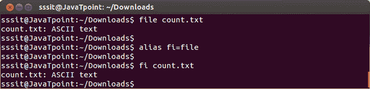
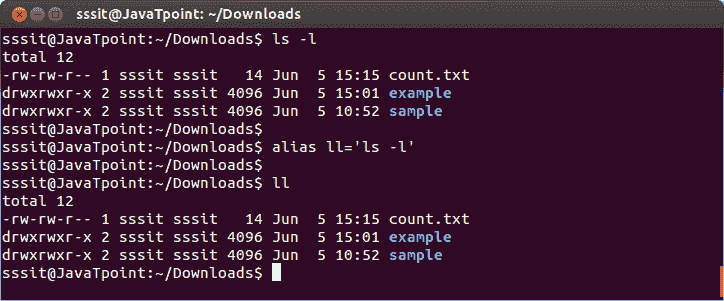
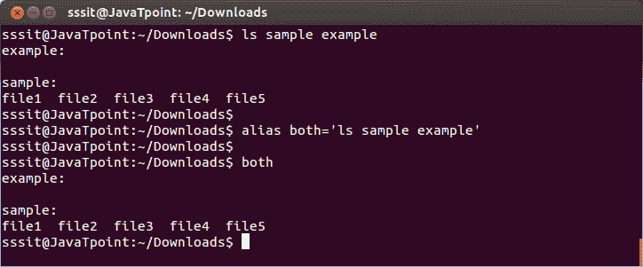
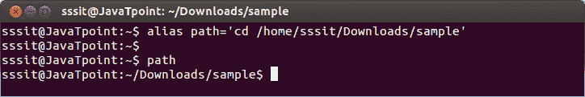
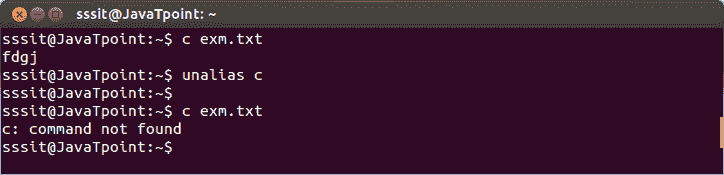

# Linux 别名

> 原文：<https://www.javatpoint.com/linux-aliases>

Linux“alias”命令用另一个字符串替换 shell 中的一个字符串。它是一个 shell 内置命令。它将一个复杂的命令转换成一个简单的命令，或者换句话说，它通过用一个简单的命令替换它来创建一个快捷方式。

在命令行中创建“别名”会创建一个临时“别名”。临时别名仅在退出 shell 之前可用。使它成为永久的“别名”存储在 bash 启动文件中。

**注意:**在键入‘alias’命令时，(=)符号两边都没有空格。如果字符串中有多个单词被别名，则需要使用引号。

**别名语法:**

```
alias =<command></command>			(To create alias for commands)
alias <newname>= 	(To create alias for more than one argument)
alias <newname>=    	(To create alias by a path)</newname></newname> 
```

* * *

## 创建别名

在这里，我们将使用以下选项来创建别名。

1.  将“文件”命令的别名创建为“fi”
2.  将“ls-l”命令的别名创建为“ll”
3.  使用两个参数创建别名
4.  为路径创建别名

## 1)为“文件”命令创建别名为“fi”

**语法:**

```
alias =<command></command> 
```

**示例:**

```
alias fi=file

```



看上面的快照，**‘file’**命令通过命令**别名为**‘fi’**“fi = file”**。

## 2)为“ls-l”命令创建别名为“ll”

**语法:**

```
alias = 
```

**示例:**

```
alias ll='ls -l'

```



看上面的快照，**‘ls-l’**命令通过命令**别名为**‘ll’**“ll =‘ls-l’”。**

## 3)使用两个参数创建别名

**语法:**

```
alias = 
```

**示例:**

```
alias both='ls sample example' 

```



看上面的快照，**‘ls 样例’**命令通过命令**别名为**‘双双’**“双双=‘ls 样例’”。**

## 4)为路径创建别名

**语法:**

```
alias = 
```

**示例:**

```
alias path='cd /home/sssit/Downloads/sample'

```



看上面的快照，**‘CD/home/sssit/Downloads/sample’**命令通过命令**别名为**‘路径’**“别名路径=‘CD/home/sssit/Downloads/sample’”。**

* * *

## 如何删除别名

借助“unalias”命令，您可以删除已创建的别名。

**语法:**

```
unalias  
```

**示例:**

```
unalias c

```



看上面的快照，别名**‘c’**作为‘cat’命令工作。通过命令**“unalias c”**移除“c”后，我们收到一条错误消息。