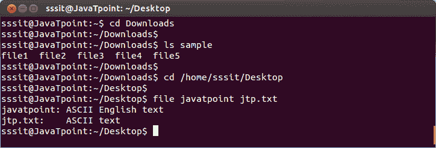
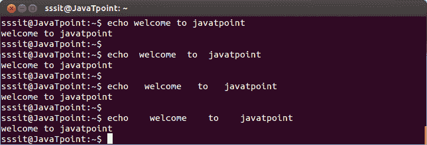
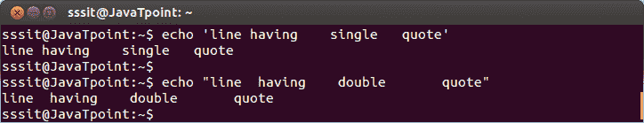
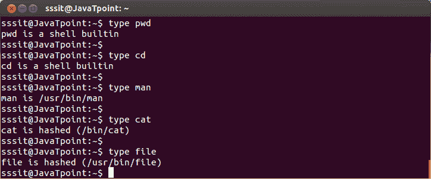

# Linux 参数

> 原文：<https://www.javatpoint.com/linux-arguments>

参数，也称为命令行参数，可以定义为在给定命令的帮助下提供给命令行以处理该输入的输入。参数可以是文件或目录的形式。

输入命令后，在终端或控制台中输入参数。它们可以设置为一条路径。我们还可以一起编写多个参数，它们将按照编写的顺序进行处理。

**语法:**

```
 <command></command> <argument><argument></argument></argument> 
```

**示例:**

```
cd Downloads
ls sample
cd /home/sssit/Desktop
file javatpoint jtp.txt (With two arguments)

```



看上面的快照，命令**“CD Downloads”**已经把我们的目录改成 Downloads 了。

命令**“ls 样品”**列出样品内容。

命令**“CD/home/sssit/Desktop”**设置我们的桌面目录路径。

命令**“文件 javatpoint jtp . txt”**先显示‘javatpoint’文件类型，然后显示‘jtp . txt’文件类型。

* * *

## 空白删除

空白是不可见的，但会占用空间。执行命令时，这些空格会自动从输出中删除。

这里，我们将使用**回显**命令，该命令用于打印它从外壳接收的输出。

**语法:**

```
echo 
```

**示例:**

```
echo welcome to javatpoint

```



看看上面的快照，所有的参数将显示相同的输出，去掉空格，不管它们之间有没有空格。

* * *

## 单引号和双引号

如果你想显示空格，那么在引号内使用它们。您可以使用单引号和双引号。在引号中写入参数，并用' echo '命令打印出来。

Linux“echo”命令会将整个数据视为引号内的单个参数。

虽然，单引号和双引号之间有一些重要的区别，我们将进一步研究。

**语法:**

```
echo < 'typedTtext' >
echo < "typedTtext" >

```



看看上面的快照，输出包括命令行中给出的空格。

* * *

## 回音 e

Linux“echo-e”命令与**' \ n】**和 **'\t'** 一起使用，分别开始一个新行和添加一个制表符空间。它可以在单引号和双引号内工作。

**语法:**

```
echo -e < 'typedTtext' >
echo -e < 'typedTtext" >

```



看上面的快照，' \n '以新行显示输出，' \t '以制表符间距显示输出。单引号和双引号显示相同的输出。