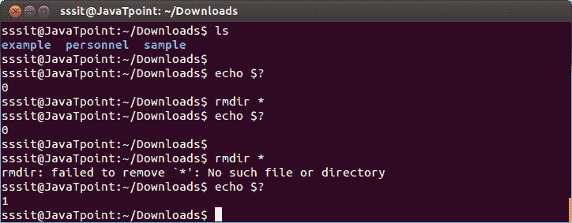

# Linux 美元问号($？)

> 原文：<https://www.javatpoint.com/linux-dollar-question-mark>

该控制操作符用于检查上次执行命令的状态。如果状态显示**“0”**则命令成功执行，如果显示**“1”**则命令失败。

前一个命令的退出代码存储在 shell 变量$？。它是一个外壳参数，而不是一个变量，因为你不能给它赋值。

**语法:**

```

echo $?

```



看上面的快照，第一次，所有的目录都被成功删除，因此$？显示值**“0”。**

But in the second time, command was failed to delete the directories and hence shows the value **'1'.**