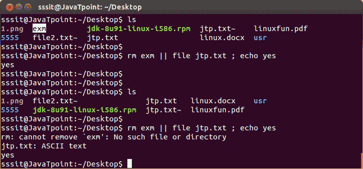

# 双竖线(||)

> 原文：<https://www.javatpoint.com/linux-double-vertical-bar>

命令外壳将 **(||)** 解释为逻辑或。这与逻辑“与”相反。意味着只有当第一个命令失败时，第二个命令才会执行。

**示例:**

```

rm exm || file jtp.txt ; echo yes

```



看上面的快照，通过列出桌面，可以看到有一个文件**‘exm’**(我们高亮显示只是为了指出来)。现在，我们已经给出了命令**“RM exm | | file jtp . txt；回声是”。**传递此命令时，由于第一个命令已成功删除' exm '，因此'文件 jtp.txt '尚未执行。

现在，我们再次传递了相同的命令**“RM exm | | file jtp . txt；回应“是”**现在第二个命令‘file jtp . txt’成功执行。