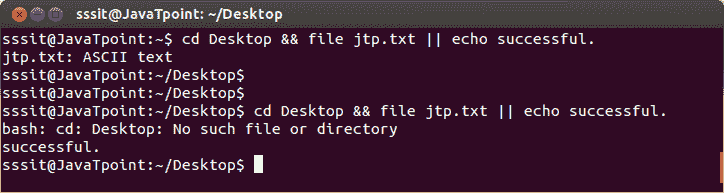

# 组合&&和||

> 原文：<https://www.javatpoint.com/linux-combining-and-or-operators>

逻辑“与”和逻辑“或”的组合用于在命令行中编写一个 **if then else** 结构。

如果第一个条件(If)将被满足，那么命令行执行将在那里停止。

但是如果第一个条件失败，那么第二个条件(否则)执行。

**示例:**

```

 cd Desktop && file jtp.txt || echo successful.

```



看上面的快照，从命令**“CD Desktop&&文件 jtp.txt || echo 成功。”**，第一个(if)命令 **(cd Desktop & &文件 jtp.txt)** 成功执行，因此命令行执行停止。

但第二次，“如果”部分执行不成功，则“否则”部分将被执行。