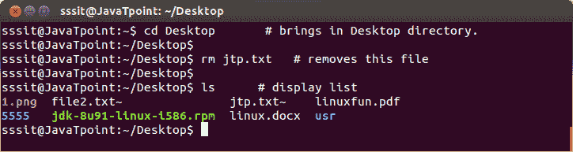

# 磅符号(#)

> 原文：<https://www.javatpoint.com/linux-pound-sign>

任何写在#符号之后的内容都将被忽略，或者被认为是注释，而不是命令执行的一部分。它被用作注释符号。注释意味着你可以为你的观点或利益写任何东西，它不会成为 shell 扩展的一部分。

**语法:**

```

 # 
```

**示例:**

```

 #  brings in Desktop directory.
# removes this file

```



看上面的快照，我们在#符号后写了一些行供我们使用，它们不参与 shell 扩展或命令执行。