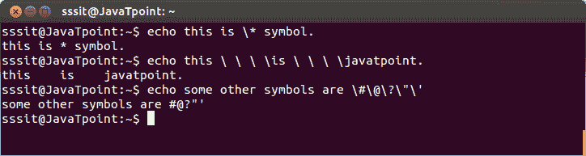
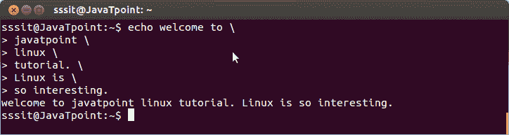

# 转义特殊字符(\)

> 原文：<https://www.javatpoint.com/linux-escaping-special-characters>

转义字符用于允许在外壳扩展中使用控制字符，但无需外壳解释。

**示例:**

```

echo this \ \ \ \is \ \ \ \javatpoint. 

```



看上面的快照，我们已经展示了一些特殊字符的使用。

* * *

## 结束一行(\)

当在一行的末尾使用反斜杠时，它会指引你到下一行。shell 不会解释转义字符并等待执行，直到新的一行没有反斜杠结束。



看看上面的快照，所有的行都以反斜杠(\)结尾。