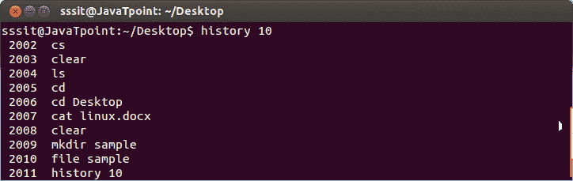
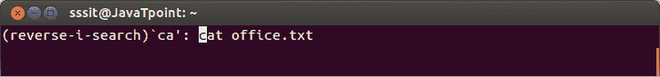

# Linux 外壳历史

> 原文：<https://www.javatpoint.com/linux-shell-history>

“历史”命令将显示 shell 中最后使用的命令列表(shell 历史)。

**语法:**

```

history 
```

**示例:**

```

history 10

```



看上面的快照，我们已经使用了 **history -10** (可以使用任意整数)命令，它显示了最后十个命令的列表。

#### 注意:“history -c”从历史记录中清除所有命令的列表。

## 控制 + r

“ctrl+r”键执行历史记录中与您键入的指定字符相匹配的最后一个命令。

**语法:**

```

press 'ctrl+r'.  
```

**示例:**

```

press 'ctrl+r'. ca

```



看上面的快照，我们已经按下了**‘ctrl+r’**后跟两个字符 ca，它已经找到了最后一个匹配字符‘ca’的命令。

* * *