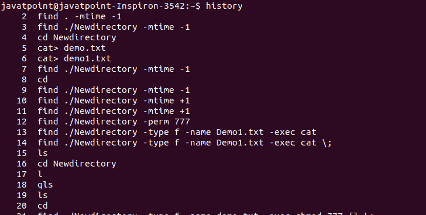
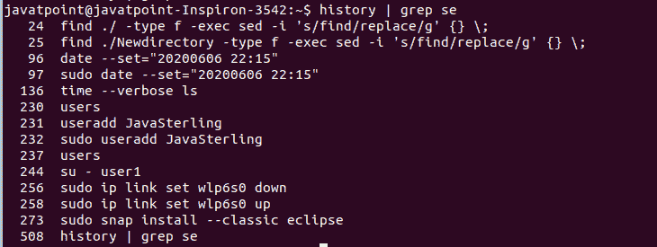
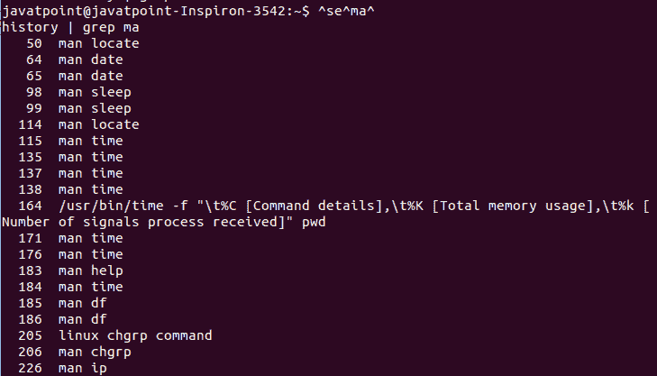

# Linux 历史命令

> 原文：<https://www.javatpoint.com/linux-history-command>

Linux 历史命令用于显示用户执行的命令的历史。这是一个方便的工具，用于审核已执行的命令及其日期和时间。

大多数命令一次从终端读取一行输入。但是，history 命令能够记录那些带有相关数据的行。默认情况下，它将显示从旧命令到最新命令的最后五百个命令。历史库保存在历史文件中。

### 语法:

历史命令的基本语法如下:

```

history

```

### 选项:

以下是历史命令支持的一些命令行选项:

**-c:** 用于清除完整的历史列表。

**-d offset:** 用于删除 offset 位置的历史条目。

**-a:** 用于追加历史行。

**-n:** 用于读取所有历史行。

**-r:** 用于读取历史文件。

**-w:** 用于将当前历史写入历史库。

**-p:** 用于进行历史扩展。

**-s:** 用于将参数作为单个条目追加到历史列表中。

### 如何使用历史命令？

历史命令的基本用法非常简单。按如下方式执行历史命令:

```

history

```

它将列出历史库中以前执行的命令。考虑下面的输出快照:



从上面的输出中，显示了 500 个命令的列表。

### 显示历史记录中的第 n 个命令

我们可以通过将其指定为来显示命令的具体数量”！<command number=""></command>”。例如，我们想要显示历史文件中的第 500 条最新命令，请按如下方式执行该命令:

```

!500

```

它将显示我们历史上最新的命令。考虑以下输出:


从上面的输出中，我们已经执行了 man 命令，所以它正在显示它。根据历史，产量会有所不同。

### 显示 n 个最近的命令

我们可以使用 history 命令列出最后 n 个命令。例如，如果我们想要显示前面的五个命令，请执行下面的命令:

```

history 5

```

上面的命令将显示前面执行的五个命令。考虑以下输出:


### 通过指定命令的名称来显示命令

我们可以通过指定命令的名称来显示该命令。它将显示该命令的最新用法。例如，我想看到最后一个“ls”命令。为此，请执行以下命令:

```

!ls

```

上面的命令将显示历史记录中 ls 命令的前一次使用。考虑以下输出:


### 显示带有搜索模式的命令

我们可以通过指定搜索模式来显示命令的历史。要指定模式，请使用 grep 命令管道历史命令，如下所示:

```

history | grep se

```

上面的命令将搜索与模式“se”匹配的命令。考虑以下输出:



### 更改已执行的历史命令

我们可以通过返回不同语法的命令来转换已执行的历史命令。例如，如果我们想将之前的命令“history | grep se”更改为“history | grep ma”。为此，请执行以下命令:

```

^se^ma^

```

上述命令将改变以前的历史命令行为。它将显示与模式“ma”匹配的命令，而不是“se”考虑以下输出:



从上面的输出中，显示了与模式“ma”匹配的所有命令。

### 删除历史记录

历史命令允许我们从历史库中删除数据。我们可以删除特定的行或完整的历史。

要删除特定命令，请通过在历史记录中指定命令编号来执行历史记录命令，如下所示:

```

history -d <line number>

```

例如，要删除最近的命令，请执行以下命令:

```

history -d 500

```

上面的命令将删除最近的命令，它在数字 500 上。考虑以下输出:


从上面的输出中，删除了历史记录中的第 500 条<sup>命令。如果成功执行，它不会返回任何内容。</sup>

要删除已执行命令的完整历史记录，请运行以下命令:

```

history -c

```

上述命令将从历史库中删除整个历史。

* * *