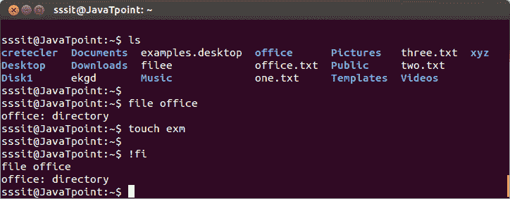
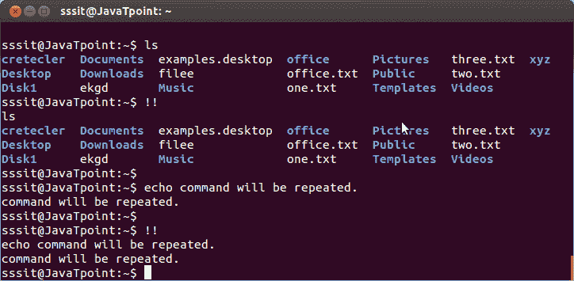
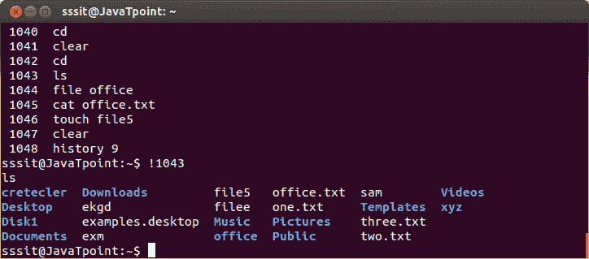

# Linux！！

> 哎哎哎:# t0]https://www . javatppoint . com/Linux-bang

该命令也读作**‘砰砰’**命令。它会重复 shell 中最后键入的命令。

**语法:**

```

!!

```



看上面的快照， **'ls'** 命令通过传递**重复！!'**命令。之后，**‘回声命令将重复’**也已经重复。

* * *

## ！

这个命令发音为“砰”的一声。最后键入的命令将由**重复！!'**。但是，如果你想重复其他命令，那么你可以使用**“！”**命令，后跟该命令的一个或多个字符。

**语法:**

```

!  
```



看上面的快照，命令**”！fi"** 重复上述命令'文件办公室'。

* * *

## ！n

这里，n 表示**数。**只需键入“！”后跟您想要使用的命令行编号，该命令将被执行。

**语法:**

```

!
```

**示例:**

```

!1043

```



看上面的快照，我们已经从行号 **1043 执行了命令**‘ls’**。**

* * *