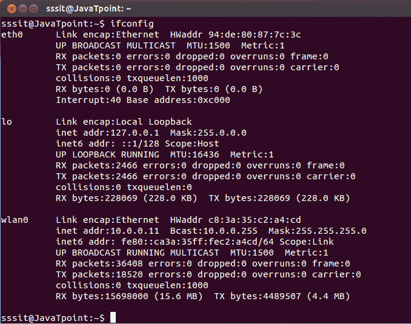
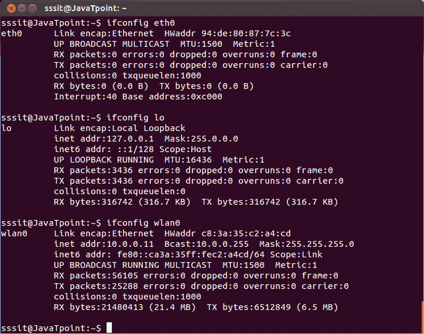

# Linux ifconfig

> 原文：<https://www.javatpoint.com/linux-ifconfig>

ifconfig 命令代表接口配置器。此命令使我们能够初始化接口、分配 IP 地址、启用或禁用接口。它显示路由和网络接口。

您可以使用 ifconfig 命令查看 IP 地址、MAC 地址和最大传输单位。

ifconfig 的较新版本是 ip 命令。ifconfig 命令适用于所有版本。

**语法:**

```

ifconfig

```



看上面的快照，它显示了三者的 IP 地址，即 eth、lo 和 wlan。

* * *

## 获取特定接口的详细信息

要以不同方式找到这三个地址，请使用命令

```

ifconfig eth0
ifconfig lo
ifconfig wlan0

```



* * *

## 分配 IP 地址和网关

您可以为接口分配 IP 地址和网关，但这些设置将在系统重新启动后被禁用。

**语法:**

```

ifconfig eth0  netmask 

<address>
</address>

```

* * *

## 启用或禁用特定接口

到**启用**特定界面，

```

ifup eth0

```

至**禁用**特定界面，

```

ifdown eth0

```

* * *

## 设置 MTU 大小

默认情况下，最大传输单位大小为 1500，您可以根据自己的意愿更改大小。

```

Ifconfig eth0 mtu xxxx

Replace xxxx with size.

```