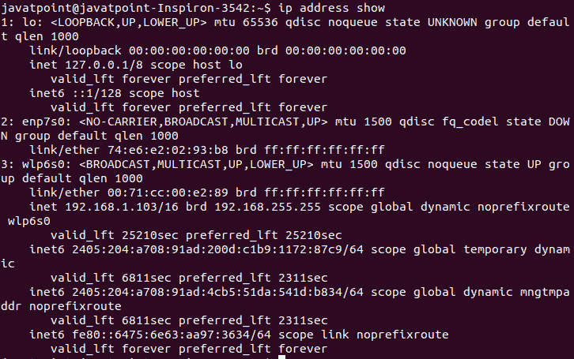
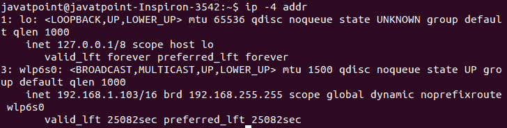
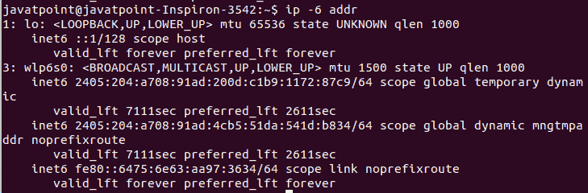
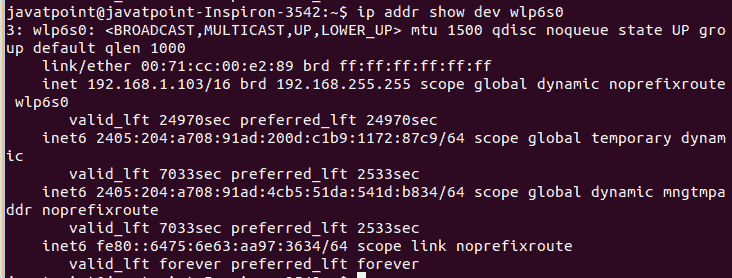
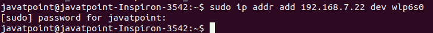
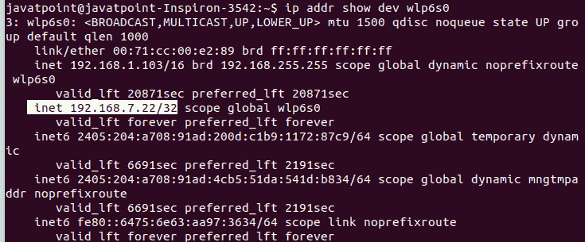
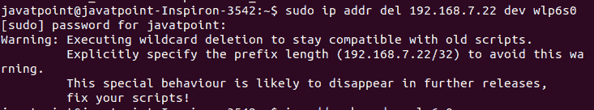
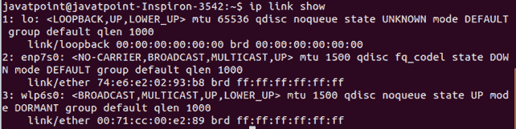
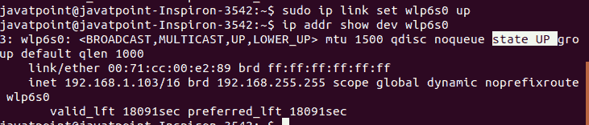

# Linux 知识产权命令

> 原文：<https://www.javatpoint.com/linux-ip>

Linux IP 命令是 [ifconfig 命令](https://www.javatpoint.com/linux-ifconfig)的更新版本。对于 [Linux](https://www.javatpoint.com/linux-tutorial) 管理员来说，这是一个配置网络接口的便捷工具。它可以用来分配和删除地址，打开或关闭接口，以及更多有用的任务。

### 语法:

[IP](https://www.javatpoint.com/ip-full-form) 命令的基本语法如下:

```

ip a or ip addr  

```

### 选项:

IP 命令支持以下命令行选项:

**-V 或-Version:** 用于显示 IP 命令的版本。

**-h，-人，-人可读:**用于以人可读值的形式显示统计数据。

**-b，-batch < FILENAME > :** 用于从给定文件或输入中读取和调用命令。故障可能导致[知识产权](https://www.javatpoint.com/ip)效用终止。“-force”选项不会让 IP 在批处理模式下因错误而终止。如果在执行过程中有任何错误，返回代码将是非零的。

**-s、-stats、-statistics:** 用于显示统计或时间值等更多信息。

**-d、-details:** 用于显示详细输出。

**-l，-loops < COUNT > :** 用于指定最大循环数。

**-f，-family < FAMILY >:用于确定协议家族。这些协议族标识符可以是 inet、inet6、网桥、ipx、dnet、mpls 或 link。以下快捷方式用于协议系列:**

*   **-4:** 用于 inet 家族。
*   **-6:** 用于 inet6 家族。
*   **-B:** 用于桥牌家族。
*   **-D:** 用于 decnet 家族。
*   **-I:** 用于 ipx 家族。
*   **-M:** 用于 mpls 家族。
*   **-0:** 用于链接族。

**-o，-oneline:** 用于在一行显示每条记录。它用反斜杠“\”字符替换行字段。这对于使用 wc 和 grep 命令计数记录非常有用。

**-r，-resolve:** 当我们想使用系统的名称解析器来打印 DNS 名称而不是主机地址时，会指定它。

**-n，-netns < netns > :** 用于将 IP 切换到指定的 NETNS(网络命名空间)。

**-a 或-all:** 用于对所有对象执行给定的命令。

**-c，-color:** 用于显示彩色输出。

**-t，-时间戳:**用于显示当前时间。

**-ts，-tshort:** 它与‘timestamp’选项非常相似，但使用的格式更短。

**-rc，-rcvbuf < SIZE > :** 用于设置 Netlink 套接字接收缓冲区大小，默认值为 1MB。

**-iec:** 用于以 iec 单位显示人类可读的速率(如 1Ki = 1024)。

**-br，-brief:** 用于以表格形式仅显示重要信息，以提高可读性。

### 有用的 IP 命令语法

下表给出了 IP 命令的一些有用的命令语法。

| 目标 | 使用 |
| 地址 | 它用于设备上的协议(IP 或 IPv6)地址。 |
| 地址标签 | 它用于标记协议地址选择的配置。 |
| l2tp(消歧义) | 它用于 IP 以太网隧道(L2TPv3)。 |
| 环 | 它用于将设备联网 |
| 地址 | 它用于多播地址。 |
| 班长 | 它用于观看 Netlink 消息。 |
| 路呢 | 它用于多播路由缓存条目。 |
| mrule | 它用于多播路由策略数据库中的规则 |
| 邻居 | 它用于管理 ARP 或 NDISC 缓存条目。 |
| 海王星啊 | 它用于管理网络名称空间 |
| 著名的 | 它用于管理邻居缓存的操作 |
| 途径 | 它用于路由表条目。 |
| 规则 | 它用于路由策略数据库中的规则。 |
| tcp_metrics/tcpmetrics | 它用于管理传输控制协议度量。 |
| 代币 | 它用于管理标记化的接口标识符。 |
| 隧道 | 它用于 IP 隧道。 |
| 调谐器抽头 | 它用于管理 TUN/TAP 设备。 |

对象名也可以缩写形式书写。例如，地址对象可以写成 addr 或者只是一个。

### IP 命令是如何工作的？

IP 命令管理 Linux 系统如何处理 IP 地址、网络接口控制器等等。通过 IP 命令进行的更改会立即对系统采取措施；我们不需要重启它。

IP 命令还有许多其他应用。它有许多子命令；每个命令都作用于特定的对象，如路由和 IP 地址。它提供了丰富的功能。

以下是 IP 命令使用的一些有用的对象:

**地址:**包含 IP 地址和范围。

**链接:**它包含网络接口，如连接和[无线网络](https://www.javatpoint.com/wifi-full-form)适配器。

**路由:**它包含管理通过接口(链路)发送到地址的流量路由的协议。

### 知识产权命令的使用

让我们看看 IP 命令的以下用法:

*   列出 IP 地址
*   显示 Ipv4 和 Ipv6 地址
*   显示单一界面
*   向接口添加一个 IP 地址
*   删除一个 IP 地址
*   带网络接口的 IP
*   启动或停止网络接口
*   带路由的 IP

### 列出 IP 地址

IP 命令的基本用途是了解我们系统的设置和地址。要显示我们计算机的 IP 地址，请使用如下地址执行 IP 命令:

```

ip address show

```

上面的命令将显示我们系统的设置和地址。但是，我们也可以使用以下命令之一来获得相同的结果:

```

ip addr show
ip addr
ip a

```

所有上述命令将产生相同的输出。考虑以下输出:



从上面的输出中，我们可以看到两个 IP 地址和很多相关的其他信息。此外，还有关于显示的界面的附加信息。第一个 IP 地址是内部 IP 地址，用于本地通信。第二个是局域网上使用的外部 IP 地址。

### 显示 Ipv4 和 Ipv6 地址

如果您只想显示 Ipv4 地址，请执行以下命令:

```

ip -4 addr

```

上述命令将只显示 IP 版本 4 地址。考虑以下输出:



要显示 Ipv6 地址，请执行以下命令:

```

ip -6 addr

```

上述命令将只显示 IP 版本 6 地址。考虑以下输出:



### 显示单一界面

要显示单个接口的信息，使用带有接口名称的**“显示开发”**选项。例如，要查看**‘wlp6s 0’**界面的详细信息，请执行以下命令:

```

ip addr show dev wlp6s0

```

上面的命令将显示如下输出:



我们还可以使用“-4”和“-6”标志来过滤输出，以显示与给定接口相关的 [Ipv4 和 Ipv6](https://www.javatpoint.com/ipv4-vs-ipv6) 信息。

### 向接口添加一个 IP 地址

**“添加”**和**“开发”**选项用于向接口添加一个 IP 地址。我们必须指定要添加的 IP 地址和接口。例如，将 IP 地址“192.168.7.22”添加到“wlp6s0”接口。要添加此 Ip 地址，请执行以下命令:

```

sudo ip addr add 192.168.7.22 dev wlp6s0

```

上面的命令将给定的 IP 地址添加到指定的接口。如果添加成功，将不会产生任何输出。考虑以下输出:



要验证添加的 Ip 地址，请执行以下命令:

```

ip addr show dev wlp6s0

```

考虑以下输出:



从上面的输出，我们可以看到给定的 IP 地址被添加到指定的接口。

### 删除一个 IP 地址

删除一个 IP 地址与添加相同，只是我们必须用“删除”替换“添加”选项要删除 IP，请执行以下命令:

```

sudo ip addr del 192.168.7.22 dev wlp6s0

```

上述命令将从“wlp6s0”接口删除给定的 IP。考虑以下输出:



### 带网络接口的 IP

我们可以使用**链接对象**来工作和检查网络接口。要在我们的系统上显示已安装的界面，请执行以下命令:

```

ip link show

```

上面的命令将显示我们机器上安装的界面。考虑以下输出:



### 启动或停止网络接口

带有**向上**和**向下**参数的**‘设置’**选项用于启动和停止网络接口。考虑以下命令:

```

sudo ip link set wlp6s0 down

```

上述命令将关闭“wlp6s0”接口。要显示界面的状态，请执行以下命令:

```

ip addr show dev wlp6s0

```

考虑以下输出:


要启动界面，请执行以下命令:

```

sudo ip link set wlp6s0 up

```

上面的命令将启动给定的接口。考虑以下输出:



### 带路由的 IP

**根对象**用于检查和操纵路线。路由定义了网络流量的转发过程和应用的网络接口。在共享网络的情况下，发送设备可以直接转发数据包。但是，如果目的设备没有直接连接，发送设备会将数据包发送到默认路由器。在这种情况下，路由器处理数据包。

要显示我们系统的已定义路线，请执行以下命令:

```

ip route

```

* * *