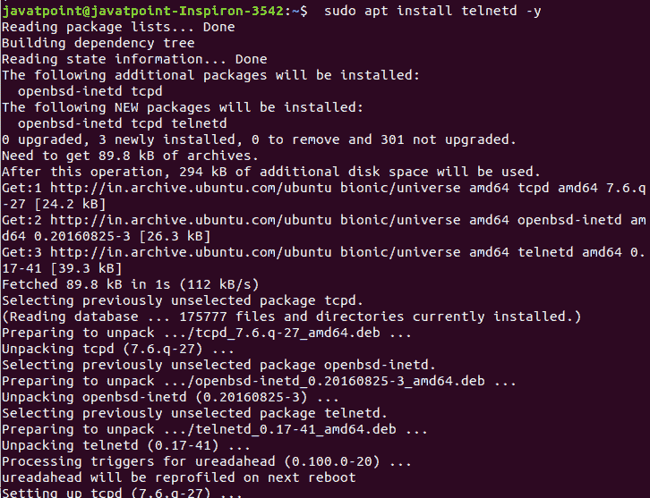
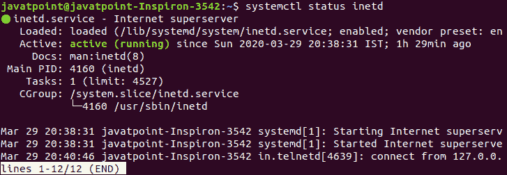
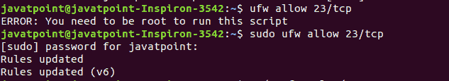
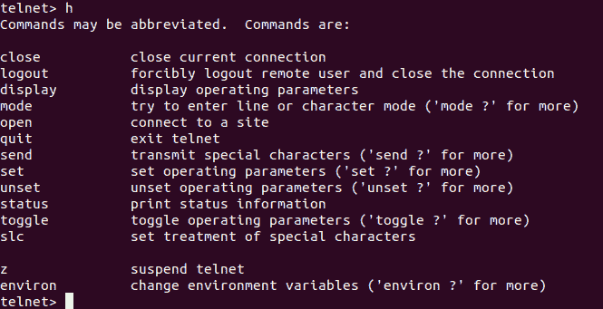
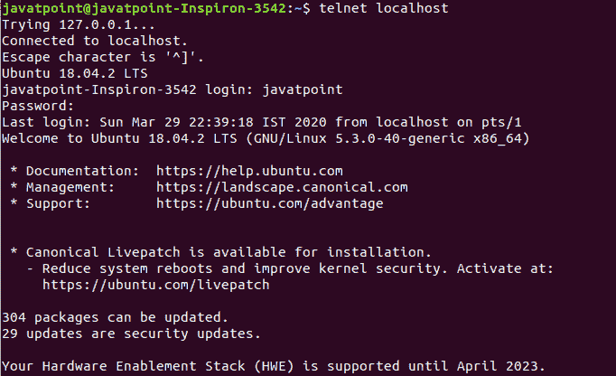

# Linux 远程登录命令

> 原文：<https://www.javatpoint.com/linux-telnet-command>

在 Linux 中， **telnet** 命令用于通过 TCP/IP 网络创建与系统的远程连接。它允许我们通过终端管理其他系统。我们可以运行一个程序来进行管理。

它使用 TELNET 协议。然而，该协议存在一些安全缺陷，但由于其简单性，它是最常用的网络协议之一。它不是一个安全的协议，因为它以未加密的形式传输数据。Linux 用户通常更喜欢 **ssh** 而不是 telnet，因为 ssh 以加密的形式传输数据。该实用程序类似于 Windows 中的远程桌面功能。远程登录的语法如下:

```

telnet hostname/IP address

```

## 在 Linux 上安装远程登录(Ubuntu)

在 Linux 上安装 telnet 是一个简单的过程。我们可以通过执行以下命令来安装它:

通过执行以下命令更新 Linux 系统:

```

sudo apt update

```

上述命令将提示输入用户密码。输入密码，按**回车**键；它将启动一个守护进程，并需要一段时间来更新您的系统。

要安装 telnet，请执行以下命令:

```

sudo apt install telnetd -y

```

上面的命令将安装 telnet 协议所需的包。考虑以下输出:



要验证安装以及服务是否正在运行，请执行以下命令:

```

systemctl status inetd

```

考虑以下输出:



现在，我们必须打开 ufw 防火墙中的端口 23。执行以下命令:

```

ufw allow 23/tcp

```

上述命令只能由根用户执行。如果您不是根用户，请在此命令之前使用 sudo。考虑以下输出:



下一步是重新加载防火墙以应用更改。要重新加载防火墙，请执行以下命令:

```

ufw reload

```

现在，我们已经成功地在我们的机器上安装了 telnet。

## 启动远程登录外壳

交互式 shell 可以通过执行 telnet 命令来启动，如下所示:

```

telnet

```

这个 shell 允许我们执行一些只用于 telnet 的命令。如下图所示:


该外壳便于使用各种命令来创建远程连接。我们可以通过执行帮助命令来列出所有的命令，通过键入 **h** 来执行帮助命令。考虑以下输出:



从上面的 shell 快照中，列出了所有命令及其用法。列出了许多命令行实用程序，如关闭、注销、显示、模式、打开、退出、发送等。

## Linux 中如何通过 telnet 命令连接？

通过 telnet 命令在两个系统之间创建连接是一个简单的过程，先执行 telnet 命令，然后执行主机名。

例如，我们正在将系统与本地主机连接。按如下方式执行命令:

```

telnet localhost

```

上面的命令将询问用户名和密码，输入凭据继续。考虑以下输出:



连接后，我们可以像以前一样执行命令。唯一不同的是，现在机器被视为远程机器。

要退出 telnet 命令，请执行注销命令。

```

logout

```

考虑以下输出:


现在，我们已经从远程连接成功注销。

* * *