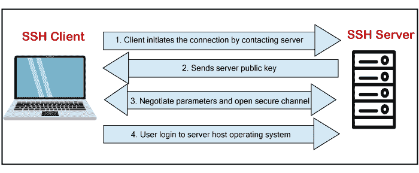
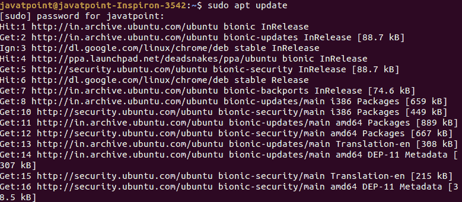
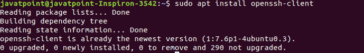
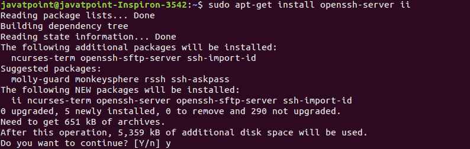
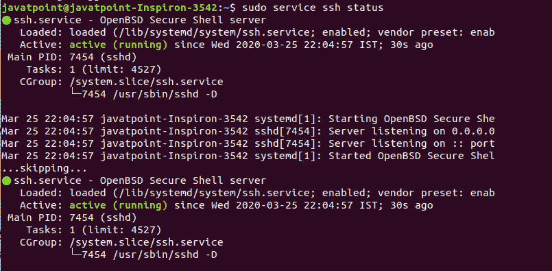
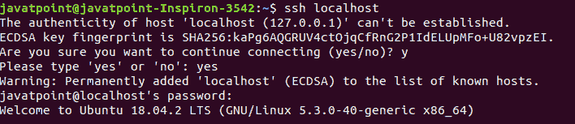
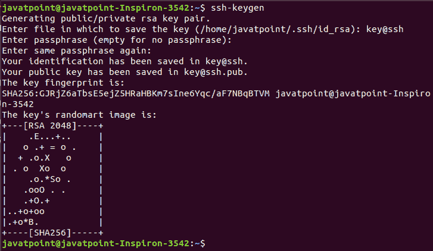

# SSH Linux | Linux ssh 命令

> 原文：<https://www.javatpoint.com/ssh-linux>

在 Linux 中， **ssh** 是一个协议，代表 S **ecure Shell** 或者 S **ecure Socket Shell。**连接到远程服务器时，安全外壳对于安全性非常有用。 **ssh 命令使用 ssh 协议**，这是一种安全协议，因为客户端和主机之间的数据传输是以加密形式进行的。它通过客户端将输入传输到主机，并返回主机传输的输出。它通过 TCP/IP 端口 22 执行。

加密连接还用于在 **Linux 服务器**、**端口**、**转发**、**隧道**等上运行命令。

有许多 SSH 客户端可供商业和免费使用。OpenSSH 是其使用最广泛的客户端。它适用于所有最常用的平台，如 Windows、Linux、macOS、OpenBSD 等。

**语法:**

```

ssh user_name@host(IP/Domain_name)

```

## ssh 命令的组件

ssh 命令由三种不同类型的组件组成:

*   **ssh 命令:**它指示机器创建与主机系统的安全加密连接。
*   **用户名:**用户名是 Linux 用户的名称，主机正在访问该用户。
*   **主机:**主机是用户正在访问的机器，例如计算机或路由器。域名或 IP 地址也称为主机。

## SSH 是如何工作的？

要建立 SSH 连接，我们需要两个主要组件；客户端和主机，可以是服务器、域名、IP 地址等。此外，我们需要一个 ssh 客户端来连接另一台计算机或服务器。客户端使用指定的主机信息来建立连接；如果提供的凭据经过验证，它将建立加密连接。



服务器(主机)包含一个 SSH 进程，准备通过 TCP/IP 端口接受客户端连接请求。一旦客户端发起连接，主机就会以必要的信息进行响应并交换凭据。

如果所提供的信息得到验证，SSH 协议将为可用环境建立一个新的连接。

SSH 服务器和 SSH 客户端通信的默认 SSH 协议版本是版本 2。

## 在 Linux (Ubuntu)上安装 OpenSSH 客户端

OpenSSH 客户端是一个连接工具，用于系统使用 SSH 协议连接两个系统。它也被称为 ssh，可以从 Linux 终端调用。该客户端包包含其他 ssh 实用程序，如 sftp、scp 和 ssh，默认情况下使用 SSH 命令安装。它使用这些 ssh 实用程序执行远程操作。

OpenSSH 客户端预装在大多数 Linux 发行版中。如果任何 Linux 系统没有 ssh 客户端，我们可以使用包管理器手动安装它。

要安装 OpenSSH 客户端，请执行以下命令:

```

sudo apt update

```

上面的 sudo 命令将更新 Linux 系统的包。考虑以下输出快照:



更新 Linux 系统后，执行以下命令安装 OpenSSH 客户端:

```

sudo apt install OpenSSH-client

```

上面的命令将安装 OpenSSH 客户端的最新包。考虑以下输出:



从上面的输出中我们可以看到，正在运行一个守护进程来安装 OpenSSH 客户端。和我们的机器一样，已经安装了 OpenSSH 客户端，所以它显示了消息‘OpenSSH-client 已经是最新版本了。’

#### 注意:默认情况下，macOS 搭载 Openssh 客户端。

## 在 Linux(Ubuntu)上安装 OpenSSH 服务器

要建立 SSH 连接，我们需要在机器上安装 SSH 软件的服务器端部分。

要检查服务器的安装状态，请打开终端并执行以下命令:

```

ssh localhost

```

如果我们的机器没有 OpenSSH 客户端的服务器工具包，那么它将显示如下输出:


在上面的例子中，我们必须安装 OpenSSH 服务器。

要安装 SSH 服务器，请执行以下命令:

```

sudo apt-get install openssh-server ii

```

以上命令将提示系统管理密码，输入密码，按**回车**键开始安装过程。接下来，确认安装类型**‘y’**键，按回车键。考虑以下输出:



确认安装后，守护进程将开始，并在您的机器上安装 OpenSSH 服务器。

要验证安装，请执行以下命令:

```

sudo service ssh status

```

上述命令将显示安装状态。如果安装成功，它将显示如下输出:



还有另一种方法可以通过 ssh localhost 命令测试安装:

```

ssh localhost

```

上述命令将验证连接类型“**是”**以继续。考虑以下输出:



现在，我们已经成功地在我们的机器上安装了 OpenSSH 服务器。

## SSH 密钥生成

要创建与主机客户端的连接，我们需要加密连接的特定密钥。通过 ssh 密钥登录到远程主机比使用密码更安全。登录主机后，只有将这些命令直接写入主机，计算机命令才会起作用。

要生成 ssh 密钥，请执行以下命令:

```

ssh-keygen

```

上述命令将生成公钥和私钥，用于创建与主机系统的连接。考虑以下输出:



从上面的输出中我们可以看到，ssh 密钥已经生成。 **ssh-keygen** 命令创建了两个文件， **[【邮件保护】](/cdn-cgi/l/email-protection)**和 **[【邮件保护】](/cdn-cgi/l/email-protection)**，它们分别包含私钥和公钥。

出于安全考虑，建议隐藏私钥，将公钥复制到远程主机。将此密钥复制到远程主机后，我们可以使用 SSH 密钥建立连接，而不是通过密码。

## SSH 协议技术

SSH 协议相比 **telnet** 等其他协议更加安全，加密技术也比其他协议相当优秀。SSH 使用三种主要的加密技术。它们如下:

1.  **哈希:**哈希是一种身份验证技术，用于确保接收到的数据是否来自真正的发送方，以及是否未被更改。它使用哈希函数从接收到的数据中生成哈希代码。但是，不可能从哈希值重新生成数据。该哈希值在发送方和接收方的两端进行验证。如果匹配，则数据通过身份验证。
2.  **对称加密:**这种技术生成一个密钥用于加密和解密。生成的密钥在主机和客户端之间分发，并创建安全连接。这是最基本的加密技术。当数据在同一台机器上加密和解密时，它的性能最好。
3.  **非对称加密:**非对称加密技术被认为比其他技术更安全，因为它使用 ssh 密钥(公钥和私钥)进行加密。公钥被分发到其他机器以创建安全连接，而私钥仅由客户端机器使用。安全连接由公钥和私钥建立。

## SSH 命令

客户端 ssh 对于 ssh 命令有很多功能，比如**创建密钥、配置密钥、打开 SSH 服务器、持有单点登录密钥、文件传输客户端、**等等。一些最有用的 ssh 命令如下:

*   **ssh-keygen:** 用于创建建立连接和公钥认证的密钥对。
*   **ssh-copy-id:** 用于在服务器上将公钥配置为有效用户。
*   **ssh-agent:** 用于创建一个代理来保存单点登录的私钥。
*   **ssh-add:** 是给代理添加密钥的工具。
*   **scp:** 它是一个文件传输客户端，提供类似 RCP 的命令行界面。
*   **sftp:** 它是一个文件传输命令，提供类似 ftp 的命令行界面。
*   **ssh:**它是一个用于 Linux 系统的 OpenSSH 服务器。

**选项:**有很多命令行选项可以指定 SSH 输出的不同规格。一些有用的选项如下:

*   **-c:** 用于为非 IN 数据指定查询类。
*   **-C:** 用于比较权威名称服务器上的 SOA 记录。
*   **-d:** 这个选项被认为相当于-v。
*   **-i:** 用于 IP6.INT 反向查找。
*   **-l:** 用于列出使用 AXFR 的域中的所有主机。
*   **-m:** 该选项设置内存调试标志，如 trace|record|usage。
*   **-N:** 用于改变查根前允许的点数。
*   **-r:** 用于禁用递归处理。
*   **-R:** 指定 UDP 数据包的重试次数。
*   **-s:** 用于 SERVFAIL 响应应停止查询。
*   **-t:** 用于指定查询类型。
*   **-T:** 用于启用 TCP/IP 模型。
*   **-v:** 用于详细输出。
*   **-V:** 用于打印版本号并退出。
*   **-w:** 用于指定永远等待回复。
*   **-W:** 用于指定等待回复的时间。
*   **-4:** 仅用于 IPv4 查询传输。
*   **-6:** 仅用于 IPv6 查询传输。

## 如何通过 SSH 连接

由于我们已经安装了 SSH 客户端和服务器，我们可以与其他机器建立安全连接。为了两台机器之间的安全连接，它们都安装了 ssh 客户端和服务器。

要建立连接，请执行以下命令:

```

ssh your_username@host_ip_address

```

如果要连接的计算机验证了用户名，请执行以下命令:

```

ssh host_ip_address

```

上述命令将询问密码，键入密码，然后按回车键。

如果我们是第一次连接，它会要求继续连接；键入是，然后按回车键。它将添加一个 ECDSA(椭圆曲线数字签名算法)密钥，并将您连接到远程服务器。

您现在有资格通过您的终端控制和管理远程机器。如果您在建立连接时遇到任何困难，请考虑以下几点:

*   如果提供的远程机器的 IP 地址有效。
*   SSH 守护程序正在侦听的端口没有被防火墙阻止或转发不正确。
*   您输入的用户名和密码是正确的。
*   SSH 软件安装正确。

* * *