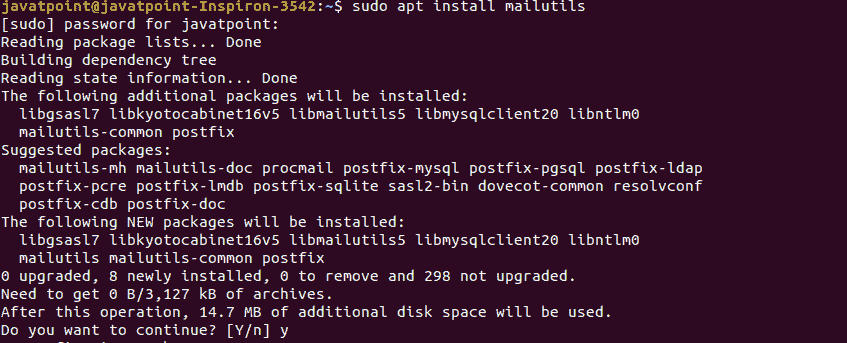
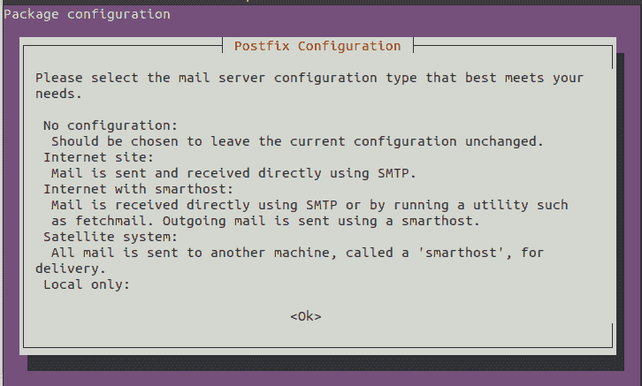
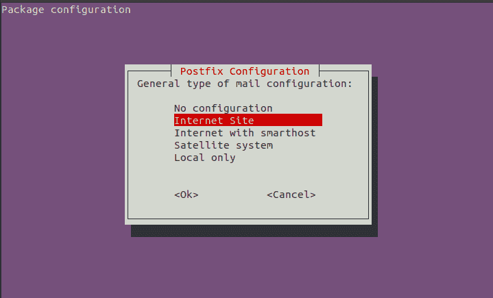
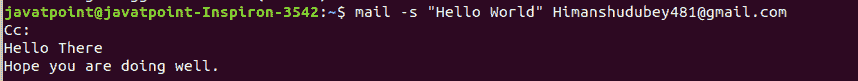
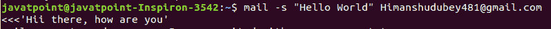
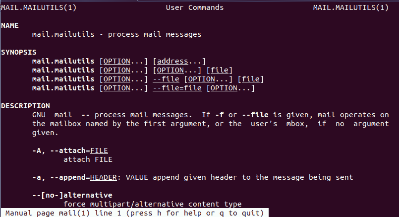
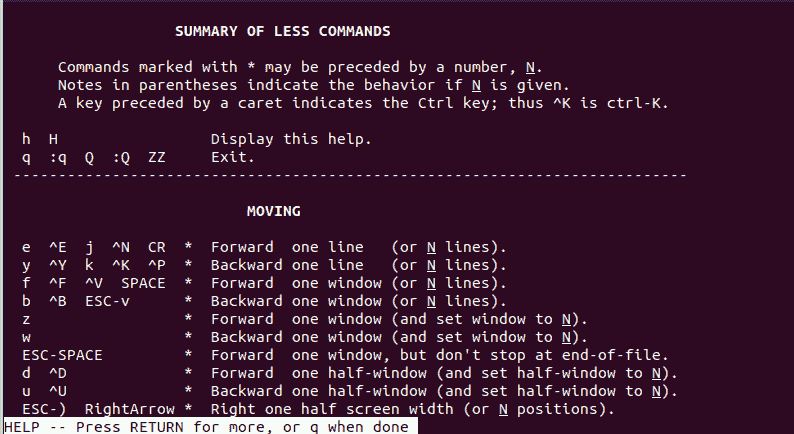

# Linux 邮件命令

> 原文：<https://www.javatpoint.com/linux-mail-command>

Linux **mail** 命令是一个命令行实用程序，允许我们从命令行发送电子邮件。如果我们想通过 shell 脚本或 web 应用程序以编程方式生成电子邮件，那么从命令行发送电子邮件将非常有用。邮件命令可以由终端和 Shell 脚本直接使用。然而，Linux 中还有许多其他命令可以用来从命令行发送电子邮件，例如 **sendmail、mutt、SSMTP、telnet** 等等。在本节中，我们将重点讨论邮件命令。

## 在 Linux 中安装邮件命令

mail 命令可以通过各种软件包安装，例如:

*   gnu mailutils
*   传家宝-邮件
*   bsd-mailx

每个包都有不同的功能和选项。例如**传家宝矩阵**包能够使用外部 smtp 服务器发送消息，而其余两台服务器使用本地 smtp 服务器。

我们将安装 mailutils 包，这是从命令行发送电子邮件的最流行方式。它支持邮件命令来发送电子邮件。

要安装 mailutils 包，请执行以下命令:

```

sudo apt install mailutils

```

上面的命令会询问系统密码，输入密码，然后按**回车**键。它将验证安装，键入**‘y’**确认安装。考虑下面的输出快照:



它将启动一个守护进程，并要求后缀配置，选择您想要的后缀选项。



有四个后缀选项可供安装。它们如下:



要选择您想要的选项，使用**箭头**键滚动选项，并使用**选项卡+回车**键选择。Postfix 与服务器交互来处理请求。选择后缀选项后，它将在您的计算机上成功安装 mailutils 包。

## 邮件命令是如何工作的？

了解命令是如何工作的很重要。mailutils 包的 mail 命令调用标准的 sendmail 二进制文件将邮件发送到指定的目标。它连接到本地 MTA，这是一个本地运行的 SMTP 服务器，支持端口 25 上的邮件。

这意味着包含 smtp 服务器的后缀应该在我们的机器上运行，以便使用 mail 命令。后缀询问域名系统，邮件的目的地，域名系统回复邮件服务器列表，并创建一个 SMTP 连接。如果丢失，我们会得到类似“**发送邮件:无法打开邮件:25** ”的错误信息。

## 使用 mail 命令发送邮件

从命令行发送邮件是一个简单的过程。要从终端发送邮件，请执行以下命令:

```

mail -s "Subject" <recipient address>

```

“-s”选项用于指定主题。执行命令后，它会询问 Cc 地址。键入 Cc(副本)地址；您可以通过按回车键将其留空。键入文本，按 CTRL+D 键发送。考虑以下输出:



从上面的输出中，邮件将被发送到指定的邮件地址。

## 在一行中指定邮件正文

我们可以在一行中指定主题和消息。要在一行中指定消息正文，请执行以下命令:

```

mail -s "subject" <recipient_address> <<< 'Message'

```

上面的命令将邮件发送到指定的地址。考虑以下命令:



或者我们也可以指定如下命令:

```

echo "Message body" | mail -s "Subject" aFrom:Dwivedi\<Himanshudubey481@gmail.com\> hr@javatpoint.com

```

## 从文件中获取消息

我们还可以从文件中获取消息。如果我们想从 shell 脚本或其他程序中调用 mail 命令，这很有用。要从文件发送消息，请执行以下命令:

```

mail -s "Hello World" user@yourmaildomain.com < /home/mail/mailcontent.txt

```

上面的命令将从文件 mailcontent.txt 发送消息。为了快速，我们还可以使用下面的命令:

```

$ echo "Message body" | mail -s "Subject" <mail_address>

```

### 指定抄送和密件抄送

我们还可以在命令中附加一个密件抄送和抄送地址。要附加密件抄送和抄送地址，请分别使用-b 和-c 选项。

要添加密件抄送地址，请执行以下命令:

```

mail -s "Hello World" <recipient address> -b userto< bcc address>

```

要添加抄送地址，请执行以下命令:

```

mail -s "Hello World" <recipient address> -c userto< cc address>

```

此外，我们可以在一个命令中指定抄送和密件抄送地址。按如下方式执行命令:

```

mail -s "Hello World" <recipient address> -b userto< bcc address> -c userto<cc address>

```

### 添加多个收件人

mail 命令允许我们在一封邮件中添加多个收件人，而不是抄送和密件抄送。要添加多个邮件地址，只需将其他邮件地址放在第一个邮件地址之后，后跟逗号(，)。考虑以下命令:

```

mail -s "Hello World" <recipient address1>,<recipient address2>

```

上面的命令将消息传递到两个地址。

### 指定发件人姓名和地址

我们可以添加额外的标题信息，如“发件人”的姓名和地址，以附在电子邮件中。要使用 mail 命令指定附加信息，请将-a 选项与命令一起使用。按如下方式执行命令:

```

$ echo "Message body" | mail -s "Subject" -aFrom:Sender_name\<Sender mail address\> recipient address

```

上述命令将把指定的信息传送给接收器。

### 添加附件

我们也可以在邮件中附上一份文件。-a 选项用于将文件与邮件一起附加。要添加附件，请执行以下命令:

```

 echo "Message body" | mail -s "Subject" -r "<recipient address>" -a /path/to/file <sender address>

```

上面的命令将用邮件从指定的路径附加一个指定的文件。

## 阅读邮件

mail 命令可以用来读取所有收到的邮件。然而，从命令行阅读邮件并不酷，但我们可以理解为知识的摇动。要读取收件箱邮件，请执行 mail 命令，不带任何选项，如下所示:

```

mail

```

上述命令将显示所有收到的邮件。

## 邮件命令手册

要阅读 mail 命令的手册，请执行 man 命令，如下所示:

```

man mail

```

上述命令将在您的终端上显示邮件命令手册。考虑以下输出:



按“q”键退出手册，按“h”键寻求帮助。帮助选项列出了更多帮助您的选项。请考虑下图:



要退出帮助，请按“q”键。

* * *