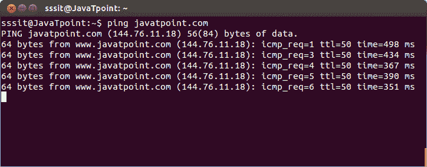
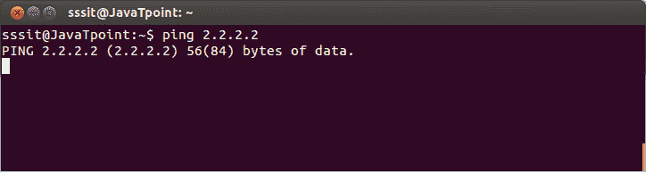
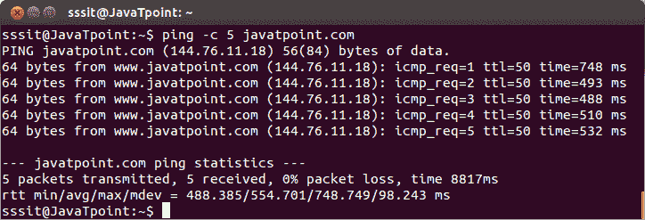
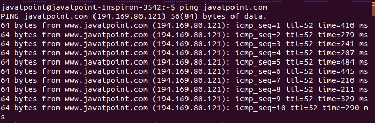
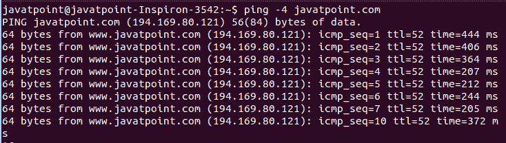
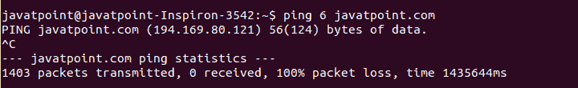
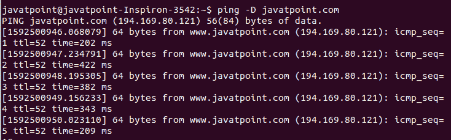
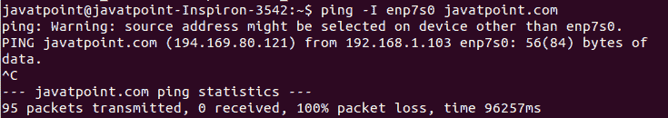
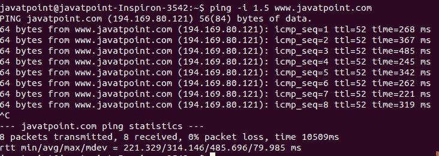

# Linux ping 命令

> 原文：<https://www.javatpoint.com/linux-ping>

Linux ping 命令代表(分组互联网协议)。它检查两个节点之间的连通性，以查看服务器是否可用。它向网络主机发送 ICMP ECHO_REQUEST 数据包，并在远程服务器的响应中显示数据。它检查远程主机是否启动，或者是否可以访问网络接口。此外，它用于检查两个设备之间是否有网络连接。它也是检查网络连接和验证网络问题的便捷工具。

Ping 命令继续执行并发送数据包，直到您中断。

要停止执行，按“ **CTRL** +C”键。

### 语法:

ping 命令支持各种命令行选项。但是，ping 命令的基本语法如下:

```

ping <option> <destination>

```

### 选项:

ping 命令支持以下命令行选项:

**-4:** 以前只使用 IPv4。

**-6:** 仅用于使用 IPv6。

**-a:** 用于可听 ping。

**-A:** 用于自适应 ping。

**-b:** 用于 ping 广播地址。

**-B:** 用于不改变探头源地址。

**-c 计数:**用于发送计数 ECHO_REQUEST 数据包后停止。

**-d:** 用于在正在使用的套接字上设置 SO_DEBUG 选项。

**-D:** 用于打印每行前的时间戳。

**-f:** 代表洪水坪。它为每个发送的回声请求打印一个周期，为每个接收的回声应答打印退格。

**-F 流量标签:**仅用于 IPv6。它在回应请求数据包上分配一个 20 位流标签(十六进制)。

**-h:** 用于显示帮助手册，简要说明用法和支持选项。

**-i 间隔:**用于指定每个数据包之间的时间间隔，单位为秒。默认情况下，它被设置为 1。

**-I 接口:**用于指定源接口。

**-l 预加载:**如果指定了预加载，则发送数据包，不等待回复。只有超级用户(具有 sudo 权限的用户)有权选择预加载超过。

**-L:** 用于粉碎组播包的环回。这对于多播目的地地址很有用。

**-m 标记:**用于标记输出数据包。这对于在出站处理中选择策略路由非常有用。

**-M pmtudisc_opt:** 用于选择路径 MTU 发现策略。

**-N nodeinfo_option:** 仅用于 IPv6。

**-n:** 用于显示数值输出。

**-O:** 用于在发送下一个数据包前报告未完成的 ICMP ECHO 回复。

**-p 模式:**它允许我们指定多达 16 个“填充”字节来填充发送的数据包。这对于确定“网络中与数据相关的问题”非常有用。"

**-q:** 用于终端安静。

**-Q tos:** 用于设置 ICMP 数据报中服务相关比特的质量。

**-r:** 用于绕过正常的路由表。此外，它直接将其发送到连接接口上的主机。

**-R:** 用于记录路线。

**-s 数据包大小:**用于确定要发送的数据字节数。默认情况下，它发送 56 个字节。

**-S sndbuf:** 用于设置 socket sndbuf。如果未指定，缓冲区将不会选择多个数据包。

**-t ttl:** 仅用于 ping，将 IP 时间设置为 Live。

**-T 时间戳选项:**用于设置 tsonly、tsandaddr 或 tsprespec host 1[host 2][host 3[host 4]]等特殊的 IP 时间戳选项。

**-U:** 用于显示完整的用户间延迟。通常，ping 命令显示网络往返时间。

**-v:** 打印更详细的输出。

**-V:** 用于显示版本信息。

**-w 截止时间:**用于指定 ping 命令退出前的超时时间，以秒为单位。

**-W 超时:**用于指定以秒为单位的响应等待时间。

### ping 命令的示例

让我们看看 ping 命令的以下示例:

*   使用域名系统 Ping
*   使用 IP 地址 Ping
*   限制数据包
*   检查远程主机是否启动
*   检查 IPv4 连接
*   检查 IPv6 连接
*   在每一行前添加时间戳
*   指定源接口
*   更改 Ping 数据包之间的时间间隔

### 使用域名系统 Ping

要使用 DNS 检查连接，请执行以下命令:

```

ping <destination>

```

考虑以下命令:

```

ping javatpoint.com

```

上面的命令将 ping“javatpoint . com”。考虑下面的输出:



### 使用 IP 地址 Ping

我们可以使用 [IP](https://www.javatpoint.com/ip-full-form) 地址，而不是带有 ping 命令的 DNS。要使用 IP 地址 ping 目标，请执行以下命令:

```

ping <IP address>

```

考虑以下命令:

```

ping 2.2.2.2  

```

上述命令将检查与给定 [IP](https://www.javatpoint.com/ip) 地址的连通性。考虑以下输出:



### 限制数据包

我们可以使用 ping 命令来限制发送的数据包数量。要限制数据包，请指定“c”选项，后跟要发送的数据包数量。它将按如下方式执行:

```

ping -c <number> <destination>  

```

考虑以下命令:

```

ping -c 5 javatpoint.com  

```

上述命令将数据包限制在 5 个以内。考虑以下输出:



### 检查远程主机是否启动。

要检查远程主机是否启动，请执行 ping 命令，然后是远程服务器的主机名或 IP 地址。考虑以下命令:

```

ping javatpoint.com

```

上面的命令将检查与“javatpoint.com”的连接。考虑下面的输出:



从上面的输出来看，该命令将保持运行；我们可以通过按 **CTRL+C** 键手动中断。

### 检查 IPv4 连接

“-4”选项用于 Ipv4 接口。要检查 IPv4 接口是否启动，请执行以下命令:

```

ping -4 javatpoint.com

```

上面的命令将使用 Ipv4 地址显示与' javatpoint.com '的连接。考虑以下输出:



### 检查 IPv6 连接

“-6”选项用于 IPv6 接口。要检查 IPv6 接口是否启动，请执行以下命令:

```

ping 6 javatpoint.com

```

上面的命令将使用 IPv6 地址显示与“javatpoint.com”的连接。考虑以下输出:



### 在每一行前添加时间戳。

“-D”选项用于在每行之前添加时间戳。要在每行之前添加时间戳，请执行以下命令:

```

ping -D javatpoint.com

```

上面的命令将在每行的开头添加一个 UNIX 时间戳。考虑以下输出:



### 指定源接口

默认情况下，ping 命令使用默认路由发送 ICMP 数据包。要指定特定的源接口，请使用“-I”选项，如下所示:

```

ping -I <INTERFACE_NAME> <DESTINATION>

```

考虑以下命令:

```

ping -I enp7s0 javatpoint.com

```

上述命令将使用“enp7s0”作为源接口 ping javatpoint.com。考虑以下输出:



### 更改 Ping 数据包之间的时间间隔

默认情况下，ping 数据包之间的时间间隔为一秒钟。我们可以根据自己的需要来设置。“-i”选项用于设置每个 ping 请求之间的时间间隔。要设置 ping 间隔，请执行以下命令:

```

ping -i <time> <destination>

```

考虑以下命令:

```

ping -i 1.5 www.javatpoint.com

```

上述命令将每“1.5”秒请求 ping 数据包。考虑以下输出:



从上面的输出可以看出，8 个包的传输时间是 1050s。

* * *