# Linux netstat 命令

> 原文：<https://www.javatpoint.com/linux-netstat>

Linux netstat 命令代表**网络统计**。它显示不同接口统计信息，包括开放套接字、路由表和连接信息。此外，它还可以用来显示所有的套接字连接(包括 TCP、UDP)。除了连接的套接字之外，它还显示等待连接的套接字。对于网络和系统管理员来说，这是一个方便的工具。

### 语法:

netstat 命令支持各种命令行选项。netstat 命令的基本语法如下:

```

netstat 

```

### 选项:

它支持多个命令行选项来打印关于 [Linux](https://www.javatpoint.com/linux-tutorial) 网络子系统的信息。输出由第一个参数控制。让我们看看第一个参数的列表:

**(无):**如果未指定选项，它将执行默认命令，显示所有已配置地址族的开放套接字列表。

**- route，-r:** 用于打印内核路由表。“netstat -r”命令和“route -e”命令将产生相同的输出。

**-group，-g:** 用于显示不同 [IP](https://www.javatpoint.com/ip) 版本(Ipv4 和 IPV6)的组播组成员信息。

**-接口，-i:** 用于显示所有网络接口。

**-伪装，-M:** 显示伪装连接。

**-统计，-s:** 该选项显示每个协议的汇总统计。

### 其他选项:

**- verbose，-v:** 用于显示详细输出。这是一个显示未配置地址族详细信息的便捷工具。

**- wide，-W:** 作为输出，不根据需要减少 [IP](https://www.javatpoint.com/ip-full-form) 地址。不破坏现有脚本仍然是可选的。

**-数字，-n:** 用于显示数字地址，或者定义符号主机、端口或用户名。

**-数字主机:**用于显示数字主机地址；它不影响端口或用户名的解析。

**-数字端口:**用于显示数字端口号，不影响主机或用户名的属性和对象。

**-数字用户:**用于显示数字用户标识，不影响主机或端口名称的解析。

**-协议=系列，-A:** 用于指定要显示连接的地址系列。地址族由逗号('，')分隔，如 Inet、inet6、Unix、ax25、Netrom、Econet、Ipx、DDP 和蓝牙。

**-c、- continuous:** 用于每秒连续显示所选信息。

**-e，- extend:** 用于扩展输出。该选项可以使用两次，以获得最大的细节。

**-o，- timers:** 用于包含联网定时器相关信息。

**-p，- program:** 用于向对应的套接字显示进程的 PID 和名称。

**-l，-监听:**用于只显示监听插座。

**-a、- all:** 用于显示两个插座(即听和不听)。通过指定“- interfaces”选项，我们可以列出未启动的接口。

**-F:** 用于显示来自 FIB 的路由信息。

**-C:** 用于显示来自路由缓存的路由信息。

### netstat 命令的安装

如果您的机器上没有安装 netstat 命令，它将显示传统的 Linux 安装错误消息“找不到命令‘netstat’。”

要安装它，请执行以下命令:

```

 sudo apt install net-tools

```

上面的命令将要求管理密码来安装该命令。如果安装成功，它将产生如下输出:

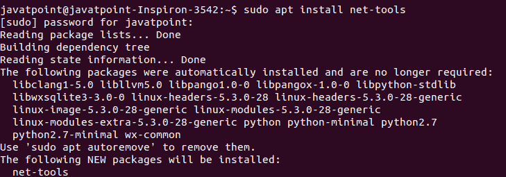

### netstat 命令的示例

让我们看看 netstat 命令的以下示例:

*   显示所有连接
*   仅显示 TCP 或 UDP 连接
*   禁用反向域名系统查找以加快输出速度
*   仅显示监听连接
*   显示 Pid 和 Uid
*   显示统计数据
*   显示内核路由信息
*   显示网络接口
*   持续显示 netstat 输出
*   显示多播组信息

### 显示所有连接

“-a”选项用于显示所有现有连接。按如下方式执行 netstat 命令:

```

netstat- a

```

上面的命令将列出所有现有的连接。考虑以下输出:

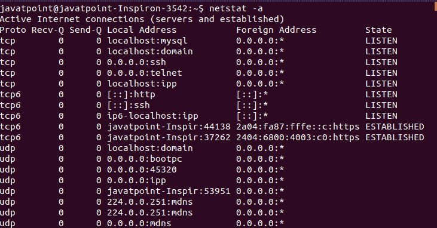

### 仅显示 TCP 或 UDP 连接

我们只能列出 TCP 或 UDP 连接。要仅显示 TCP 连接，请使用“t”选项执行命令，如下所示:

```

netstat -at

```

上面的命令将列出所有的 TCP 连接。考虑以下输出:

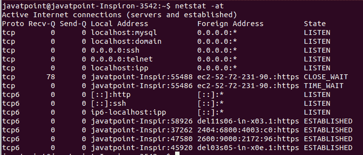

要仅显示 UDP 连接，请使用“u”选项执行它，如下所示:

```

netstat -au

```

上面的命令将列出所有的 UDP 连接。考虑以下输出:

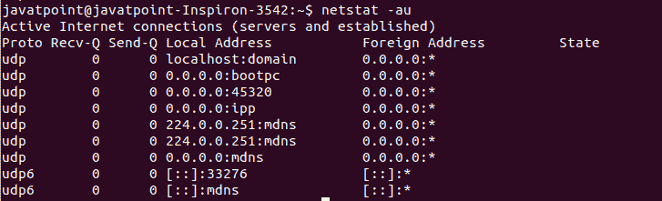

### 禁用反向域名系统查找以加快输出速度

netstat 命令的默认行为是通过反向 DNS 查找找出每个 IP 地址的主机名。它会导致输出变慢。如果我们不想知道主机名，那么通过取消“n”选项来禁用反向 DNS 查找:考虑下面的命令:

```

netstat -ant

```

上述命令将禁用反向域名系统查找，并显示所有的 TCP 连接。考虑以下输出:

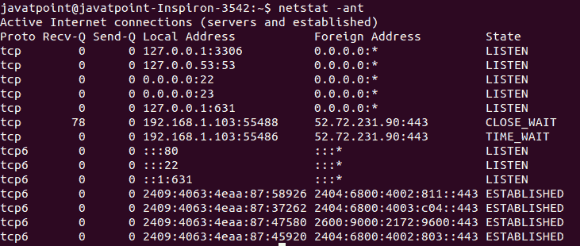

### 仅显示监听连接

监听连接是可用于连接请求的连接。任何网络进程都为侦听传入的连接请求保留一个开放端口。通过执行以下命令，可以列出这些连接:

```

netstat -tnl

```

上面的命令将列出 TCP 连接的所有监听连接。考虑以下输出:

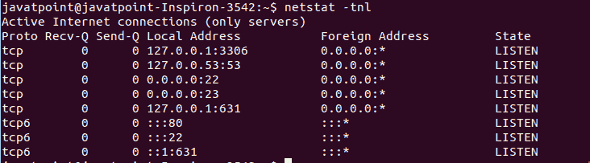

### 显示 Pid 和 Uid

在检查网络统计数据时，有时了解特定连接或用户的 Pid 和 Uid 至关重要。可以通过执行“p”选项来列出 Pid 和 Uid。执行以下命令:

```

sudo netstat -nlpt

```

上面的命令将列出 TCP 连接的所有 Pid。必须以 sudo 权限执行此命令。否则，它将不会显示 Pid。考虑以下输出:

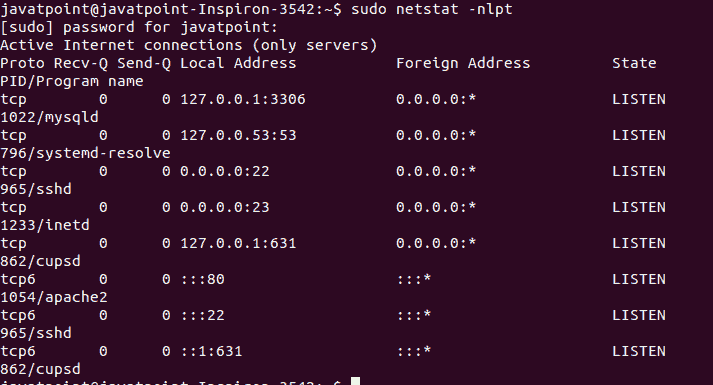

### 显示统计数据

netstat 命令也是一个方便的工具，用于显示网络统计信息，例如协议没有发送和接收数据包。要显示网络统计信息，请使用“-s”选项执行命令，如下所示:

```

netstat -s

```

上述命令将显示网络统计信息。考虑以下输出:


### 显示内核路由信息

“r”选项用于显示内核路由信息。它将显示与路由命令相同的输出。要显示路由信息，请执行以下命令:

```

netstat -rn

```

上述命令将显示路由信息。“n”选项将禁用主机名查找。考虑以下输出:

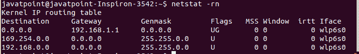

### 显示网络接口

我们还可以使用 netstat 命令显示网络接口的信息。要显示网络接口，请执行带有“I”选项的命令，如下所示:

```

netstat -i

```

上面的命令将列出网络接口和相关信息。考虑以下输出:

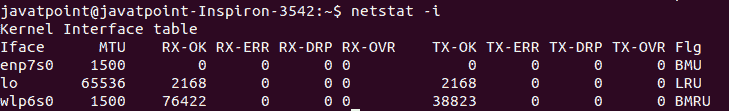

### 连续显示网络状态输出

要连续显示 netstat 输出，请使用“c”选项执行命令，如下所示:

```

netstat -ct

```

上述命令将连续显示 TCP 连接。考虑以下输出:

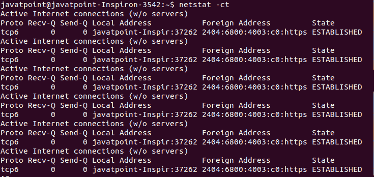

### 显示多播组信息

“g”选项用于显示多播组信息。要打印 [Ipv4 和 Ipv6](https://www.javatpoint.com/ipv4-vs-ipv6) 的详细信息，请执行以下命令:

```

netstat -g

```

上述命令将显示多播组信息。考虑以下输出:

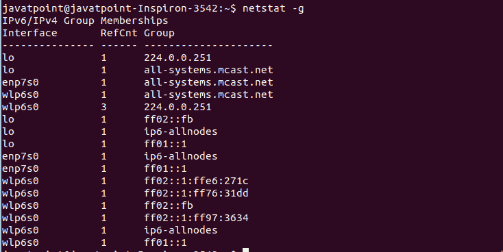

* * *