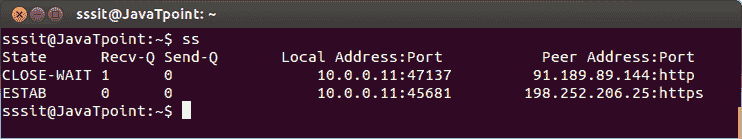
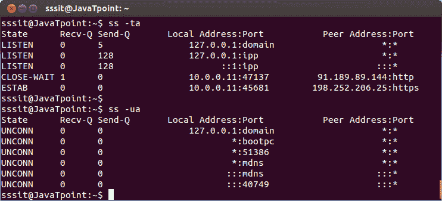
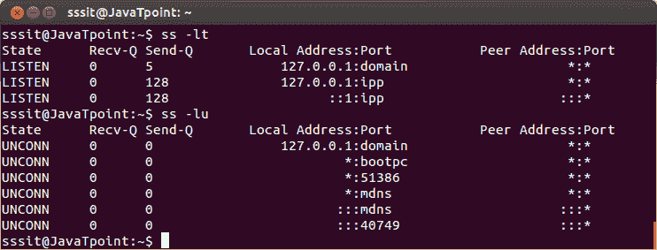

# Linux 系统

> 原文：<https://www.javatpoint.com/linux-ss>

ss 命令是 netstat 命令的替代命令。与 netstat 相比，该命令提供了更多信息。它也比 netstat 更快，因为它从内核用户空间获取所有信息。

**语法:**

```

ss

```



看上面的快照，ss 命令显示所有的 TCP、UDP 和套接字连接。

* * *

## 列出了 TCP、UDP 和 Unix 的监听端口和连接端口

如果您想列出 TCP、UDP 和 Unix 的已连接端口和侦听端口，请使用 **-t、** **-u** 和 **-x** 分别使用**和**命令。

```

ss -ta
ss -ua
ss -xa

```



* * *

## 列出了 TCP、UDP 和 Unix 的监听端口

如果要列出 TCP、UDP 和 Unix 的监听端口，使用 **l** 命令分别使用 **-t、** **-u** 和 **-x** 。

**语法:**

```

ss -lt
ss -lu
ss -lx

```

