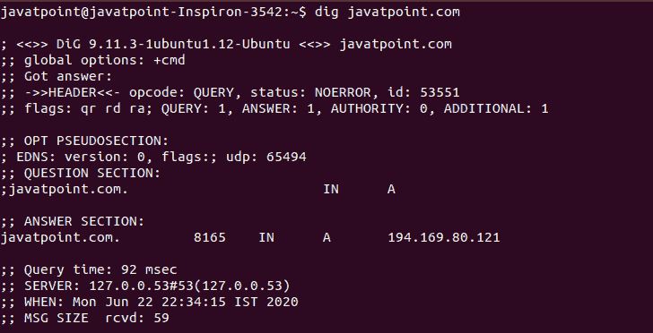
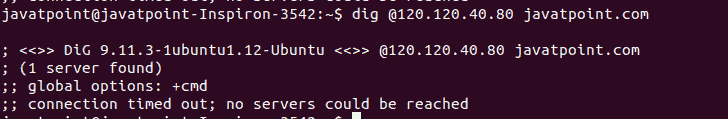
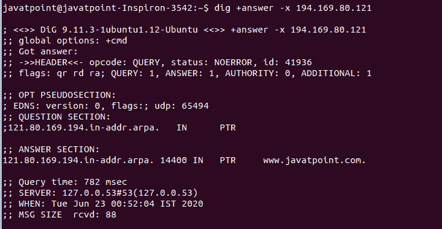

# Linux 挖掘命令(域名系统查找)

> 原文：<https://www.javatpoint.com/linux-dig>

Linux dig 命令代表**域信息 Groper** 。此命令用于与 DNS 查找相关的任务，以查询 DNS 名称服务器。主要处理 DNS 相关问题的故障排除。这是一个检查域名服务器的灵活工具。它用于执行域名系统查找，并从名称服务器返回查询的答案。通常，它被大多数域名系统管理员用来解决域名系统问题。这是一个简单明了的工具，提供了清晰的输出。它比其他查找工具功能更强。

dig 命令支持大量命令行选项。此外，它有助于批处理模式，这对于从文件中访问查找请求非常有用。如果没有在 dig 命令中指定查询特定的名称服务器，它将从**/etc/resolv . conf**访问每个服务器没有任何命令行选项的摘要将对“”执行 ns 查询(根)。

### 语法:

dig 命令的一般语法如下:

```

dig @server name type

```

在上面的语法中，

**服务器:**是我们要查询的名称服务器或 [IP](https://www.javatpoint.com/ip-full-form) 地址的名称。可以是 [Ipv4 或 Ipv6](https://www.javatpoint.com/ipv4-vs-ipv6) 地址。如果给定的服务器是主机名，它会在查询给定名称的服务器之前确定名称。

如果我们不指定服务器，它将从“/etc/resolv.conf”中查找。如果它在这里找到一个名称服务器，它将查询这个名称服务器。如果没有找到有效的地址，它会将查询转发到本地主机。

**名称:**决定资源记录的名称。

**类型:**它指定所需的查询类型，如 ANY、A、MX、SIG 等。类型参数必须有效。如果没有指定参数类型，它会将值“A”作为默认值并查找它。

### 选项:

以下是 dig 命令的一些有用的命令行选项:

**-4:** 仅用于 IPv4。

**-6:** 仅用于 IPv6。

**-b 地址[#port]:** 用于设置查询的源 [IP](https://www.javatpoint.com/ip) 地址。

**-c 类:**用于设置查询类。

**-f 文件:**用于批处理模式。dig 命令访问指定文件中的查找请求进行处理。摘要系统地处理文件中组织的每一行。

**-I:**-' I '选项对于“反向 Ipv6 查找”很有用。

**-k keyfile:** 用指定文件生成的密钥标记使用 TSIG 的查询。我们可以使用“tsig-keygen”生成密钥文件。

**-m:** 用于启用内存使用调试。

**-p 端口:**用于将查询转发到服务器上的非标准端口，而不是默认端口(即 53)。这是一个测试名称服务器的便捷工具。

**-q 名称:**用于域名查询。这是一个方便的工具来区分名称和其他参数。

**-t 类型:**用于指定要查询的资源记录类型。通常，这些记录是任何有效的查询类型。类型参数的默认值是“A”。

**-u:** 用于显示查询次数(以微秒计)。

**-v:** 用于显示版本信息。

**-x addr:** 用于简化地址到名称映射的反向查找。

**-y [hmac:]keyname:secret:** 用于用给定的身份验证密钥标记 TSIG 的查询。“keyname”定义密钥名，“secret”代表“base64 编码的共享密钥”。“hmac”指定密钥算法的名称。有效选项可以是“hmac-md5、hmac-sha1、hmac-sha224、hmac-sha256、hmac-sha384 或 hmac-sha512”。

### 安装挖掘命令

dig 命令是与 BIND 名称服务器一起安装的 **dnsutils 包**的一部分。要安装 dig 实用程序，请执行以下命令:

对于基于 Debian 和 Ubuntu 的系统，执行以下命令:

```

sudo apt-get install dnsutils

```

对于 CentOS 7，执行以下命令:

```

yum install bind-utils

```

上面的命令将安装 dig 命令所需的包文件。要验证安装，请执行以下命令:

```

dig -v

```

### 挖掘命令的示例

让我们看看下面的 dig 命令示例:

*   查询域名
*   显示短输出
*   显示详细输出
*   查询特定的名称服务器
*   跟踪域名系统路径
*   反向域名系统查找
*   查询多个域名

### 查询域名

我们可以使用 dig 命令执行域名的 [DNS](https://www.javatpoint.com/computer-network-dns) 查找。挖掘命令的默认行为将显示类型 A 记录。要查询域名，请执行以下命令:

```

dig <domain name>

```

考虑以下命令:

```

dig javatpoint.com

```

上面的命令将查询给定的域名。考虑以下输出:



从输出中，我们可以看到 dig 版本信息、关于查询的统计数据、其他技术细节、以及一个问题部分和其他几个部分。

### 显示短输出

上面使用的 dig 命令显示了许多关于指定域名的信息。但是，可能有一段时间你只是想要简短的信息。“+short”选项用于显示较少的输出。它将只显示给定域的 IP 地址。考虑以下命令:

```

dig javatpoint.com +short

```

上面的命令将显示 javatpoint.com 的 IP 地址。考虑以下输出:


### 显示详细输出

如果您想知道任何域名的附加信息，请使用“+答案”选项执行 dig 命令。要阻止显示所有部分的命令，请在命令中指定“+noall”选项。考虑以下命令:

```

javatpoint.com +noall +answer

```

上述命令将显示一些附加信息，如国家名称、IP 地址等。考虑以下输出:


### 查询特定的名称服务器

dig 命令的默认行为是对给定的域名执行[域名系统](https://www.javatpoint.com/dns-full-form)查找。我们可以通过在名称服务器的 IP 地址或主机名前使用@符号来更改这种行为。考虑以下命令:

```

dig @120.120.40.80 javatpoint.com

```

上面的命令将使用给定的选项对名称服务器(120.120.40.80)执行 DNS 查找。考虑以下输出:



### 跟踪域名系统路径

我们可以使用 dig 命令跟踪 DNS 路径。“+trace”选项用于跟踪 DNS 路径。它将从根开始查询名称服务器，并向下遍历以查找后续的名称空间。要跟踪 DNS 路径，请执行以下命令:

```

dig javatpoint.com +trace

```

考虑以下输出:


### 反向域名系统查找

反向 DNS 查找显示指定 IP 地址的域和主机名。要执行反向 DNS 查找，请使用“-x”选项和 IP 地址执行命令。考虑以下命令:

```

dig +answer -x 194.169.80.121

```

上述命令将对给定的 IP 地址执行反向 DNS 查找。考虑以下输出:



### 查询多个域名

dig 命令允许我们执行批处理查询。我们可以为多个域执行域名系统查找。要做到这一点，我们必须创建一个文件，在一个新的行中有多个域名。例如，对域“javatpoint.com”、“google.com”和“github.com”执行 DNS 查找。创建一个文件“lookups.txt”，如下所示:

```

 cat >lookups.txt
javatpoint.com
google.com
github.com

```

现在通过执行以下命令查询指定域的域:

```

dig -f lookups.txt +short

```

上面的命令将在“lookups.txt”中显示指定域的 IP 地址。考虑下面的输出:


* * *