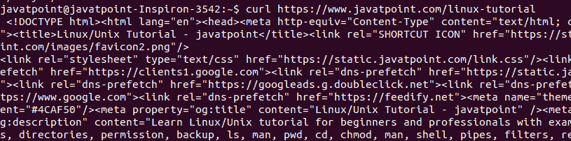
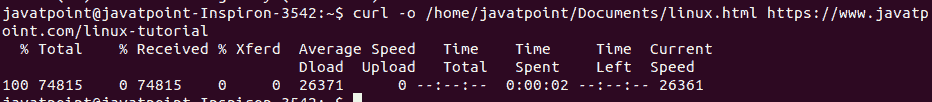
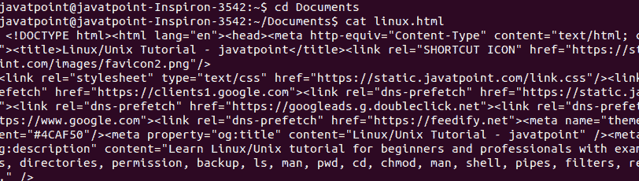
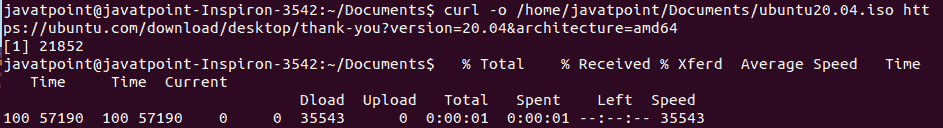

# Linux 卷曲命令

> 原文：<https://www.javatpoint.com/linux-curl-command>

Linux curl 命令用于通过支持的协议(如 HTTP、FTP、IMAP、SFTP、TFTP、IMAP、POP3、SCP 等)将数据下载或上传到服务器。这是一个远程实用程序，因此它在没有用户交互的情况下工作。

从一个地方到另一个地方的数据传输是计算机系统最重要和最常用的任务之一。然而，有许多[图形用户界面](https://www.javatpoint.com/gui-full-form)工具可用于数据传输。但是，当在命令行上工作时，它会变得有点复杂。curl 实用程序允许我们通过命令行传输数据。

### 语法:

使用 curl 的基本语法如下:

```

curl [options] [URL...]

```

从上面的语法来看，

### 网址:

[网址](https://www.javatpoint.com/url-full-form)语法是一个依赖于协议的通用网址。我们可以指定多个网址如下:

```

http://site.{one,two,three}.com

```

### 选项:

curl 命令支持以下命令行选项:

**-抽象-unix-socket <路径> :** 用于通过抽象的 unix 域 socket 而不是网络进行连接。

**- anyauth:** 用于命令 curl 使用最安全的方法自行认证方法。该实用程序是一个可选的实用程序“- basic、- digest、- ntlm 和 negotiate”，用于设置特定的身份验证方法。

**-a、- append:** 用于上传文件。它附加文件，而不是覆盖它。如果服务器上不存在给定的文件，它将创建一个。

**-基本:**指定使用 [HTTP](https://www.javatpoint.com/http-full-form) 基本认证。这是 curl 命令的默认选项。这对于覆盖以前的设置很有用。

**- cacert <文件> :** 指定使用特定的证书文件来验证对等方。这些文件可能有多个证书颁发机构证书。证书的标准格式是 PEM，因此，所有证书都必须包含在其中。

**- capath <目录> :** 它被指定用于使用特定目录来验证对等体。我们可以通过冒号(:)分隔来指定多个路径，例如“路径:路径 2:路径 3”。证书的标准格式是 PEM，因此，所有证书都必须包含在其中。

**-证书-状态:**用于验证服务器证书的状态。它使用证书状态请求或 OCSP 装订顶级域名系统。

**-证书类型<类型> :** 指定提供的卷曲证书类型。这些证书可以是 PEM、DER 和 ENG 格式。默认值为 PEM。如果多次指定，最后一个值将由 curl 取值。

**-E，cert <证书【:密码】> :** 指定通过 HTTPS、FTPS 等任何基于 SSL 的协议获取文件时使用客户端证书文件。

**-密码<密码列表> :** 用于选择连接中使用的密码。

**-压缩-ssh:** 用于启用内置 ssh 压缩。此选项将被服务器视为请求，因此服务器可能接受也可能不接受。

**-压缩:**使用 curl 算法请求压缩响应，保存未压缩的文档。此选项将发送不支持编码卷曲的报告。

**-K，- config <文件> :** 用来描述读取 curl 参数的文本文件。curl 将使用文本文件中的命令行参数。

**-连接超时<秒> :** 用于指定卷曲连接超时的最大时间(秒)。

**-连接到<主机 1:端口 1:主机 2:端口 2 > :** 用于创建对给定主机和端口对的请求；否则，它将连接到下一对。该选项是在特定服务器上进行直接请求的便捷工具。

**-C，- continue-at <偏移量> :** 用于在给定偏移量处继续或恢复之前的文件传输。

**-c，- cookie-jar <文件名> :** 它用于指定一个特定的文件，在操作成功后，我们要将所有 cookie 写入该文件。

**-b，- cookie <数据> :** 用于将数据转发到 cookie 头中的 [HTTP](https://www.javatpoint.com/http-tutorial) 服务器。

**- create-dirs:** 与“-o”连用？选项，它将创建所需的本地目录层次结构。

**- crlf (FTP SMTP):** 用于上传时将 lf 转换为 crlf。对于 MVS 来说，这是一个方便的工具。

**- crlfile <文件> :** 用于指定(以 PEM 格式)证书吊销列表。

**-数据-ascii <数据> :** 是的别名？-d？选项。

**-委托< LEVEL > :** 用于设置 LEVEL，在涉及到用户凭证时，确认允许服务器委托什么。

**-摘要:**用于启用 HTTP 摘要认证。

**-q，- disable:** 如果用作第一个参数，它将忽略 curlrc 配置文件。

**-dns-接口<接口> :** 用于确认服务器发出的 DNS 请求。

**- dns 服务器<地址> :** 用于指定 [DNS](https://www.javatpoint.com/dns-full-form) 服务器，而不是默认服务器。

**-f，- fail:** 用于在服务器出错时使 curl 静默失败。

**-F，- form < name=content > :** 用于模拟用户提交的已填写表单。

**-P，-ftp-端口<地址> :** 用于在连接 FTP 时反转默认监听器角色。

**-FTP-SSL-ccc-模式<主动/被动> :** 用于设置 CCC 模式。

**-G，- get:** 用于指定数据用？-d？用于 HTTP GET 请求而不是 POST 请求的选项。

**-h、- help:** 用于显示帮助手册，其中有使用和支持选项的简要说明。

**-0，- http1.0:** 指定使用 http1.0 版本。

**-忽略内容长度:**用于忽略内容长度头。

**-i，- include:** 用于包含 HTTP 响应头。

**-4，- ipv4:** 用于将名称解析为 ipv4 地址。

**-6，- ipv6:** 用于将名称解析为 ipv6 地址。

### 卷曲命令的安装

curl 命令伴随着大多数的 [Linux](https://www.javatpoint.com/linux-tutorial) 发行版。但是，如果系统默认不携带卷曲。您需要手动安装它。要安装 curl，请执行以下命令:

通过执行以下命令更新系统:

```

sudo apt update
sudo apt upgrade

```

现在，通过执行以下命令来安装 curl 实用程序:

```

sudo apt install curl

```

通过执行以下命令来验证安装:

```

curl -version

```

上面的命令将显示 curl 命令的安装版本。

### 获取指定网址的内容

要获取任何特定[网址](https://www.javatpoint.com/url-full-form)的内容，执行 curl 命令，后跟网址。考虑以下命令:

```

curl https://www.javatpoint.com/linux-tutorial

```

上述命令将获取指定页面的页面数据。考虑以下输出快照:



从上面的输出中，我们可以看到给定网址的页面数据正在被获取。要停止执行，请按 CTRL+C 键。

### 将数据保存在特定文件中

要将数据保存在特定文件中，请传递“-o”选项，后跟目录、文件名和网址，如下所示:

```

curl -o <directory>/<filename> <URL>

```

考虑以下命令:

```

curl -o /home/javatpoint/Documents/linux.html https://www.javatpoint.com/linux-tutorial

```

上述命令将把页面数据保存在“/home/javapoint/Documents/”目录下的‘Linux . html’文件中。考虑以下输出:



从上面的命令中，我们可以看到下载的数据总量、接收的数据、平均时间以及一些其他关于数据的统计数据。

要验证下载的数据，请通过执行 cat 命令打开文件

```

cd Documents
cat linux.html

```

考虑下面的输出快照:



### 从网上下载文件

curl 有趣而迷人的用途之一是我们可以从网上下载一个文件。要从网站下载文件，请复制下载链接并用 curl 命令粘贴它。我们也可以传递其他参数，使其更加具体。比如下载最新版本的 ubuntu，从其官网复制 ubuntu 的[下载链接](https://ubuntu.com/download/desktop/thank-you?version=20.04&architecture=amd64)，用 curl 命令粘贴如下:

```

curl -o /home/javatpoint/Documents/ubuntu20.04.iso https://ubuntu.com/download/desktop/thank-you?version=20.04&architecture=amd64

```

上面的命令将把 Ubuntu 20.04 下载到指定的目录。提供正确的文件扩展名；否则，它将以不同的格式下载文件。考虑以下输出:



从上面的输出中，正在下载 ubuntu.iso 文件。我们可以看到下载时间、文件大小、下载速度等统计数据。要停止执行，随时按下 CTRL+D 键。

### 恢复中断的下载

由于某种原因，下载可能会中断。我们可以使用 curl 命令恢复下载。要恢复中断的文件，请使用 curl 命令传递“-C”选项，如下所示:

```

curl -C <URL>

```

上述命令将恢复指定网址的下载。

### 下载多个文件

要下载多个文件，请指定用空格分隔的多个 URL，如下所示:

```

curl -O <URL1> <URL2>

```

上面的命令将分别从两个网址下载数据。

### 查询 HTTP 头

HTTP 头包含附加信息；它允许 web 服务器下载这些信息。要从网站查询 HTTP 头，请执行带有“-I”选项的命令，如下所示:

```

curl -I www.javatpoint.com

```

上述命令将产生以下输出:


* * *