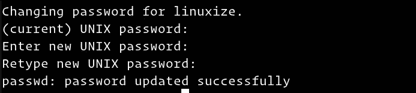

# 如何在 Linux 中更改用户密码

> 原文：<https://www.javatpoint.com/how-to-change-user-password-in-linux>

讨论的指南应该适用于所有 Linux 发行版，包括 **Ubuntu、Debian** 和 **CentOS** 。

在这里，您还将学习如何强制员工在下次登录时开发他们的密码。

### 介绍

在 [Linux](https://www.javatpoint.com/linux-tutorial) 中，使用 passwd 实用程序，可以更改用户帐户密码。

加密的帐户凭据和其他与密码相关的详细信息包含在/ etc / shadow 文件中。

作为日常用户，您需要更改密码。根用户和拥有 sudo 权限的用户将更新另一个用户的密码，并决定是否应该使用或更改密码。

当您更改密码时，请确保选择唯一有效的密码。

拥有一个正确的密码是保护您的帐户的基本要素之一。强密码至少有 16 个字符，其中至少有**一个大写字母、一个小写字母、一个整数、**和**一个特殊字符**。

最好定期更新密码，出于安全考虑，为每个帐户使用单独的密码。

### 更改您的用户密码

运行 passwd 命令更改您自己的用户帐户密码:

你需要输入你已经有的密码。如果密码正确，它会要求您输入新密码并验证。

当您键入密码时，密码不会显示在屏幕上。

下次登录设备时，请使用新密码。

### 更改其他用户的密码

如介绍中所述，只有 root 用户和有权访问 sudo 帐户的用户才能更改另一个用户帐户的密码。

下面的例子暗示你是以 **sudo 特权拥有者**的身份登录的。

要更改另一个用户帐户的密码，请按照以下步骤操作:

*   运行 passwd 命令，后跟用户名，
*   例如，要修改名为 linuxize 的用户密码，请运行以下命令:

您将被要求输入并验证新密码:

**输出**

成功的命令将打印如下内容:

### 强制用户在下次登录时更改密码

默认情况下，密码是固定的，永不过期。要强制用户在下次登录时更改其密码，请使用 passwd 命令，在- expire 选项后接用户名:

使用上述命令，用户的密码将立即过期。

下次用户尝试使用旧密码登录时，将显示一条强制用户更改密码的消息:

**输出**

一旦用户设置了新密码，连接将关闭。

* * *