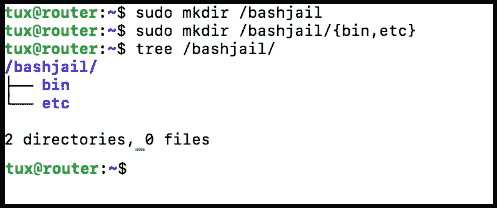
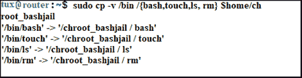
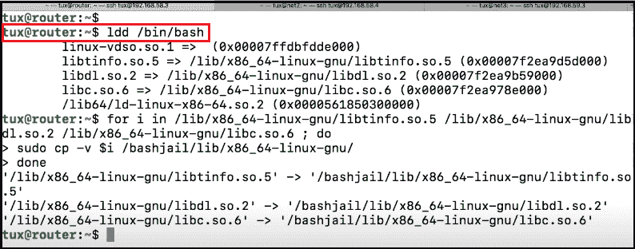

# Linux/Unix: chroot 命令

> 原文：<https://www.javatpoint.com/linux-chroot-command>

## 什么是 chroot 命令？

“chroot 命令”是一个 Unix/Linux 命令。用于在 [Linux/Unix 操作系统](https://www.javatpoint.com/linux-tutorial)中将根目录更改为新目录。新的目录被称为 chroot 监狱和监狱目录。对于用户工具集来说，这是一个有效而简单的命令。一旦进入两个根目录，就不能使用上面的任何目录。如果您为用户创建了一个假根目录，它将无法访问真正的根目录。

通常，对根进行以下更改以进行系统维护:

1.  使用隔离机制提高安全性
2.  重新启动系统上的引导加载程序文件
3.  为软件测试创建测试环境
4.  密码重置

**chroot 命令的语法**

Linux 中的 chroot 命令有以下语法。

| 南不 | chroot 命令语法 |
| 1. | chroot/path/to/new/root/path/to/server |
| 2. | chroot / path / to / new / root 命令 |
| 3. | chroot[options]/path/to/new/root/path/to/server |

chroot 命令需要一个参数来运行该命令，这个参数会让位于新的根目录。您可以使用这些可用选项来获得想要的结果。

**选项:**

*   **-userspec = (USER:GROUP):** 此选项描述了要在其上使用 chroot 命令的组和用户。数字 id 或名称可用于定义组和用户。
*   **-group = G _ LIST:**用于定义互补组，如 G1、G2、G3、G4、G5、…、Gn。
*   **-帮助:**该选项用于显示帮助信息。
*   **-版本:**此选项用于显示给定版本的详细信息。

## 创建一个监狱

监狱是一个虚拟目录。它是通过将根目录转换为新目录而创建的。它充当你的监狱的虚拟根目录。

**1。创建目录**

在这个命令中，首先我们使用 mkdir 命令创建一个伪根目录。该命令如下所示。

```

$ sudo mkdir /bashjail

```


这个命令在给定的地址创建一个目录，我们用它作为 chroot jail 目录，在运行这个命令之前，我们把需要的文件添加到新的目录中。

**2。在监狱中添加所需的根目录**

首先，在这个命令中，我们在 chroot 监狱目录中创建了所需的目录(/ bin、/ lib 和/ lib64)。所需的目录在方括号(“{}”)中指定，如下面的命令语法所示。

```

$ sudo mkdir / bashjail/ {bin, etc}

```



**3。移动二进制文件**

我们为这个命令创建了一个极简的 Linux 环境，我们使用 ls、bash touch 和 rm 命令来增强虚拟环境的功能。

```

sudo cp -v /bin/ {ls, bash, touch, rm} $home / ch

```



#### 注意:在这个命令中，我们使用 cp 命令和-v 标签来查看当时正在复制什么。

**4。要查找命令依赖关系**

我们可以使用 ldd 命令找出命令的依赖性。现在，我们将使用 cp 命令在我们的 chroot 监狱中一个接一个地复制目录。我们检查所有依赖库的副本。如果依赖库有问题，chroot 监狱将无法正常运行。

```

ldd /bin/bash

```

```

cp -v {<List of command dependencies here>} $desktop/ jail/ lib64

```



我们将在 Chroot 监狱内用所有我们想允许的命令重复这些步骤。

* * *