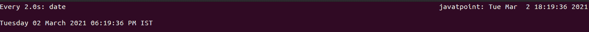
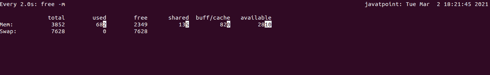
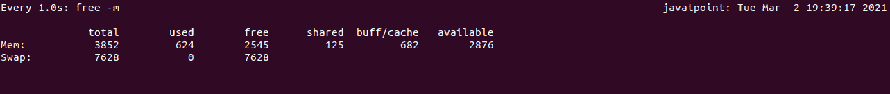
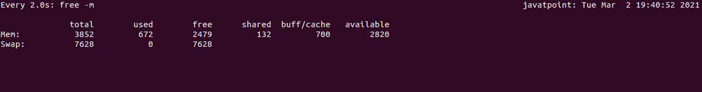
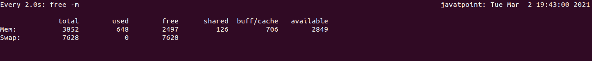
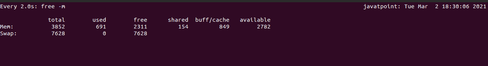
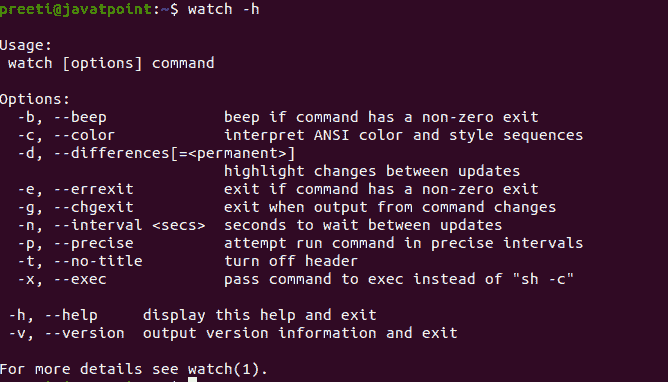

# Linux 观察命令

> 原文：<https://www.javatpoint.com/linux-watch-command>

在 [Linux](https://www.javatpoint.com/linux-tutorial) 中，我们使用 watch 命令，以便定期执行程序，全屏显示输出。Watch 命令可以通过显示其输出和错误来不断运行参数中的确定命令。默认情况下，每 2 秒钟，指定的命令运行一次，手表将一直运行到中断。

如果我们需要持续执行命令并定期观察命令的输出变化，Watch 命令会很有帮助。例如，watch 命令可用于监控系统正常运行时间和磁盘使用情况。几乎每个 Linux 发行版都预装了 Watch，它是***procp***包的一部分。

## 如何使用监视命令

如果我们想使用 watch 命令，那么我们必须遵循以下语法:

```

Watch [options] command

```

为了理解 watch 命令的工作原理，我们运行了 date 命令:

```

$ watch date

```



在上图中，我们可以看到 watch 命令将暂时删除所有终端内容，并开始定期运行给定的命令。如果我们在没有选项的情况下使用，那么手表将每两秒钟运行一次指定的命令。

我们可以看到 ***手表*** 的更新间隔和执行的命令，也就是每 2.0s***:日期*** ，在屏幕表头的左上方，而左上方的时钟 ***手表*** 显示当前的日期和时间。如果我们需要停止使用标题，我们必须使用选项 ***-t ( - no-title)。***

指定命令的输出显示在屏幕上，每两秒钟重复更新一次。

如果我们想退出 ***观看*** 命令，我们必须输入 ***Ctrl+C*** 键。

### 选项:

*   **-d，-差异**

我们使用此选项来突出显示两次连续更新之间的修改。-d，-difference 选项读取使修改永久化的可选参数，允许用户查看自第一次迭代以来稍微修改过一次的内容。

**示例:**

```

watch -d free -m

```



*   **-n，-间隔秒**

我们使用该选项来确定更新间隔。该命令允许的时间间隔不超过 0.1 秒，较小的值将被更改。

**示例:**

```

watch -n 1 free -m

```



*   **-p，-精确**

使用此选项，观察尝试每隔秒运行一次命令。

**示例:**

```

watch -p free -m

```



*   **-t， -无标题**

在此选项的帮助下，标题可以关闭，在屏幕顶部显示命令、当前时间和间隔。


*   **-b，-哔声**

如果命令有非零退出，则该选项将发出蜂鸣声。

**示例:**

```

watch -b free -m

```



*   **-e，-错误**

-e，-errexit 选项在命令错误时冻结更新，然后在按键后退出。

```

watch -e free -m

```



*   **-g，-不成功**

如果命令的输出退出，则-g，-chgexit 选项退出。

*   **-c，-颜色**

-c，-color 选项解释样式序列和 ANSI 颜色。

*   **-x， -exec**

这个选项是给 ***sh -c*** 的，这意味着我们可能需要使用额外的报价才能得到想要的效果。

*   **手表-h**

watch -h 选项用于显示帮助消息并退出。

**示例:**

```

watch -h

```



*   **手表-v**

watch -v 选项将显示版本信息并退出。

**示例:**

```

watch -v

```

* * *