# 清除 Linux 缓存

> 原文：<https://www.javatpoint.com/clear-cache-linux>

在本教程中，我们将学习如何在 Linux 中清除内存缓存和清理交换空间。

和所有其他操作系统一样，GNU/ Linux 也实现了内存管理系统。尽管如此，Linux 的内存管理比其他操作系统高效得多，甚至得到了更好的利用。但是，在某些情况下，如果您想要控制内存管理，或者有一个或多个进程正在消耗您系统的内存。在这种情况下，我们要阻止它； [Linux](https://www.javatpoint.com/linux-tutorial) 提供的刷新(清除 ram 缓存)方式很少。

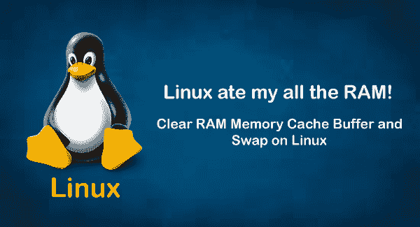

### Linux 中如何清除缓存？

几乎在每个 Linux 系统中，都提供了三种方法来清除缓存。其中一些可以在不中断任何正在进行的过程或服务的情况下显著使用。这三种方式如下:

1.  仅清除页面缓存
2.  清除齿状线和索引节点
3.  清除数据和信息节点，清除页面缓存

我们将详细讨论这三种方法，并看看它们的实际实现:

### 1.仅清除页面缓存-

这种方法是清理 Linux 缓存最安全的方法之一，因为它可以清除缓存，而不会杀死任何正在进行的操作、应用和服务。据说这是清理缓存最安全的方法，因为它可以在生产中使用，并且它只清理页面缓存。在此方法中，使用了以下命令:

**命令**

```

 #  sync ; echo 1 > proc/sys/vm/drop_caches

```

**说明:**

上述命令中，**同步**用于刷新文件系统缓冲区，命令之间用“**分隔；**“按顺序执行。

但是，在开始执行序列中可用的下一个命令之前，shell 会等待每个命令被执行或终止。

**drop _ cache**用于刷新或清理缓存，而不会杀死或影响任何其他正在运行的应用或服务，内核文档中也明确提到了这一点。“**呼应**”命令完成文件的写入工作。

**使用终端清除页面缓存的步骤:**

**步骤 1 -** 在 Linux 中打开终端，键入以下给定命令，然后按回车键。一旦命令被执行，它将显示关于系统内存的信息，如示例所示:

命令

```

free 

```

上述命令用于显示使用了多少内存，并显示其他因素，如总可用内存、交换内存等。我们可以在使用每种方法时，在前后使用这个“ **free** ”命令。

有必要在执行实际命令之前和之后使用“free”命令，以便我们可以轻松地看到或检测内存分配的变化。让我们看一个例子来理解整个过程实际上是如何工作的:

**例**

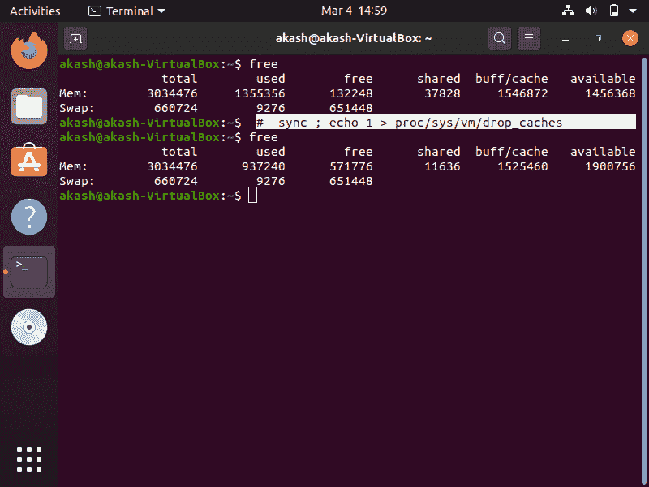

### 2.清除牙齿和信息节点-

此方法用于清除数据区和信息节点的内存。它与第一种方法类似，但略有不同，因为它用于清除数据区和信息节点的内存，而不是清除页面缓存的内存。尽管如此，它很像我们上面讨论的第一种方法。该方法中使用的命令如下:

**命令**

```

# sync ; echo 2 >  proc / sys / vm / drop_caches

```

让我们看一个例子来理解如何实现这个方法:

**例**

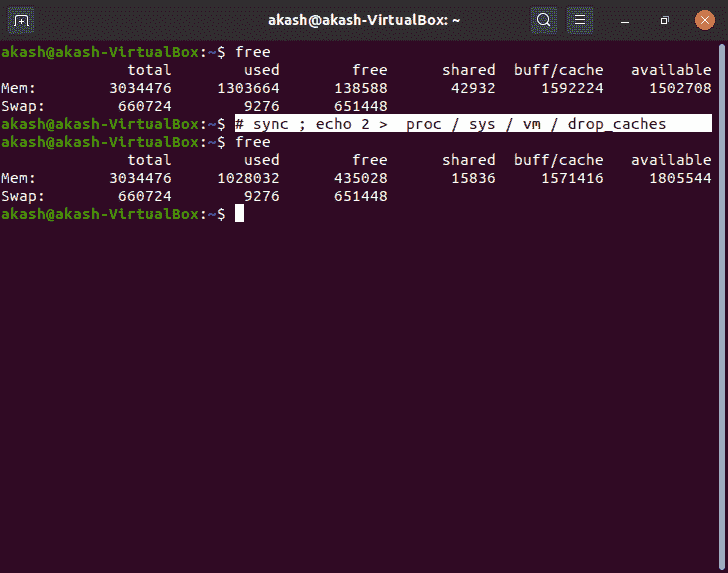

### 3.清除数据和信息节点，清除页面缓存

这是最有效的方法之一。然而，传统上不建议在你知道你在做什么之前使用它，因为它不被认为是最安全的使用方法，尤其是在生产中。此方法中使用的命令使用“echo 3 >”，它同时清理页面缓存、数据区和信息节点。

**命令:**

```

# sync ; echo 3 > / porc / sys / vm / drop_caches

```

要更详细地了解它的实际工作原理，请考虑给定的示例:

**示例:**

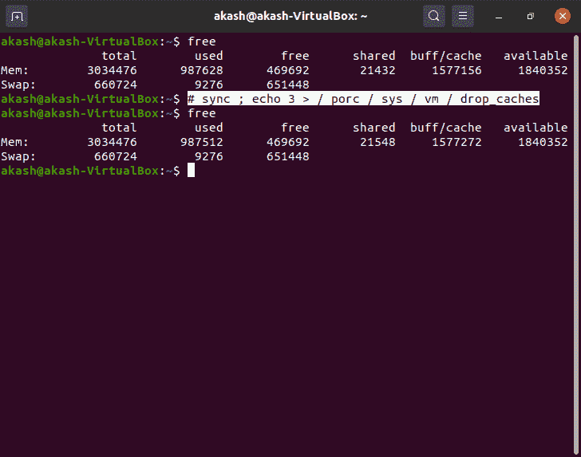

#### 注意:除非您知道自己在做什么，否则不建议在生产中使用它，因为它会立即清理页面缓存和数据区以及信息节点，正如我们在上面已经讨论过的。

## 交换空间

通常，当物理内存的利用率接近峰值时，会使用交换空间。因此，当系统需要更多内存资源，并且物理 ram 已满时，所有非活动页面都会转移到交换内存空间。

但是，交换内存空间作为少量但有效的内存也有助于系统。不过，毫无疑问，不建议将交换空间视为物理内存。

### Linux 中如何清除交换空间？

要清除系统上的交换内存，只需关闭交换。这将把所有数据从交换内存移回[内存](https://www.javatpoint.com/ram)。这也意味着您需要确保您的系统中有足够的内存来支持此操作。

一个简单的方法是运行**‘free-m’**命令，查看交换内存中正在使用什么，然后禁用交换。

关闭后，您应该等待 30 秒或更长时间，让操作完成，然后重新打开交换。这将清除交换内存缓存并重新启用它，但在清除交换之前，您应该查看系统的当前(或默认)设置。

要查看您系统的 swappiness 的当前设置，您只需要使用输出中所示的以下命令打开终端:

```

cat /proc/sys/vm/swappiness

```

**输出**

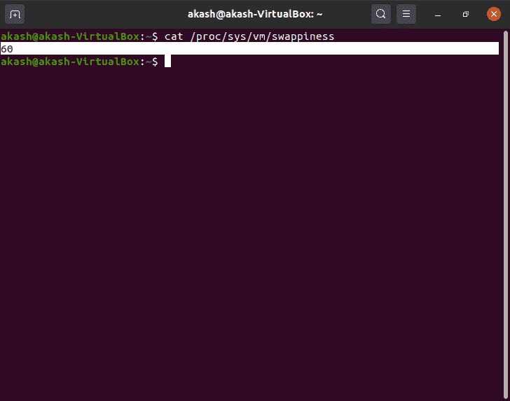

如您所见，我们系统当前的 Swappiness 值为“60”秒。但是，如果您想更改它，您可以将其设置在 0 到 100 之间的任何位置。编辑(更新)该值的过程非常简单。全部，您需要在终端中键入以下命令并按回车键:

**命令:**

```

sudo sysctl vm.swappiness=x 

```

(这里 x 是我们想要设置的交换值)

正如您在上面给出的输出中看到的，我们系统的当前交换值(或默认值)是 60。让我们尝试将交换值更改为 40。

1.按键盘上的 **Ctrl+Alt+T** 打开终端。

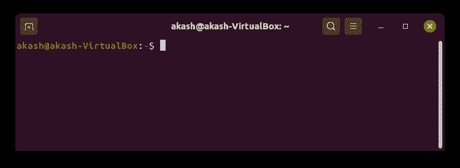

2.终端打开后，键入以下命令并按 enter 键，如下图所示:

```

sudo sysctl vm.swappiness=40

```

**输出**

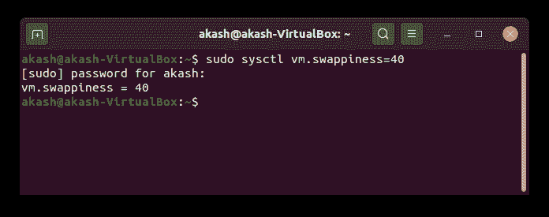

#### 注意:它可能会要求您输入密码，因为我们需要以超级用户(root 用户)权限运行此命令。

**验证**

要验证交换值是否已成功更新，请键入以下命令并点击 enter 按钮:

```

cat /proc/sys/vm/swappiness

```

**输出**

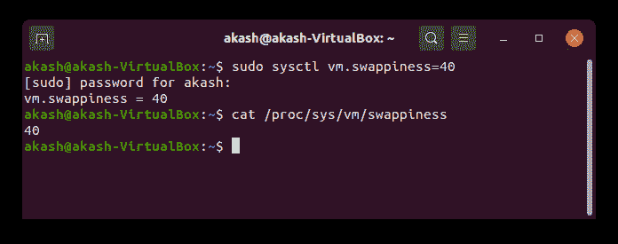

正如您在输出中看到的，我们已经成功地将交换值更新为 40。

## 清除交换空间

要清除交换空间，过程非常简单，因为我们只需**关闭**交换，所有数据或非活动页面都会从交换内存空间传输回内存。一旦您关闭交换空间，您必须等待 30 秒，然后需要重新启动或再次在交换空间上循环。

**有用的命令:**

以下是一些有助于我们清理交换空间的基本命令:


**清除交换内存的步骤**

让我们看看如何使用这些命令来清除交换空间或内存:

第一步。按键盘上的“ **Ctrl+Alt+ T** 打开终端。

第二步。一旦终端打开，输入“ **sudo -i** ”命令，因为我们可能需要**超级用户权限**来运行上面给出的命令:

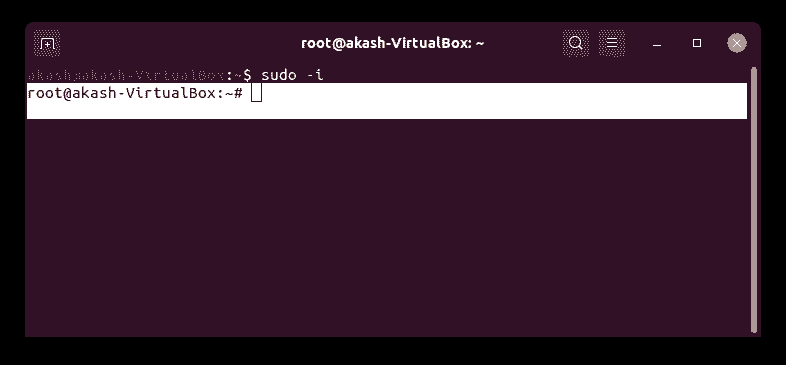

第三步。在**关闭****交换**之前，键入“free -m”命令查看内存利用率:

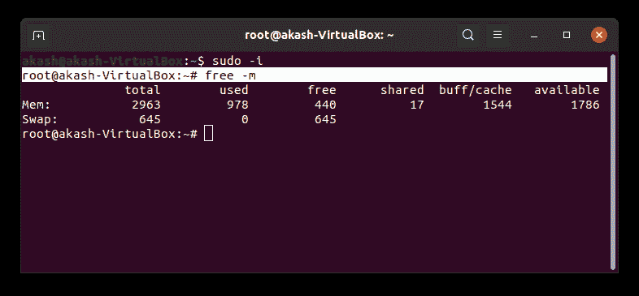

**步骤- 4** 现在，键入“ **Swapoff -a** ”命令并按回车键关闭交换，如下所示:

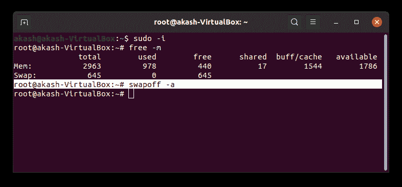

**第五步。**关闭**循环**后，交换至少等待 40 秒。

第六步。现在键入“交换-a”，然后按回车键重新启用交换。要查看内存使用的差异(或变化)，请再次运行“free-m”命令，如下所示:

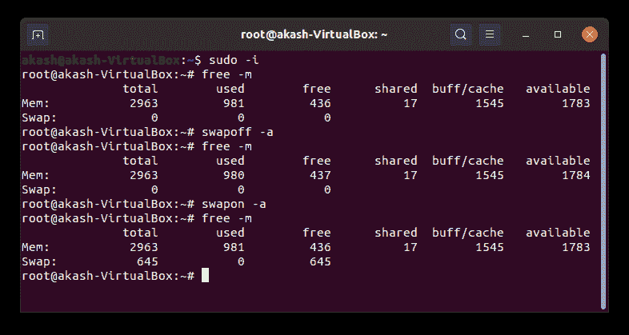

如果您发现自己处于这种情况，这有望帮助您清除系统的交换内存。

* * *