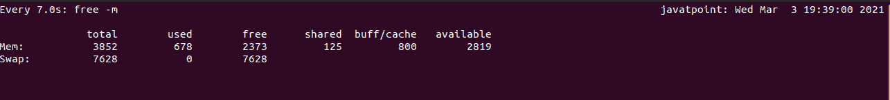
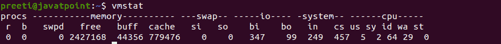
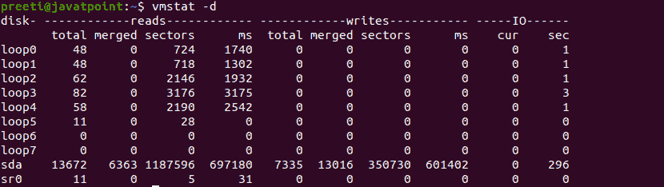
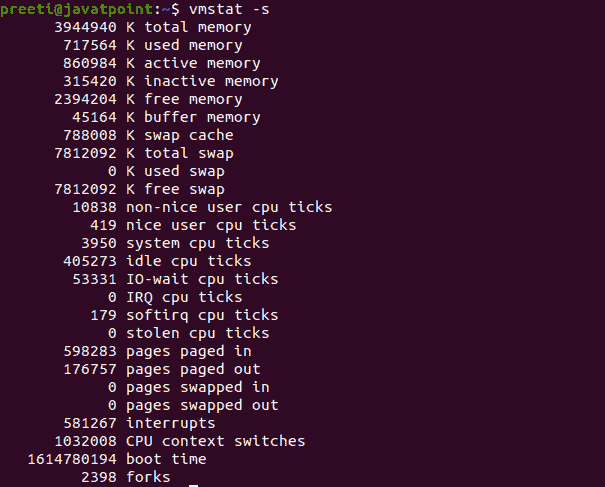
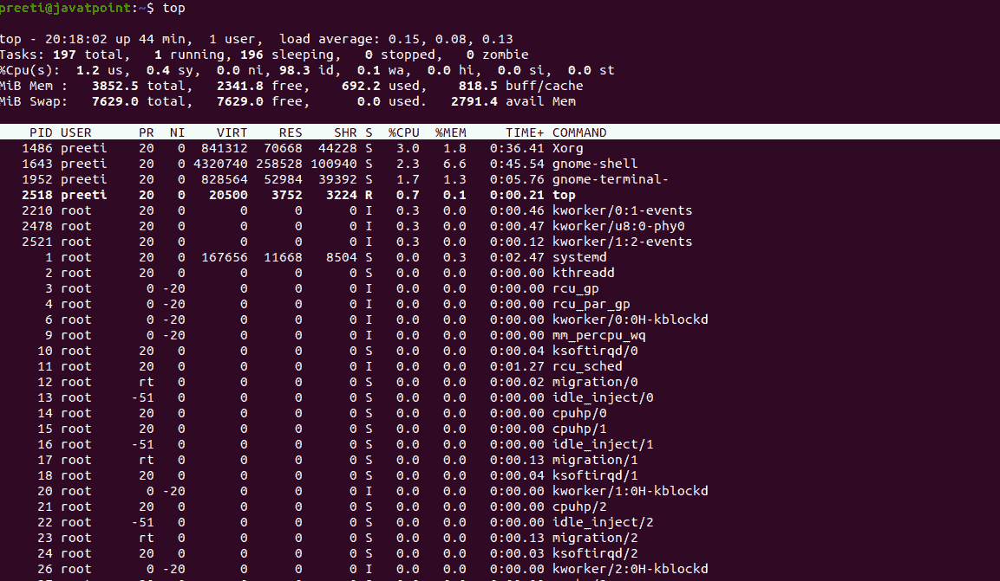
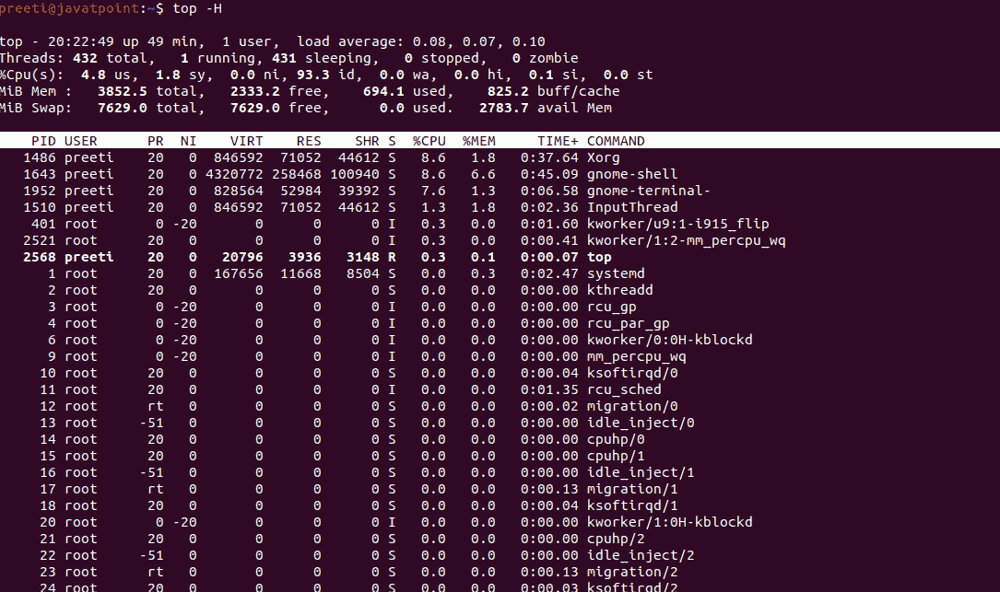
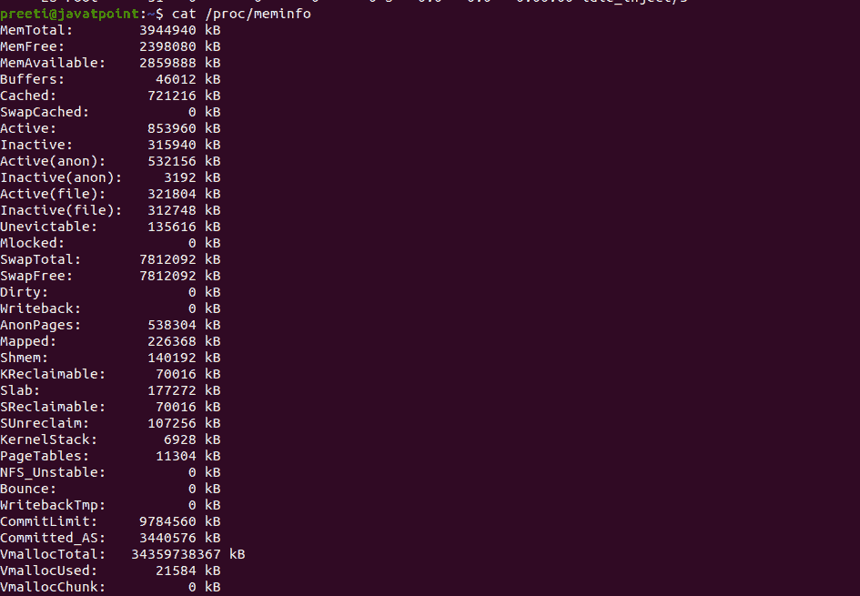

# Linux 进程内存使用

> 原文：<https://www.javatpoint.com/linux-process-memory-usage>

确定程序通常需要检测系统的内存使用情况，这将消耗所有的中央处理器资源，或者是负责减缓中央处理器活动的程序。为了指定服务器上的负载，跟踪进程内存使用情况至关重要。通过解析使用数据，服务器可以在不降低系统速度和满足用户请求的情况下平衡负载。

## 用于检查 Linux 中进程内存使用情况的命令

[Linux](https://www.javatpoint.com/linux-tutorial) 中有各种检查进程内存使用情况的命令:

### 1.自由的

此命令显示系统当前可用于交换和物理的内存量。free 命令通过解析/proc/meminfo 收集这些数据。默认情况下，内存量以千字节为单位显示。


如果我们想定期执行程序，那么我们可以使用 watch 命令。

**语法:**

```

Watch -n 7 free -m

```



根据上面的图片，有 3842 兆内存和 7628 兆交换空间分配给 Linux 系统。在 3852 兆内存中，目前使用了 678 兆；但是，2373 MB 是免费的。相应地，对于交换空间，在 7628 兆字节中，使用了 0 兆字节，系统中目前有 7628 兆字节可用。

### 2.显示虚拟内存状态

如果我们想显示系统的虚拟内存统计数据，那么我们可以使用 vmstat 命令。该命令显示与内存、磁盘、分页、CPU 活动等相关的数据。当我们第一次使用此命令时，它会返回自上次重新启动以来的数据平均值。下一次使用根据长度延迟的采样周期返回数据。



```

vmstat -d // Reports disk statistics

```



```

vmstat -s // shows the amount of memory that is used and available

```



### 3.顶端

top 命令用于显示系统中当前运行的所有进程。顶部的命令显示了当前由内核管理的线程和进程的列表。为了监控内存使用的总量，我们也可以使用这个命令。



```

Top -H Threads-mode operation
This will show each thread hat present in the system. If we do not use this command option, then the summation of every thread in each process is shown.

```



### 4\. /proc/meminfo

该文件包括所有与内存使用相关的数据。它为您提供当前内存使用的详细信息，而不是旧的存储值。



### 第五名

这是一个交互式流程查看器。Htop 命令与 top 命令相同，只是我们可以水平和垂直滚动，以便允许用户查看系统上运行的每个进程，使用他们的完整命令行，并将它们视为进程树，选择进程并立即对它们采取行动。


* * *