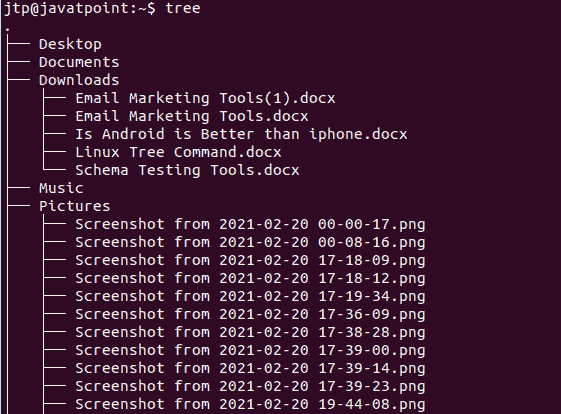
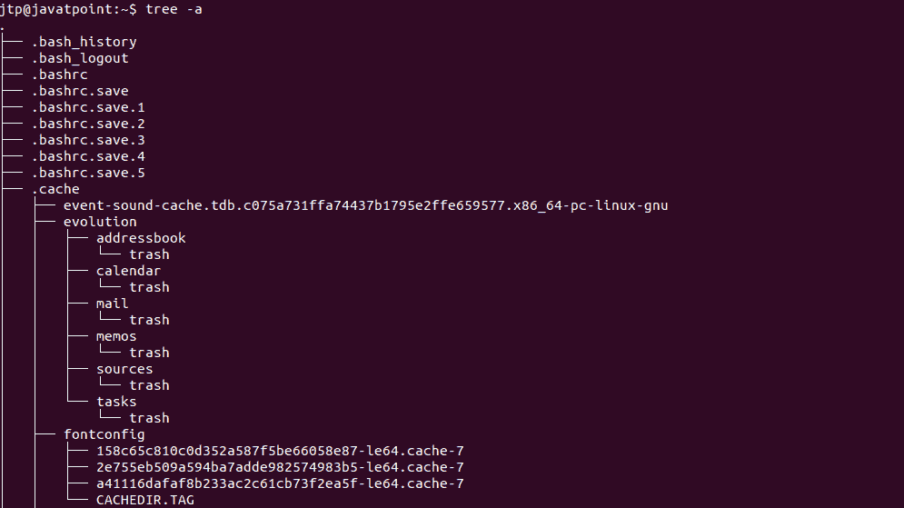
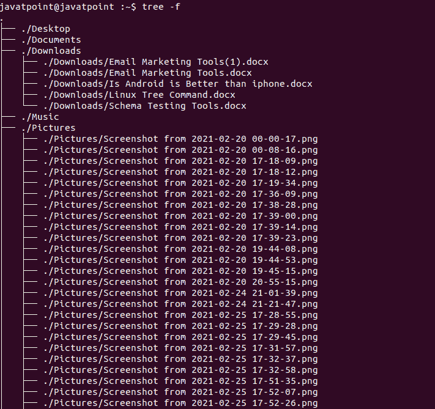
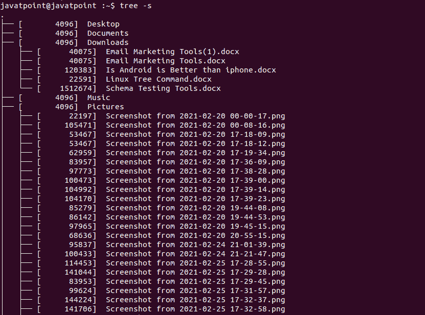
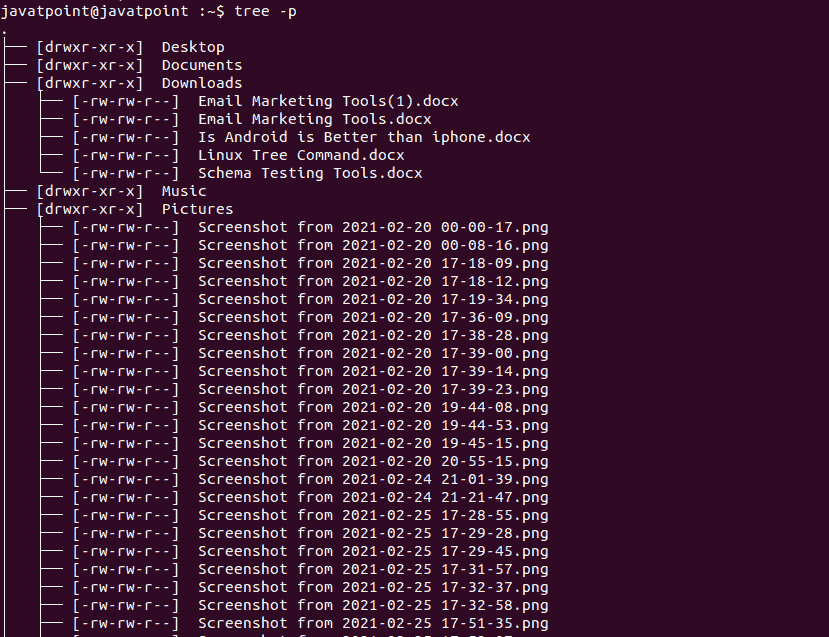
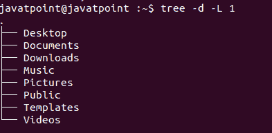
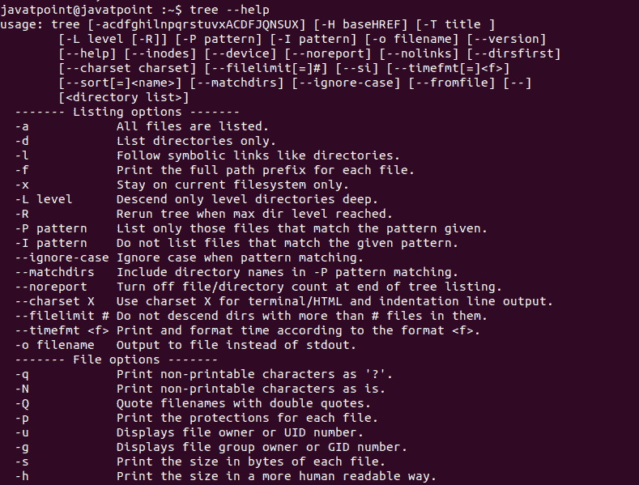

# Linux 树命令

> 原文：<https://www.javatpoint.com/linux-tree-command>

在 Linux 中，树被定义为递归目录列表程序，它生成深度缩进的文件列表。在没有任何参数的情况下，该树列出了当前目录中的文件。在给定目录参数时，该树交替列出给定目录中每个目录的每个文件。当每个目录和文件的列表完成后，树将返回列出的目录和文件的总数。可以使用各种选项来修改输出中使用的字符和使用颜色。

### 句法

```

$ tree [-adfgilopqrstuxACDFNS] [-L level [-R]] [-H baseHREF] [-T title] [-o filename] [--nolinks] [-P pattern] [-l pattern] [--inodes] [--device] [--noreport] [--dirsfirst] [--version] [--help] [directory ?..]

```

### 选项:

| 标签 | 描述 |
| **-帮助** | 输出详细的用法列表。 |
| **-版本** | 输出树的版本。 |
| **-a** | 所有的文件都打印出来了。默认情况下，隐藏文件不会按树打印(意味着文件以点“.”开头)).在任何情况下，树都不会打印文件系统构造“.”(当前目录)和'..'(上一个目录)。 |
| **-d** | -d 选项用于列出目录。 |
| **-f** | 对于每个文件，打印完整的路径前缀。 |
| **-i** | -i 选项创建一个树，但是不打印缩进线，如果我们将它与-f 选项一起使用，那么它是有帮助的。 |
| **-l** | 遵循到目录的符号链接，就像它们是目录一样。避免了那些将导致递归循环的链接。 |
| **-x** | 保持当前的文件系统，例如 fins-xdv。 |
| **-P 模式** | 只列出那些符合通配符模式的文件。我们还应该使用选项-a，并考虑那些以“.”开头的文件匹配点。有各种有效的通配符运算符，如“？”(任何单个字符)、“*”(任何零个或多个字符)、“[……]”(括号中列出的任何单个字符(可选-(破折号)表示可以使用的字符范围:ex [A-Z])，以及'[^….} '(括号中没有列出单个字符)和“&#124;”拆分交替模式。 |
| **-l 型** | 此选项不会列出符合通配符模式的文件。 |
| **-修剪** | 从输出树中删除空目录，这在与-P 或-l 结合使用时很有帮助 |
| **-filelimit #** | 不要删除包含#个以上条目的目录。 |
| **-timefmt 格式** | 根据使用 strftime 语法的格式字符串打印(隐含-D)并格式化数据。 |
| **-noreport** | 省略树列表末尾的文件和目录的报告打印。 |
| **-p** | 打印所有文件的保护。 |
| **-s** | -s 选项将打印所有文件的大小以及文件名。 |
| **-u** | 打印文件的 UID #或用户名(如果没有用户名)。 |
| **-g** | 如果文件没有组名，则打印 GID #或组名。 |
| **D** | 此选项用于打印所列文件的最后一次修改日期。 |
| **-索引节点** | 打印目录或文件的信息节点号。 |
| **-装置** | 打印包含目录或文件的设备号。 |
| **-F** | 对目录追加“/”，对套接字文件追加“=”。可执行文件用“*”，先进先出用“&#124;”，按照 ls -F |
| **-q** | 此选项打印文件名中不可打印的字符，如问号，而不是默认的胡萝卜符号。 |
| **-N** | 此选项按原样打印不可打印的字符，而不是默认的胡萝卜符号 |
| **-r** | 该选项将按相反的字母顺序对结果进行排序。 |
| **-t** | 根据上次更改的时间而不是字母顺序对结果进行排序。 |
| 说 | 在文件之前，列出目录。 |
| **-n** | 总是关闭被选项-C 覆盖的着色 |
| **-C** | 如果没有设置 LS_COLORS 环境的变量，请始终使用创建的默认颜色打开着色。将输出着色到管道很有帮助。 |
| **-A** | 打印缩进线时，打开 ANSI 线条图形。 |
| **-S** | 打开 ANSII 线条图形(当我们使用 Linux 控制台模式正面时，这很有帮助)。现在这个选项等于“-charset=IBM437”，最终会被诋毁。 |
| **-L 级** | 导演树的最大显示深度。 |
| **-R** | 递归地向下遍历树中的每一级目录(勾选选项-L)，并在每一级目录中再次执行树添加新选项。 |
| **-H 基 HREF** | -H 选项负责打开包含 HTTP 引用的 HTML 的输出。这对 ftp 站点很有帮助。如果使用 HTML 输出，baseHREF 提供基本 ftp 位置。表示本地目录可以是“/local/ftp/pub”，但应该引用为“FTP://hostname . oganization . domain/pub”(base href 必须是“FTP://hostname . organization . domain”)。提示:使用此选项时，不要使用 ANSI 行，并且在此目录列表中，不要给出多个目录。我们可以通过 CSS 样式表来使用颜色，除了这个选项之外，还可以使用选项-C 来进行颜色输出。 |
| **-T 标题** | 在 HTML 输出模式下，设置标题和 H1 标题字符串。 |
| **-字符集字符集** | 使用此选项，设置使用 HTML 和线条绘图时要使用的字符集。 |
| **—no links** | 在 HTML 输出中，nolinks 用于关闭超链接。 |
| **-o 文件名** | 此选项将输出发送到文件名。 |

## 安装树命令

我们必须安装 tree 命令，因为默认情况下，它没有安装。为了在 RHEL/CentOS/Fedora Linux 上安装 tree 命令，我们必须在终端上键入以下命令:

```

# yum install tree

```

如果我们想为 Debian / Ubuntu Linux / Mint 安装树命令，那么我们必须键入以下命令:

```

$ sudo apt install tree

```

如果我们想为苹果 OS X 安装树命令，请键入:

```

Brew install tree

```

## 如何使用树命令

树是为 Unix 和类似 Unix 的系统而存在的程序。这是一个递归目录列表程序，它生成文件的深度缩进列表。

如果没有任何参数，tree 会列出当前目录中的文件。当给定目录参数时，树会列出随后在给定目录中找到的每个文件和目录。当文件和目录的列表完成时，树返回列出的目录和文件的总数。

让我们看一些有助于理解 tree 命令的 tree 命令示例:

### 基本树输出

使用 tree 命令的最常见方式是:

```

$ tree

```



当我们在终端上键入上面的命令时，输出显示了我们当前目录的树形结构，显示了所有的文件、文件夹和子文件夹。

### 显示特定目录的内容

如果我们想列出特定目录的文件和子文件夹，而不是当前目录的文件和子文件夹，那么我们可以通过以下语法确定路径或目录名:

```

$ tree -a [DirectoryName/Path

```

**示例:**

如果我们想要列出名为 pictures 的目录中的所有文件和子文件夹，那么我们必须编写以下命令:

```

$ tree -a Pictures

```


### 使用树显示隐藏文件和其他文件

在 tree 命令中，隐藏文件夹和文件的列表不会显示在 ubuntu 中。尽管如此，我们可以使用“a”标志来列出它们，如下所示。

```

$ tree -a

```



在树中，以“.”开头的文件夹和文件是隐藏的文件夹和文件。

### 通过树仅显示目录列表

我们可以使用“d”标志来查看目录列表，但不能查看底层文件。为了通过树只显示目录列表，我们必须在终端上键入以下命令。

**语法:**

```

$ tree -d

```


### 使用树显示文件和文件夹的完整路径前缀

使用“f”标志，我们可以自定义树标志，以便为每个文件夹和文件列表显示完整的路径作为前缀。

**语法:**

```

$ tree -f

```



当我们需要知道什么存在于哪里时，它主要是有用的。

### 使用树显示文件和文件夹的大小

使用 flag 的' tree '命令，可以打印目录中所有文件夹和文件的字节大小。

**语法:**

```

$ tree -s

```



借助“s”标志，我们可以检查哪些内存项目会占用更多的系统空间，并删除不必要的内存项目。

### 使用树显示文件和文件夹的读写权限

如果我们想查看所列文件夹和文件的删除、读取和写入权限，那么我们可以使用“p”标志。

**语法:**

```

$ tree -p

```



因此，在对文件和文件夹执行操作之前，我们可以首先查看和编辑特定项目上存在的权限。

### 通过树列出文件夹内容直到某个级别/深度

我们能够配置 tree 命令，以便将树显示到特定的级别或路径，而不是列出目录的每个内容。例如在 tree 命令中，level 1 只能显示给定文件夹的列表，而不能显示其任何子文件夹。

**语法:**

```

$ tree -L[n]

```

**例**

该命令将只显示当前目录的子目录(使用-d 标志)，而不显示附加的扩展树。



### 树帮助

tree 命令比我们定义的要有用得多。我们可以通过如下树命令再次找到该命令:

```

$ tree -help

```



* * *