# 葡萄酒 Linux

> 原文：<https://www.javatpoint.com/wine-linux>

在本教程中，我们将学习什么是 wine 及其工作原理，如何在 Linux 中下载 wine，以及如何使用 Wine。

### 介绍

基本上，葡萄酒是一种软件，或者我们可以具体地说，它是一种开源软件。它对每个人都可用，这意味着任何人都可以下载并使用它，而无需花费一分钱。它可以被认为是我们可能需要的最重要的软件之一，特别是如果我们是一个 Linux 用户，因为它允许我们在几个 [Linux](https://www.javatpoint.com/linux-tutorial) 和基于 UNIX 的操作系统(或其他符合 POSIX 的操作系统)上运行 windows 应用。

简而言之，我们可以说，如果我们使用的是基于 Linux 或 Unix 的操作系统，并且我们需要为某项任务运行一些 Windows 应用，或者只是为了娱乐。可以通过安装葡萄酒软件来实现。Wine Software 允许 it 用户在基于 Linux 的操作系统上运行各种 windows 应用，而不需要任何其他附加软件，如虚拟机。我们只需要安装 Wine 软件，因为在 Wine 的帮助下，我们永远不需要在 wer 系统上安装窗口，这是一个耗时的过程(或者使用虚拟盒子)。

很有可能许多用户会认为它也是一个仿真器，就像互联网上其他几个仿真器一样。但是我们不在这里，因为它不能被认为是一个模拟器。相反，它立即将窗口API调用转换为 POSIX 调用，消除了其他方法的性能和内存损失，并允许我们将窗口应用干净地集成到 wer 桌面中。

让我们了解如何使用它，但是在知道如何使用 Wine 之前，让我们看一下如何为 wer Linux 操作系统获取 Wine。

## 如何在 Linux 操作系统下下载 Wine？

要在 Linux 操作系统中下载 Wine 软件，我们可以遵循下面给出的说明:

在安装 Wine 软件之前，我们应该需要知道我们的系统是安装在 32 位还是 64 位，因为这将帮助我们为操作系统选择正确的 Wine 版本。如果我们不确定，我们可以使用下面给出的命令:

**命令:**

```

lscpu

```

一旦我们在终端中执行了上面给出的命令，它将自动显示关于我们系统的所有必需信息，如输出所示:

**输出**


**第二步**。使用 Ubuntu 存储库安装葡萄酒软件

为了无缝安装 Wine 软件，我们将建议使用标准的 **Ubuntu 资源库安装 Wine。**通过这种方式，我们的电脑上可以有一个更加稳定可靠的版本。

在终端中键入以下给定命令，然后按 enter 键:

**命令**

```

sudo apt install wine64

```

**输出**

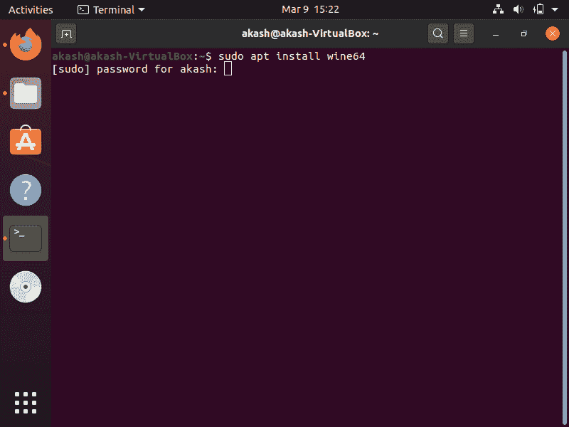

正如我们在上面给出的输出中看到的，它可以要求我们输入根用户密码，所以输入密码继续。

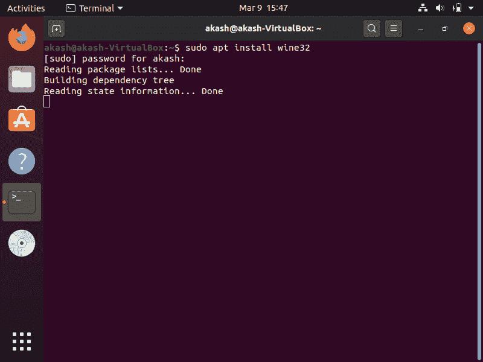

安装 Wine 时，系统会提示我们 y/n 选项，因此请键入“y”并按 enter 继续安装过程:

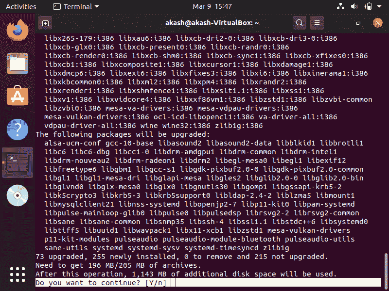

在此之后，可能需要一段时间才能在系统上安装 Wine，这是正常的。

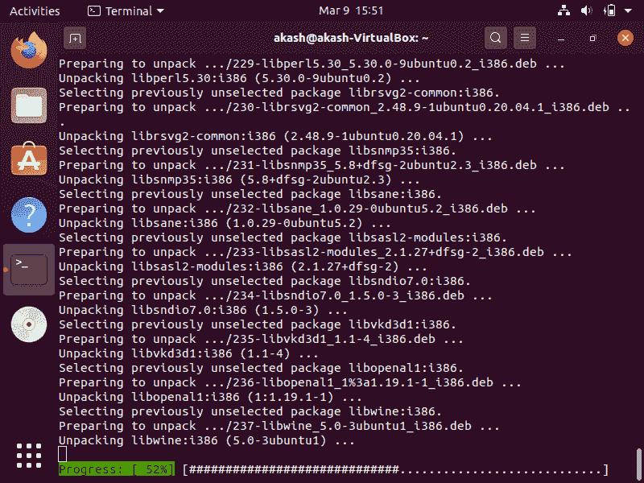

安装过程完成后，使用给定的命令退出终端。

**命令:**

```

Exit

```

一旦我们退出终端，Wine 软件就已经准备就绪，可以使用了。

如果我们的系统安装在 64 位上，安装 Wine 的过程就没那么不同了。我们只需要在一个命令中做一个微小的改变，整个过程将是一样的。

**第三步**。在 64 位系统上安装 Wine

打开终端，输入以下命令:

```

sudo apt install wine64

```

除了一个命令中的这一变化，整个过程与上面显示的完全相同。

现在，要验证 Wine 软件的安装是否成功完成，我们可以使用以下命令:

```

wine --version

```

**输出**

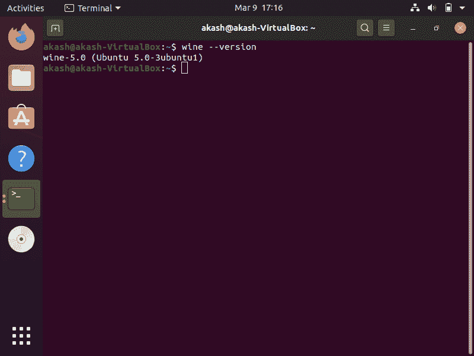

## 如何使用葡萄酒？

成功下载并安装 Wine 后，让我们看看如何使用它来运行窗口应用。我们只需要。我们想要运行的窗口应用的. exe 文件。

在给定的图像中，我们可以看到我们有一个**。记事本++的 exe 文件**，是一个窗口的应用。要在 Wine 的帮助下在我们的 Linux 操作系统上运行它，请仔细遵循给定的说明:


**第一步**。首先按键盘上的 **Ctrl+Alt+T** 打开终端。

**第二步**。一旦终端打开，导航到我们有“**”的文件夹(或目录)。exe 文件**。”正如我们在案例中看到的，我们的**。exe** 文件位于桌面。

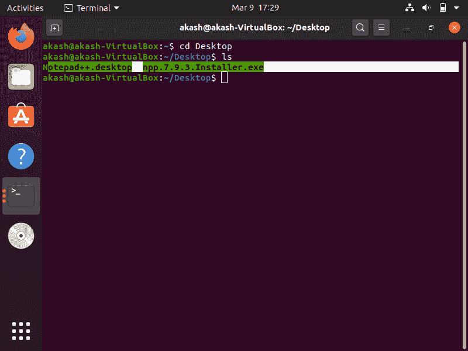

**第三步**。键入以下命令在我们的 Ubuntu 操作系统中安装 windows 应用。

**命令:**

```

Wine "Our window application name"

```

#### 注意:在使用上述命令时，我们必须确保提供了确切的名称(或正确的名称)；否则，该命令将不起作用。

**输出**

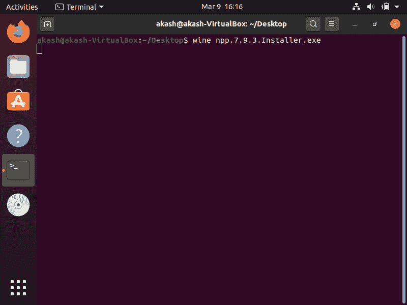

一旦我们在键入上述命令后按回车键，记事本++的安装过程将开始:

**第四步**。现在选择首选语言，点击**确定**，如下图:

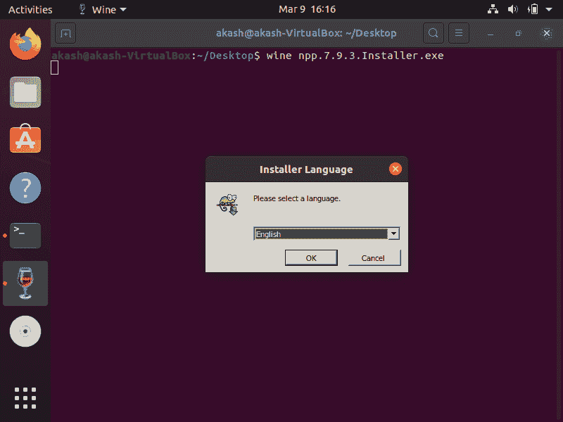

**第五步**。点击 **<u>N</u> ext >** 按钮。

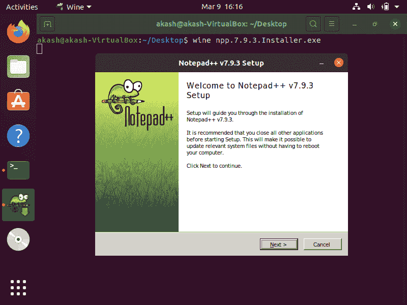

**第六步**。点击“ **I <u>A</u> 格力**按钮”

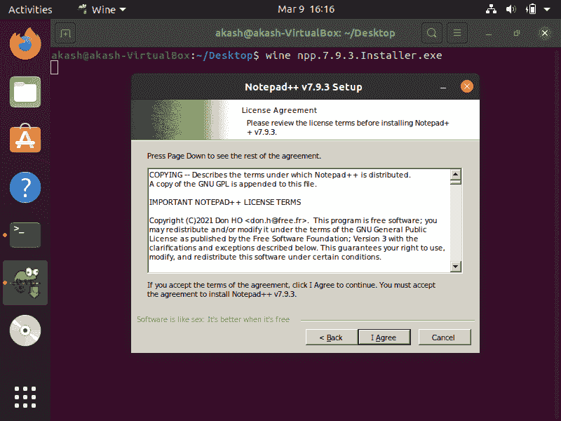

**第七步**。如果我们想将应用安装到一个特定的位置，这里我们可以提供路径或我们想安装它的位置。或者我们只需点击“ **<u>N</u> ext >** ”如下图所示:

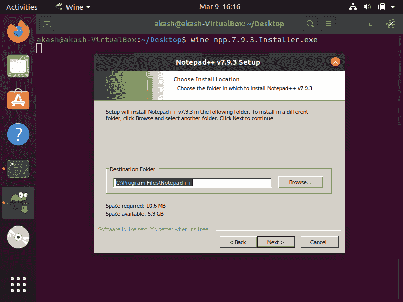

**第八步**。在这里，选中我们要安装的组件，点击**T3】Next>**继续，如下图:

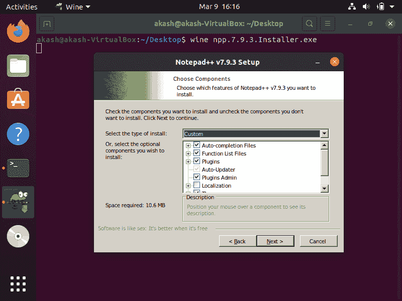

**第九步**。现在，如果我们愿意的话，选中标记为**“在桌面上创建快捷方式”**的选项，然后单击“<u>I</u>install”:

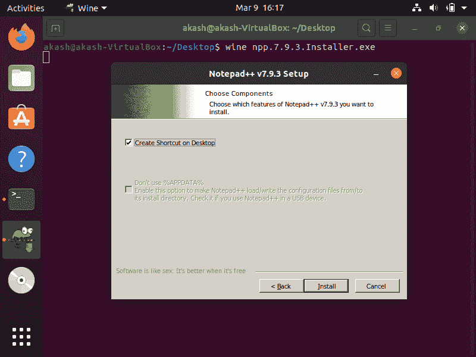

**第 10 步**。我们可能需要等待一段时间，直到安装过程完成

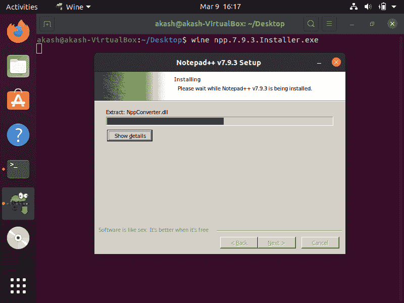

**第 11 步**。一旦安装过程完成，我们将获得如下所示的输出:


**第 12 步**。如果我们想现在运行，现在点击检查“运行记事本++ v79.3”。否则，只需点击完成按钮。

**第 13 步**。我们只需运行**记事本++** 即可验证其安装成功:

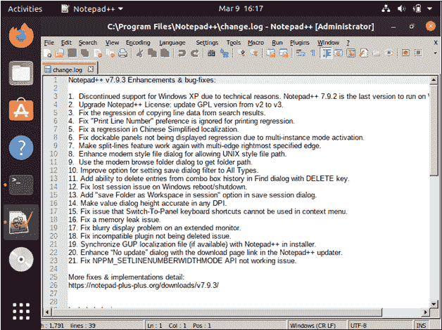

我们希望本教程将帮助您在任何基于 Linux 的操作系统上运行您的 Windows 应用，而不会强制您更改当前的操作系统。

* * *