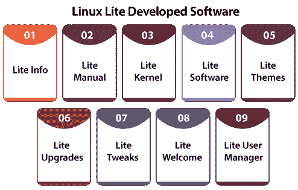

# Linux 操作系统

> 原文：<https://www.javatpoint.com/linux-lite>

Linux Lite 可以定义为基于**Ubuntu****Debian**并由 **Jerry Bezencon** 领导的团队开发的 Linux 发行版。该发行版通过 Xfce 桌面的定制环境提供了轻量级的桌面体验。

它包含一组 Lite 应用，用于为各种 Linux 新用户提高效率。[开发 Linux](https://www.javatpoint.com/linux-tutorial) Lite 是为了尽可能高效地通过 Windows 过渡到基于 Linux 的操作系统。

这个发行版遵循了关于软件编程和选择的 Linux 哲学。它用到了最新的时代——“写做一件事并且做好它的程序”。

## Linux 精简版的硬件规格

### 最低建议规格

**RAM:**768 MB RAM
T3】CPU:1 GHz 处理器
T6】存储:8gb
T9】MEDIA:USB 端口或 DVD 驱动器用于 ISO 映像
T12】分辨率: VGA 屏幕 1024*768 分辨率

### 首选规格

**RAM:**1024 MB RAM
**CPU:**1.5 GHz 处理器
**存储:** 20gb
**媒体:**ISO 图像的 USB 端口或 DVD 驱动器
**分辨率:** HDMI、DVI 或 VGA 屏幕分辨率 1366*768

## Linux Lite 的可用软件

Linux Lite 专注于通过提供适用于所有 Windows 计算机的类似软件，给 Windows 用户一种熟悉感。

作为操作系统一部分的软件如下所示:

*   书店老板
*   GIMP
*   媒体播放器
*   Mozilla Thunderbird(Mozilla Thunderbird)
*   火狐浏览器

添加到操作系统的软件如下所示:

*   VirtualBox(虚拟方块)
*   浏览器门
*   远程控制
*   蒸汽
*   Spotify
*   Skype(仅 64 位)
*   Kodi(软件)
*   收存箱(服务)
*   Chrome(网络浏览器)

## Linux Lite 的历史

2013 年，Linux Lite 以发布 Linux Lite 1.0.0 开始，基于 Ubuntu，代号为“**紫晶**”。最初，它是为了吸引 Windows 用户使用基于 Linux 的操作系统而设计和开发的。这个想法是为了消除关于 Linux 使用起来很复杂的误解。

## Linux 精简版的发布

Linux Lite 最初是由以下几个部分组成的数字系统:1 . 0 . 0“1”说明了 Ubuntu 的基础代码，即“1”意味着 Ubuntu 的 12.04 LTS 基础。

“0”说明了 Ubuntu 的临时 LTS 版本，即“0”表示 12.04.1。最后一个数字“0”说明了点释放。最后一个数字，即“0”被忽略，因为 2.x 系列不需要点发布。

| 未来版本 |
| **版本** | **发布日期** | **代号** | **寿命终止日期** | **基于** |
| **1.0** | 2012 年 10 月 26 日 | 紫色 | 2017 年 4 月 | Ubuntu 12.04 lt |
| **1.0.2** | 2012 年 11 月 25 日 | 紫色 | 2017 年 4 月 | Ubuntu 12.04 lt |
| **1.0.4** | 2013 年 2 月 12 日 | 紫色 | 2017 年 4 月 | Ubuntu 12.04 lt |
| **1.0.6** | 2013 年 6 月 24 日 | 紫色 | 2017 年 4 月 | Ubuntu 12.04 lt |
| **1.0.8** | 2014 年 1 月 17 日 | 紫色 | 2017 年 4 月 | Ubuntu 12.04 lt |
| **2.0** | 2014 年 6 月 1 日 | 绿宝石 | 2019 年 4 月 | Ubuntu 14.04 lt |
| **2.2** | 2014 年 12 月 1 日 | 绿宝石 | 2019 年 4 月 | Ubuntu 14.04 lt |
| **2.4** | 2015 年 4 月 1 日 | 绿宝石 | 2019 年 4 月 | Ubuntu 14.04 lt |
| **2.6** | 2015 年，9 月 1 日 | 绿宝石 | 2019 年 4 月 | Ubuntu 14.04 lt |
| **2.8** | 2016 年 2 月 1 日 | 绿宝石 | 2019 年 4 月 | Ubuntu 14.04 lt |
| **3.0** | 2016 年 6 月 1 日 | 柠檬黄 | 2021 年 4 月 | Ubuntu 16.04 lt |
| **3.2** | 2016 年 11 月 1 日 | 柠檬黄 | 2021 年 4 月 | Ubuntu 16.04 lt |
| **3.4** | 2017 年 4 月 1 日 | 柠檬黄 | 2021 年 4 月 | Ubuntu 16.04 lt |
| **3.6** | 2017 年，9 月 1 日 | 柠檬黄 | 2021 年 4 月 | Ubuntu 16.04 lt |
| **3.8** | 2018 年 2 月 1 日 | 柠檬黄 | 2021 年 4 月 | Ubuntu 16.04 lt |
| **4.0** | 2018 年 6 月 1 日 | 钻石 | 2023 年 4 月 | Ubuntu 18.04 lt |
| **4.2** | 2018 年 11 月 1 日 | 钻石 | 2023 年 4 月 | Ubuntu 18.04 lt |
| **4.4** | 2019 年 4 月 1 日 | 钻石 | 2023 年 4 月 | Ubuntu 18.04 lt |
| **4.6** | 2019 年，9 月 1 日 | 钻石 | 2023 年 4 月 | Ubuntu 18.04 lt |
| **4.8** | 2020 年 1 月 14 日 | 钻石 | 2023 年 4 月 | Ubuntu 18.04 lt |
| **5.0** | 2020 年 5 月 31 日 | 绿宝石 | 2025 年 4 月 | Ubuntu 20.04 lt |

## Linux 精简版开发软件

*   **Lite Info:** 是通过用户的电脑获取硬件信息，并通过社区进行分发的应用。
*   **Lite 手册:**是用户指南。
*   **Lite 内核:**有一个由 Linux Lite 创建的自定义创建的 Linux 内核。
*   **Lite 软件:**方便用户安装附加软件。
*   **Lite 主题:**鼠标、字体、图标和系统主题。
*   **精简升级:**方便用户更新系统的表单。
*   **Lite Tweaks:** 这是一个实用工具，方便用户修复和清理他们的系统。
*   **Lite Welcome:** 是用户电脑第一次重启时出现的对话框窗口。
*   **Lite 用户管理器:**可以添加或提取用户。

* * *