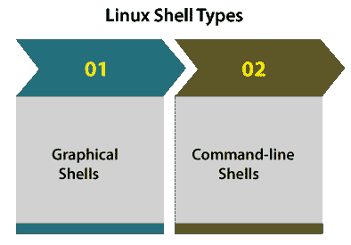
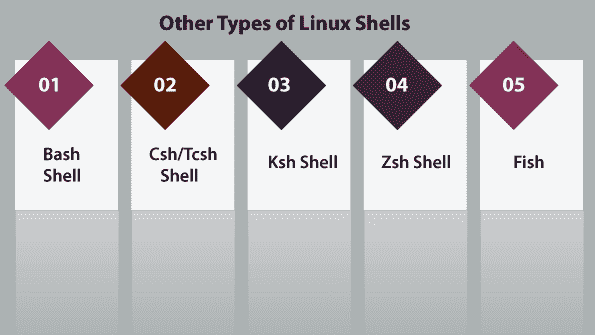

# Linux 外壳

> 原文：<https://www.javatpoint.com/linux-shell>

外壳可以被定义为像 Linux/GNU 或 Unix 这样的操作系统中的命令解释器。它是一个运行其他程序的程序。外壳作为 Unix/GNU Linux 系统的接口，方便了计算机的每个用户。因此，用户可以使用少量输入数据来执行不同的工具/实用程序或命令。

当外壳运行完一个程序时，它通过屏幕将结果发送给用户，该程序是通用的输出设备。所以被称为“**命令解释器**”。

shell 不仅仅是一个命令解释器。此外，shell 是一种编程语言，具有完整的[编程语言](https://www.javatpoint.com/programming-language)结构，例如**函数、变量、循环、条件执行**以及许多其他结构。

为此，GNU/Unix [Linux](https://www.javatpoint.com/linux-tutorial) Shell 比 Windows shell 更强。

大体上，外壳分为两大类，解释如下:



### 图形外壳

这些外壳通过允许像**移动、关闭、调整大小、**和**打开窗口**以及在窗口之间切换焦点这样的操作来指定基于图形用户界面的程序操作。乌班图操作系统或[视窗操作系统](https://www.javatpoint.com/windows)可以作为一个很好的例子，为用户提供一个图形用户界面与程序交互。各种用户不需要为所有操作键入任何命令。

### 命令行外壳

用户可以在命令行界面的帮助下访问各种外壳。一个独特的程序被称为**命令提示符**在视窗或终端在苹果操作系统/Linux 提供输入人类可以理解的命令，如“ls”、“cat”等，然后，它正在运行。结果在终端上进一步显示给用户。

对于许多初学者来说，使用命令行 shell 是一件复杂的事情，因为很难记住几个命令。命令行 shell 非常重要，它允许用户将命令存储在文件中并一起运行。通过这种方式，重复的动作可以很容易地自动化。通常，这些文件在 macOS/Linux 系统中被称为 Shell 脚本，在 Windows 中被称为批处理文件。

有各种类型的外壳，讨论如下:



### 文字介面

在[痛击炮弹](https://www.javatpoint.com/bash)中，痛击的意思是伯恩再一次炮弹。它是目前 Linux 的几个发行版的默认外壳。这是一个兼容 sh 的外壳。它可以通过视窗操作系统安装。它有助于在 sh 上进行实际的改进，以供交互和编程使用，包括:

*   作业控制
*   命令行编辑
*   外壳别名和函数
*   无限大小的命令历史记录
*   基数为 2-64 的整数运算

### Csh/Tcsh Shell

Tcsh 是一个升级的 C 壳。这个 shell 可以用作 shell 脚本命令处理器和交互式登录 shell。
Tcsh 外壳包括以下特性:

*   c 类语法
*   文件名完成和可编程字
*   命令行编辑器
*   作业控制
*   拼写纠正

### Ksh Shell

Ksh 表示 **Korn shell** 。它是由**大卫·科恩**开发设计的。Ksh shell 是一种高级的、强大的、完整的编程语言，它也是一种交互命令语言，就像其他各种 GNU/Unix Linux shell 一样。C shell 的用法和语法与 C 编程语言非常相似。

### Zsh Shell

Zsh shell 被开发为对等的，它结合了其他 GNU/Unix Linux shell 的各个方面，如 ksh、tcsh 和 bash。此外，POSIX 外壳标准规范基于 Korn 外壳。
此外，与其他可用的 shells 一样，它也是一种强大的脚本语言。它的一些独特功能如下:

*   启动文件
*   文件名生成
*   登录/注销观看
*   概念索引
*   结束语
*   可变指数
*   关键指数
*   函数索引以及我们可以在手册页中找到的各种其他内容。

所有这些外壳都做类似的工作，但采用不同的命令，并促进不同的内置功能。

### 鱼

鱼代表“**友好互动壳**”。它生产于 2005 年。鱼壳被开发成完全用户友好的和交互式的，就像其他壳一样。它包含下面提到的一些好的特性:

*   基于 Web 的配置
*   手册页完成
*   自动建议
*   支持 term256 终端自动化
*   完全用干净的脚本编写

## 外壳提示

它被称为命令提示符，是通过 shell 发出的。当显示提示时，我们可以输入任何[命令](https://www.javatpoint.com/linux-shell-commands)。
点击回车后，Shell 读取我们的输入。它通过查看输入的首字来说明我们想要运行的命令。一个单词可以被定义为角色的完整集合。制表符和空格分隔单词。

下面是一个显示当前时间和日期的常见数据命令示例:

我们还可以在 PS1(环境变量)的帮助下自定义命令提示符。

## 外壳脚本

shell 脚本的常见概念是命令列表。一个好的 shell 脚本将包含注释，注释之前是通过# simbol。

解释外壳函数和脚本。这意味着它们没有被编译。

还有一些条件测试，比如 Y 值大于 Z 值，循环允许我们处理大量数据，文件存储和读取数据，变量存储和读取数据，这些脚本可能包含函数。

外壳通常是交互式的，这意味着它们通过用户接收命令作为输入并运行它们。尽管有时我们通常希望运行一组命令，因此，我们必须一直在终端内键入命令。

shell 脚本包含类似于其他编程语言的语法。当我们对编程语言如 [C](https://www.javatpoint.com/c-programming-language-tutorial) / [C++](https://www.javatpoint.com/cpp-tutorial) 、 [Python](https://www.javatpoint.com/python-tutorial) 等有经验时。从它开始会很容易。外壳脚本结合了以下组件:

**功能**

*   **控制流程:** if，else，then，shell 循环，case 等。
*   **Shell 命令:** touch、pwd、echo、ls、cd 等。
*   **Shell 关键字:** break、if、else 等。

### 外壳脚本需要

编写这些 shell 脚本有几个原因:

*   为了避免自动化和重复工作
*   系统管理员在许多日常备份中使用 Shell 脚本
*   包括外壳的新功能
*   系统监控等。

### 外壳脚本优势

*   语法和命令与直接在命令行中输入的完全相似。因此，程序员不必切换到完全不同的语法
*   交互调试
*   快速启动
*   写 shell 脚本等要快得多。

### 外壳脚本缺点

*   一个错误就可以修改命令，这可能是有害的，因此容易出现代价非常高的错误。
*   语言实现和语法中的设计缺陷。
*   执行速度较慢。
*   提供不同于其他脚本语言的最小数据结构。
*   不太适合复杂和大型任务等。

### 脚本示例

假设我们做了一个测试。sh 脚本。我们必须提醒系统，在脚本中包含任何其他内容之前，shell 脚本已经启动。

#### 注意:每个脚本都有一个. sh 扩展名。

这可以在舍邦建筑的帮助下完成。

**例如:**

```

#!/bin/sh

```

它向系统展示了几个由伯恩外壳运行的命令。它被称为 shebang 是因为符号#被称为 hash 和符号！它被称为大爆炸。

要制作包含这些命令的脚本，我们首先将 shebang 构造行放在前面，然后添加任何命令:

```

#!/bin/bash
pwd
Is

```

## shell 中的注释

我们可以在下面的脚本中加入我们的评论:

```

#!/bin/bash

```

使脚本可以运行，并保存上面提到的内容:

```

$chmod +x test.sh

```

现在，shell 脚本可以运行了:

```

$./test.sh

```

在执行中，我们将得到如下结果:

```

/home/amrood
index.htm unix-basic_utilities.htm unix-directories.htm
test.sh unix-communication.htm unix-environment.htm

```

#### 注意:-为了执行最新目录中的程序，我们可以使用。/program_name

## 扩展外壳脚本

shell 脚本包含几个必需的构造，这些构造定义了 shell 平台什么时候做什么。大部分脚本都比上面的脚本复杂。

毕竟，shell 是一种实际的编程语言，具有完整的控制结构、变量等。尽管如此，不管脚本有多复杂，它都只是按顺序执行的命令列表。

下面的脚本使用了 read 命令，该命令通过键盘获取输入，并将其指定为变量 PERSON 值，最后通过 STDOUT 打印出来。

* * *