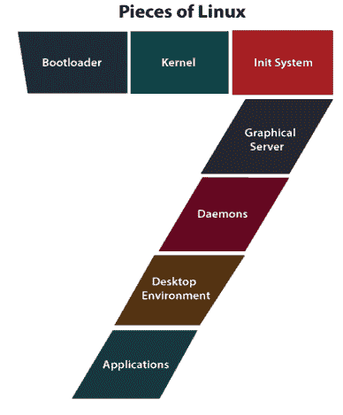
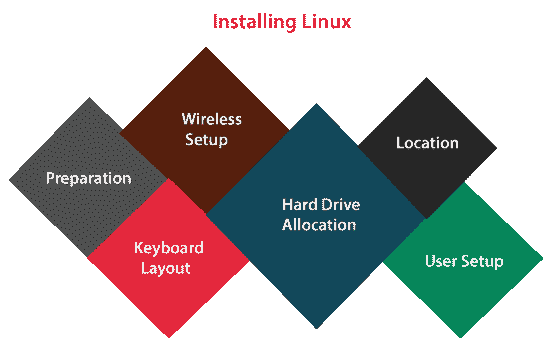

# Linux 的意义

> 原文：<https://www.javatpoint.com/linux-meaning>

## 什么是 Linux？

操作系统可以被描述为计算机硬件和任何计算机的用户之间的接口。它是一组软件，处理计算机硬件的资源并促进计算机程序的基本服务。

操作系统是计算机系统中系统软件的必要组成部分。操作系统的主要目的是提供一个平台，用户可以方便有效地运行任何程序。

另一方面，Linux 操作系统是 UNIX 操作系统的著名版本之一。它是为几个个人计算机系统用户提供低成本或免费的操作系统而开发的。值得注意的是，它是一个完整的操作系统，包括 **X 窗口系统、Emacs 编辑器、IP/TCP、图形用户界面**等。它获得了作为一个非常高效和快速运行的系统的声誉。

[Linux](https://www.javatpoint.com/linux-tutorial) 是一个类似于 Mac OS、iOS 和 Windows 的操作系统。 [**安卓**](https://www.javatpoint.com/android-tutorial) 搭载的是全球使用最广泛的平台之一的 Linux OS。

操作系统是处理与我们的笔记本电脑或台式机相关的每个硬件资源的软件。简单地说，操作系统处理我们的硬件和软件之间的通信过程。

但是，当我们必须选择一个平台来运行世界各地的**嵌入式、服务器、**和**桌面**系统时，Linux 是最无忧、最安全、最可靠的操作系统之一。

## Linux 的碎片

Linux 操作系统由各种不同的部分组成。其中一些定义如下:

*   **Bootloader:** 是处理我们电脑开机过程的软件。简单地说，这将是一个出现和消失的闪屏，最终引导到操作系统。
*   **内核:**它是整个 Linux 的一部分，被称为 Linux。它可以被定义为系统的核心，处理外围设备、内存和中央处理器。内核也是操作系统的最底层。
*   **Init 系统:** Init 是一个可以引导用户空间的子系统，负责处理守护进程。一旦启动引导过程通过引导加载程序给出，初始化系统就处理引导过程(即 GRand 或 GRUB 统一引导加载程序)。
*   **图形服务器:**是在我们的显示器上显示图形的子系统。通常，它被称为 X 或 X 服务器。
*   **守护进程:**守护进程是后台服务(调度、声音、打印等)。)登录计算机或在引导时启动。
*   **桌面环境:**桌面环境是几个用户实际交互的一块。有各种桌面环境可供选择(Xfce、KDE、启蒙、万神殿、Mate、肉桂、GNOME 等。).所有桌面环境都包含内置应用，如游戏、网络浏览器、配置工具和文件管理器。
*   **应用:**桌面环境不提供完整的应用阵列。就像苹果操作系统和视窗系统一样，Linux 提供了成千上万种高级软件，可以很容易地检测和安装。

大多数最新的 Linux 发行版都包含类似应用商店的资源，可以简化和集中应用的安装。

例如，Ubuntu Linux 包括 Ubuntu 软件中心，它允许我们在几个应用之间快速搜索，并通过一个集中的位置安装它们。

## 为什么要用 Linux？

Linux 已经衍生出世界上最安全的计算机生态系统。它包括零入门成本的可靠性，我们有桌面平台的最佳解决方案。

我们可以在多台计算机上安装 Linux，而不必为服务器或软件许可付费。一般来说，Linux 不太容易受到各种类型的攻击，如**病毒、恶意软件、**或**软件**。

## 开源的

此外，Linux 是基于开源许可证分发的。有几个主要的租户是开源的:

*   对于任何目标，执行程序的自由。
*   了解程序如何工作并对其进行修改以使其能够做我们想做的任何事情的自由。
*   把我们修改过的版本复制给他人的自由。
*   重建副本的自由，这样我们就可以帮助我们的邻居。

这些要点对于理解为了创建 Linux 环境而共同实现的社区是必要的。毫无疑问，Linux 是操作系统，也就是说，是为人民服务的，是为人民服务的。同样，这些租户也是几个人选择 Linux 的主要原因。这一切都是关于自由、选择自由和使用自由。

## 什么是“分配？”

Linux 包括几个变体来适应他们的用户。从新手用户到硬核用户，我们会找到几种类型的 Linux 风格来满足我们的需求。这些类型的版本被称为**发行版**(或“发行版”)。

所有的 Linux 发行版几乎都可以免费下载、安装(在我们喜欢的任意多的机器上)，并在磁盘(或 u 盘)上刻录。

所有的发行版都有一个明显的桌面接管。少数人选择不同的用户界面，如 Elementry 和 GNOME OS 的 Pantheon。此外，其他人与一个传统的环境互动(KDE 使用的开放源码软件)。

它是一个由 Linux 内核上基于软件的集合组成的操作系统，或者我们可以说发行版包括 **Linux 内核**。它支持软件和库。我们可以通过下载任何 Linux 发行版来获得基于 Linux 的操作系统。这些类型的分发适用于不同类型的设备，如个人计算机、嵌入式设备等。大约有 600 多个 Linux 发行版，下面列出了一些著名的 Linux 发行版:

*   深度
*   OpenSUSE
*   一种男式软呢帽
*   Solus
*   一种自由操作系统
*   人的本质
*   基本的
*   Linux 作为
*   曼哈罗
*   MX Linux

还有一些可用的服务器发行版:

*   企业 Linux
*   CentOS
*   Ubuntu 服务器
*   红帽企业版 Linux

上面这些服务器的发行版中有一些是免费的(比如 CentOS 和 Ubuntu Server)，还有一些包含相关的价格(比如 SUSE 企业版 Linux 和红帽企业版 Linux)。但是，相关价格的服务器也包括支持。

## 分布选择

我们使用哪种分布取决于三个一般性问题:

*   我们更喜欢标准的还是现代的桌面界面？
*   台式机还是服务器？
*   我们有多精通电脑？

如果我们的计算机熟练程度是基本的，我们可以使用像 **Ubuntu、Linux Mint、Deepin、**或 **Elementry OS** 这样的发行版。如果我们的技能增加到上述范围，我们可以使用像 Fedora 或 Debian 这样的发行版。但是，如果我们精通系统或计算机管理，我们可以使用 Gentoo 等发行版。如果我们希望有任何挑战，我们可以通过 Scratch 使用 Linux 创建我们的 Linux 发行版。

如果我们正在搜索一个服务器专用接口，我们将希望确定我们是希望只通过命令行来完成，还是我们需要任何桌面接口。Ubuntu 服务器没有安装**图形用户界面**。这意味着两件事，我们的服务器不会被消灭下载图形，我们将需要有一个良好的 Linux 命令行知识。

然而，我们可以在 Ubuntu 服务器的顶部安装图形用户界面包，以及一个单独的命令，比如 Sudo apt-get install Ubuntu-desktop。此外，系统管理员希望看到具有各种功能的发行版。

## Linux 操作系统应用

Linux 现在是一家十亿美元的公司。由于更低的资金、时间、许可费用和可负担性，世界各地成千上万的政府和公司正在使用 Linux 操作系统。Linux 可以在几种类型的电子设备中使用。这些电子设备很容易为世界各地的用户所用。一些

下面列出了著名的基于 Linux 的电子设备:

*   雅马哈动力键盘
*   沃尔沃车内导航系统
*   数字录像机
*   索尼阅读器
*   索尼布拉瓦电视公司
*   每个孩子一台笔记本电脑 XO2
*   摩托罗拉摩托罗拉 35 手机
*   联想 IdeaPad S9
*   HP Mini 1000
*   谷歌安卓开发手机 1
*   Garmin Nuvi 860、880 和 5000
*   戴尔 Inspiron Mini 9 和 12

## Linux 的缺点

*   **硬件驱动:**大部分 Linux 用户在使用 Linux 时都面临一个问题，就是少数硬件驱动对于 Linux 来说是不存在的。各种硬件公司更喜欢为 Mac 或 Windows 构建驱动程序，因为它们比 Linux 包含多个用户。Linux 有比 windows 更小的外围硬件驱动程序。
*   **软件替代:**我们以著名的图形编辑工具 Photoshop 为例。Photoshop 是为 Windows 而存在的；但是，它在 Linux 中不可用。此外，还有其他一些用于照片编辑的工具，但与其他工具相比，Photoshop 工具更强大。另一个例子是微软办公系统，它不适合 Linux 用户。
*   **学习曲线:** Linux 不是一个非常用户友好的操作系统。因此，它可能会让许多初学者感到困惑。对于许多初学者来说，开始使用 Windows 既高效又简单；然而，理解 Linux 如何工作是复杂的。
    我们必须理解命令行界面，寻找更新的软件也有点复杂。当我们在操作系统中遇到任何问题时，搜索解决方案就很成问题。此外，与 Linux 相比，苹果和视窗有各种各样的专家。
*   **游戏:**有几款游戏是为 Windows 开发的，可惜不是为 Linux 开发的。因为 Windows 的平台应用广泛。所以，游戏的开发者对 windows 更感兴趣。

## 安装 Linux

对于几个人来说，安装操作系统的想法似乎是一项复杂的任务。Linux 方便了每个操作系统最简单的安装。大多数 Linux 版本都有助于实时分发。这意味着我们可以从 [USB](https://www.javatpoint.com/what-is-usb) 或 DVD/CD 闪存驱动器执行操作系统，而无需对硬盘驱动器进行任何修改。

我们可以在不进行安装的情况下获得完整的功能。简单地说，我们双击安装图标，在试用并确定要使用常规安装向导后，继续执行该向导。

安装向导通常通过以下步骤引导我们完成该过程:

*   **准备:**确保我们的机器满足安装需求。此外，它可能会问我们是否希望安装任何第三方软件(如视频编解码器插件、MP3 播放插件等)。
*   **无线设置(如果必要):**如果我们使用的是机器(或带有无线功能的笔记本电脑)，我们将必须连接到网络才能下载第三方更新和软件。
*   **硬盘分配:**这是允许我们选择希望如何安装操作系统的重要步骤。如果我们想在另一个操作系统旁边安装 Linux(称为“双引导”)，我们可以使用整个硬盘，将其安装在现有的 Linux 版本上，或者升级现有的 Linux 安装。
*   **位置:**使用地图选择我们的位置。
*   **键盘布局:**为我们的系统选择键盘。
*   **用户设置:**设置我们的密码和用户名。

系统安装完成后，重新启动，我们就可以继续了。

* * *