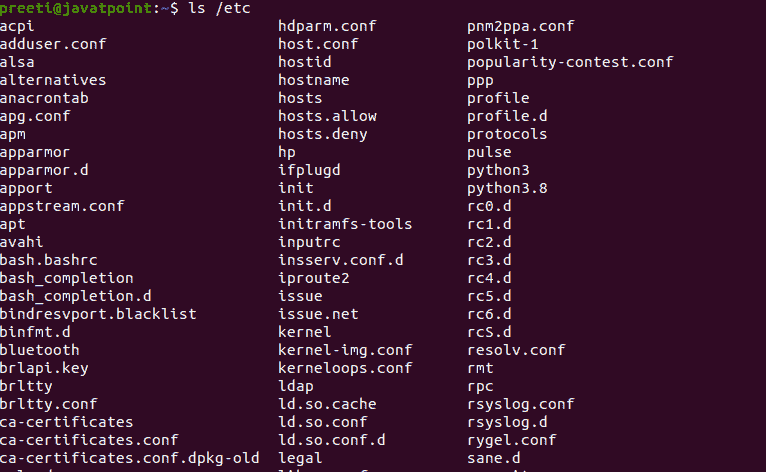
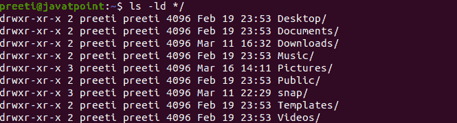
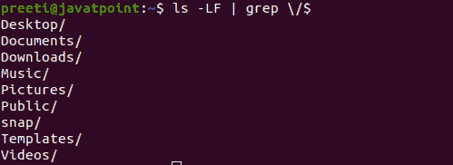
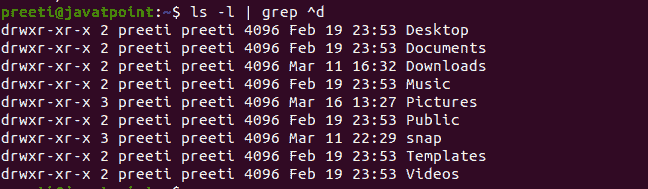
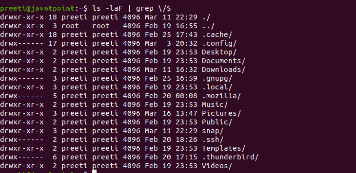
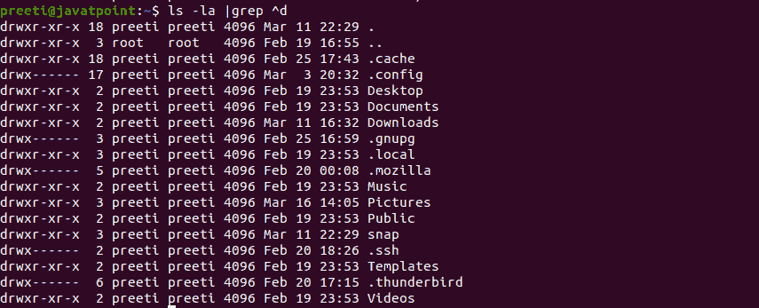
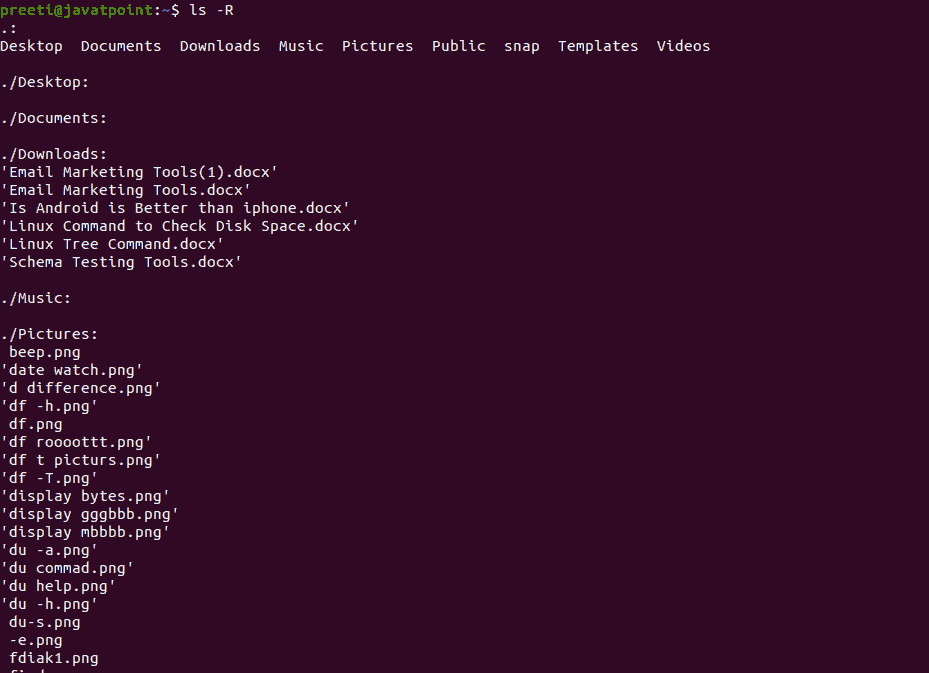

# Linux 目录列表

> 原文：<https://www.javatpoint.com/linux-list-directories>

在 Linux 系统上，有各种方法可以列出文件和目录信息。但是 **ls** 是我们可以用来列出文件和目录的主要命令。该命令将列出文件系统中的文件和目录，并显示完整的信息。这是安装在每个 [Linux](https://www.javatpoint.com/linux-tutorial) 发行版上的 GNU 核心实用程序包的一部分。

## 如何使用 ls 命令

如果我们想使用 [**ls** 命令](https://www.javatpoint.com/linux-ls)，那么我们必须使用以下语法:

```

ls [options] [files]

```

如果没有任何选项和参数，我们使用了 **ls** 命令，那么 ls 命令将向您显示当前工作目录中每个文件的列表。

```

$ ls

```

当我们执行上面的命令时，文件会按字母顺序排列在多个列中，这些列可以适合我们的终端:


为了在一个确定的目录中列出文件，我们必须将目录的路径像参数或参数一样传递给 **ls** 命令。例如，为了列出/etc 目录的内容，我们必须键入以下命令:

```

$ ls /etc

```



## 使用通配符列出目录

使用通配符列出目录是列出目录最简单的方法。在这种情况下，每个目录都以一个转发斜杠结束。

**语法:**

```

$ ls -ld */

```



## 使用-F 选项和 grep 列出目录

-F 选项会附加一个尾随的正斜杠。因此，我们能够借助以正斜杠(/)结尾的“grep”行对目录进行 grep；

**语法:**

```

$ ls -LF  | grep \/$

```



我们也可以使用没有 **-l** 选项的目录名

**语法:**

```

$ ls -F | grep \/$

```

## 使用-l 选项和 Grep 列出目录

在 **ls** 长列表中，意味着 ls -l，我们能够“grep”以 d 开头的行。

**语法:**

```

$ ls -l | grep ^d

```



## 使用回声命令

借助 echo 命令，我们可以列出以正斜杠(/)结尾的条目。

**语法:**

```

$ echo */ 

```


## 使用 printf

类似地，我们可以使用 printf 突出显示以正斜杠(/)结尾的字符串

**语法:**

```

$ printf '%s\n' */

```


## 使用查找命令

使用**查找**命令，我们可以根据文件类型找到文件。

**语法:**

```

$ find . -maxdepth l -type d

```


在上面的命令中，maxdepth 选项指定只在特定目录上执行搜索。否则，find 命令将通过遍历每个目录及其子目录来递归地查找目录。在我们在 **ls** 命令中使用的所有上述方法中，我们可以通过 **-a** 选项实现相同的目的。例如:

**语法:**

```

$ ls -laF |  grep \/$

```



```

$ ls -la | grep ^d

```



## 递归列出子目录

**-R** 选项告诉 **ls** 命令以递归方式显示子目录的内容:

```

$ ls -R

```



* * *