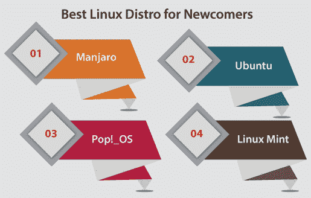
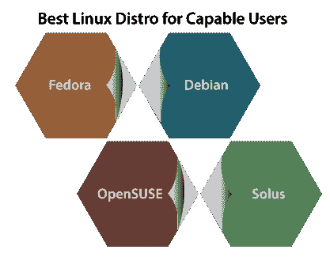

# 最佳 Linux 分散式

> 原文：<https://www.javatpoint.com/best-linux-distro>

## Linux 发行版简介

Linux 发行版是一个 Linux 发行版。这是一个使用基于**包管理系统**和 **Linux 内核**的软件集合创建的操作系统。通常，Linux 用户通过下载任何 Linux 发行版来获得操作系统。这些发行版适用于从个人电脑(如 Linux Mint)到嵌入式设备等多种系统。

常见的 Linux 发行版结合了 GNU 库和工具、Linux 内核、附加软件、窗口系统(通常是 X Window System)、文档、桌面环境和窗口管理器。

大多数添加的软件都是开源的自由软件，以源代码和二进制文件的形式进行编译，允许对真实软件进行修改。或者，Linux 发行版通常包含一些专有软件，这些软件可能不像一些设备驱动程序所需的二进制 blobs 那样以源代码形式存在。

一个 [Linux](https://www.javatpoint.com/linux-tutorial) 发行版也可以被定义在一个特定的实用软件(几个 GNU 库和工具)和应用的分类中，使用 Linux 内核以满足用户需求的方式进行分组

通常，软件被容纳到发行版中，然后通过发行版的维护者分成几个软件包。许多软件包在线存在于存储库中。

这些存储库通常分布在世界各地。一些像包管理系统或发行版安装程序(如 Anaconda 和 Debian-Installer)这样的粘合组件，只有一些包是由各种 Linux 发行版的维护者从头开始编写的。

几乎有 1000 多个 Linux 发行版可用。由于软件的大量可用性，这些发行版采取了多种形式，包括与**上网本、笔记本电脑、服务器、台式机、平板电脑、**和**手机**兼容的软件。也有商业支持的发行版，如 Ubuntu(Canonical Ltd .)、OpenSUSE (SUSE)和 Fedora(红帽)，以及完全社区驱动的发行版，如 Arch Linux、Gentoo、Slackware 和 Debian。

## 发行版的趋势和类型

总的来说，Linux 发行版可以是:

*   非商业性或商业性
*   专为家庭用户、超级用户、企业用户开发
*   在平台供应商的认证范围内，支持各种硬件和特定平台
*   专为嵌入式设备、台式机、服务器开发。
*   机器特定功能的高度专用或通用(例如，计算机集群、网络路由器和防火墙)
*   针对特定的用户群体，如通过语言本地化和国际化，或通过添加各种科学计算或音乐制作包
*   主要是为了可用性、全面性、可移植性或安全性而构建的
*   滚动释放或延长释放

Linux 发行版的多样性是因为用户和供应商之间的哲学上的、组织上的和技术上的差异。自由软件许可授权定义了一个有足够兴趣和知识的用户可以个性化一个现有的发行版或者开发一个符合他们需求的发行版。

## 新手最佳 Linux 发行版

对于希望不使用命令行就能快速访问各种应用/软件和 Linux 的初学者。对于这类用户，我们建议:

**1。Manjaro:** 基于 Arch Linux 的面向桌面、用户友好的操作系统。一些关键方面包括广泛的桌面可配置性、管理图形驱动程序的独特 Bash 脚本以及安装多个内核的能力。它还包括一致的滚动发布模型、自动硬件检测和直观的安装过程。

**2。Ubuntu:** 全桌面 Linux 操作系统。它是免费提供的，并且有发行版的大量社区支持。Ubuntu 提供了一个对初学者友好的下载页面，并带有大文本。它专注于初学者最基本的东西，如实时 USB 指南、系统要求和其他关于从 Mac 或 Windows 切换的指南。

**3。爸爸！_OS:** 这是一个基于 Ubuntu 的 Linux 发行版，提供了一个 GNOME 桌面(自定义)。一家 Linux 电脑零售商(system76)改进了这个 Linux 发行版。这个 Linux 发行版之所以上榜，是因为他们为了确保 Pop！_OS 对初学者很友好，因为它提供了一个改进的帮助文章列表和 100 条信息。

**4。Linux Mint:** Linux Mint 是一个基于 Ubuntu 的 Linux 发行版。其目标是通过添加**媒体编解码器、浏览器插件、对 [Java](https://www.javatpoint.com/java-tutorial) 的支持、播放、DVD** 和其他元素来促进全面的开箱即用体验。它还包括自定义菜单和桌面选项、几个特定的配置工具以及基于 web 的软件包的安装界面。这个 Linux 发行版与各种 Ubuntu 软件库兼容。

## 最适合有能力的用户的 Linux 发行版

下面的发行版与上面的发行版非常相似。然而，默认安装并没有提供很多酷的膨胀。它需要更多的研究和定制。它不应该是令人沮丧和困难的，而是令人满意的。

**1。软呢帽:**原名**软呢帽芯**。它是由社区支持的 Fedora 项目设计的一种 Linux 发行版。Fedora 包括开源和免费许可软件包，并专注于技术的领先时代，同时几乎与上游 Linux 社区合作。

Fedora 项目为机器人、科学计算、设计、安全、游戏等分发 Fedora 的定制变体，称为 Fedora spins。fedora 生命周期的短版本定义了包的更新或频繁。对少数人来说可能很复杂，对其他想使用最新软件的人来说可能很满意。

**2。Debian:** 用户最基本的东西是应用软件。Debian 让我们可以轻松访问这个应用软件，而不必预先安装它们。

达米安提供了 60，000 多个软件包(软件包是预编译的软件，以良好的格式分组，以便在我们的机器上高效安装)，每个软件包都是免费的。

**3。OpenSUSE:** 该项目包含三个主要目标:

*   它使 OpenSUSE 可访问的 Linux 对每个人来说都可以访问，并且大多使用 Linux 发行版。
*   它极大地简化和开放了打包过程和开发，为各种软件供应商和 Linux 开发人员提供了开放的选择环境。
*   它利用开源关联来启用 OpenSUSE 对于有经验的和新的 Linux 用户来说，这是世界上最有用的桌面环境和 Linux 发行版。

OpenSUSE 现在促进了风滚草滚动发布发行版。

**4。Solus:** 这是一个从零开始开发的相当新的 Linux 发行版。对于各种桌面版本，如 Solus Mate、Solus Plasma、Solus Gnome 和 Solus Bungie 来说，这是一种非常重要的方法。

Bungie Desktop 已经迅速普及，它是我们可以选择启动的全能桌面平台之一。

#### 注意:AntiX 是一个轻量级的、易于安装的、快速的 Linux 发行版。

## 专家最佳 Linux 发行版

下面提到的分布集中在简单、轻量级和比其他分布更灵活。我们将注意到这些发行版将有助于在安装过程中安装我们明确命令它们安装的东西。

**1。Arch Linux:** 它是一个独立构建的 Linux 发行版，针对高效的 Linux 用户。这个 Linux 使用 Pacman 和它自己开发的包管理器来更新现代软件应用以及完整的依赖跟踪。Arch 可以通过文件传输协议服务器或光盘映像安装。

默认安装提供了强大的基础，使用户可以开发自定义安装。此外，**Arch Build System**(ABS 的缩写)提供了一条路径，可以轻松创建新包，将这些包分发给其他用户，并使用 Arch Linux 用户存储库更改停止包的配置。

**2。Gentoo:** 为网络专业人士和开发人员开发的快速、多功能的 Linux 发行版。这个 Linux 包含一个被称为**门户**的高级管理系统。

在本地，源代码可以根据用户的偏好进行编译，并且可以针对特定的计算机类型进行优化，这与二进制软件的分发不同。

之所以选择这个名字，是因为它反映了机器特定优化的潜在速度增长，这是 Gentoo 的一个主要方面。Gentoo 的包管理被创建为灵活、易于管理、可移植和模块化的。

**3。Slackware:** 它是一款先进的 Linux 操作系统，开发时将稳定性和易用性这两个目标作为重中之重。在保留传统的同时，现代流行软件促进了易用性和简单性，以及功能和灵活性。

它最初设计于 1991 年，是一个类似 UNIX 的 Linux 操作系统，现在通过全球数百万开发人员和用户的贡献获利。这款 Linux 为有经验的用户和新用户提供了一个功能齐全的系统，可以在从桌面工作站到机房服务器的任何地方使用。

**电子邮件服务器、 [FTP](https://www.javatpoint.com/computer-network-ftp) 、**和 **web** 已经准备好开箱即用，因为这些都是众多著名桌面平台的选择。为想要编译或开发附加软件的用户添加了一整套当前的库、编辑器和开发工具。

* * *