# Linux 中的“谁”命令

> 原文：<https://www.javatpoint.com/who-command-in-linux>


在本教程中，我们将讨论 Linux 的“谁”命令，并了解它的工作原理。

### 介绍

Linux“谁”命令允许您显示当前登录到您的 UNIX 或 Linux 操作系统的用户。

每当用户需要知道有多少用户正在使用或登录到特定的基于 Linux 的操作系统时，他/她可以使用“谁”命令来获取该信息。该命令使用起来很简单，它显示了当前登录到系统中的所有用户的各种基本信息。在大多数 [Linux 操作系统](https://www.javatpoint.com/linux-tutorial)中，有一个被称为“w”的类似命令，它几乎做同样的事情。“w”命令显示登录到当前系统的所有用户的信息。此外，它还显示附加数据以及一些统计数据。没有命令行参数的基本“who”命令只显示当前登录到系统的用户的名称。在许多情况下，它还可能显示一些附加信息，例如他们登录的终端和登录时间，但是这完全取决于用户使用的系统。

“谁”命令的输出通常取决于用户及其使用方式。如果用户通常在终端中键入“谁”命令并运行它，输出将是相同的。它将显示当前登录到当前操作系统的用户列表。但是，如果用户用不同的参数运行或使用“who”命令，那么输出也会略有变化，或者可能完全不同。

让我们看看，如果我们在没有任何附加选项或参数的情况下运行“who”命令，会得到什么输出。

通过此命令显示的信息取决于您如何使用此命令。如果您在没有任何选项或参数的情况下使用此命令，它将根据以下几点仅显示少量信息:

1.  **上次系统启动时间**
2.  **系统当前运行水平**
3.  **登录用户列表及更多**

让我们看看“谁”命令的语法，不包括任何参数:

**命令语法:**

```

who

```

### 如何在 Linux 中运行“谁”命令？

以下步骤将帮助您运行上述命令，即使有人对 Linux 操作系统不够熟悉(或不熟悉 Linux 操作系统):

**第一步。**按键盘上的 **Ctrl + Alt + T** 打开终端，如图所示:

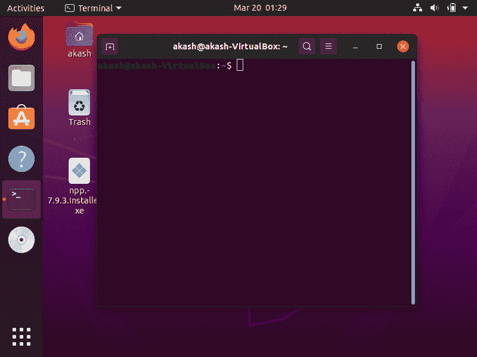

**第二步。**现在，在终端中键入以下给定命令，然后按回车键:

命令:

```

Who

```

**第三步。**按下回车键后，需要一点时间，显示登录用户的姓名、上次重启时间等信息。该命令的输出可能如下图所示:

**输出**

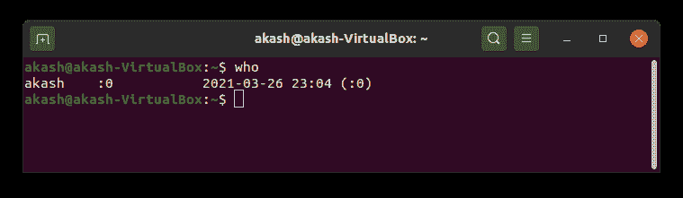

我们可以注意到在上面给定的图像中，只有一个用户当前登录到我们的系统中。因此，它只显示当前用户的信息。但是，如果您使用的系统有其他几个用户可以访问，上面的命令将显示登录到该系统的所有用户。

### “谁”指挥着不同的论点

现在让我们看看如何使用带有不同选项或参数的“who”命令来显示关于不同事物的不同类型的信息。在这里，我们将简要讨论“谁”及其所有有用的选项、论据，并看看它们的实际实现。

**1。命令显示与输入/输出设备相关联的主机名和用户，如键盘-**

**语法**

```

Who -m -H

```

**输出**

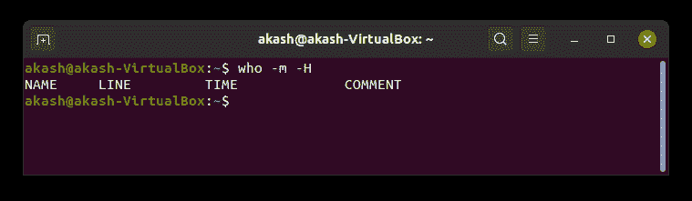

**2。显示当前登录用户的所有详细信息-**

在这个命令的帮助下，可以看到登录到当前系统的每个用户的所有详细信息。除了附加选项“-a”之外，该命令的语法是相同的，我们可以在给定的语法中看到:

**语法**

```

who -a

```

**输出**

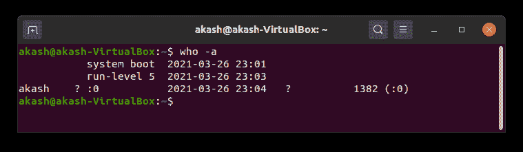

**或**

您可以使用“所有人”代替“谁-a”，因为它显示所有信息。

**语法**

```

Who  -all

```

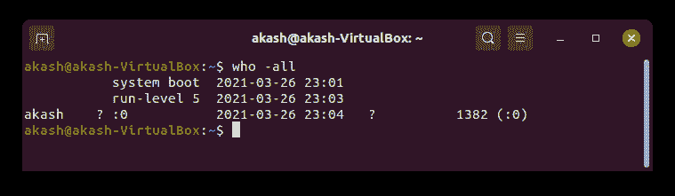

**3。显示由 NIT 进程产生的所有活动进程的信息-**

该命令将帮助您显示基本信息以及每个活动进程。

**语法**

```

who -p -h

```

**输出**


**4。将用户消息的状态显示为-、+或？**

该命令将帮助我们显示用户消息的状态。下面给出了该命令的语法:

**语法**

```

who -T -H

```

**输出**

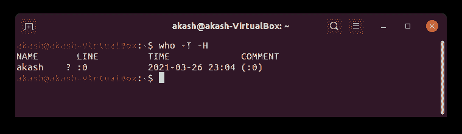

**5。显示登录用户的完整列表-**

该命令将帮助我们显示登录用户的完整列表。下面给出了该命令的语法:

**语法**

```

who -u

```

**输出**

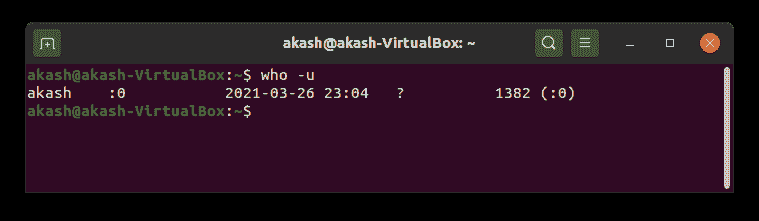

**6。显示整个死进程列表-**

可以使用这个命令查看所有死进程的完整列表。下面给出了命令的语法:

**语法**

```

who -d -H

```

**输出**

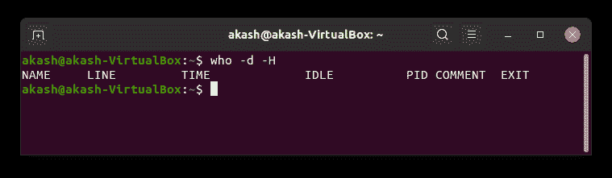

**7。显示系统登录流程详情-**

可以使用该命令查看登录过程。该命令的语法如下:

**语法:**

```

who -l -H

```

**输出**

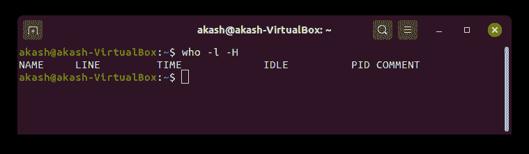

**8。统计所有登录用户的数量-**

我们可以使用这个命令来查看有多少用户以数字的形式登录。该命令的语法如下:

**语法:**

```

who -q -H

```

**输出**

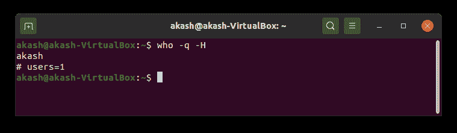

9.要显示系统的当前运行级别-

该命令的语法如下:

```

Who -r

```

**输出**

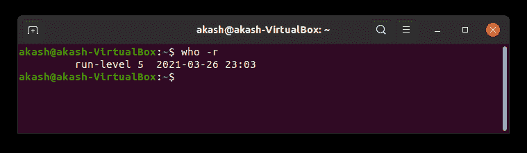

**10。显示系统的用户名-**

该命令通常用于了解实际系统的用户名。该命令的语法如下:

**语法**

```

whoami

```

**输出**

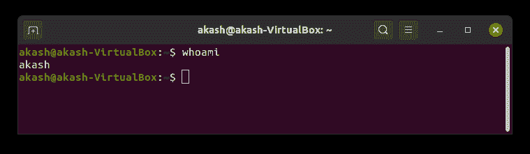

**11 时。显示用户及其活动列表-**

在此命令的帮助下，您还可以看到登录到当前系统的用户及其活动的完整列表。命令如下:

**语法**

```

w

```

**输出**

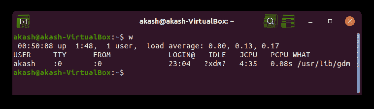

**12 时。显示用户识别信息-**

可以使用该命令查看用户标识信息。该命令的语法如下:

**语法**

```

Id

```

**输出**

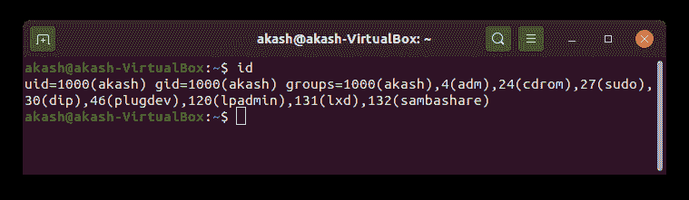

* * *