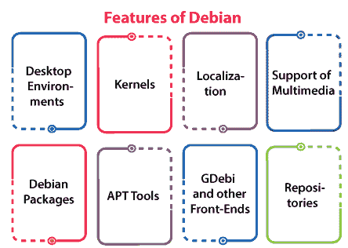
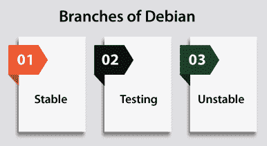
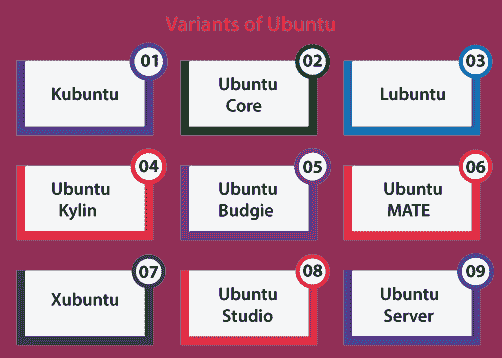

# Debian 诉 Ubuntu

> 原文：<https://www.javatpoint.com/debian-vs-ubuntu>

## Debian 简介

Debian 也叫 **Debian Linux/GNU** 。它是一种 Linux 发行版，由开源和自由软件组成，由社区支持的 Debian 项目设计。它是由**伊恩·默多克**在 1993 年 8 月 16 日创建的。Debian 的第一个版本(0.01)于 1993 年 9 月 15 日发布，其最初的稳定版本(1.1)于 1996 年 6 月 17 日发布。Debian 的稳定分支是服务器和个人电脑最著名的补充。Debian 也是其他各种发行版的基础，最重要的是 Ubuntu。

这个 [Linux](https://www.javatpoint.com/linux-tutorial) 发行版是最早的基于 Linux 内核的操作系统之一。该项目在互联网上与 Debian 项目负责人指导的志愿者团队以及以下三个基础文件相关联:

*   Debian 自由软件指南
*   德比亚宪法
*   Debian 社会契约

几个较新的发行版不断更新，即将到来的候选版本在基于时间的冻结后发布。Debian 自创建以来，一直基于 GNU 项目的原则进行公开改进和自由共享。因此，自由软件基金会从 1994 年 11 月至 1995 年 11 月资助了该项目。Debian 项目在公共利益范围内开发了非营利组织软件，以便在赞助结束时继续在财务上支持发展。

### 德比安的特点

Debian 包括对各种在线存储库的访问，这些存储库还包括 51，000 多个包。官方上，Debian 只包含自由软件；但是，可以使用 Debian 存储库安装和下载非自由软件。

Debian 包含著名的免费程序，如 **LibreOffice、Evolution mail、Firefox 网络浏览器、K3b 光盘刻录机、VLC 媒体播放器、Evince 文档查看器、**和 **[GIMP](https://www.javatpoint.com/gimp) 图像编辑器**。Debian 是几个服务器的著名选择，例如与 LAMP 堆栈的操作系统组件相同的服务器。

让我们讨论一下 Debian 的一些特性。

### 桌面环境

Debian 为专门为 LXQT、LXDE、肉桂、MATE、KDE、GNOME 和 XFCE 创建的 DVD 和 CD 图像提供便利。MATE 是官方支持的，而肉桂的支持包含在 Debian 8.0 中，Jessie。一些不太基本的窗口管理器，如 WindowMaker、IceWM、Fluxbox、Openbox、启蒙等都存在。

由于 GNOME3 不适合收藏的初始光盘，7.0 版本喘息的默认桌面平台暂时更改为 Xfce。8.0 版本的默认版本 Jessie 在 2013 年 11 月再次切换到 Xfce，并在 2014 年 9 月回归 GNOME。

### 核心

Linux 内核的几个版本适用于所有端口。i386 端口包含支持实时计算的 IA-32 电脑版本以及 X86-64 电脑和旧电脑的物理地址扩展。

正式来说，Linux 内核不包括没有任何来源的固件，但是这个固件可以在替代安装介质和非免费包中获得。

### 本地化

几个 Debian 部分被转换成各种语言，包含包描述、文档、网站和配置消息。

软件本地化级别基于语言，从支持的法语和德语到几乎没有翻译的萨摩亚语和克里克语。Debian 版安装程序有 76 种不同的语言版本。

### 多媒体支持

在没有非常严格的许可或来源的情况下，对多媒体的支持在 Debian 中对潜在的专利侵权和像 Adobe Flash 这样的技术一直含糊不清。

尽管如此，有分发问题的包可以放在非免费的地方。像 libdvdcss 这样的软件不在 Debian 上托管。

值得注意的是，有一个第三方存储库，以前名为**debian-multimedia.org**。它正在促进 Debian 中没有的软件，如 Adobe Flash Player、libdvdcss 和 Windows 编解码器。不过，这个存储库是由克里斯蒂安·玛丽莱特管理的。这个库方便了已经在 Debian 中添加的包，中断了官方维护。

### Debian 软件包

包管理的操作可以通过 Debian 上存在的不同工具来执行，通过最底层的命令 dpkg 到前端(图形)如 Synaptic。

在 Debian 系统上管理包的建议标准是一个合适的工具集。

此外，dpkg 简化了包管理的底层结构。dpkg 的数据库包括当前系统上所有已安装软件的列表。

dpkg 的命令工具不知道仓库。这个命令可以在本地执行。通过 dpkg 数据库获取 deb 包文件和详细信息。

### APT 工具

APTE 代表**高级包装工具**。它允许管理已安装的 Debian 系统，以便通过存储库检索和解析包依赖关系。APT 分发缓存的包和依赖信息。

### 全球数据基础设施和其他前端

GDebi 被称为一个 **APT 工具**。它可以应用于图形用户界面和命令行。GDebi 可以安装一个文件，即一个**本地的**。deb 使用命令行，如 dpkg 命令。

但是，通过访问各种存储库来解决依赖性，APT 的各种其他前端(图形)如 **Apper、Synaptic、**和**软件中心**。此外，GNOME 软件被称为 PackageKit 的前端(图形)。GNOME 软件本身可以在几个软件打包系统的顶端工作。

### 仓库

**DFSG (** 代表 Debian 自由软件指南)规定了“自由”这个词在“开源和自由软件”中的特殊含义。

几个遵守这些准则的包，通常属于 GNU 通用公共许可证(艺术许可证或修改的 BSD 许可证)，被包括在主要区域中，否则，它们将被包括在贡献和非自由区域中。

这两个区域没有在官方安装媒体中共享，但是可以手动采用。

### Debian 的分支

Debian 有三个分支(也称为套件、发行版或发行版)，它们被定期维护:

*   **稳定**是目前的版本，目标是测试良好且稳定的软件需求。稳定的设计是通过冻结测试几个月，其中错误被解决，有这么多错误的包被丢弃。然后，最终的系统被公布为稳定。
*   **测试**被称为预览分支。最终，它将成为即将到来的主要版本。这个分支中添加的那些包包含一些不稳定的测试；但是，它们可能不会被释放。

它包括与稳定相比新的包，但比不稳定更早。测试分支会持续更新，直到它被冻结。测试的 DVD 和光盘可以在 Debian 的网站上找到。

*   **不稳定**是主干，始终代号为 sid。包裹也是可以接受的，不需要完全检查配送。通常，这个分支是由许多软件开发人员执行的，他们对任何项目都有贡献，并要求当前的库存在，也由那些追求尖端软件的人执行。

此外，Debian 不支持完整的 Sid 安装光盘。虽然，而不是一个最小的国际标准化组织，可以适用于安装在网络连接。该分支还可以通过测试或稳定的系统升级来安装。

### Debian 的组织

Debian 的团队努力和策略强调协作测试过程和软件开发。结果，新版本往往每两年出现一次，同时出现的还有设置重要问题和安全问题的修订版本。

Debian 开发人员被维护在一个信任的网络中。目前活跃的开发商约有 1000 家；然而，在没有任何官方开发者的情况下为项目做贡献是可能的。

志愿者组织是一个不正常的项目，它有三个重要的基本文件:

*   《Debian 自由软件指南》规定了自由软件的标准，因此规定了什么样的软件可以在发行版中使用。该指南已被接受为开源定义的基础。

然而，这份文件可以单独考虑，它在形式上是社会契约的一部分。

*   Debian 社会契约规定了一组共同的原则，通过这些原则，项目和它的开发者组织事务。
*   《Debian Constitution》规定了项目正式决策的组织基础设施，并描述了秘书、项目负责人和其他角色的职责和权力。

### Debian 的开发者

Debian 项目包含了大量想成为开发者的申请人。申请人应经历审查过程，以发展他们对项目原则和技术能力的理解、动机和认同。这个项目多年来变得非常复杂。

Debian 的开发者加入这个项目有几个原因。其中一些解释如下:

*   Debian 是主要的操作系统，他们希望开发 Debian
*   发展对喜爱的技术的支持
*   改善他们的维护工作要容易得多
*   渴望为自由软件社区做出贡献
*   它们与 Debian 的一个衍生物相关联

如果认为必要，Debian 开发人员可能会辞职，或者在任何时候，他们可能会被开除。追求退休协议的开发人员可以被授予一个身份，即“荣誉退休”**，他们可能会通过新的成员流程重新获得成员资格。**

 **## Ubuntu 简介

Ubuntu 是基于 Debian 的 Linux 发行版。大多数情况下，它由开源和自由软件组成。正式来说，Ubuntu 有以下三个基本版本:

*   计算机网络服务器
*   桌面
*   机器人和物联网设备的核心

这些新增功能中的每一项都可以在虚拟机中或单独在计算机上执行。Ubuntu 是一个著名的云计算操作系统，支持 OpenStack。Ubuntu 的默认桌面从 17.10 版本开始就是 GNOME 了。

Ubuntu 每六个月出版一次，LTS 每两年发行一次。最新的 LTS 发布是**焦窝** (20.04)截至 2020 年 10 月 22 日。目前的标准出版物是 Groovy Gorilla (20.10)。支持九个月。

这一行是由 canonical 和一组其他开发人员基于精英治理模型设计的。Canonical 为 Ubuntu 的所有版本提供支持和安全更新，从发布日期开始，直到发布达到其开发的生命周期结束日期。Canonical 使用与 Ubuntu 相关的高级销售服务来产生收入。

### Ubuntu 的背景

Ubuntu 是在 Debian 的基础设施和架构上创建的。它包括 Linux 桌面、服务器以及操作系统的停产平板电脑和手机版本。可以预见的是，Ubuntu 每六个月发布一次更新版本，所有的出版物都可以获得九个月的免费支持，包括有益的低风险错误修复、高影响的 bug 保守和修复以及安全修复。第一份出版物于 2004 年 10 月发行。

Ubuntu 的包是基于 Debian 不稳定分支的包，可以每六个月同步一次。这些发行版使用了包管理工具(比如 Ubuntu 和 APT Software)和 Debian 的 deb 包格式。

Ubuntu 和 Debian 的包本质上不是二进制兼容的，但是这些包可能需要通过 Ubuntu 中应用的源代码重新创建。Ubuntu 的几个开发人员也是 Debian 中包的管理者。

目前，乌班图由 Canonical 有限公司资助。Canonical 和马克·舒托沃尔斯于 2005 年 7 月 8 日宣布成立乌班图基金会，并促成了 1，000 万美元的启动资金。

该基金会旨在确保每个 Ubuntu 未来版本的开发和支持。

Ubuntu 在 2009 年 3 月 12 日发布了开发者对第三方云管理环境的支持，就像亚马逊 EC2 中使用的那些一样。

### Ubuntu 的特点

*   Ubuntu 的默认安装包括大量软件，包括传输、雷鸟、火狐、LibreOffice 和各种轻量级游戏，如象棋和数独。
*   使用 Ubuntu 软件(内置)和其他基于 APT 的包管理工具，可以访问几个附加的软件包。
*   默认情况下不再安装的几个附加软件包，如 **Synaptic、洋泾浜、GIMP、**和 **Evolution** ，可以在存储库中访问，也可以使用主要工具或任何其他基于 APT 的软件包管理工具安装。
*   交叉分配的扁平包装和快照包装也存在。这两个软件包都允许在大多数大型 Linux 操作系统中安装软件，就像微软的一些软件一样。
*   GNOME 文件是默认的文件管理器，原名**鹦鹉螺**。
*   默认情况下，安装的每个应用软件都是自由软件。Ubuntu 重新分发了一些硬件驱动程序，这些驱动程序也只以二进制格式存在；然而，这些类型的包在约束组件中被公开标记。

### Ubuntu 的安全性

默认情况下，Ubuntu 注重安全性。用户程序以低权限执行，不能损坏操作系统或用户的其他文件。 **sudo** 工具用于分配权限以执行各种管理任务，这些任务允许根帐户保持锁定，并支持保护没有经验的用户不打开安全漏洞或为高安全性进行系统更改。Polkit 正在桌面上高度实现。

默认情况下，大多数网络端口可以关闭，以防止黑客攻击。防火墙(内置)允许安装网络服务器的用户控制访问。

存在用于配置它的图形用户界面。Ubuntu 可以用 GCC 特性编译它的各种包，比如缓冲区溢出保护和 PIE 来加强软件。这些新增功能大大增强了安全性能。

Ubuntu 还支持完整的磁盘加密以及私有目录和主目录的加密。

### Ubuntu 的安装

Ubuntu 产品之间的系统需求变化。Ubuntu 20.0 4 LTS 台式机版本推荐使用一台配备 2 千兆赫双核处理器、25GB 可用磁盘空间和 4GB 内存的电脑。

还有其他各种各样的发行版开放给像徐本图和鲁本图这样的性能差得多的计算机。Ubuntu 支持 ARM 的架构。

它在 Power ISA 上可用，而 PowerPC 的早期体系结构在单点得到了非官方支持，现在支持 Power ISA 的新 CPU。官方支持 x86 64 的 AMD64 架构。

*   实时图像是各种用户访问和随后安装 Ubuntu 的关键方式。这些可以作为磁盘映像下载，随后刻录到 DVD 并启动。
*   安装一个 u 盘可以额外用于引导 Kubuntu 和 ubuntu，其形式允许用户设置的永久存储以及安装了 u 盘的系统在不同物理机器之间的可移植性。
*   Ubuntu 的实时 USB Creator 可用于在新版本的 Ubuntu 中通过 USB 驱动器安装 Ubuntu(不带或带实时 DVD 或 CD)。
*   制作一个带持久性的可引导 u 盘就像拖动任何滑块来决定要为续航能力保留多少容量一样简单。Ubuntu 为此使用了 Casper。
*   桌面版也可以安装 Netboot 映像，该映像应用了 Debian 安装程序，并允许可能的专业 Ubuntu 安装:从早期安装升级，不使用网络访问，修复自动部署，磁盘阵列或 LVM 分区，安装在系统上以及 256 兆内存。

### Ubuntu 的变体

官方说法是，Ubuntu 桌面是为大多数用户建议的变体。它简称为 Ubuntu，正式名称为 Ubuntu 桌面版。

它是为笔记本电脑和台式机开发的，由 Canonical 官方支持。从 Ubuntu 版本开始，GNOME 外壳是桌面环境(默认)。

从 Ubuntu 11.04 版本到 Ubuntu 17.04 版本，默认是 Unity 桌面界面。通过简单地提供独特的桌面环境，其他几个变体也有所不同。

Xfce 和 LXqt 经常被推荐用于处理能力和内存可能较低的早期电脑。

### 官方分发

Ubuntu 的许多风格和版本只是安装了一个不同于标准 Ubuntu 桌面的默认包集合。因为他们分发相似的软件包库，所以每个相似的软件对他们来说都是存在的。

Ubuntu 的核心是唯一的例外，因为它只能访问快照存储中的包。

下面讨论一些主要的分布及其描述:

*   **Kubuntu:** 使用的是 KDE 接口，而不是 ubuntu 桌面应用的 Unity 接口和 GNOME，这是一种 Ubuntu 的味道。
*   **Ubuntu Core:** 它是一个专注于嵌入式和 IoT 系统的 Ubuntu 版本。与其他各种变体不同，它没有应用传统 apt 的包管理器，而是完全依赖于 Snap 包。
*   **Lubuntu:** 这个发行版是 ubuntu 的一个味道，更节能，更少资源消耗，更轻。它使用 LXqt 桌面环境(在 18.10 版之前应用了 LXDE)。
*   **Ubuntu Kylin:** 是一款专注于中国市场的 Ubuntu 口味。
*   **乌班图虎皮:**是使用虎皮的乌班图的一种风味。
*   **Ubuntu MATE:** 这是使用 MATE 的 Ubuntu 的另一个味道，MATE 是一个通过现在已经不存在的 GNOME 2 的代码库分叉的桌面平台。它侧重于桌面隐喻。
*   **Xubuntu:** 是一款使用 Xfce 的 ubuntu 的味道。这种风格旨在适用于不太强大的系统或那些在速度更快的系统上探索高性能桌面环境的人，并且也主要适用于 GTK+应用程序。
*   **Ubuntu Studio:**Ubuntu Studio 基于 Ubuntu。它正在促进各种面向图形、视频和音频编辑器的多媒体创建开源应用程序。
*   **Ubuntu Server:** Ubuntu 包括一个服务器版本，将类似的 APT 存储库应用到 Ubuntu 桌面版。它们之间的主要区别是 X Window 环境在服务器版本的默认安装中不存在(然而，可以很容易地安装一个，包括 KDE、GNOME、Xfce 或 Unity)，以及对安装过程的一些更改。

此服务器版本支持硬件虚拟化。此外，它可以在虚拟机管理程序或主机操作系统(如基于内核的虚拟机、QEMU、微软 Hyper-V、思杰 XenServer、甲骨文、VMware ESXi 或其他与 IBM PC 兼容的虚拟化器或仿真器)中的虚拟机内执行。

## Debian 和 Ubuntu 的区别

Debian 和 Ubuntu 在几个方面是完全一样的。它们都使用 DEB 包和 APT 包管理系统进行手动安装。Debian 和 Ubuntu 都包含一个类似的默认桌面平台，那就是 GNOME。这意味着默认的感觉、外观和大多数预安装/默认的应用程序将是相同的。

| 没有。 | 一种自由操作系统 | 人的本质 |
| **1。** | 它是原创的 | 它在 Debian 的测试分支上 |
| **2。** | 不建议新人使用 | 可以说这对新人更好 |
| **3。** | 它只使用免费软件 | 它使用专有和自由软件 |
| **4。** | Debian 更稳定 | Ubuntu 不如 Debian 稳定 |
| **5。** | Debian 有计划外的发布 | 它按照特定的时间表发布 |
| **6。** | Debian 的稳定版本包括最长三年的支持 | 其 LTS 版本包括最长五年的支持 |
| **7。** | 它很轻 | 它需要更好的硬件 |
| **8。** | 它的桌面版本包括几个桌面环境选项 | 默认情况下，Ubuntu 应用 GNOME 桌面环境(早期版本的 Unity) |
| **9。** | 免费试用 Vultr 的 Debian 服务器 | 在 Vultr 免费试用 Ubuntu 服务器 |
| **10。** | 如果我们在一个企业平台，我们应该使用 Debian，因为它更安全和稳定。 | 如果我们需要每个软件的当前版本，如果我们将服务器用于个人用途，那么我们应该使用 Ubuntu。 |
| **11 时。** | Debian 中没有正式规定发布周期。虽然，我们会发现一个更新的版本几乎每两年出现一次。比如巴斯特。 | 合理地说，Ubuntu 包括一个正常的发布周期。每两年发行一个 LTS 版本，每年发行两个版本。例如焦窝。 |
| **12 时。** | 完全是，Debian 是由社区驱动的。Debian 由世界各地的开发人员和程序员开发和维护。这种发展方式证实了连续性。完全，Debian 是无集中控制的。这是导致不确定的稳定释放周期的原因之一。 | Ubuntu 由 Canonical 维护和开发。由公司维护它有几个好处。有支持线(官方)，有明确的发布周期，还有具体的工业软硬件支持。 |
| **13。** | Debian 在其存储库中只包含开源和自由软件。它大多面向各种用户。此外，Debian 支持 PPAs。Debian 的存储库中只有可信的开源软件。 | Ubuntu 包括各种各样的软件库。它的存储库中有大量可供选择的软件，尽管还有其他选择。
**注意:**在大多数情况下，存储库(默认)就足够了。 |
| **14。** | Debian 提供了最少的预装软件。它使 Debian 能够在简单的安装中表现得更好。 | 此外，Ubuntu 提供了更多有希望的软件特性，可以用来检查膨胀。不同的用户可能会有所不同。该软件可以卸载，使系统非常轻，但是，这可能并不总是工作，因为用户仍然不知道哪些软件包是必要的系统。 |
| **15。** | 如果我们是游戏玩家，那么我们可能会对最新的驱动程序、硬件和软件支持感兴趣。尽管 Debian 可能会促进这一点，但我们可能会完成对安装的分解。Debian 专注于软件的开源因素。 | Ubuntu 还支持各种专有包，这些包通常结合了游戏所需的图形驱动程序。对于游戏玩家来说，Ubuntu 及其发行版(比如 Pop！_OS)在硬件和软件支持方面的表现更好。 |
| **16。** | Debian 应用 Debian 安装程序，它基于安装过程的 nCurses。Debian 安装程序提供了比泛在性更多的选项。 | 此外，Ubuntu 应用了一个名为泛在性的安装程序。 |
| **17。** | Debian 需要更多的修补来完成事情。 | 相对来说，用 Ubuntu 可以很快完成事情。 |
| **18。** | 如果涉及到桌面环境，Debian 为一些选择提供了便利。提供的桌面环境有 LXqt、LXDE、MATE、KDE、Xfce、肉桂、GNOME，还有一些被称为“标准”的东西，也就是没有图形界面的 Debian。GNOME 是 Debian 的默认 DE。 | Ubuntu 包含用于不同桌面环境的不同命名发行版。比如有 Ubuntu 的 KDE 就是 Kubuntu。带 Ubuntu 的 Xfce 是 Xubuntu 等人的。几种 Ubuntu 口味有 Ubuntu MATE (MATE)、Xubuntu (Xfce)、Ubuntu Budgie (Budgie)、Lubuntu (LXqt)、Kubuntu (KDE)和 Ubuntu (GNOME)。 |

* * ***