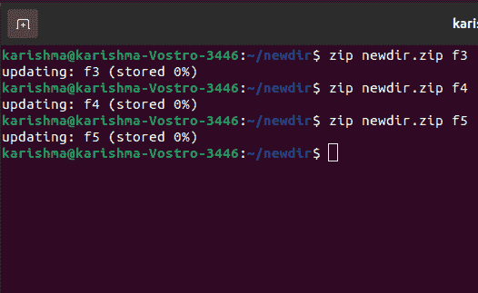
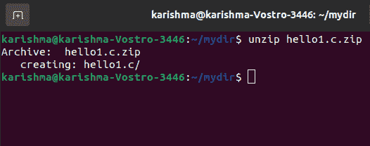
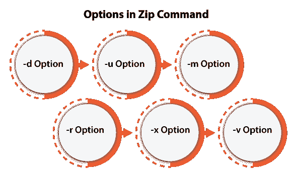
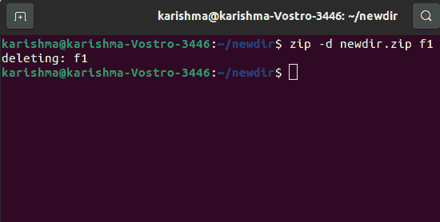
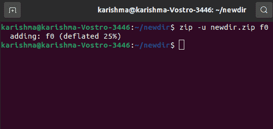
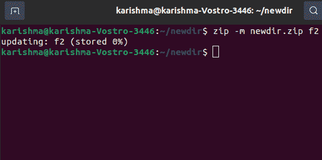
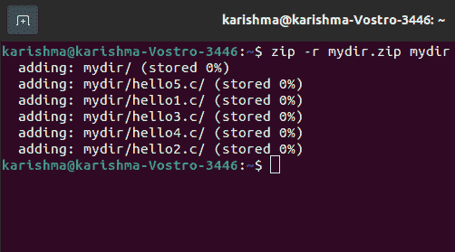
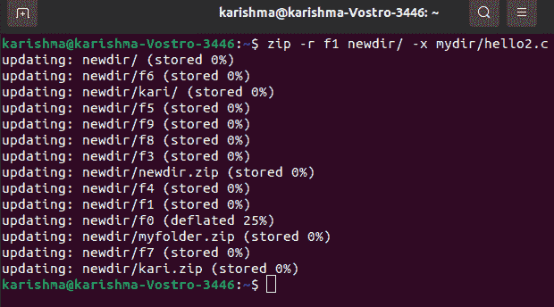
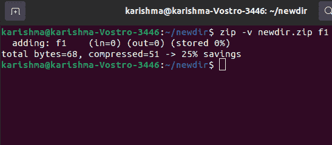

# Linux 压缩命令

> 原文：<https://www.javatpoint.com/linux-zip-command>

Zip 是一个用于 Unix 的文件打包和压缩工具。所有文件都存储在一个文件中，即。zip {。zip-filename}以及。zip 扩展。

*   Zip 用于压缩文件以减小文件的大小。它被类似地用作实用程序。Windows、Unix、Linux 等各种操作系统中文件包的 zip。
*   如果我们在两台服务器之间的带宽有限，并且希望更快地移动文件，zip 可以轻松地移动文件。
*   zip 程序允许将多个压缩文件放入一个单独的 zip 存档中，其中包含文件的详细信息，包括名称、保护、上次修改时间、日期、路径以及用于验证文件完整性的检查详细信息。目录的整个结构可以和一个单独的命令一起打包到 zip 存档中。
*   该程序有助于打包文件组进行分发，节省磁盘空间，并通过临时压缩未使用的目录和文件来存档文件。
*   对于各种文本文件，3:1 和 2:1 的压缩率是正常的。Zip 也可以存储几个文件而无需任何压缩，并且它有一个压缩方法(紧缩)。自动地，zip 为所有要压缩的文件选择两者中较好的一个。

### 语法:

```
zip [options] zipfile files_list

```

### 创建任何 zip 文件的语法:

```
$zip myfile.zip filename.txt

```



## 从 zip 文件中提取文件

解压缩可以从 zip 档案中提取、测试或列出文件，这在 Unix 上是常见的。默认的性质是通过特定的 ZIP 存档将每个文件提取到当前目录中。

### 语法:

```
$unzip myfile.zip

```



## 压缩命令中的选项:



**1。-d 选项:**该选项通过 zip 存档删除任何文件。我们可以在制作一个 zip 文件后，借助-d 选项，通过存档删除任何文件。

**语法:**

```
$zip -d filename.zip file.txt

```



**2。-u 选项:**该选项可以更新 zip 存档内的文件。它可以用于更新描述的文件列表或向现有的 zip 文件添加新文件。

我们可以更新 zip 存档中的现有条目，只要它与 zip 存档中已经存在的版本相比是最近更改的。

**语法:**

```
$zip -u filename.zip file.txt

```



**3。-m 选项:**压缩后，该选项删除真实文件。将特定文件传输到 zip 存档中，因为它会在创建指定的 zip 存档后删除目标文件/目录。

在这种情况下，如果在删除文件后目录变得无人占用，该目录也会被删除。在 zip 存档没有任何错误之前，不会进行删除。

节省磁盘空间很有用；但是，删除每个输入文件可能是不安全的。

**语法:**

```
$zip -m filename.zip file.txt

```



**4。-r 选项:**要递归压缩目录，请将 zip 命令与-r 选项配合使用，它将递归压缩目录中的指定文件。这个选项支持我们压缩存在于指定目录中的每个文件。

**语法:**

```
$zip -r filename.zip directory_name

```



**5。-x 选项:**该选项可以在制作 zip 时排除指定的文件。例如，我们正在压缩目录中的每个文件，并希望排除一些不需要的文件。借助此选项，我们可以排除不需要的文件。

**语法:**

```
$zip -x filename.zip file_to_be_excluded

```



**6。-v 选项:**打印诊断或详细模式版本信息。当通常应用于原始操作时，它在请求关于 zip 文件结构的异常的详细诊断和压缩信息期间启用进度指示器显示。

如果-v 是单个命令行参数，并且 stdout 或 stdin 没有重定向到任何文件，诊断屏幕将被打印。在帮助屏幕标题以及发布日期、版本和程序名称的扩展中，给出了一些指向分发站点和 Info-ZIP 主页的指针。

然后，它会显示有关目标环境的信息(编译器版本和类型、编译日期、操作系统版本以及用于创建 zip 可执行文件的启用选项方面)。

**语法:**

```
$zip -v filename.zip file1.txt

```



* * *