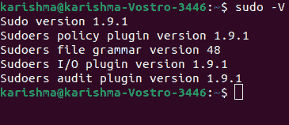
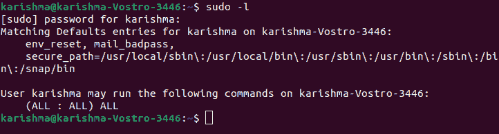
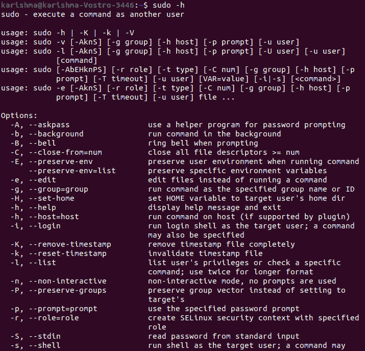
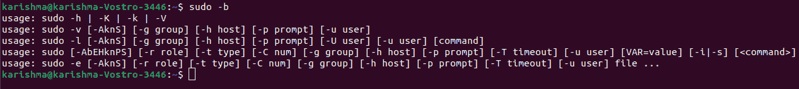
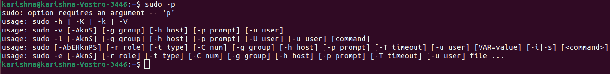
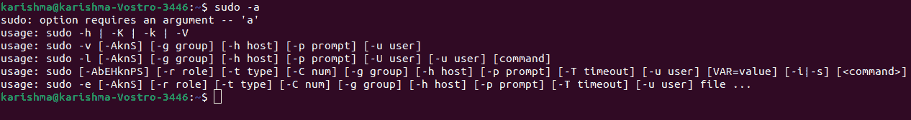
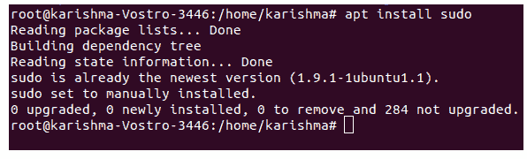
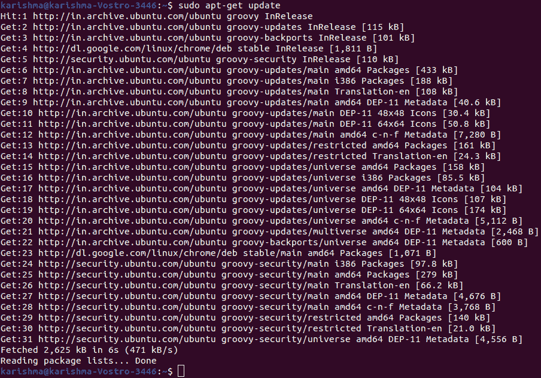

# Linux sudo

> 哎哎哎:# t0]https://www . javatppoint . com/Linux-sudo

## 介绍

Linux sudo 命令代表**超级用户 Do** 。通常，它作为超级用户被允许执行的一些命令的前缀。

如果我们将该命令与其他命令放在一起作为前缀，它将以较高的权限执行该命令。换句话说，它将允许用户以超级用户等其他用户的身份接受命令，并获得适当的授权。

相当于 Windows 中的选项**“以管理员身份运行”**。sudo 选项允许我们拥有多个管理员。可以应用 sudo 命令的用户需要将 sudoers 文件中的条目放在**/etc/sudoers/**处。

#### 注意:要查看或编辑文件，我们必须应用 sudo 命令。对于编辑文件，建议应用“visudo”命令。

默认情况下，sudo 命令需要用户自己验证密码，该密码是用户的密码，而不是根密码本身。

### sudo 命令的语法

sudo 命令的语法如下:

```

sudo OPTION... COMMAND 

```

## sudo 命令中的选项

sudo 命令中的一些重要选项解释如下:

**1。-V:** 代表**版**。此选项启用 sudo 命令打印版本号并退出。如果请求用户已经是根用户，则-V 选项将打印出默认 sudo 列表暂停。



**2。-l:** 代表**名单**。该选项将有助于打印出用户在当前主机上允许的各种命令。

它显示当前用户可以将每个命令作为 sudo 应用。



**3。-h 或-help:**h 在此选项中代表**帮助**。此选项启用 sudo 命令来打印使用和退出的消息。



**4。-v:** 代表**验证**。如果 sudo 命令将更新用户的时间戳，验证将在必要时提示输入用户的密码。它将 sudo 命令超时时间延长了另外 5 分钟，但不执行任何命令。它不提供任何结果。

**5。-k:** 代表**击杀**。该选项使用户的时间戳对 sudo 无效。因此，下次执行 sudo 命令时，将需要密码。-k 选项不需要任何密码，它是允许用户通过**撤销 sudo 命令的权限。注销**文件。

**6。-b:** 代表**背景**。该选项通知 sudo 命令在后台执行提供的命令。

#### 注意:如果我们应用这个选项，我们就不能应用 shell 作业控制来操作这个过程。



**7。-K:** 此选项与-K 选项相同。但是，它代表**确定杀死**。该选项用于完全删除用户的时间戳。它同样不需要任何密码。

**8。-p:** 代表**提示**。此选项允许我们覆盖密码提示(默认)并应用自定义提示。允许几个百分比的逃逸，如下所示:

*   %u 被开发为调用用户的登录名。
*   %U 被开发为用户的登录名
*   %h 被开发为主机名(本地),没有任何域名。
*   %H 被开发为具有域名的主机名(本地)(仅当机器的主机名完全合格时)
*   %%(两个连续的字符)可以分解成一个单独的%字符。



**9。-n:** 此选项将运行命令，而不要求输入密码。如果我们希望执行一些命令作为后台任务(或者在 shell 脚本中)，这是非常有用的，因为我们不希望 sudo 命令询问密码。此选项是非交互式的缩写。

**10。-u:** 代表**用户**。此选项使 sudo 命令能够以用户身份执行描述的命令，而不是以 root 用户身份执行。为了指定一个 **uid** 而不是用户名，我们可以使用 **#uid** 。

**11 时。-H:** 代表**家**。该选项可以将**家庭环境变量**设置到根用户的**家庭目录**，如 passwd 文件中所述。默认情况下，sudo 命令不会更改 HOME。

**12 时。-s:** 代表**外壳**。该选项执行通过 **shell 环境变量**描述的 SHELL，当其设置或该 SHELL 如 **passwd** 文件中所述。

**13。-S:** 代表 **stdin** 。此选项启用 sudo 命令，通过标准输入而不是终端设备读取密码。

**14。-:** 此选项说明 sudo 命令必须停止处理命令行的参数。它与 a -s 标志结合使用最有帮助。

**15。-a:** 代表**认证类型**。此选项启用 sudo 命令，以便在验证用户时使用所描述的身份验证类型，如 **/etc/login/所允许的。配置**。

系统管理员可以通过在 **/etc/login/中包含**“自动 sudo”**条目来描述 sudo 特定认证的方法列表。配置**。



## sudo 命令中的环境变量

以下是 sudo 命令应用的一些环境变量:

| 没有。 | 标签 | 描述 |
| **1。** | **编辑器** | 这是一个默认编辑器，当 VISUAL 未修复时，可以在-e 模式(sudoedit)中使用。 |
| **2。** | **HOME** | 它将在-H 或-s 模式下设置为用户(目标)的主目录(或当 sudo 命令与选项一起形成时，即-enable-shell-set-home)。 |
| **3。** | **路径** | 当选项，即 secure_path sudoers 固定时，它设置为相同的值。 |
| **4。** | **壳牌** | 它可用于确定与-s 选项一起执行的 shell。 |
| **5。** | **SUDO _ 命令** | 它设置为由 sudo 命令执行的命令。 |
| **6。** | sudo _ prompt | 它可以用作密码提示(默认)。 |
| **7。** | sudo _ user | 它设置为请求 sudo 命令的用户的登录名。 |
| **8。** | sudo _ uid | 它设置为请求 sudo 命令的用户的 uid。 |
| **9。** | sudo _ GID | 它设置为请求 sudo 命令的用户的 gid。 |
| **10。** | sudo _ PS1 | 如果 PS1 被设定，它的价值将被固定。 |
| **11 时。** | **用户** | 它设置为用户(root，除非描述了选项，即-u)。 |
| **12 时。** | **视觉** | 它是一个默认的编辑器，在-e 模式(sudoedit)中使用。 |

## 苏多司令部的历史

1980 年，克利夫·斯潘塞和罗伯特·科格沙尔在 SUNY/布法罗的计算机科学系编写了实际的子系统。罗伯特·科格沙尔把苏多带到科罗拉多大学博尔德分校。实质上，在 1986-1993 年间，功能和代码被工程学院和科罗拉多大学博尔德计算机科学系的信息技术成员以及托德·米勒的应用科学所改变。

公开来说，最新版本自 1994 年以来一直由托德管理。米勒(OpenBSD 开发者)，自 1999 年以来一直分享 ISC 风格的许可证。

托马斯·克莱本(Thomas Claburn)在 2009 年 11 月将这种不确定性描述为夸大其词，以回应微软拥有 sudo 特权的事情。狭义地说，这些声明是针对特定的图形用户界面而不是 sudo 方法。

## sudo 命令的设计

用户可以在必要时向 sudo 提供密码，而不是超级用户，这与 su 命令不同。它允许可访问的用户行使合格的特权，而不用处理另一个帐户密码的保密性。

*   当配置文件允许用户访问时，在认证之后，系统请求所要求的命令。
*   sudo 命令为每个伪终端保留了用户的调用权限一段宽限时间(通常为 5 分钟)，并且它允许用户作为声明的用户执行各种连续的命令，而不必再次给出任何密码。
*   sudo 命令可能被配置为记录作为审核和安全功能运行的每个命令。
*   此时，用户为调用 sudo 命令而拍摄的镜头没有在配置文件中列出，向该用户呈现了一个异常示例，告知该镜头已被记录。
*   一个条目将保存在系统中，根用户将收到邮件通知。

## sudo 命令的配置

**/etc/sudoers** 文件包括有权运行一组命令的用户组或用户列表，同时包含根用户或其他列出的用户的权限。该程序可能被配置为需要密码。

## sudo 命令的影响

在一些系统发行版中，sudo 命令已经取代了对各种管理操作使用不同的超级用户登录(默认)，最重要的是在一些苹果的 macOS 和 Linux 发行版中。

它防止了一些漏洞利用，还允许对管理命令进行更受保护的日志记录。

## 角色访问控制

sudo 命令可用于与 SELinux 协作，在基于角色的访问控制中各种类型的角色之间进行转换。

## 类似的程序和工具

visudo 是一个命令行实用程序，允许在故障安全模式下编辑 sudo 的配置文件。它执行语法和健全性检查，并且还防止多个同时编辑和锁定。

runas 程序在微软视窗中促进了同样的性能；但是，它不能将当前的长命令行传递给子级、环境变量或目录。

它不支持通用提升，但它有助于像其他用户一样执行子级。对于 windows，添加了 **Hamilton C shell** 的真正 sudo 和 su，它们可以传输这些状态细节中的每一个，并以另一个用户或提升者的身份开始子进程。

图形用户界面可用于 sudo ( **gksudo** 值得注意的是)，但它在 Debian 中被否决，在 Ubuntu 中也不再被否决。各种其他类型的用户界面不是直接在 sudo 上设计的，而是为管理目标提供相同的特权提升(临时)，如 Mac OS X 的**授权服务、微软视窗**中的用户帐户控制和类 Unix 操作系统中的 **pkexec。**

从 OpenBSD 5.8 版本(2015 年 10 月)开始， **doas** 可用。它被指定在 OpenBSD 的基础系统中替换 sudo 命令。

## 苏诉须藤

如果我们习惯于更经典的 Linux 设置，那么我们习惯于应用 su 命令来获得 root 权限。我们也可以发出 su 命令，以便作为根用户有效地登录(根用户的家变成了我们的家)。

使用这些分发，我们也可以作为路由用户登录。但是，以 root 用户身份登录不是一个好主意。如果我们正在应用依赖于 su 命令并允许根用户登录的分发，那么作为我们的标准用户登录，并将 su 命令发送给根用户。

最有可能的是，我们会注意到我们不能使用基于 sudo 的发行版作为根用户登录。事实上，在像 Ubuntu 这样的一些发行版中，根用户的帐户已经被禁用。

我们不能以根用户身份登录，并使用 su 命令成为根用户。我们可以做的是使用 sudo 命令发出这些命令来获得管理权限。

## sudo 命令的用法

使用 Linux 执行管理应用程序有两种不同的方式。我们可以使用 su 命令更改超级用户或根用户，也可以利用 sudo 命令。

当我们在终端上利用时间时，sudo 是我们经常使用的重要命令之一。使用 sudo 命令而不是以 root 用户身份登录更受保护，因为我们可以在单个用户不知道 root 密码的情况下只授予他/她一些管理权限。

我们如何实现它取决于我们使用的发行版。少数发行版允许根用户(如 **OpenSUSE、红帽**或 **Fedora** ，而少数不允许(如 **Debian** 和 **Ubuntu** )。

使用 sudo 命令的最基本形式很简单。例如，我们必须执行 dpkg 来安装一个软件。如果我们只是以标准用户的身份运行 **dpkg -i software.deb** 命令，我们会得到一条错误消息，用户没有运行该命令的权限。

这就是为什么默认情况下，标准用户不能在 Linux 机器上安装各种应用程序。如果我们想在 Linux 机器上安装任何应用程序，我们需要拥有超级用户的特权。

我们将运行 **sudo dpkg -i software.deb** 命令，这样我们就可以成功执行安装。

## 安装 sudo 命令

sudo 命令包是在大多数 Linux 发行版上预先安装的。要确认软件包安装在我们的系统上，必须遵循以下步骤:

*   首先，打开我们的终端。
*   键入 sudo，然后单击输入按钮。
*   如果我们在系统上安装了 sudo 包，它会显示一条短消息。
*   否则，我们将通过消息通知，即找不到 sudo 命令。
*   如果没有安装软件包，我们可以通过应用过度分发的软件包管理器轻松安装这个软件包。

### 在 Fedora 和 CentOS 上安装 Sudo

```

$ yum install sudo 

```

### 在 Debian 和 Ubuntu 上安装 Sudo

```

$ apt install sudo 

```



## 更新 sudo 命令



* * *