# 基本的 Linux 命令

> 原文：<https://www.javatpoint.com/basic-linux-commands>

命令是由用户提供的指令，用于指示系统执行单个程序或一组相连的程序。一般来说，**命令**是通过在命令行中指定它们，然后再按下回车键来发出的，回车键可以将它们传递给 shell。一个**单元**可以被定义为一个能够读取并执行这些命令的程序。

这些外壳是任何用户与计算机交互的最常见技术。所有类似 UNIX 的操作系统至少包括一个外壳。 **Bash** 是几乎所有 Linux 系统的默认外壳。

程序是计算机的主要逻辑单元中央处理器可读的指令序列。它说明了中央处理器必须对一组数据执行哪些操作。

通常，程序或文件可以存储在其中一个 bin 目录中，如 **/usr/local/bin** 和 **/bin/usr/bin** 。类似 UNIX 的操作系统上的命令可以是外部命令，也可以是内置命令。前者是外壳的划分。后者结合了可执行文件和外壳脚本。

这些可执行程序是用编程语言指定的程序，如 **Java、C++、C** ，然后编译成二进制。

shell 脚本可以定义为用 Shell 编程语言指定的程序，如 **sh、ksh、csh、**或 **bash** ，它允许用户发出单独的命令来执行命令的合并，包括带有参数或/和选项的命令以及重定向。这些 shell 脚本非常适合自动化一般任务和创建定制的过滤器。

一个选项有时被称为**标志**或**开关**。选项是单个字母的代码，有时是一组单词或单个单词的代码。它可以通过几种预定的方式改变命令的性质。

当使用多个单字母选项时，每个字母的位置相互靠近，并且可以是任何顺序。通常，这组选项前面应该有一个单独的连字符，中间没有空格。

一个参数也被称为**命令行参数**。它可以是文件名，也可以是在命令序列中给命令的任何其他数据，以便命令将其作为输入应用。

该命令包括命令的名称，通常由多个字符串(字符顺序)组成，这些字符串组合了参数和选项。所有的字符串都被空格(由多个制表符或空格组合而成)隔开。

命令的基本语法是:

```

command [options] [arguments]

```

这些方括号说明插入的项目是可选的。几乎所有的命令都至少包含一些选项，并且可能需要(或接受)参数。然而，有一些命令不接受参数，有些没有选项。

**pwd** 命令代表**打印工作目录**。它告诉用户当前目录的位置和名称(即用户当前工作的目录)，同样不接受参数。相反，它通过外壳获得输入。

它只包含两个非常常见的选项版本和帮助。因此，它总是被应用为:

```

pwd 

```

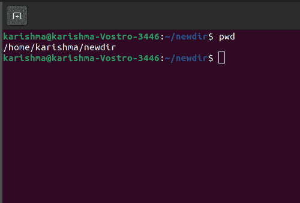

外壳避免了在 **pwd** 命令之后的类似行中输入的任何内容，以及其选项的异常，并且不返回任何错误消息。

其他一些不接受参数只接受选项的命令示例有 **ps** 和 **dmeg** 。 **dmeg** 命令显示系统启动时内核(即操作系统的核心)生成的消息。

**ps** 命令显示当前系统上的进程(执行进程中的程序)。 **ps** 命令不常见，因为引导其选项的连字符是可选的(至少在少数版本上是这样)。因此，它不接受这些论点。这个参数没有连字符选项是不可行的。因此，以下两个命令产生相同的结果:

```

ps aux

```

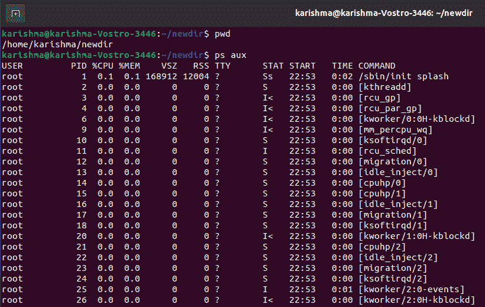

而且，

```

ps -aux

```

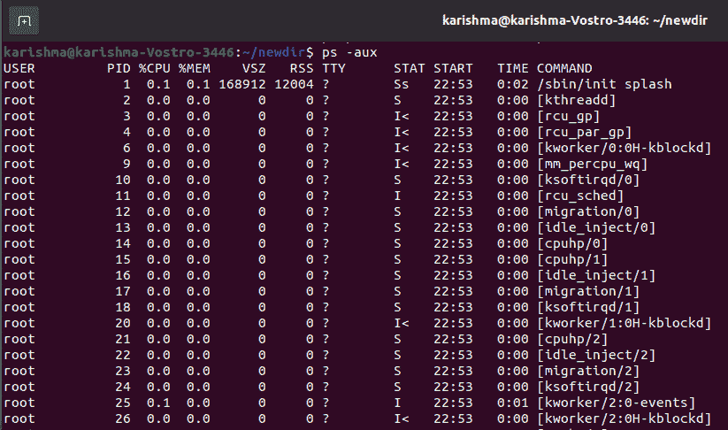

## 基本命令

下面讨论 Linux 中广泛使用的一些基本命令:

### 命令

如果我们需要创建目录或文件夹，请应用 mkdir 命令。例如，如果我们希望创建一个名为**“DIY”**的目录，那么我们可以键入**“mkdir DIY”**。

如果我们希望创建一个名为**“自制黑客”**的目录，那么我们可以键入**“mkdir DIY \黑客”**。

应用 **rmdir** 命令删除任何目录。但是， **rmdir** 命令只能用于删除空目录。删除任何目录包括文件，我们可以使用 **rm** 。

### rmdir 中的选项

*   **-帮助:**该选项将帮助打印命令的基本语法，以及可与 rmdir 命令一起应用的几个选项，并提供所有选项的简短详细信息。

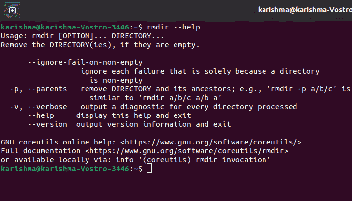

*   **rmdir-p:** 所有目录参数都是指每个组件将被删除的路径名，如果它们已经为空，则从结束组件开始。
*   **-verbose，rmdir-v:** 它显示正在处理的每个目录的详细信息。
*   **rmdir-ignore-fail-on-non-empty:**它不会报告任何仅由于目录非空而出现的故障。当命令被指定为删除任何非空目录时，它只是报告一个错误。该选项组合了这些错误消息。
*   **rmdir-version:** 可用于显示版本退出和信息。

### rm 命令

应用 **rm** 命令删除目录和文件。应用**“RM-r”**仅删除目录。如果只使用 **rm** 命令，它可以删除它包含的文件和文件夹。

### 远程管理命令中的选项

*   **rm -i:** 此选项将在删除所有文件之前确认。一些人包括 rm 别名自动做这件事(键入“别名”检查)。相反，考虑使用 rm -I，它只会在我们试图删除三个以上的文件时询问一次。
*   **rm -r:** 该选项将递归删除一个目录及其每个内容。
*   **rm -f:** 该选项会在不确认的情况下强制删除文件。当我们将 rm 别名为" rm -i "时，这是最有帮助的，但是，希望删除几个文件而不要求删除所有文件。

### 触摸命令

此命令用于创建文件。它可以是任何东西，从一个空的 zip 文件到一个空的 txt 文件。比如**“触摸 new . txt”**。它是应用于 Linux/UNIX 操作系统的标准命令。

它用于修改、更改和创建文件的时间戳。此命令用于创建没有内容的文件。触摸命令用于创建空文件。如果用户在文件创建过程中没有要存储的数据，也可以使用它。

**创建新文件的触摸命令:**我们可以一次借助一个触摸命令创建一个单独的文件。

**语法:**

```

touch file_name

```

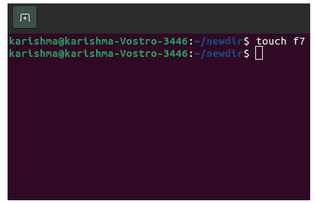

可以使用 ls 命令查看创建的文件。此外，我们可以应用长列表命令 ls -l 或 ll 命令来获取文件的更多细节。

**触摸命令创建多个文件:**触摸命令可用于一次创建多个文件。但是，这些文件在创建时将为空。

**语法:**

```

touch File1_name File2_name File3_name

```

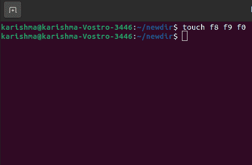

### 触摸命令中的选项

触摸命令包括几个类似于其他命令的选项。这些选项有许多用途:

**1。touch -a:** 此选项仅用于更改访问时间。-a 命令可用于更新或更改任何文件的最后修改或访问时间。

**语法:**

```

touch -a filename 

```

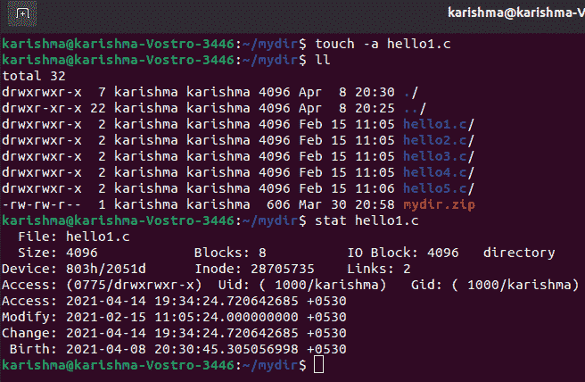

**2。touch -c:** 此选项可用于检查文件是否已贷记。在这种情况下，如果没有创建文件，就不要创建它。此外，此选项会忽略创建文件。

**语法:**

```

touch -c filename

```

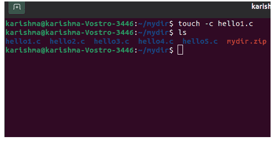

**3。touch -c-d:** 用于更新修改和访问时间。

**语法:**

```

touch -c-d filename

```

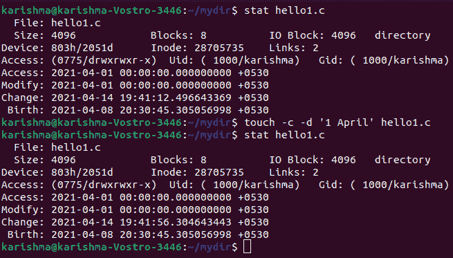

**3。touch -m:** 该选项适用于修改时间的变更。它只能更新最后的修改时间。

**语法:**

```

touch -m filename

```

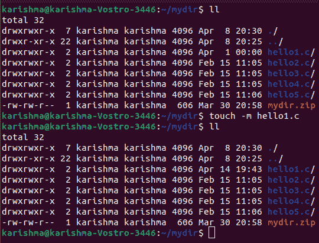

**4。touch -r:** 可用于使用其他文件的时间戳。

**语法:**

```

touch -r second_file_name first_file_name

```

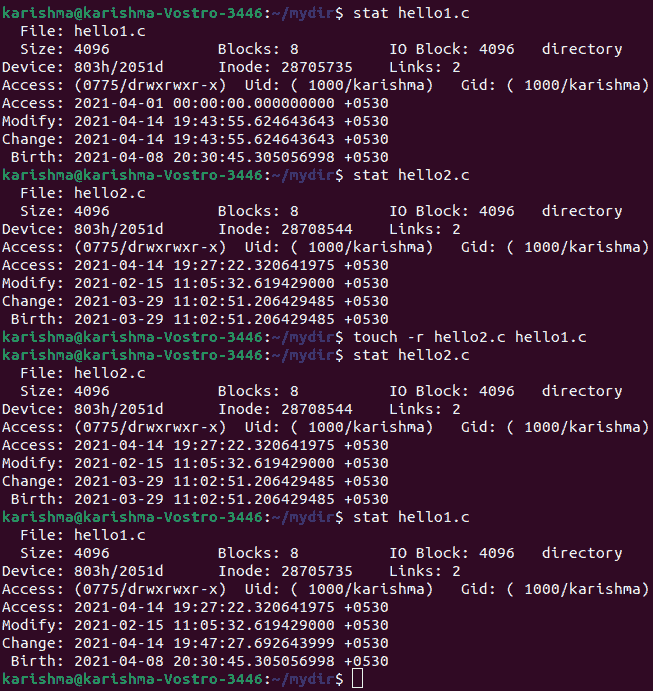

**5。touch -t:** 可应用于借助特定时间制作文件。

**语法:**

```

touch -t YYMMDDHHMM filename

```

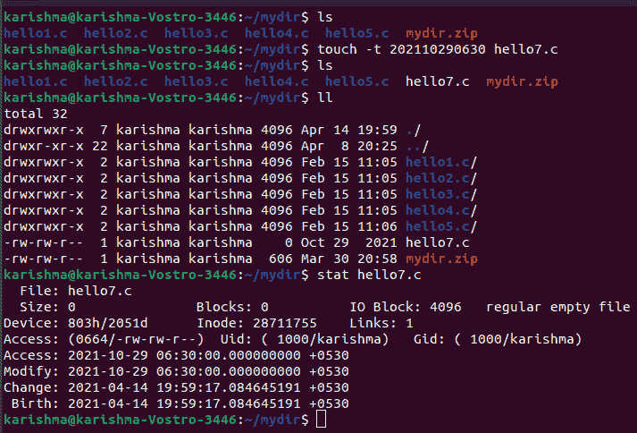

### 人类和救援指挥部

我们可以应用 **man** 命令来详细了解命令，也了解如何应用。它显示命令的手动页面。

例如，**“man cd”**显示 CD 命令的手动页面。在命令和参数中键入名称会显示该命令的使用方式(**如 cd -help** )。

它给出了命令的整体视图，包含**名称、描述、概要、选项、返回值、退出状态、文件、错误、作者、示例、版本、**和其他。

所有手册分为以下几个部分:

*   Shell 命令或可执行程序
*   库调用(程序库中的函数)
*   系统调用(内核给出的函数)
*   比赛
*   文件约定和格式(如/etc/passwd)
*   特殊文件(通常在/dev 中找到)
*   非标准内核例程
*   系统管理命令(通常仅适用于 root 用户)
*   杂项(包括宏约定和包)，例如 groff(7)

**语法:**

```

$man [OPTION] ... [COMMAND NAME]...

```

### 人工命令中的选项

**1。无选项:**显示命令的整个手册。

**语法:**

```

$ man [COMMAND NAME]

```

**示例:**

```

$ man printf

```

**输出:**

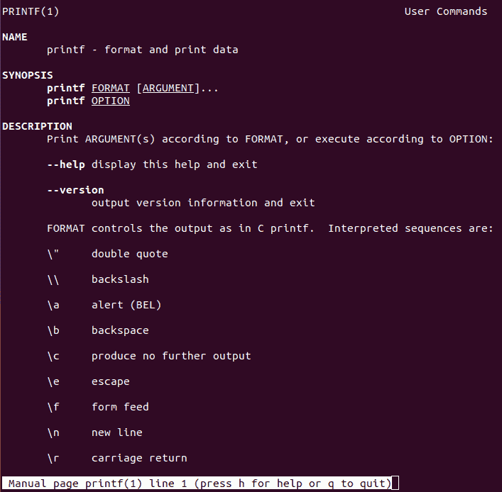

**2。章节号:**正如我们所知，手册分为多个章节，因此此命令仅用于显示手册的特定部分。

**语法:**

```

$man [SECTION-NUM] [COMMAND NAME]

```

**示例:**

```

$ man 2 intro

```

**输出:**


**3。-a 选项:**支持我们连续展示介绍手册的每一页。

**语法:**

```

$ man -a [COMMAND NAME]

```

**示例:**

```

$ man -a  intro

```

**输出:**

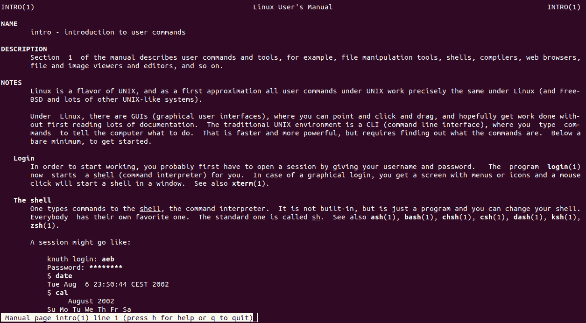

**4。-k 选项:**它可以在每个手册中搜索提供的命令作为正则表达式，并将返回所有手册页以及检测到它的章节号。

**语法:**

```

$ man -k [COMMAND NAME]

```

**示例:**

```

$ man -k cd

```

**输出:**

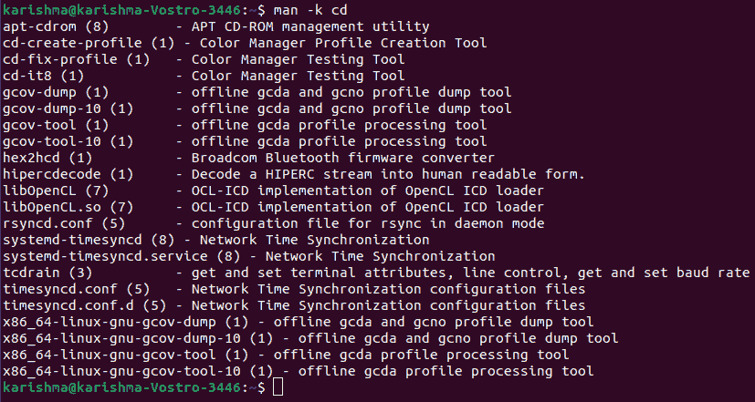

**5。-w 选项:**可以返回提供命令的手动页面可用的位置。

**语法:**

```

$ man -w [COMMAND NAME]

```

**示例:**

```

$ man -w ls

```

**输出:**

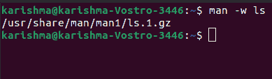

**6。-I 选项:**它检查命令是否区分大小写。

**语法:**

```

$ man -I [COMMAND NAME]

```

**示例:**

```

$ man -I printf

```

**输出:**


### cp 命令

从命令行应用 **cp** 命令复制文件。可能需要两个参数:

1.  要复制的文件位置
2.  将文件复制到哪里

cp 的完整形式是**副本**。它可以用于复制目录、文件组或文件。它可以在磁盘上创建一个类似的文件映像以及一个不同的文件名。cp 命令在其参数中需要两个文件名(至少两个)。

**语法:**

```

cp [OPTION] Source Directory 
cp [OPTION] Source Destination
cp [OPTION] Source-1 Source-2 Source-3 Source-n Directory 

```

第二和第一语法用于将源文件复制到目录或目标文件。

第三种语法可用于复制多个源文件目录。

### cp 中的操作模式

cp 命令可以在三种基本操作模式下实现，这些操作取决于 cp 命令内部传递的参数的类型和数量:

**1。两个文件名:**当命令包含文件名时，会将第一个文件的内容复制到第二个文件。当第二个文件不存在时，它将创建一个并将内容复制到其中。

```

cp Src_file Desk_file

```

**2。多个参数:**在多个参数的情况下，描述文件名并跟随这些参数(描述目录名的参数，则该命令会将所有源文件复制到它们的目标目录以及一个类似的名称)在不可用但已经可用时会被覆盖。

```

cp Src_file1 Src_file2 Src_file3 Desk_directory

```

**3。两个目录名:**CP 命令将每个源目录文件复制到目标目录。如果 cp 命令由两个目录名组成，它会创建所需的任何目录或文件。这个操作需要一个额外的选项(通常是 R)来指示目录的递归副本。

### cp 命令中的选项

有几个选项可供选择。我们将解释一些有用的选项。

**1。-i 选项:**该选项表示**交互复制**。系统将在覆盖目标文件之前警告用户。cp 命令可以提示响应，当我们单击 y 时，它将覆盖文件。

**示例:**

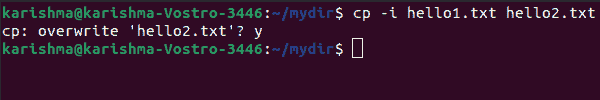

**2。-b 选项:**该命令可以在具有不同格式和名称的类似文件夹中创建目标文件的备份。

**示例:**

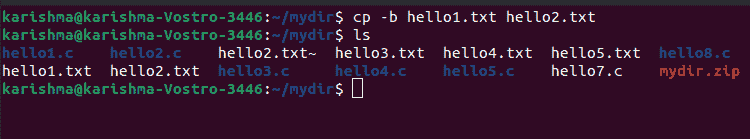

**3。-f 选项:**代表**力**。有时系统无法使用 cp 命令打开目标文件进行写操作。在这种情况下，-f 选项找到目标文件，并将内容从源文件复制到目标文件。

**示例:**

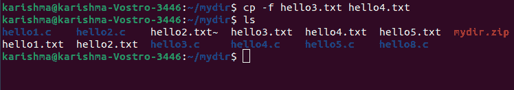

**4。-R 或-r:** 用于复制目录结构。co 命令通过递归复制整个目录结构来显示该选项的递归性质。

**示例:**

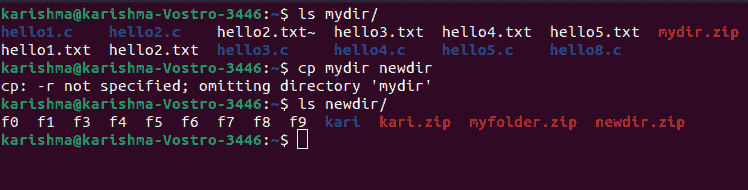

**5。-p:** 代表禁猎区。使用此选项，cp 命令可以保留相关目标文件中所有源文件的以下特征:上次数据更改时间、上次访问时间、文件的权限位和所有权。

#### 注意:我们应该是系统的根用户，以保存特性，否则特性会改变。

**示例:**

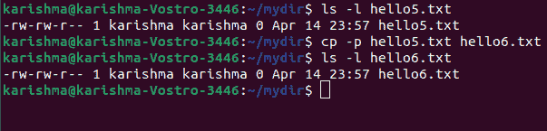

### 命令 mv

从命令行应用 **mv** 命令移动文件。此外，我们可以应用 **mv** 命令来重命名任何文件。假设我们希望将文件**“文本”**重命名为**“新”**，那么我们可以应用**“mv 文本新”**。这将需要两个类似于 **cp** 命令的参数。意思是移动。该命令包括以下两种不同的功能:

*   它可以重命名文件夹或文件。
*   它可以将一组文件移动到不同的目录。

重命名时，磁盘上不会消耗额外的空间。通常情况下，这个命令是无声的。它定义没有提示确认。

**语法:**

```

mv [Option] source destination

```

**示例:**

### mv 命令中的选项

**1。-i 选项:**表示**互动**。该选项可以使命令在移动文件之前请求用户授权，该文件将像 cp 命令一样覆盖现有文件。我们需要点击确认移动。

当文件不存在时，此选项不实现。它只是将它移动或重命名到一个新的位置。

**示例:**

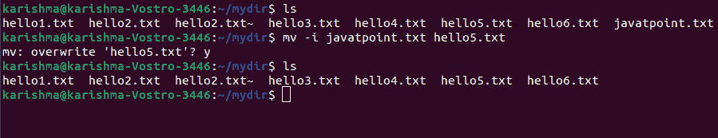

**2。-n 选项:**代表不吃零食。使用-n 选项，mv 命令可防止现有文件被覆盖。

**示例:**

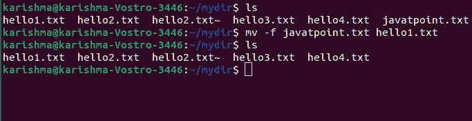

**3。-b 选项**:使用该选项可以更容易地保留现有文件的备份，该文件将由于 mv 命令的结果而被覆盖。它将制作一个备份文件，并附加一个波浪号(~)字符。

**示例:**

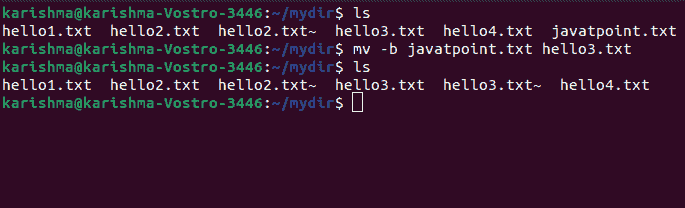

**4。-版本:**可以用来显示我们系统当前正在执行的 mv 命令的版本。

**示例:**

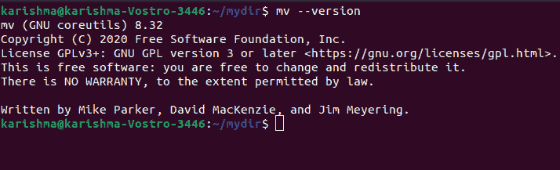

### 定位命令

该命令用于在 Linux 系统中定位文件，类似于在 Windows 中(搜索命令)。当我们不知道文件存储在哪里或文件的实际名称时，**定位**命令很有帮助。

使用命令应用 **-i** 参数支持避免大小写(不管是小写还是大写)。因此，如果我们想要一个包含单词**“约翰”**的文件，当我们在**“定位-我约翰”**中键入时，它会提供我们的 Linux 系统中包含单词**“约翰”**的每个文件的列表。

如果我们记住了两个单词，那么我们可以借助一个**星号(*)** 来孤立它们。比方说，要定位任何包含单词**【约翰】**和**【强尼】**的文件，我们可以应用命令**“定位-我*约翰*强尼”**。

实用程序 locate 比 find 命令更快、更好，因为如果启动文件搜索，它将通过数据库查找文件系统。数据库包括文件的部分和位以及它们在我们系统上的相关路径。默认情况下，locate 命令不会检查在数据库中检测到的文件是否仍然可用。

**语法:**

```

locate [OPTION]... PATTERN...

```

**定位命令的退出状态:**如果检测到任何描述的匹配，定位命令以 0 状态退出。当没有检测到匹配或遇到任何致命错误时，它以 1 状态退出。

### 定位命令中的选项

1.  **-basename，-b:** 它只将基的名称与描述的模式进行匹配，而描述的模式是-wholename 的反义词。
2.  **-count，-c:** 我们可以只写匹配的条目，而不是在标准输出上写文件名。
3.  **-数据库 DBPATH，-d:** 用 DBPATH 替换数据库(默认)。它是数据库文件名的冒号(:)分隔列表。当描述多数据库选项时，最终路径将是独立路径的添加。默认数据库将替换数据库的空文件名。数据库文件名也称为**标准输入**。

#### 注意:通过标准输入，数据库可以只读一次。

4.  **-existing，-e:** 它只打印在执行定位期间分配给可用文件的条目。
5.  **-跟随，-L:** 它在检查文件是否可用时跟随尾随符号链接(如果描述了-existing 选项)。该选项是默认的。可以借助-nofollow 选项描述相反的情况。
6.  **-help，-h:** 在标准输出上写下已有选项的总结，成功退出。
7.  **-忽略大小写，-i:** 如果匹配模式，忽略大小写会有所区别。
8.  **-mmap，-m:** 它被忽略，但是为了与 GNU 和 BSD 定位兼容而添加。
9.  **-n LIMIT，-limit，-l:** 检测到 LIMIT 条目后成功退出。此外，当描述-count 选项时，最终计数被限制为 LIMIT。
10.  **-H，-nofollow，-P:** 检查可用文件时(如果描述了-existing 选项)，我们不应该跟随尾随符号链接。该选项与-follow 选项相反。
11.  **-null，-0:** 借助 ASCII NUL 字符在标准输出上隔离条目，而不是将所有条目都写在一个隔离行上。该选项是使用 GNU xargs-null 选项为互操作性开发的。
12.  **-statistics，-S:** 将所有读取数据库的统计信息写入标准输出，而不是查找每个文件并成功退出。
13.  **-quiet，-q:** 指定在处理和读取数据库期间没有遇到错误的消息。
14.  **-正则表达式:**该选项用于像扩展正则表达式一样解释每个模式。
15.  **-stdio，-s:** 为了与 GNU 和 BSD 定位兼容，该选项被忽略。
16.  **-版本，-V:** 在标准输出上写入定位和版本的许可信息，成功退出。
17.  **-全名，-w:** 它只将路径的全名与描述的模式进行匹配。-wholename 选项是默认的。可以借助-basename 选项描述相反的情况。

### 定位命令示例

**命令查找特定名称的文件:**

```

$ locate note.txt

```

上面的命令在特定的目录中查找 note.txt。

**将搜索查询限制在一个特定的数字内:**

```

$ locate "*.html" -n 10

```

上面的命令将显示以. html 结尾的文件的 10 个搜索结果。

**显示匹配的条目编号:**

```

$ locate -c [.txt]*

```

上面的命令统计了以. txt 结尾的文件。

## 中间命令

下面列出并讨论了一些最常用的中间命令:

**1。echo:****echo**命令支持我们将一些数据、文本移动到文件中。例如，如果我们希望创建一个新的文本文件或包含一个已经创建的文本文件，那么我们只需要键入“**”echo hello，我的名字是 John>>new . txt”**。

我们不需要在这里用反斜杠分隔空格。这是因为如果我们结束我们需要指定的内容，我们将放入两个三角括号中。

**示例:**

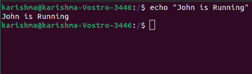

**2。cat:** 该命令代表**连接**。它允许我们创建单个或多个文件，连接文件，文件的视图内容，重定向文件或终端的结果。

我们可以应用 **cat** 命令来显示文件内容。通常，它用于轻松观看节目。 **cat** 命令可以使用文件读取数据，并提供数据内容。

*   **查看单个文件的命令:**

```

$cat filename

```

*   **查看多个文件的命令:**

```

$cat f1 f2

```

*   **查看文件内容的命令，在行号**之前

```

$cat -n filename

```

*   **创建文件的命令:**

```

$cat >newfile

```

*   **Cat 命令可以使用 tac 命令以相反的顺序显示内容**

```

$tac filename

```

*   **高亮显示线端的命令**

```

$cat -E "filename"

```

**示例:**

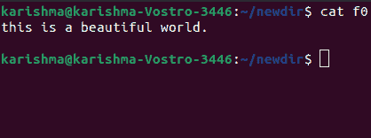

**sudo:** 是 Linux 终端内部最常用的命令。它代表“超级用户”。

因此，如果您希望一个命令以 root 或管理权限实现，我们可以应用这个命令。比方说，如果我们希望编辑任何需要根权限的文件，如 viz.alsa-base.conf，我们可以应用 sudo nano 也-base.conf 命令。我们可以用“sudo bash”命令应用根命令行。

此外，我们可以使用“su”命令来实现这一点，但是我们需要在此之前为 root 用户修改一个密码。我们可以使用“sudo 命令”命令。之后在里面输入新的根密码。

**示例:**

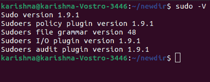

**df:** 我们可以应用 df 命令来查看系统中所有分区内已有的磁盘空间。

我们只能在终端中键入 df 命令，并且我们可以看到所有已安装的分区以及它们的可用/已用空间，单位为 KBs 和%。如果我们希望它显示在 MBs 中，我们可以应用“df-m”命令。

**示例:**

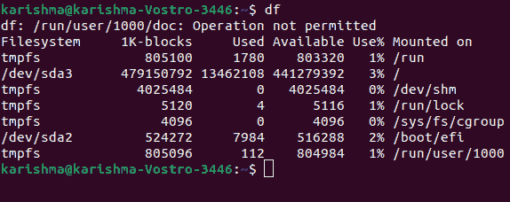

**du:** 我们可以应用 du 命令来了解我们系统中文件的磁盘使用情况。如果您希望了解 Linux 中特定文件或文件夹的磁盘使用情况，我们可以在 df 命令中键入文件或文件夹的名称。

例如，如果我们希望了解 Linux 中文档文件夹所使用的磁盘空间，我们可以应用“du Documents”命令。此外，我们可以应用“ls-lah”命令来查看文件夹中每个文件的大小。

**示例:**

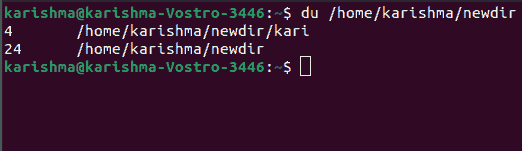

**tar:** 我们可以使用 tar 命令来处理 Linux 终端内部的 tarballs。它包括一长串用户。

它可以用于压缩和解压缩不同类型的档案，如. tar.bz2、. tar.gz、.焦油等。它基于提供给它的各种参数运行。让我们说" tar -cvf "来创建一个. tar 档案，使用-xvf，-tvf 来取消 tar 档案，列出档案内容，等等。

**示例:**

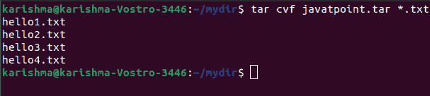

**unname:** 我们可以使用 unname 命令来显示我们的 Linux 发行版正在执行的系统的信息。unname -a 命令可以打印系统的大部分细节。它可以打印处理器类型、版本、内核发布日期。

**示例:**

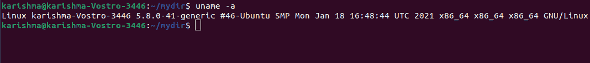

**zip 和解压:**我们可以使用 zip 命令将文件压缩到 zip 存档中，通过 zip 存档解压文件。

**邮编示例:**

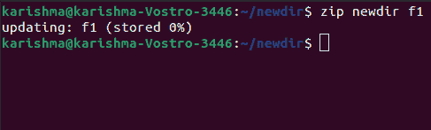

**解压示例:**

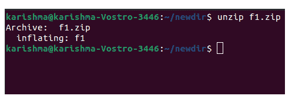

**jed、vi、nano:** vi、nano 是安装在 Linux 终端内部的文本编辑器。nano 命令是一个更好的文本编辑器，它使用颜色来指示关键词，并且可以诊断大多数语言。vi 命令比 nano 命令更容易。我们可以用这个编辑器创建一个新文件或更改文件。

假设我们需要创建一个名为“create.txt”的文件，我们可以通过“nano create.txt”命令来实现。编辑后，我们可以在序列 Ctrl+X 的帮助下保存我们的文件，然后是 y。对于 HTML 编辑，Nano 命令似乎并没有因为它的颜色而变得更好，这就是为什么我们推荐 jed 文本编辑器。

**apt-get:** 我们可以使用 apt 命令来处理 Linux 终端内部的各种包。此外，我们可以使用 apt-get 命令来安装包。

它需要根权限；因此，我们可以对其应用 sudo 命令。假设，如果我们希望安装一个 jed 文本编辑器，我们可以在“sudo apt-get install jed”命令中输入。

类似地，可以像这样安装各种包。每次我们尝试安装任何新的软件包时，更新我们的存储库是很好的。我们可以通过使用“sudo apt-get update”命令来做到这一点。

我们可以使用“sudo apt-get upgrade”命令来升级我们的系统。此外，我们可以通过使用“sudo apt-get dist-upgrade”命令来升级我们的发行版。

“apt-cache search”命令可用于搜索任何包。如果我们希望搜索一个，我们可以使用“apt-cache search jed”命令(它不需要 root)。

**示例:**

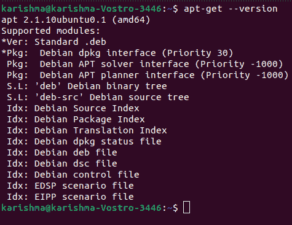

* * *