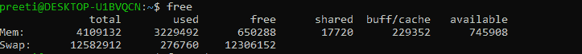
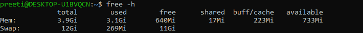
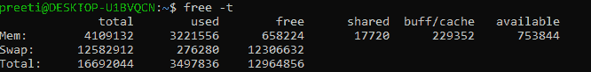
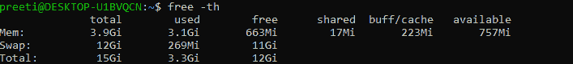
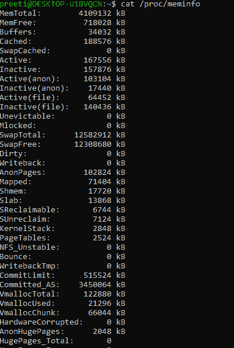
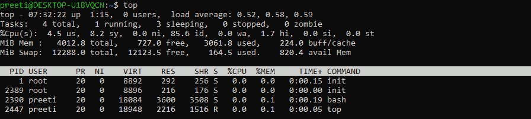

# 如何在 Linux 中检查内存

> 原文：<https://www.javatpoint.com/how-to-check-ram-in-linux>

随机存取存储器是 Linux 系统的重要组成部分，必须对其进行严密监控。在某些情况下，我们可能会耗尽内存，对服务器的响应速度非常慢，或者完全没有响应。

因此，知道如何在 [Linux](https://www.javatpoint.com/linux-tutorial) 上检查你的内存是至关重要的，因为我们可能会采取保护措施，而不是正确的措施。

我们可能还需要增加交换内存，也称为虚拟内存，以便提高服务器的性能。

现在，我们讨论一下在 Linux 中检查我们的[内存](https://www.javatpoint.com/ram-full-form)的方法:

## 免费检查 Linux 上的内存

借助自由命令，我们可以在 Linux 上查看我们的 [RAM](https://www.javatpoint.com/ram) ，自由命令是最流行的命令。

### 自由命令的语法:

```

$ free

```



在上图中我们可以看到，输出分为两类:内存(实际的 RAM)和交换(也称为虚拟内存)。

在 free 命令的帮助下，我们可以提供以下信息:

*   **总计:**术语**总计**是指当前安装在我们系统上的内存总量，单位为千字节。
*   **使用:**术语**使用的**是指我们当前在系统上使用的内存量，单位为千字节。
*   **空闲:**术语**空闲**是指我们系统上可用的内存量，以千字节为单位。
*   **shared:** 它代表 tmpfs 使用的内存，tmpfs 是一个虚拟文件系统，它看起来是挂载的，但属于易失性内存。
*   **缓冲区:**内核缓冲区使用的内存称为缓冲区。
*   **cache:** cache 是页面缓存使用的内存数量，数据在写入磁盘之前可以首先存储在页面缓存中。
*   **可用:**系统上可用的内存量(以千字节为单位)称为可用。

然而，我们必须注意的一点是，缓冲区或高速缓存可以使用大量内存；如果我们的系统需要额外的内存用于进程，那么内核可以释放这些空间。就像 lsblk 命令一样，free 命令也可以以人类可读的格式显示。

我们可以将 free 命令与选项 **-h、**一起使用，以便使用人类可读的格式检查当前可用的内存。

### 语法:

```

$ free -h

```



我们可以看到上面的输出很容易阅读，但它是四舍五入的。

同样，使用 free 命令，我们可以显示 total 列来检查系统上可用的 RAM 和交换空间。

为了显示总计列，我们可以使用**“自由”**命令以及选项**“-t”**

### 语法:

```

$ free -t

```



我们还可以组合该命令来获得人性化的输出以及显示的总列数。

**语法:**

```

$ free -th

```



## 检查/处理/记忆信息以检查内存

众所周知，内核是虚拟化文件系统并为我们系统上的一些设备提供入口点的内核。

例如， **/proc** 目录可以存储对我们系统进程的引用(即文件描述符)；相应地，/dev 可以存储对虚拟设备的引用，这些引用最终指向真实的磁盘。

虽然，当我们谈论检查我们的内存时，一个 **/proc** 文件可能比其他文件更重要: **meminfo。**

### 语法:

```

$ cat /proc/meminfo

```



我们可以在上面的输出中看到；内核显示的统计信息类似于“free”或“vmstat”命令显示的统计信息。

在/proc/meminfo 文件的帮助下，我们可以访问系统的总内存量。空闲内存、可用缓冲内存和可能使用的页面缓存。

最后，我们可以访问交换缓存，也可以使用活动和非活动交换。

## 使用顶部命令检查内存使用情况

在 **top** 命令的帮助下，我们可以看到与系统上每个进程的内存利用率相关的所有信息。每个 Linux 系统中都已经安装了 **top** 命令。如果没有预装，我们可以借助 **apt** 命令进行安装。通过使用以下语法，我们可以运行 **top** 命令:

```

$ top

```



仔细看% mem 栏。如果我们希望看到使用过多内存的进程，请输入 **Shift + m** 。它会根据**顶部**的内存利用率来缩短程序。这就是 **top** 命令的优势，我们可以快速监控系统的内存利用率。我们可以输入 **q** 以便从顶部菜单退出。

## 使用 htop 命令检查内存使用情况

当我们运行 htop 命令时，这将向您显示与 RAM 安装相关的整体信息，其中它不断更新统计数据，并向您显示每个进程使用了多少内存。

它不像一个自由的命令；默认情况下，htop 实用程序并不总是安装在我们的 Linux 系统上。尽管在下面命令的帮助下，我们可以安装它:

```

$ sudo apt install htop

```

当 htop 命令的安装完成后，我们可以使用以下语法在终端上运行它:

```

$ htop

```


Htop 命令是每个 Linus 发行版的免费的基于 ncurses 的进程 GPL 查看器。它和 top 命令一样，只是在 htop 命令中，我们可以垂直滚动，也可以水平滚动；因此，它提供了与系统上运行的每个进程相关的完整命令行的全部信息。

* * *