# Linux 用户列表

> 原文：<https://www.javatpoint.com/linux-list-users>

在任何时候，不止一个用户可以访问一个单独的计算机系统。对于这些类型的分布式系统，系统管理员应该采取准确的安全措施，这样用户就不能侵犯他人的隐私。

例如，

使用访问控制机制，定义所有用户的权限。

用户权限的修改可能是强制性的。例如，用户可能需要为特定任务而增长的权限，或者特定用户访问系统的能力可能必须完全撤销。

在这些类型的场景中，系统管理员必须对系统的每个用户有足够的了解。

在本主题中，我们将探索用于列出 [Linux 操作系统](https://www.javatpoint.com/linux-tutorial)的用户的技术。基于**命令行界面的技术和基于**图形用户界面的技术都可以用于该操作。****

## /etc/passwd 文件

用户的详细信息存储在/etc/passwd 文件中。该文件是纯文本文件。因此，我们可以使用 cat 或更少的命令来读取这个文件。

在这个文件中，每一行都包括关于那个特定用户的各种细节，用冒号(:)隔开。

一行包含以下由冒号(:)分隔的详细信息。

*   用户名
*   密码
*   情报总部(General Intelligence Division)
*   用户界面设计（User Interface Design 的缩写）
*   主目录路径
*   用户详细信息
*   默认外壳

**用户名-** 是用户的登录名。它不能有空格或其他独特的字符。只有字母数字字符是允许的。

**密码-** 密码保存在基于 Linux 的操作系统中的/etc/shadow 文件中。

**GID-** 所有组都有一个数字标识和一个组名，在基于 Linux 的操作系统中称为 GID 或组标识。Linux 上的所有用户至少应该是一个组的成员。

因此，对于创建的所有用户，该组也与用户名具有相似的名称。然后用户被添加到组中。主组的组标识将添加到该特定字段中。该主要组是用户的组(默认)。

当用户是几个组的成员时，她/他可以在使用 newgrp 命令登录时对其进行修改。GUD 从普通群体的 1000 开始。

如果我们的 Linux 没有专门配置，组标识必须与 UID 相似。

#### 注意:根组包含 GID 0。

**UID-** 所有用户都有一个数字标识和用户名，或者一个字母数字名称，称为 UID 或用户标识。对于普通用户，UID 从 1000 开始，根用户包含 UID 0。

**主目录路径-** 它包含每个用户文件将被保存的目录的路径。通过该字段设置一个 shell 变量$HOME。

**用户详细信息-** 它以逗号分隔列表的形式包含用户的完整名称和其他详细信息。这个步骤最基本的用途之一是设置用户的全名。只需在这里输入我们用户名的全名，就可以设置了。

**默认 Shell-** 我们应该为基于 Linux 的系统上的用户准备一套 Shell。默认情况下，必须为能够登录系统的用户设置 **bash** 和 **sh (/bin/sh)** shell。然而，也有像 csh，zsh 等其他外壳。

系统用户拥有 **/sbin/nologin** 套壳；因此，他们将无法登录系统。如果我们希望禁用少数用户的登录过程，请将这些类型用户的此字段设置为/sbin/nologin。

### 根据用户的姓名对其进行排序和列出

我们可以按字母顺序对用户进行排序和列表。为此，我们将应用前面的命令，并包括排序命令。

命令如下:

```

$ cut -d: -f1 /etc/passwd | sort

```

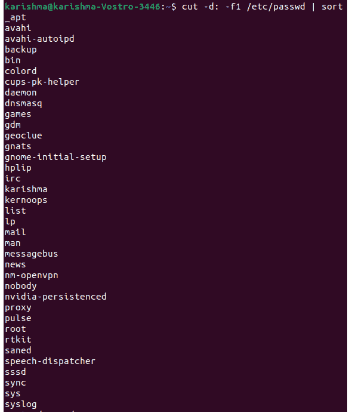

使用上述命令后，用户将按顺序显示。

### 列出没有密码的用户

有必要了解那些没有密码的用户，并采取必要的措施。对于列出没有任何密码的用户，我们可以应用以下命令:

```

$ sudo getent shadow | grep -Po '^[^:]*(?=:.?:)'

```

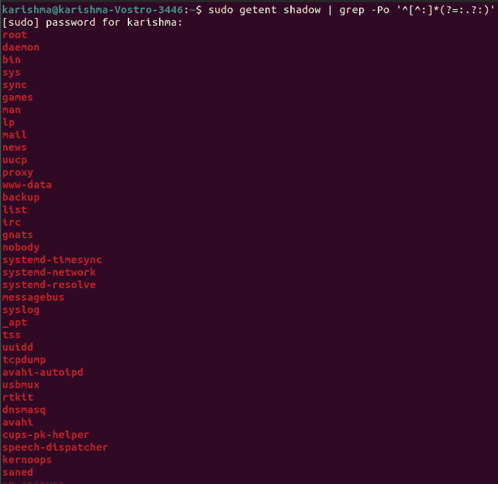

使用上述命令后，我们将获得没有密码的用户列表。

### 通过磁盘使用情况列出用户

如果我们有一个很大的目录，并且我们希望知道哪个用户正在溢出它，我们可以应用 **du** 命令来获取磁盘使用情况。

使用此命令，我们可以找到哪些用户正在破坏磁盘空间。

命令如下:

```

$ sudo du -smc /home/* | sort -n

```


使用上述命令后，我们将获得通过目录/主目录的磁盘使用情况排序的用户列表。

### 列出记录的用户(当前)

我们有很多方法来列出登录的用户(目前)。在第一种方式中，我们可以应用用户命令:

```

$ users

```

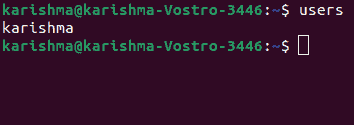

上面的命令将列出用户以及系统中打开的会话。

不过，这个信息有点常见。但是，我们有提供更多细节的其他命令。简单来说，命令就是 w。

```

$ w

```

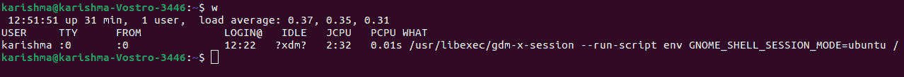

我们将获得更多细节，如会话开始的确切时间和终端会话可用的时间。

现在，又有一个命令被称为 **who** 。这个命令存在于整个 UNIX 家族中。因此，我们可以将其应用于另一个系统，如 FreeBSD。

```

$ who

```

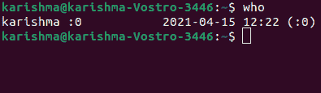

使用上面的命令，我们还有一些关于当前登录用户的详细信息。我们可以包含 **-a** 选项，并显示每个细节。

```

$who -a

```

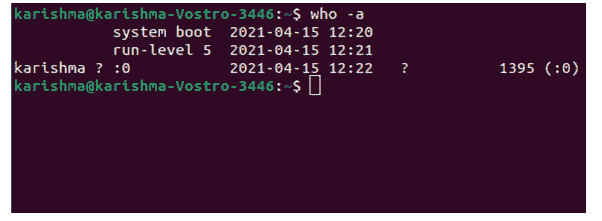

### 列出记录的用户(最近)

我们研究了如何获取当前登录的用户，但是列出用户的登录历史呢？

我们可以应用最后一个命令来获取登录的更多细节:

```

$ last

```

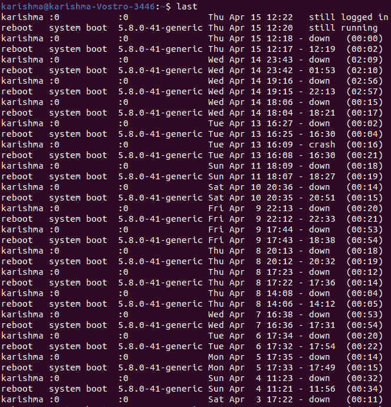

此外，我们可以使用以下命令获取特定用户的登录信息:

```

$ last [username]

```

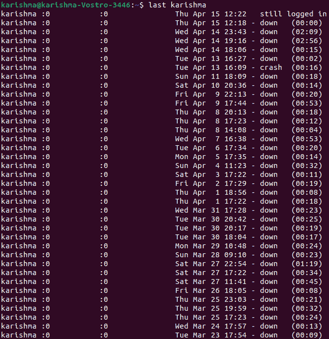

### 列出用户在特定时间或日期的登录

为此，我们可以使用-t 参数应用最后一个命令:

```

$ last -t YYMMDDHHMMSS

```

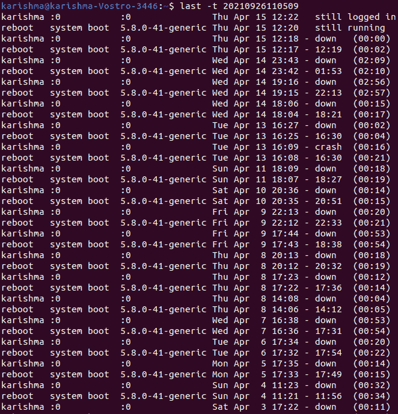

我们所要做的就是选择一个确切的时间和日期来列出在那个特定时间登录的人。

### 列出根用户

通常，在 Linux 操作系统中只有一个根用户。当有几个时，那么如何列出它们？

为此，我们可以应用以下命令:

```

$ grep 'x:0:' /etc/passwd

```

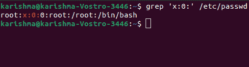

我们可以使用上面的命令过滤文件，让用户与零 UID 根用户相处。

检查/etc/group 文件的另一种方法:

```

$ grep root /etc/group

```

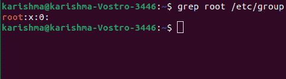

在这里，我们将通过/etc/passwd 文件获取组路由中的用户。

我们还可以通过检查文件来检查任何用户何时可以作为根用户运行命令:

```

$ cat /etc/sudoers 

```

### 列出组中的每个用户

在 Linux 中，列出一个组的用户有两种重要的方法。让会员通过 ***/etc/group*** 文件最直接最简单的方法如下:

```

$ cat /etc/group | grep group1

```

上面的命令将列出 group1 组中的成员。

第二种方法是在基于 Debian 的发行版中应用命令，比如成员的命令。默认情况下，它不会安装在 Linux 发行版中。

### 列出用户数量

在 Linux 中，为了列出用户的数量，我们可以在 **wc** 命令的帮助下计算 ***/etc/passwd*** 文件中的行数，如下所示:

```

$ cut -d: -f1 /etc/passwd | wc -l

```

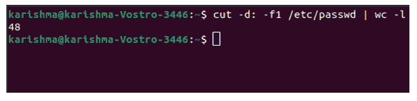

上述命令将为我们提供常规用户和系统用户。

### 获取 sudo 用户

Linux 系统包括一个名为 sudo 的实用程序，它允许我们运行命令，就像我们是另一个用户，通常是根用户一样。

必须在专业环境中小心管理。

知道哪个用户可以执行 sudo 命令也是非常重要的。列出与 sudo 组相关的用户就足够了。

```

$ members sudo

```

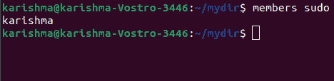

该组中的用户可以作为超级用户运行命令。

### 列出具有 SSH 访问权限的用户

SSH 允许用户访问网络上的远程计算机。这种方法是安全的，是作为远程登录的替代品开发的。

默认情况下，每个普通用户都可以登录和访问 SSH。如果我们希望限制它，我们可以应用 SSH 的配置文件(/etc/ssh/ssh_config)，并包含以下指令:

```

AllowUsers user1 user2 user3

```

我们还可以允许组，而不是只允许用户应用 AllowGroups 指令:

```

AllowGroups group1 group2 group3

```

这些类型的指令指定谁可以使用该服务。我们不应该忘记重启 SSH 服务。

### 列出有权访问目录或文件的用户

我们可以通过两种方法提供多个用户权限来修改或访问目录和文件。

在第一种方法中，我们可以将用户添加到一组目录或文件中。

我们可以在成员工具的帮助下获取组成员。

但是，当我们希望该用户只能访问该特定文件(而不是每个组的权限)时，该怎么办呢？

为此，我们可以在 setfacl 命令的帮助下使用这个特定文件的 ACL，如下所示:

```

$ setfacl -m u:newuser:rwx test

```

这里，我们为名为**新用户**的用户提供名为**测试**的文件的认证。它充当读取、写入和执行的身份验证。

现在，所有者可以修改或访问该文件。该用户被称为**新用户**。因此，如何列出它们？

在 getfacl 命令的帮助下，我们可以获得它们:

```

$ getfacl test

```

我们可以使用上面的命令获得每个拥有该文件的身份验证以及相关权限的用户。

### 列出禁用(锁定)的用户

作为 Linux 操作系统中的安全措施，我们可以锁定任何用户。当不确定用户是否实施了错误的东西时，这是一种预防措施，我们不希望完全删除用户，只锁定他们进行调查。

我们可以应用以下命令来锁定用户:

```

$ usermod -L user1

```

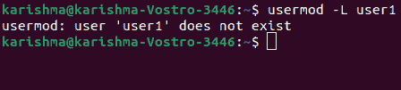

应用上述命令后，名为 user1 '的用户将不再能够使用或登录系统。

### 列出远程用户(LDAP)

我们可以使用一个名为 **getent 的命令列出远程和本地用户。**

```

$ getent passwd

```

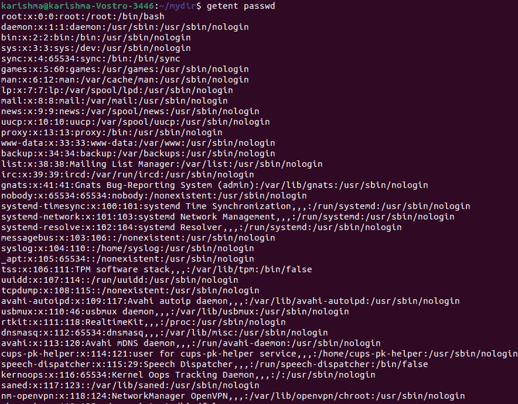

上述命令将列出 NIS 或 NDAP 用户以及本地系统用户或其他网络用户。

我们可以用类似的方式将这个命令的结果传递给上面提到的命令。

getent 命令还可以列出一个组的帐户，如下所示:

```

$ getent group

```

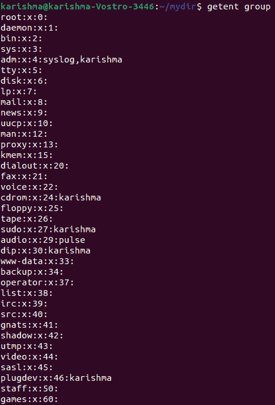

我们可以查看该命令的手册页，以了解该命令可以在其中找到的其他数据库。

## 列出用户的技术

### 技巧 1:“猫”命令

我们可以在命令行中列出每个用户，使用 cat 命令在 Linux 的文件/etc/passwd 中显示每个用户的密码和帐户详细信息。

要在 Linux 操作系统中应用 cat 命令列出每个用户，必须按顺序执行以下步骤:

*   启动终端。
*   执行以下命令。

```

$ cat /etc/passwd 

```

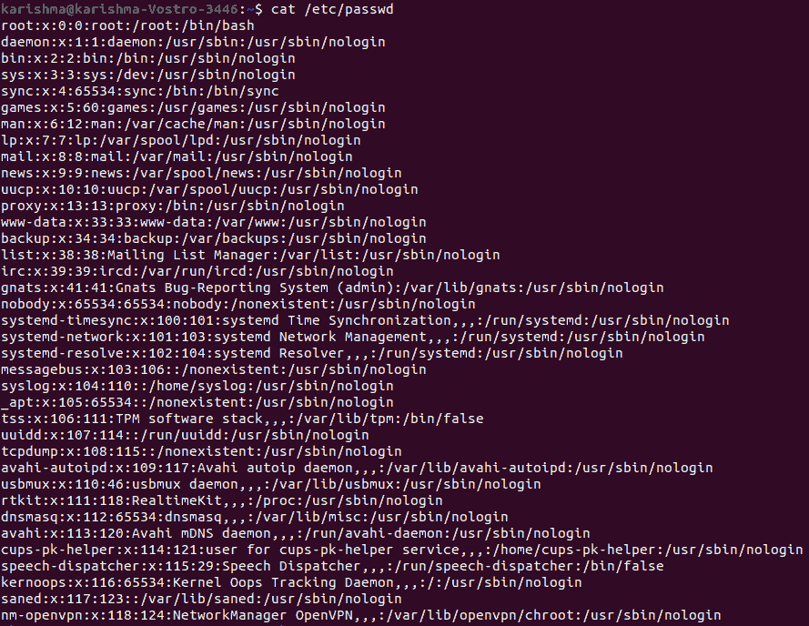

运行该命令将显示用户名和一些其他信息。我们可以滚动这个列表来查看 Linux 操作系统的每个用户。

### 技术 2:“awk”命令

如果我们想只显示用户名，这个命令很有用，如果我们不需要使用 cat 命令返回任何技术信息，这个命令可能会有帮助

要应用这个命令列出 Linux 中的每个用户，必须按顺序执行以下步骤。

*   启动终端。
*   执行以下命令:

```

$ awk-F: '{ print $1}' /etc/passwd

```

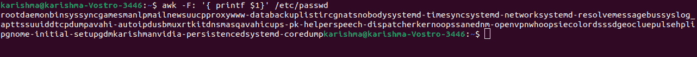

当我们在终端执行这个命令时，我们将只接收用户名。此外，这个列表包含了我们 Linux 系统的每个用户。

### 技术 3:“compgen”命令

compgen 命令仅用于显示用户名，它避免了所有其他信息。

T

o 应用 compgen 命令列出 Linux 的每个用户，必须按顺序执行以下步骤:

*   启动终端。
*   执行以下命令:

```

$ compgen -u

```

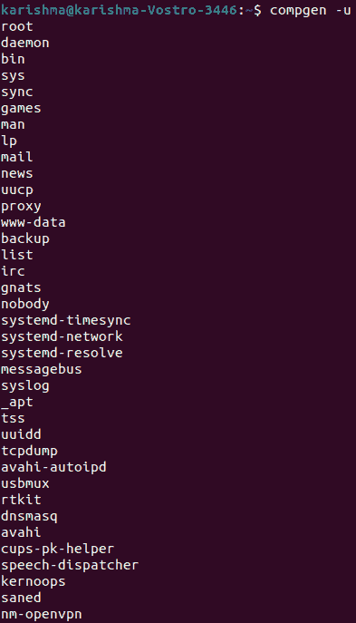

我们将使用这个命令将每个用户名与我们的 Linux 操作系统连接起来。

### 技术 4:“getent”命令

cat 命令的结果与 getent 命令的结果非常相似，因为它显示了用户名的几个细节。

要应用 getent 命令列出 Linux 中的每个用户，必须按顺序执行以下步骤:

*   启动终端。
*   执行以下命令:

```

$ getent passwd

```


上面的命令将列出我们 Linux 系统的每个用户以及一些其他信息。

* * *