# Linux 查找文件

> 原文：<https://www.javatpoint.com/linux-find-file>

Linux 中的 **find** 命令是一个强大的工具，允许系统管理员基于大量的搜索技术来管理和定位目录和文件。

它可以通过**类型、名称**或**权限、大小、扩展名**等来搜索文件和目录。

除了定位目录和文件之外，将 find 命令与其他命令相关联还允许我们对结果采取行动。包含-exec 选项允许系统管理员执行外部命令，并执行操作，如**移动、删除、复制、**或**修改符合所述标准(如名称、大小等)的文件权限。**

find 命令在基于**用户提供的表达式**的目录层次结构中搜索各种目录和文件。它可以在所有匹配的文件上实现用户特定的操作。此外，我们可以添加各种其他工具，如 sed 或 grep。

### 语法-

Linux find 命令的基本语法如下:

```

find {path} {name of the file or directory to search} {action to take}

```

哪里，

1.  **路径**描述目录。
2.  **要搜索的文件或目录的名称:**要搜索的文件名或目录
3.  **要采取的动作:**如移动、删除、复制等。

## 查找命令中的选项

“查找”命令中有各种选项。一些重要的选项讨论和解释如下:

1.  **-exec CMD:** 找到一个文件，该文件符合 find 命令的标准，并且由于其成功执行命令的退出状态而返回零。
2.  **-ok CMD:** 它的实现类似于-exec 选项，只是首先诱导用户。
3.  **-链接 N:** 它查找文件以及‘N’个链接。
4.  **-inum N:** 它查找文件以及索引节点‘N’号。
5.  **-较新的文件:**它找到在“文件”之后创建/修改的文件。
6.  **-名称演示:**它查找“演示”描述的文件。
7.  **-print:** 它显示了借助于其余文件条件搜索的文件路径名。
8.  **-perm 八进制:**权限为“八进制”时查找文件。
9.  **-大小+N/-N:** 它查找“N”个块文件。在这个选项中，“c”后面的“N”可以用来测量字符的大小。-' N '定义尺寸< 'N '块和'+N '定义尺寸> 'N '块。
10.  **-空:**查找空目录和文件。
11.  **-用户名:**它查找由 ID 'name '或用户名拥有的文件。
12.  **！expr:** 当‘expr’为假时返回真。
13.  **\(expr \):** 当‘expr’为真时返回真。它用于对与“与”或“或”相关联的标准进行分组。

## 查找目录和文件

### 按扩展名或名称查找特定文件

要搜索特定的文件，我们可以通过根目录(/)执行下面的命令。该命令包括我们正在查找的文件的匹配名称。

```

find . -name hello1.txt

```

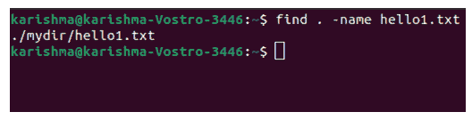

记住，结果包含路径。当我们不知道文件所在的目录时，或者当它位于多个位置时，这很重要。

我们还可以在其他目录中找到文件，同时仍然在当前位置。我们需要为我们希望搜索的目录提供路径。

```

find ./mydir -name hello1.txt

```

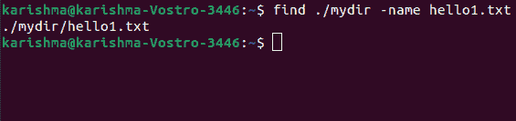

## 在其他目录中查找特定文件

在这种情况下，我们将在 **newdir** 目录中找到以文件字母开头的每个文件。

```

find ./mydir -name hello*

```

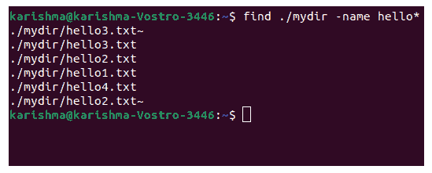

## 根据文件扩展名查找文件

在 [Linux](https://www.javatpoint.com/linux-tutorial) 中，要查找带有特定扩展名的文件，请将其包含到命令中。

```

find . -name *.txt

```

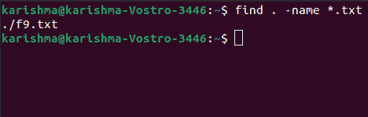

### 按名称查找目录和文件

应用以下命令搜索以 hello 字母开头的目录和文件。在我们的系统中，我们有 **hello1、hello2、hello3、**和 **hello4** 文件。

让我们执行以下命令:

```

find ./ -name "hel*"

```


上面的命令将返回所有以 hello 字母开头的目录和文件。我们需要在这个命令中描述它，以便只搜索目录或文件。

## 仅查找目录或文件

仅对于文件，使用 f 类型开关。

```

find ./ -type f -name "hel*"

```

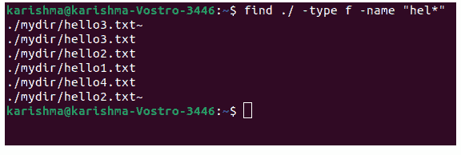

仅对于目录，使用 d 类型选项仅定位目录。

```

find ./ -type d -name "hel*"

```

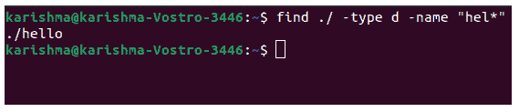

## 查找不区分大小写的命令

所有带有-name 选项的查找都区分大小写，并且不会提供大写字母的结果。我们可以使用-iname 选项获取所有案例:

```

find ./ -iname "hel*"

```

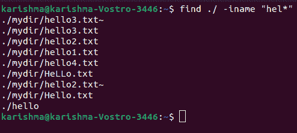

## 通过多个目录查找文件

为了在不同的目录中找到文件，我们可以在命令中包含它们的路径。在这种情况下，我们将在 newdir 目录中找到它。

```

find ./mydir ./newdir -name hello1.txt -type f

```

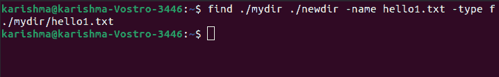

## 从每个目录中找到多个扩展名不同的文件

我们可以应用 find 命令来定位多个分发不同扩展名的文件，如 ***。pdf，*。txt，*。doc、**等。它可以单独完成，一次一个扩展，或者借助包含每个所需扩展的单个命令。

```

find . -type f \( -name "*.txt" -o -name "*.c" -o -name "*.doc" \)

```

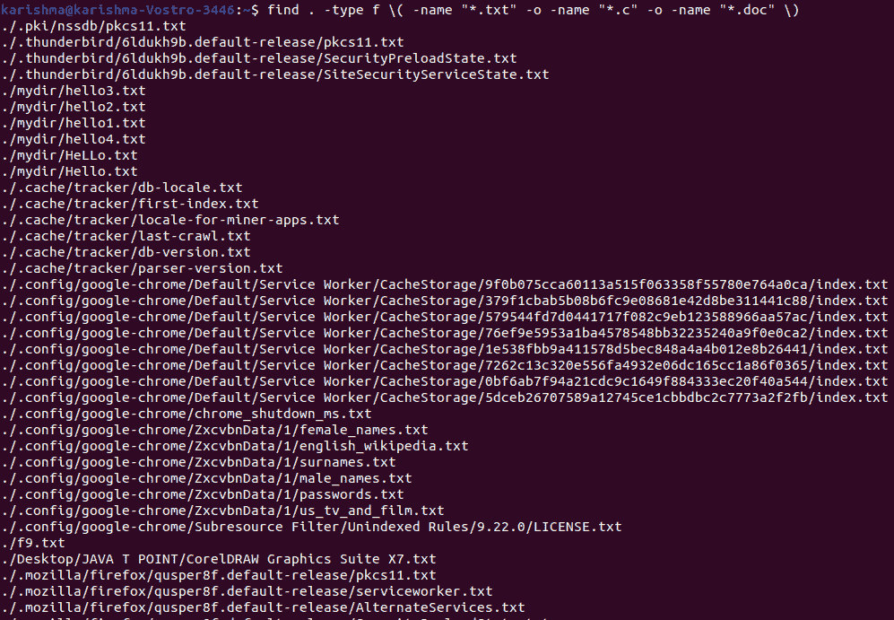

## 查找包含特定文本的文件

我们希望访问包含某些类型文本的文件，但无法回忆起其文件位置和名称。这个命令允许我们找到每个文件，包括我们的目标文本。

要搜索包含 hello 单词的每个文件，我们可以使用以下命令:

```

find . -type f -exec grep -l -i "hello" {} \;

```

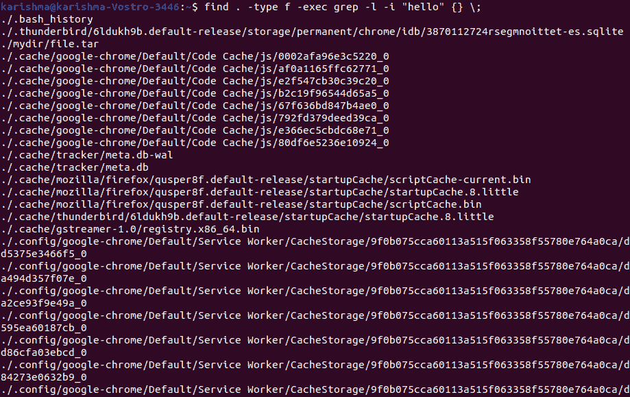

Option -i 允许该命令忽略大小写，它将搜索该文本是否大写，即 hello，Hello 等。

要在特定目录中搜索文件，我们只需在命令中包含它们。

```

find ./ newdir -type f -exec grep -l -i "hello" {} \;

```

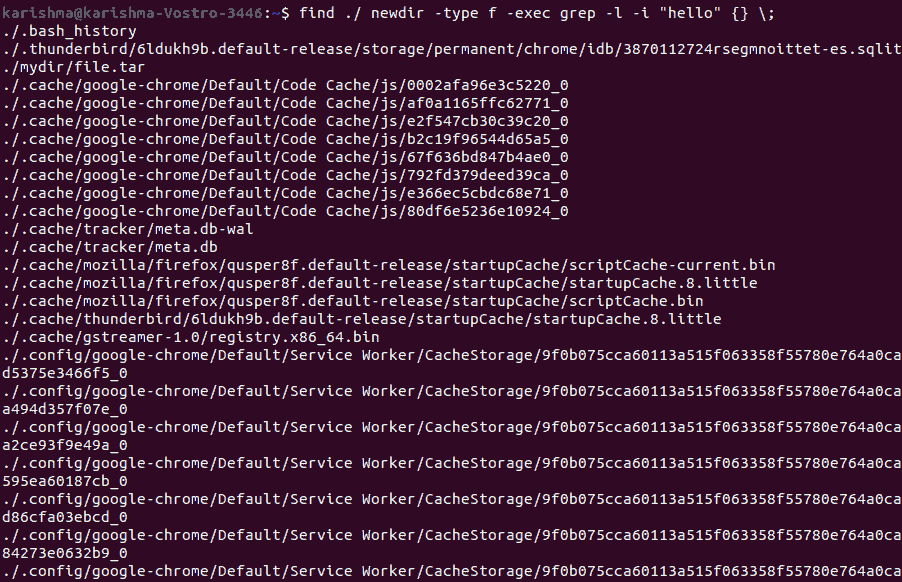

## 根据大小查找目录和文件

我们可以找到大于、等于或小于特定大小、在规范范围内或为空的所有目录和文件。根据我们要查找的目录或文件类型，应用适当的大小格式。

尺寸选项有:

**M-** 兆字节

**G-** 千兆字节

**c-** 字节

**k-** 千字节

## 查找特定大小的文件-等于 20MB

要查找每个 20MB 文件，我们可以使用以下命令:

```

find / -size 20MB

```

## 查找大于特定大小的文件

我们可以使用以下命令来查找那些大于特定大小的文件:

```

find -size +3M

```

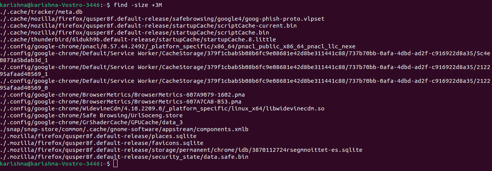

## 在当前目录中查找小于 10MB 的文件

我们可以使用以下命令来查找当前目录中小于 10MB 的文件:

```

find . -type f -size -1M

```

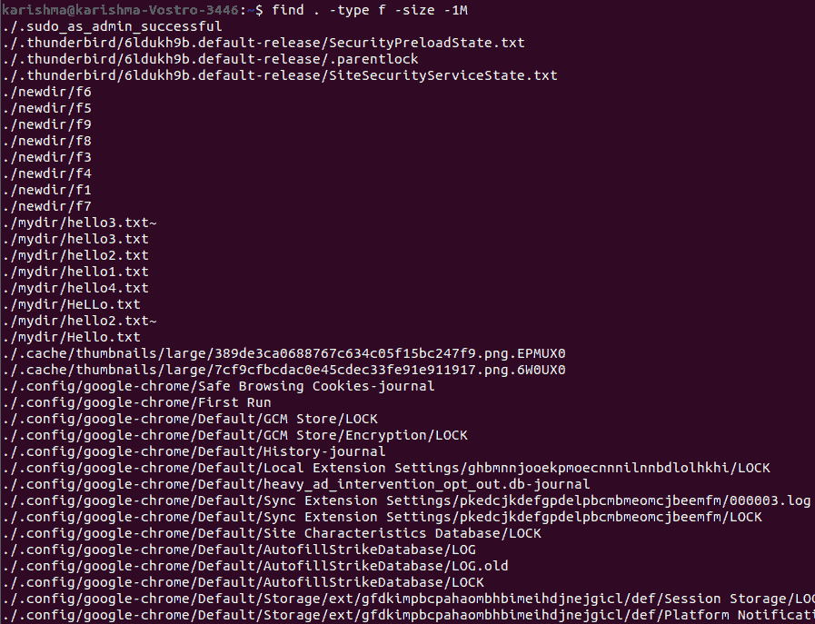

## 查找大小在 1-3MB 之间的文件

如果在 1 到 3 MB 之间的特定范围内搜索文件，我们可以使用以下命令:

```

find / -size +1M -size -3M 2>>/dev/null

```

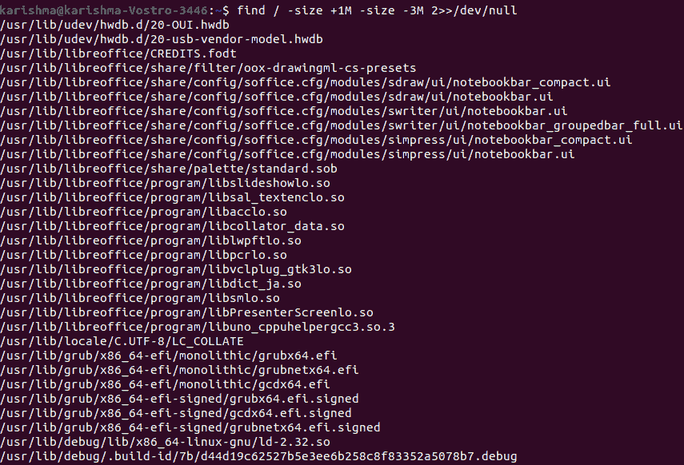

## 查找大于 10kb 的目录

我们可以使用以下命令:

```

find . -type d -size +10k

```

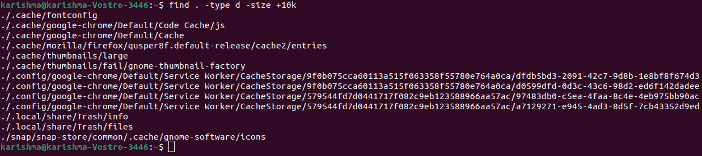

## 查找空目录和文件

### 对于文件

我们可以使用以下命令来查找一个空文件:

```

find ./ -type f -size 0

```

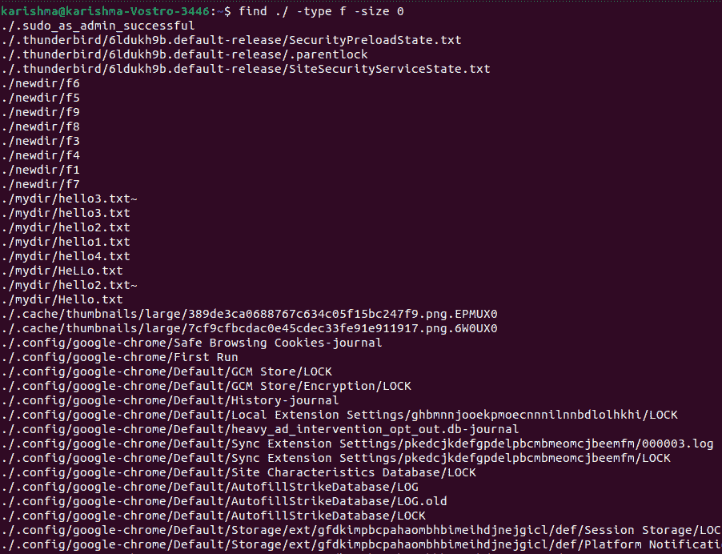

或者，

```

find ./ -type f -empty

```

### 对于目录

我们可以使用以下命令来查找一个空目录:

```

find ./ -type d -empty

```

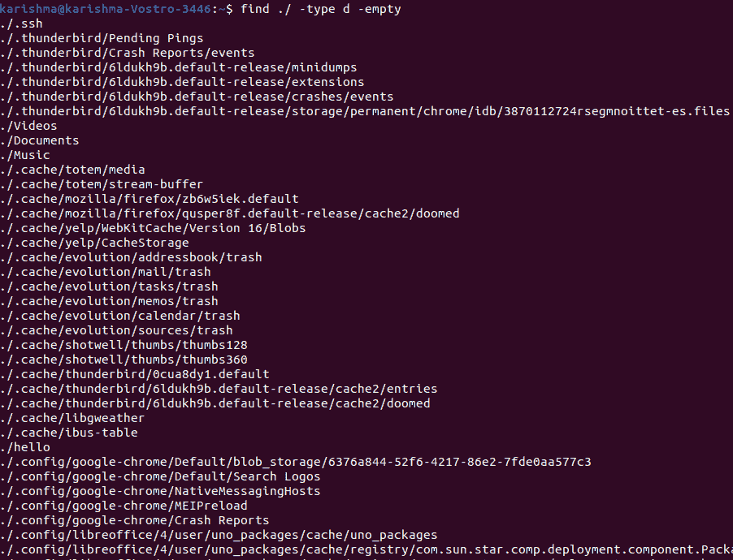

## 按修改时间或时间查找文件

使用此选项，我们可以找到 n 天前创建的文件:

```

find /path/ -type f -name '*.txt' -mtime +9

```

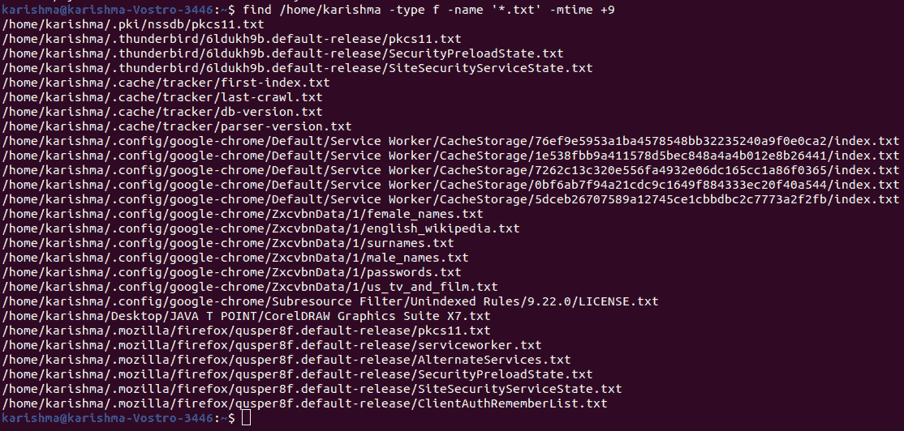

哪里，

-mtime +9 将搜索那些在 9 天前创建的 txt 文件。

## 按修改日期查找文件

它会搜索那些在过去 n 小时内被修改的文件。

```

find . -mtime -1 -type f

```

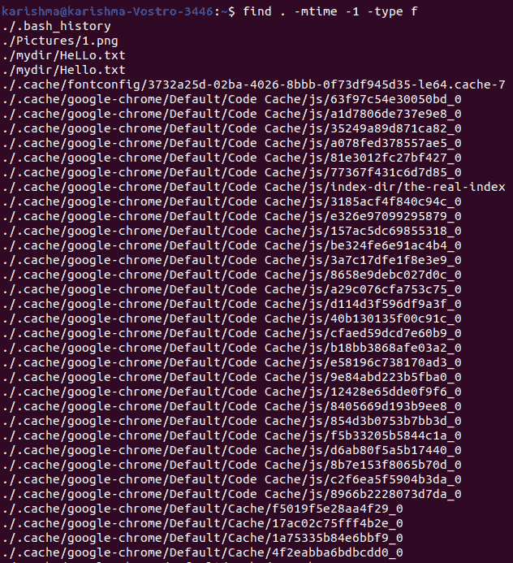

我们还可以使用以下命令来搜索在过去 n 天内修改过的目录:

```

find . -mtime -1 -type d

```

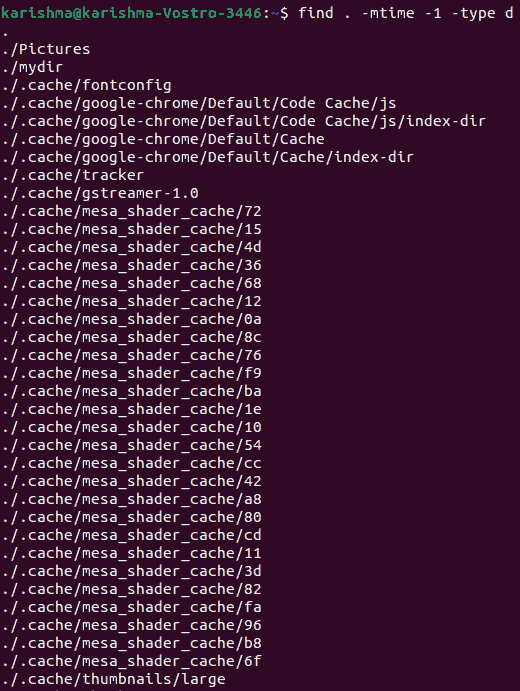

## 根据修改或访问查找文件

根据访问的时间或日期查找文件。它允许我们查看在特定时间没有或已经被访问过的文件。

要查看主目录中过去 15 天内未被访问的文件，我们可以使用以下命令:

```

find /home -atime +15

```

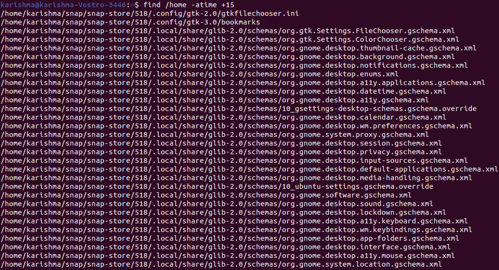

我们可以使用以下命令查看 15 天前访问过的文件:

```

find /home -atime 2

```

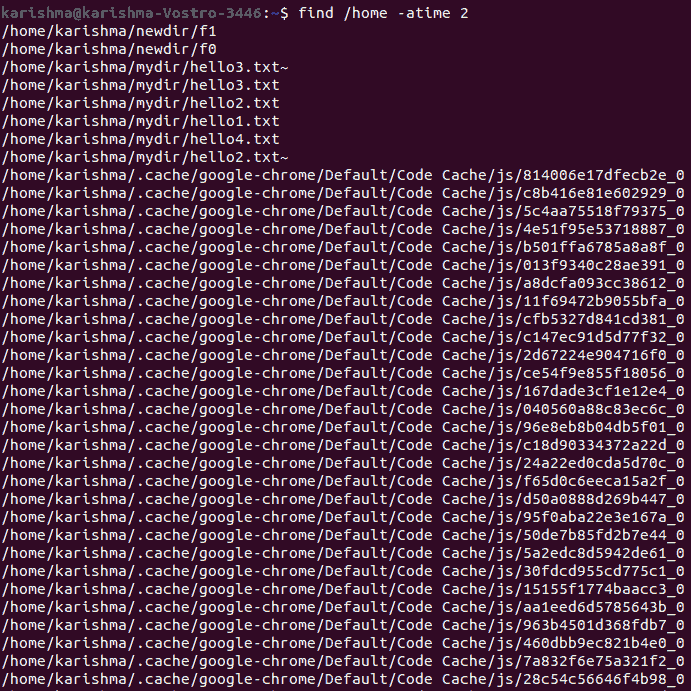

此外，我们可以使用以下命令查看过去 15 天内访问的文件:

```

find /home -atime -1

```


## 查找在过去 n 天内更改的文件

我们也可以考虑 **/home** 目录内的文件，这些文件在最近 1 天内借助以下命令发生了变化:

```

find /home -mtime -1

```

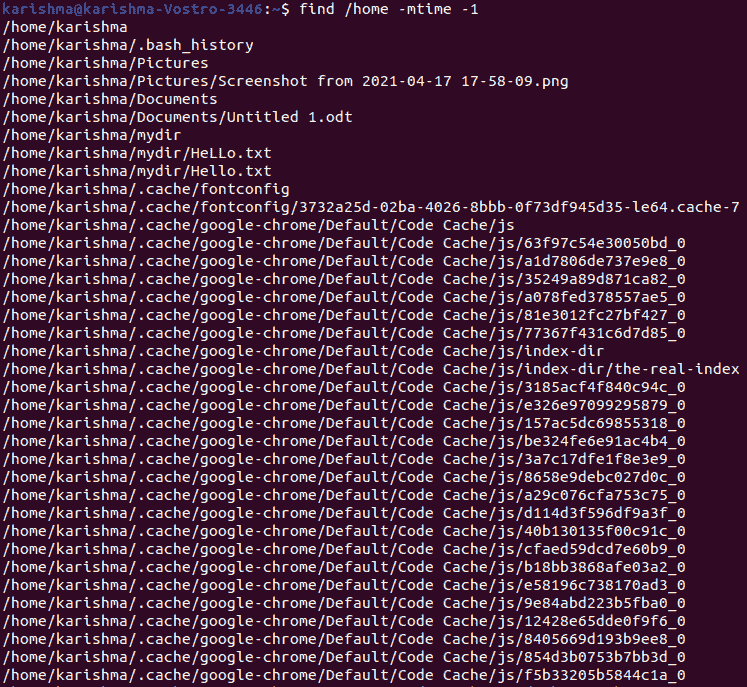

## 查找在特定时间内更改的文件

例如，在我们的主目录中，每个文件在 7 到 16 天前都发生了变化。

```

find /home -type f -mtime +7 -mtime -16

```

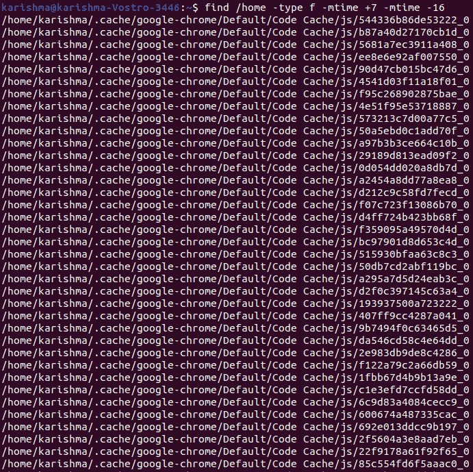

## 过去 n 分钟内访问的目录和文件

### 对于文件:

要查看最近 15 分钟访问的文件，我们可以使用选项***-阿明*** 。命令如下:

```

find . -amin -15 -type f

```

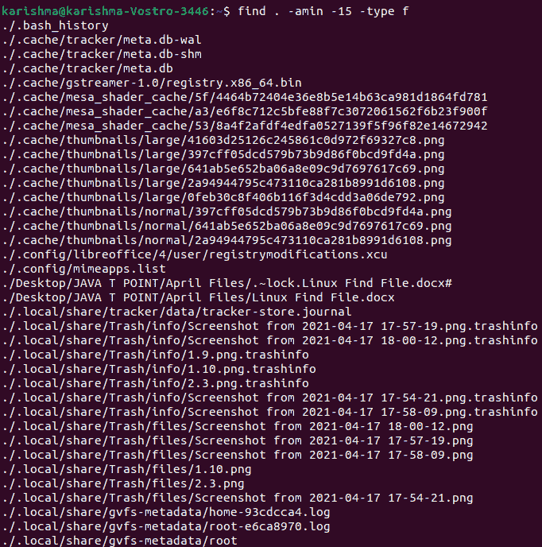

### 对于目录:

要查看最近 15 分钟访问的目录，我们可以使用选项***-阿明*** 。命令如下:

```

find . -amin -15 -type d

```

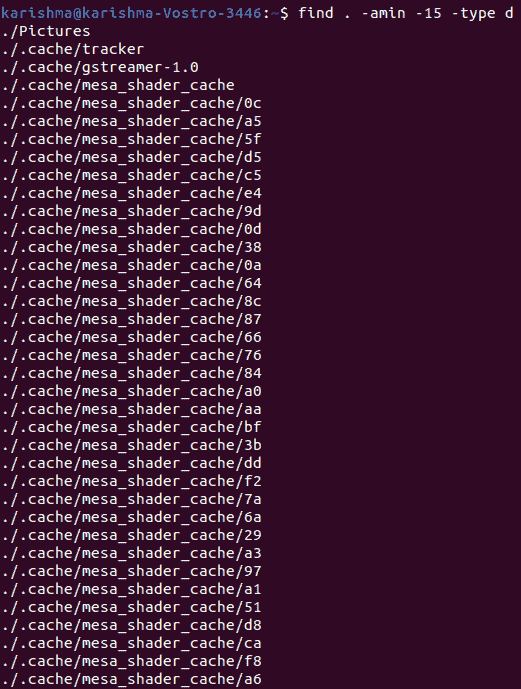

* * *