# 回声命令

> 原文：<https://www.javatpoint.com/echo-command>

在 Linux 中，echo 命令可以用来显示作为**参数传递的一行字符串/文本。**该命令是一个内置命令，主要广泛用于各种批处理文件和外壳脚本中，以将状态测试结果输出到文件和屏幕上。

**回声命令的语法**

```

echo [option] [string]

```

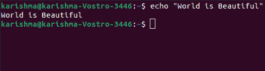

## 回声命令的实现

echo 命令存在于 SymbOS、KolibriOS、HP MPE/iX、ReactOS、微软 Windows、IBM OS/2、Digital Research FlexOS、Acorn Computers Panos、微波 OS-9、Zilog Z80-RIO、MetaComCo TRIPOS、TSC FLEX、Multics、类 Unix 和 Unix 操作系统中。

包括每一个**类 Csh(像 zsh 或 Bash)、类伯恩炮弹、**和**COMMAND.COM**以及 cmd.exe 在内的几个炮弹执行回声命令作为内置命令。

该命令也存在于电喷外壳内部。

## 回声命令的历史

回声命令在多播中启动。后来被***【C】***语言中的 ***道格·麦克罗伊*** 指定为 ***【手指锻炼】*** 并被验证为有帮助。它成为了 2 个版本的 Unix 的一部分。

在 7 个版本中，echo -n 命令取代了 prompt(但是，其行为类似于 echo 命令，没有终止输出以及行分隔符)。

该命令开始开发类似\***【n】***的 C 转义序列，区别在于八进制转义序列被表示为\ ***0ooo*** 而不是\ ***ooo*** 在 UNIX/PWB 的 C 语言中以及 Unix System 3 之后。回声命令在微软操作系统上有两个版本。

如今，各种回声不兼容的实现在不同的操作系统上可用(在相似的系统上有各种实现)。默认情况下，他们中的一些人开发转义序列，一些人没有。类似地，他们中的一些人获得了选项(列表中的选项会随着实现而改变)，而一些人没有。

当初始参数为-n 或其他参数包括 Unix 规范期间的反斜杠字符(POSIX 中的选项 XSI)要求开发序列，并且不允许选项处理时，Echo POSIX 规范未指定其性质。

echo 命令的几种实现在默认平台中并不灵活。由于这些类型的性质变化，echo 命令被视为不可移植的命令，而命令，即***【printf】***在类似 Unix 的系统上更受欢迎。

### 显示字符串/文本:

**语法:**

```

echo [string]

```

**示例:**

```

echo -e "World \bis \bBeautiful"

```

**输出:**

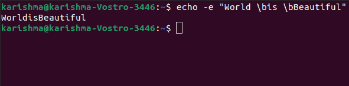

### 回声命令选项

echo 命令中有各种选项。下面列出并解释了这些选项:

**1。\b:** 该选项用于删除文本/字符串中的每个空格。

**示例:**

```

echo -e "Flowers \bare \bBeautiful"

```

**输出:**

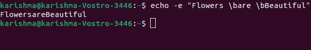

**2。\c:** 此选项用于抑制尾随的新行以及“-e”退格解释器，以便在不发出任何新行的情况下继续。

**示例:**

```

echo -e "World \cis Beautiful"

```

**输出:**

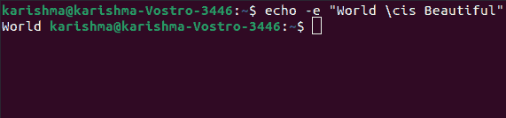

**3。\n:** 此选项用于创建新行，新行将从其使用位置创建。

**示例:**

```

echo -e "World \nis \nBeautiful"

```

**输出:**

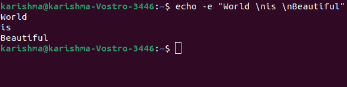

**4。\t:** 该选项用于创建水平制表符空间。

**示例:**

```
echo -e "World \tis \tBeautiful"
```

**输出:**

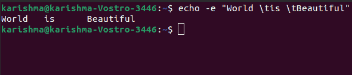

**5。\r:** 该选项与“-e”退格解释器一起用于回车，以便在结果中描述回车。

**示例:**

```

echo -e "World \ris Beautiful"

```

**输出:**

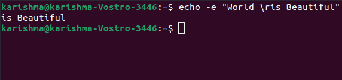

**6。\v:** 该选项用于创建垂直制表符空间。

**示例:**

```

echo -e "World \vis \vBeautiful"

```

**输出:**

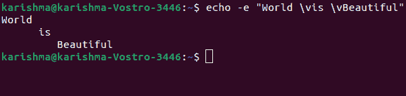

**7。\a:** 此选项与 ***'-e'*** 退格解释器一起用于提醒返回，以添加声音提醒。

**示例:**

```
echo -e "\aWorld is Beautiful"
```

**输出:**

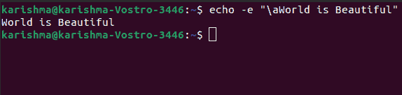

这个命令如果运行，它将产生一个提示音或警报声音。

#### 注意:点火前，确保检查音量键。

**8。echo *:** 此选项用于打印每个文件夹或文件。它与 [Linux](https://www.javatpoint.com/linux-tutorial) 中的 ls 命令相同。

**示例:**

```

echo *

```

**输出:**

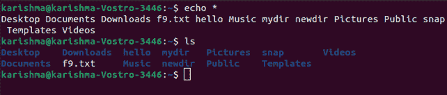

**9。-n:** 此选项用于省略回显尾随的新行。

**示例:**

```

echo -n "World is Beautiful"

```

**输出:**

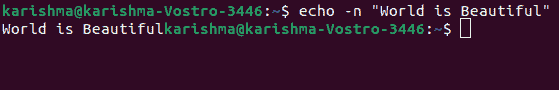

**10。打印“大家好”:**用于打印文字 ***“大家好！”*在终端上，我们可以使用下面的命令:**

**示例:**

```

$ echo "Hello All!"

```

**输出:**

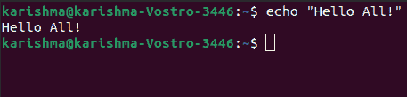

**11 时。打印特定类型的文件:**例如，如果我们希望打印每一个 ***。c'*** 文件，我们可以应用下面的命令:

**示例:**

```
$ echo *.txt
```

**输出:**

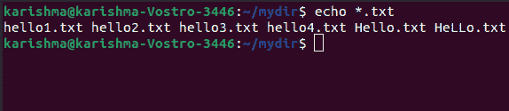

* * *