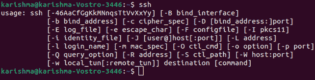
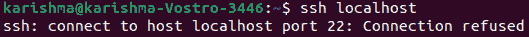
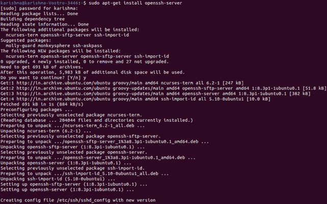
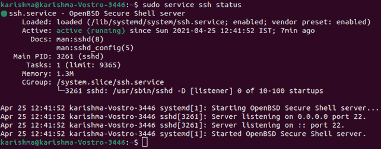
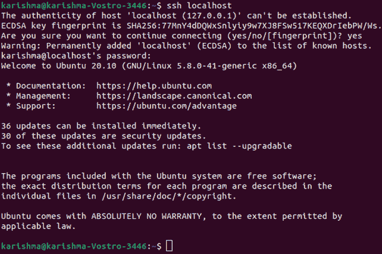
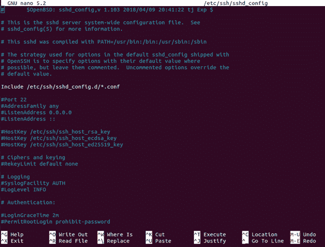
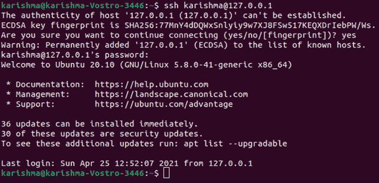

# 宋承宪命令

> 原文：<https://www.javatpoint.com/ssh-command>

SSH 是*“安全壳”*的简称。SSH 可以定义为用于安全连接到远程系统或服务器的协议。它是安全的，因为它可以在客户端和主机之间以加密格式传输信息。

它还通过客户端将输入传输到主机。该命令在 *TCP/IP* 的**22 端口**执行。

### SSH 命令的语法:

```

ssh user_name@hist(IP/Domain_name)

```

## SSH 命令的先决条件

在我们可以使用远程机器创建安全的远程桌面协议之前，下面是一些需要匹配的命令要求:

*   远程计算机应该每次都打开，并且有网络连接。
*   必须启用并安装服务器和客户端应用程序。
*   我们需要我们希望连接的远程机器的名称或 IP 地址。
*   我们要求拥有访问远程系统的强制权限。
*   允许远程连接需要各种防火墙设置。

## SSH 命令的一部分

[Linux 中的 SSH 命令](https://www.javatpoint.com/ssh-linux)包括 3 个不同的部分，下面列出并讨论:

*   *ssh 命令*指导系统建立与主机的加密安全连接。
*   *用户名*显示了正在通过主机进行身份验证的帐户。
*   *主机*可以定义为一台机器，它可以是路由器或正在被认证的计算机。可以是域名*(如 www.domainname.com)*或 IP 地址*(如 192.168.1.124)* 。

#### 注意:这些命令将像登录到主机后直接指定给主机终端时一样实现。
使用 SSH 密钥对或公私密钥对登录远程主机比使用密码更受保护。

要生成公钥-私钥，我们可以使用以下命令:

```

ssh-keygen 

```

在将公钥复制到远程主机时，私钥应该保持隐藏。

将公钥复制到远程主机后，将不会使用密码而是使用 SSH 密钥来创建连接。

## SSH 命令中的选项

[Linux](https://www.javatpoint.com/linux-tutorial) 的 SSH 命令中有各种选项。这些选项解释如下:

1.  **-1:** 用于强制 ssh 命令只应用 SSH-1 协议。
2.  **-2:** 用于强制 ssh 命令只应用 SSH-2 协议。
3.  **-4:** 用于只允许 IPv4 地址。
4.  **-6:** 用于只允许 IPv6 地址。
5.  **-a:** 用于启用认证代理连接转发过程。
6.  **-A:** 用于禁用认证代理连接转发过程。
7.  **-C:** 用于压缩每个数据(包括 stderr、stdout、stdin 以及 TCP 和 X11 转发连接的数据)，以实现更快的数据传输。
8.  **-f:** 用于仅在命令执行前请求 ssh 命令去后台。
9.  **-g:** 用于允许各种远程主机链接到本地转发端口。
10.  **-p 端口号:**是通过远程主机连接的端口。
11.  **-n:** 用于防止从 stdin 读取。
12.  **-q:** 用于抑制每一个警告和错误。
13.  **-V:** 用于显示版本号。
14.  **-v:** 代表 Verbose 模式，用于回显创建任何连接时正在运行的所有内容。该选项在连接故障调试中非常有用。
15.  **-X:** 用于启用 X11 转发或图形用户界面转发。
16.  **-c cipher_spec:** 用于选择加密会话的密码规范。只有在服务器和客户端都支持的情况下，才会选择特定的密码算法。

值得注意的是， **ssh** 由于数据加密，与 telnet 等其他各种协议相比更加安全。

SSH 协议使用的 3 种广泛使用的加密技术如下:

**1。对称加密:**对称加密的原理是产生一个密钥来加密和解密数据。生成的密钥在主机和客户端之间共享，以实现更安全的连接。这种加密技术是最常见的，如果数据在单独的机器上解密和加密，效果最好。

**2。不对称加密:**不对称加密技术更安全，因为它产生两个不同的密钥，如下所示:

*   公开密钥
*   私钥
    在私钥安全地通过客户端机器期间，公钥被共享给不同类型的主机。任何安全连接都是在密钥的公共-私有对的帮助下创建的。

**3。哈希:**在这种方法中，单向哈希可以定义为一种身份验证方法，确保数据不变并通过真正的发送方。

哈希函数可用于通过数据生成哈希代码。有可能通过哈希值重新生成数据。

这个值是在发送端和接收端测量的。如果哈希值相同，则数据是准确的。

## SSH 的工作方式

我们需要两个重要的组件来建立 SSH 连接。这些组件如下:

*   SSH 客户端组件
*   服务器端组件

**1。SSH 客户端组件:**SSH 客户端可以定义为我们安装在计算机上的应用程序，我们将使用它来连接到服务器或另一台计算机。

客户端将使用给定的远程主机数据来启动连接。当凭据通过身份验证时，它还会建立加密连接。

**2。SSH 服务器端组件:**在服务器端，有一个称为 SSH 守护程序的元素。它一直在监听某个特定的 TCP/IP 端口，寻找客户端连接的可行请求。

SSH 守护程序用协议版本和软件进行响应，这两者将交换它们的标识信息。

如果给定的凭据是准确的，SSH 将为适当的环境建立更新的会话。

SSH 客户端和 SSH 服务器通信的默认 SSH 协议版本是 2 版。

## 如何实现 SSH 连接

由于建立 SSH 连接需要一个服务器和一个客户端组件，我们需要确保它们分别安装在远程和本地机器上。

OpenSSH 工具广泛用于各种 Linux 发行版。它是 SSH 的开源工具，相对容易安装。它需要通过我们用于连接的计算机和服务器访问我们的终端。

#### 注意:默认情况下，Ubuntu 没有安装任何 SSH 服务器。

## OpenSSH 客户端安装

在我们继续安装 SSH 客户端之前，请确保它尚未安装。Linux 的几个发行版已经包含了 SSH 客户端。我们还可以安装 PuTTY 或我们选择的其他客户端，以便访问 Windows 机器的任何服务器。

要检查基于 Linux 的系统上是否存在客户端，我们需要:

1.  加载 SSH 终端。我们可以点击 ***CTRL+ALT+T*** 或者在键盘上找到 ***【终端】*** 。
2.  在 ssh 内输入，在终端内点击 ***进入*** 。
3.  当客户存在时，我们会得到回应。

这意味着我们已经准备好远程连接到任何虚拟机或物理机。否则，我们将需要安装一个 OpenSSH 客户端。

1.  执行以下命令，在我们的计算机上安装 OpenSSH 客户端。
    sudo apt-get 安装 openssh-client
2.  如果需要，输入我们的超级用户密码。
3.  按回车键完成安装过程。

现在，我们可以在任何机器上访问 SSH 以及其上的服务器端应用程序，因为我们还需要**获得访问权限、IP 地址、**和**主机名**的重要权限。

我们还可以通过输入以下命令来检查 ssh 是否安装在我们的系统上:

```

ssh

```



## 服务器安装

机器需要包含用于接受 SSH 连接的 SSH 软件工具包的服务器端部分。

如果我们首先希望检查需要接受 SSH 连接的远程计算机的 Ubuntu 上是否存在 OpenSSH 服务器，我们可以尝试连接到本地主机:

1.  在服务器上，打开我们的终端。我们可以在键盘上找到 ***【终端】*** 或者点击 ***CTRL+ALT+T*** 。
2.  在 ssh 本地主机中键入，然后按回车键。
3.  对于那些没有安装 SSH 服务器的系统，响应如下所示:

```

    username@host:~$ ssh localhost

    ssh: connect to host localhost port22: Connection refused

    username@host:~$

```



当出现上述情况时，我们将不得不安装一个 OpenSSH 服务器。打开终端，然后:

1.  执行以下命令安装 SSH 服务器:
    sudo apt-get install OpenSSH-server
2.  如果需要，输入我们的超级用户密码。
3.  按 ***进入*** 和 ***Y*** 允许安装过程稍后进行磁盘空间提示。



将安装必要的支持文件，然后我们可以使用以下命令检查 SSH 服务器是否正在机器上执行:

```

sudo service ssh status

```



在终端中，当 SSH 服务正在执行时，响应看起来应该与此相同。

测试 OpenSSH 服务器安装是否正确的其他方法是接受尝试执行命令的连接，即 ***ssh localhost*** 再次出现在我们的终端提示中。结果将显示为:

输入 ***y*** 或 ***yes*** 继续。



现在，我们已经在 SSH 客户端的帮助下设置了服务器，用于接受来自不同计算机的 SSH 连接请求。

## 重要提示

现在，我们可以编辑 SSH 守护程序的配置文件。例如，我们可以修改各种 SSH 连接的端口(默认)。我们可以在终端提示符下执行以下命令:

```

sudo nano /etc/ssh/sshd_config

```



配置文件将在我们选择的编辑器中打开。我们可以在这种情况下使用纳米。

如果必须安装 Nano，我们可以运行以下命令:

```

sudo apt-get install nano

```

#### 注意:我们必须在创建对文件的任何修改时重新启动 SSH 服务，即通过执行以下命令重新启动 sshd _ config:

```

sudo service ssh restart

```


## 通过 SSH 连接

现在，我们已经在所有需要的机器上安装了 OpenSSH 服务器和客户端。我们可以安全地与我们的服务器建立远程连接。为此:

1.在我们的机器上启动 SSH 终端提示符，并执行以下命令:

```

ssh your_username@host_ip_address

```

当我们本地机器上的用户名与我们试图链接到的服务器上的用户名相同时，我们只能键入:

```

ssh host_ip_address

```

之后按下 ***进入*** 按钮。

2.输入我们的密码，然后按下 ***进入*** 按钮。

#### 注意:在打字过程中，我们不会在屏幕上收到任何反馈。如果我们要粘贴密码，请确保密码被安全存储，而不是存储在任何文本文件中。

3.如果我们第一次连接到任何服务器，它会确认我们是否希望继续连接。我们只需输入“是”并按下 ***进入*** 按钮。

只有在本地计算机上无法识别远程服务器时，才会出现此信息。

4.现在，包含了一个 ECDSA 密钥指纹，我们连接到一个远程服务器。



当我们试图远程连接的计算机在类似的网络上时，最好使用私有的 IP 地址，而不是公共的 IP 地址。否则，我们将只需要使用一个公共的 IP 地址。

此外，确保我们知道准确的 TCP 端口 OpenSSH 了解连接声明，并且端口转发的各种设置是准确的。

当没有人修改文件内的配置时，默认为端口 22，即***ssh _ config***。此外，我们可能只在稍后将端口号附加到主机 IP 地址。

现在，我们可以在终端的帮助下控制和管理远程机器。如果我们在连接远程服务器时遇到任何问题，我们需要确保:

*   远程机器的 IP 地址是准确的。
*   SSH 守护程序正在接收的端口没有被防火墙阻止或被错误转发。
*   我们的密码和用户名是准确的。
*   SSH 软件安装正确。

#### 注意:我们现在可以在 SSH 的帮助下创建到我们服务器的连接，我们强烈建议一些进一步的步骤来提高 SSH 的安全性。当我们离开我们的设置和各种默认值，那么我们的系统可能会被黑客攻击，我们的服务器很容易成为脚本攻击的目标。

* * *