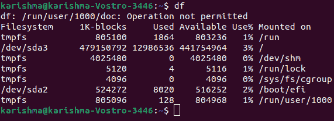
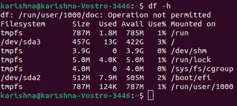
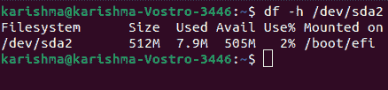
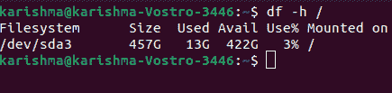
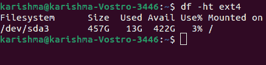
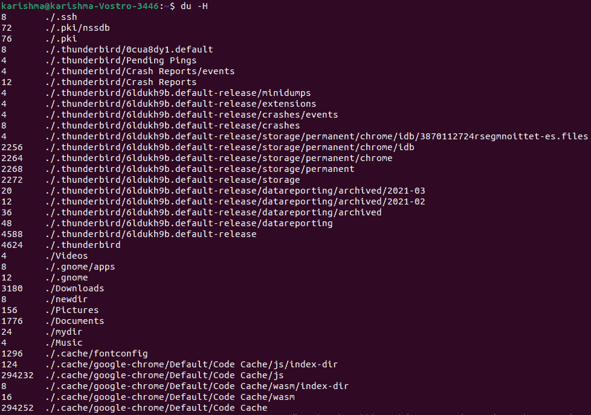
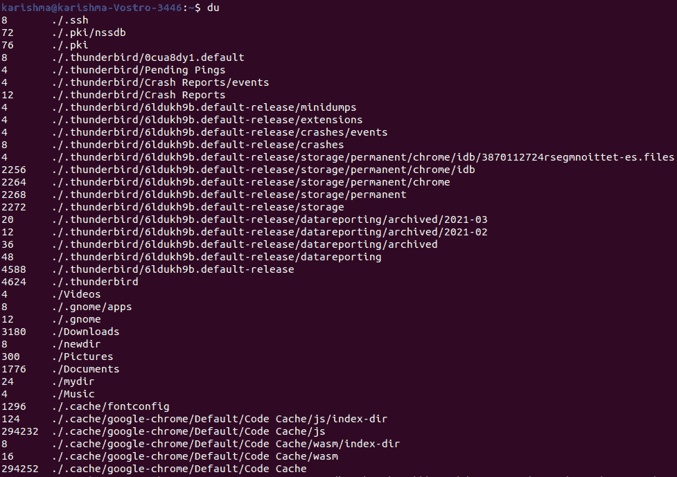
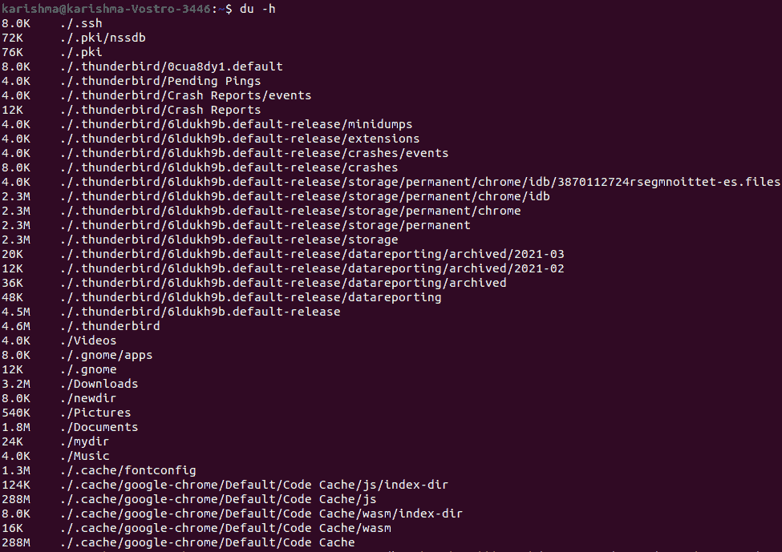
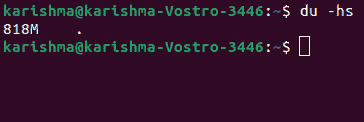

# Linux 检查磁盘空间

> 原文：<https://www.javatpoint.com/linux-check-disk-space>

管理 Linux 服务器上的磁盘空间是必不可少的一步。 ***例如，*** 包管理器的各种应用程序通知我们安装过程需要多少磁盘空间。我们应该了解我们的系统有多少空间可以让数据有意义。

在本主题中，我们将了解如何应用***【df】***命令来检查 [Linux 上的磁盘空间](https://www.javatpoint.com/linux-tutorial)以及 ***du*** 命令来显示文件系统的磁盘空间使用情况。

## 先决条件

*   基于 Linux 的系统
*   命令行或终端窗口
*   具有 root 或 sudo 权限的用户帐户

## 使用 df 命令检查磁盘空间

使用***【df】***命令，我们可以通过打开终端窗口并简单地键入以下命令来检查我们的磁盘空间:

```

df 

```



该命令是 ***磁盘空闲*** 的缩写。它向我们显示了不同驱动器占用的空间量。默认情况下，***【df】***命令显示 1 千字节块 中的值。

## 以千兆字节和兆字节为单位检查磁盘空间

通过在 df 命令中包含以下选项，我们可以以人类可读的格式显示磁盘的使用情况:

```

df -h

```



使用上述命令后，大小将以千兆字节、兆字节和千字节显示。

## 了解输出的格式

df 命令将列出下面列出和解释的各种列:

*   **文件系统:**它是所有特定驱动器的名称。它包括逻辑驱动器、物理硬盘驱动器以及临时或虚拟驱动器。
*   **大小:**是文件系统的大小。
*   **Used:** 是所有文件系统上使用的空间量。
*   **Avail:** 是所有文件系统上未使用的空间量。
*   **使用率%**显示磁盘使用率的百分比。
*   **挂载于:**是文件系统所在的目录。此外，它有时也被称为挂载点。

文件系统列表包含我们的虚拟硬盘和物理硬盘:

*   **/dev/sda2:** 是我们的物理硬盘。这个条目可能像 **/sda1/sda0** 一样列出，或者我们甚至可能有多个条目。它是**装置**的简称。
*   **/udev:** 是另一个目录 **/dev** 的虚拟目录。它是 Linux 操作系统的一部分。
*   **tmpfs:** 我们可能有很多这样的。这些类型的条目被**/运行**目录和 Linux 的其他进程用作运行操作系统的各种临时文件系统。

**例如，****tmpfs/run/lock**目录用于创建锁定文件。锁定文件是限制多个用户同时修改类似文件的文件。

## 显示特定的文件系统

df 命令可用于显示特定的文件系统:

```

df -h /dev/sda2

```



此外，我们可以添加一个反斜杠:

```

df -h /

```



它会显示我们主硬盘的使用情况。我们可以应用挂载点(在挂载条目内部)来指定我们想要检查的驱动器。

#### 注意:df 命令只针对一个完整的文件系统。即使当我们描述一个目录时，df 命令也会知道整个驱动器的空间。

## 按类型显示文件系统

我们可以使用以下命令按类型列出每个文件系统:

```

df -ht ext4

```



它将列出驱动器以及类型，即以更易于阅读的方式 **ext4** 。

## 以 1000 而不是 1024 显示尺寸

我们可以用 1000 个单位而不是 1024 个单位来显示磁盘的使用情况:

```

du -H

```



它可以解决存储机制内部的混淆点。许多硬盘制造商出售不同大小的硬盘，1000 字节等于 1 千字节。

但是，操作系统会将这些空间分类，其中:

【= 1024 字节

大约由于这个原因，1000 千兆字节的硬盘最终会有 930 千兆字节的可访问存储空间。

## 使用 du 命令检查磁盘空间

在 Linux 中， ***du*** 命令也可以用来显示磁盘的使用情况。该工具可以显示 Linux 中单个目录的磁盘使用情况，为我们提供了磁盘使用情况的更精细的视角。我们可以用它来显示当前目录使用的空间量:

```

du

```



我们可以像 df 命令一样，使 du 命令更易于阅读:

```

du -h

```



它将显示我们当前目录的内容和当前目录的各种内容的列表消耗了多少磁盘空间。

我们还可以使用-s 选项来澄清显示:

```

du -hs 

```



它将显示我们当前的目录占用了多少空间。

* * *