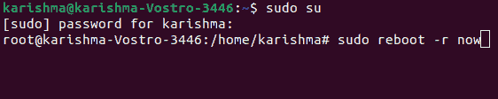
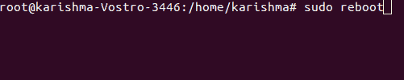
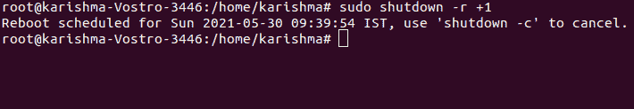
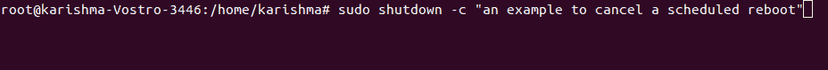
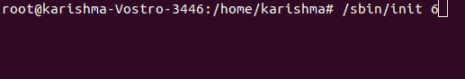
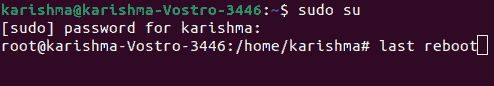

# Linux 重启命令

> 原文：<https://www.javatpoint.com/linux-reboot-command>

## 概观

***【重启】***Linux 中的命令用于重启或重启系统。在 Linux 管理中有一个要求，在一些网络和其他大型更新结束后重新启动服务器。

它可能是承载在服务器上的硬件或软件。需要重新启动命令，以便用户实施的修改能够影响服务器。

***例如，*** 当用户重新编译服务器的内核时，该内核将被更多的标准服务器管理使用。之后，用户需要重新启动系统来完成编译过程，并在服务器上包含更新内核的新版本。

如果更新需要在服务器上实施的内存、网卡配置、关键任务和 IP 分配，服务器会在成功实施后重新启动。

Linux 系统的大多数管理人员通过*或 ***shell*** 访问他们的服务器，以执行一系列管理操作、服务器监控和管理。*

 *因此，他们需要知道通过 shell 重启服务器的常用命令。

### 重新启动命令的语法

```

reboot [OPTIONS...]

```

## 重新启动命令中的选项

**1。-帮助:**此选项用于打印帮助和退出的简短文本。

**2。-停止:**用于停止机器，与以下哪个命令无关:

**3。-poweroff，-p:** 该选项将有助于关闭系统电源，与这三个命令中的哪一个是幻化的无关。

**4。-重新启动:**它重新启动系统，与这三个命令中的哪一个无关。

**5。-force，-f:** 强制立即停止、重启或关机。描述一次后，它会通过系统管理器立即但清晰地关闭。当它被描述两次时，由于不联系任何系统管理器，导致立即关闭。

**6。-wtmp-only，-w:** 它只写 wtmp 关闭的条目。它不会停止、重启或关机。

## 重启命令示例

**1。重启我们的系统:**当我们只需要重启而不进入细节。我们可以使用以下任何命令:

```

$sudo shutdown -r now

```



```

$sudo reboot

```



#### 注意:暂停、关机和重启的用法在效果和语法上几乎是一样的。使用- help 选项运行所有命令以检查详细信息。

**2。计划重新启动:**常规重新启动命令限制了使用。此外，正在应用关机命令，而不是重新启动命令，以满足更标准的关机和重新启动需求。

其中一个条件是计划重启。以下是在通过 ***时间指定的时间后重新启动系统时使用的语法。*T3】**

```

$sudo shutdown -r [TIME] [MESSAGE]

```

**在哪里，**

*   时间包含几种格式。最简单的格式是 ***“现在”。*** 它告诉机器立即重启。
*   我们拥有的其他授权格式是 ***+m*** ，其中 m 是我们要求等待重启的分钟数。
*   ***HH:MM*** 格式定义了 24 小时时钟内部的时间。
*   在防止某些数据丢失之前，可以使用消息参数(可选)来指示用户。

以下是一些例子及其相应的输出。

### 2 分钟后重启系统的命令

```

$sudo shutdown -r +1

```



### 凌晨 03:00 后重启系统的命令:

```

$sudo shutdown -r 03:00

```

## 如何取消重新启动

如果我们希望我们的系统取消先前计划的关机或重启，我们可以简单地使用一个选项，即-c，调用其他关机命令，并向用户广播重启的取消消息。

**语法:**

```

$sudo shutdown -c [MESSAGE]

```

**取消我们的计划重启:**计划重启(之前)可以通过系统管理员发出其他关闭命令来取消，只需使用一个选项，即-c 和一个消息参数(可选)。

```

$sudo shutdown -c "an example to cancel a scheduled reboot"

```



**使用 init 命令重启:**其实 ***init*** 命令是由 ***初始化*** 字来取的。它被广泛用于在 Linux 系统中启动/初始化不同的进程。因此，该命令与 ***6 运行级别一起作为关节应用；*** 一个已经被修复的重启 Linux 服务器的数字会导致服务器重启。其语法如下:

```

[root@test ~]# /sbin/init 6

```



或者，

```

[root@test ~]# init 6

```

**检查我们的重启日志:**文件，即 ***/var/log/wtmp*** 是一个记录，其中保存了注销和登录的每个记录。我们可以使用命令翻译这个文件，即 ***【最后】*** 来访问重启的日志。最后一个命令的用法及其在我们系统中的结果如下:

```

$last reboot

```



* * **