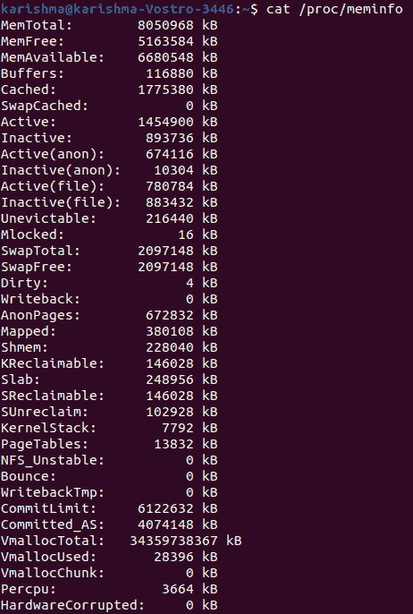
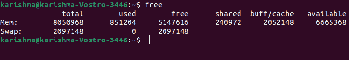
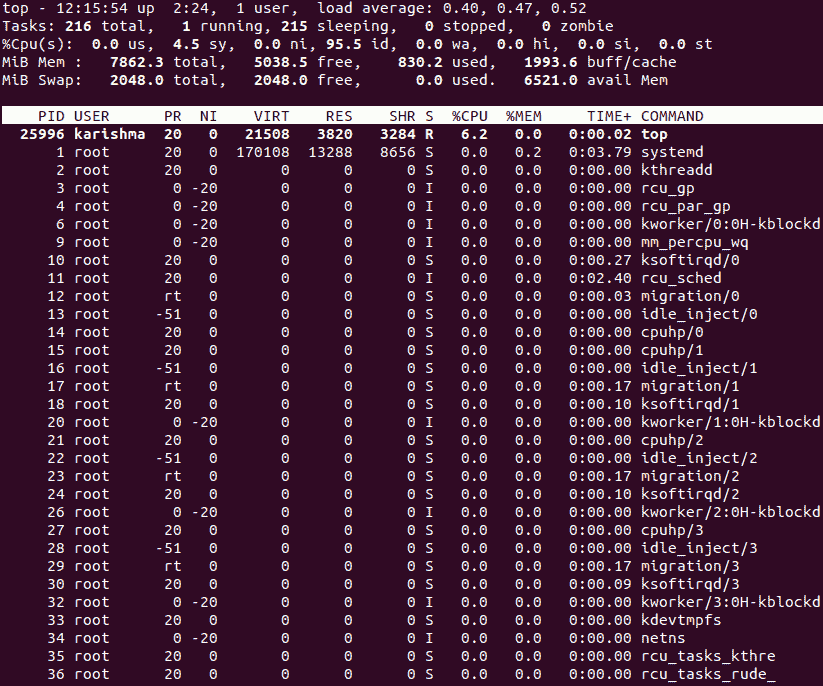
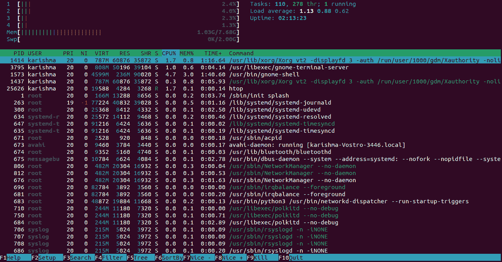
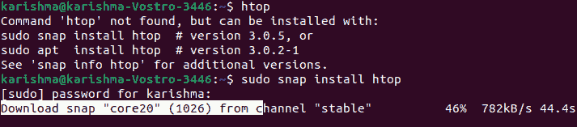
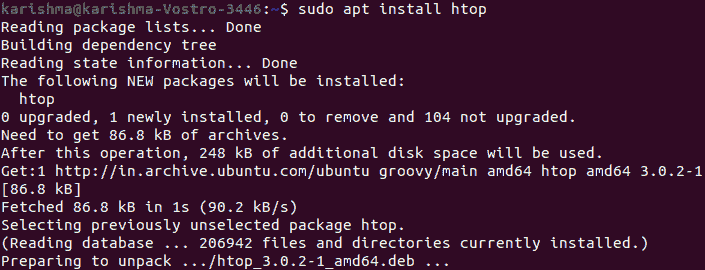
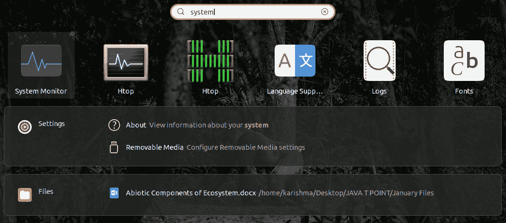
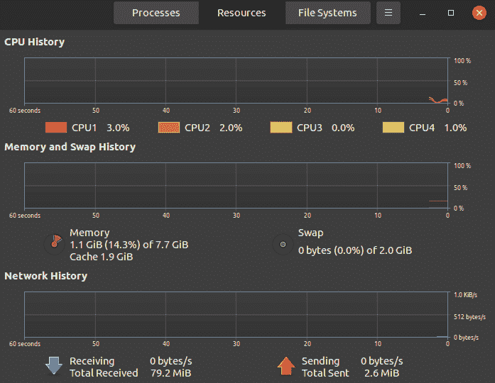
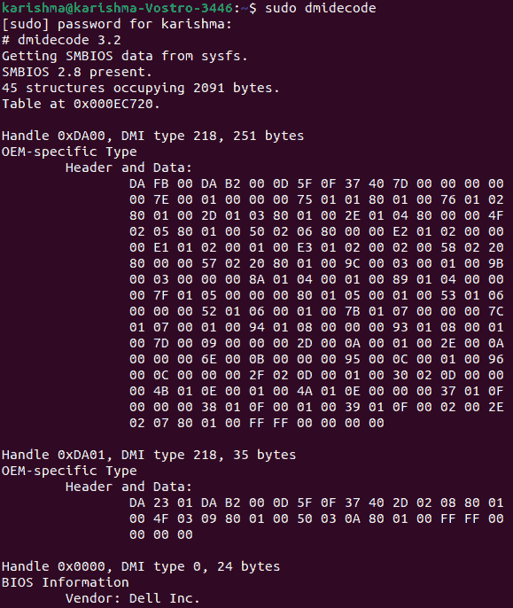

# 如何在 Linux 中检查内存

> 原文：<https://www.javatpoint.com/how-to-inspect-memory-in-linux>

## 介绍

我们的 Linux 系统有必要执行在一个优秀的水平。终端的一些简单命令允许访问每个相应的信息，并支持用户监控统计。

在本主题中，我们将了解一些检查 Linux 内存使用情况的重要命令。

此外，我们将详细解释他们在做什么，更重要的是如何说明输出。

这些命令将执行几乎所有的 Linux 发行版。结果和命令使用 ***Ubuntu 20.04*** 版本表示。

## 先决条件

*   终端或命令行的权限
*   sudo 权限的用户
*   聪明的包装经理

## 用于检查 Linux 中内存使用情况的命令

### 显示 Linux 内存详细信息的 cat 命令

在我们的命令行中键入 ***cat /proc/meminfo*** 打开一个文件，即 ***/proc/meminfo*** 。

它是一个虚拟文件，显示已用内存和可用内存的数量。它包括关于系统内存以及通过内核使用的共享和缓冲内存的实时细节。

根据操作系统和体系结构，结果可能略有不同。它是文件的一个实例，即 ***/proc/meminfo*** 在 Linux Ubuntu 20.04 中的样子:



#### 注意:命令行以 Kbs 显示详细信息。

### 什么是/proc/meminfo？

在少数情况下，命令借助名为 ***/proc/meminfo*** 的文件获取信息。我们可以使用命令直接读取这个文件，即***less/proc/meminfo***。

我们可以在输出中上下滚动，以便借助*命令找到我们真正需要的东西。*

 *关于 ***/proc/meminfo*** 文件，我们必须了解的一点是，它不是一个实际的文件。相反， ***/proc/meminfo*** 文件是一个包含系统动态和实时细节的虚拟文件。我们希望特别检查以下方面的值:

*   记忆可用
*   记忆自由
*   记忆总数
*   缓冲
*   藏起
*   交换自由
*   交换数据
*   交换疼痛

如果我们希望使用 ***/proc/meminfo*** 文件，我们可以使用 ***【白鹭】*** 命令来联合应用它。

**MemTotal:** 描述可用的总 RAM(除了一些保留位和内核的二进制代码)。

**MemFree:** 指定 HighFree+LowFree 之和。当前内存量。

**内存可用:**它定义了估计内存的存在，无需交换即可开始新的应用程序。

**缓冲区:**指定磁盘块(原始)的临时存储。它会减少硬盘的输入和输出。此外，由于类似数据已经在内存中，它还可以加速对连续请求的访问。

**缓存:**指定通过硬盘读取文件的缓存页面(交换缓存除外)。

**SwapCached:** 描述的是被放回和换出的内存。副本将保留在交换空间内。

**非活动:**它寻址已使用的内存。但是，最近不应该使用它。很可能是填海申请人。

**激活:**它处理最近使用的内存。如果不是必需的，它就不会被回收。

**非活动(匿名):**它定义了申请驱逐(或内存回收)的 shmem、tmpfs 和匿名内存的数量。

**Active (anon):** 它定义了分配给 tmpfs 伪文件系统内的文件的内存。此外，匿名文件不在硬盘上。

**非活动(文件):**描述通过申请人要回收的任何硬盘读取的文件缓存内存量。

**活动(文件):**定义正在使用的文件缓存内存量。此外，该文件已在之前的内存回收周期中使用过。

**不可收回:**它处理必须收回的内存量。但是，它是不可驱逐的，因为它是通过用户空间进程锁定在内存中的。

**Mlocked:** 它将总内存量定义为不可驱逐，因为它是通过许多用户空间进程锁定的。

**高总量:**定义总高量。它由页面缓存和用户空间程序使用。内核可以授权这个内存区域。虽然，它授权的速度并没有 LowMem 快。

**高自由:**描述自由高内存量。

**低总额:**定义低金额。它作为 HighMem 存在于每一个类似的用途中，也用于内核。

**自由流量:**描述自由流量。

**MmapCopy:** 定义映射到文件数据的内存量。

**交换空间:**它处理当前未使用的交换空间量。

**交换容量:**它处理可用的交换空间量。

**脏:**定义延迟写回磁盘的内存量。

**写回:**描述正在主动写回磁盘的内存。

**AnonPages:** 描述映射到用户空间的页表中的备份页(非文件)。

**映射:**定义了可以映射到内存中的文件(如库)。

**Shmem:** 表示 tmpfs 伪文件系统内部消耗的内存量。

**Slab:** 描述内核内数据结构的缓存。

**KReclaimable:** 表示当内存需求足够严重时，内核试图回收的内核内存分配。

**可回收:**它描述了可以像缓存一样回收的 Slab 内存量。

**sunrecovery:**它将 Slab 内存量定义为页表的最低级别。

**内核堆栈:**它处理分配给内核堆栈的内存量。

**快速浏览:**这是至关重要的，而且要尽可能快，因为删除和分配页表是一个非常快速的操作。因此，用于页表的页可以被缓存在不同的列表号中，称为 ***【快速列表】*** 。

**页表:**定义页表最底层专用的内存量。

**NFS _ 不稳定:**服务器收到但尚未写入非易失性存储器的网络文件系统页面。

**弹跳:**它定义了用于块设备弹跳缓冲区的内存。缓冲区可以放在足够低的内存中，以便设备直接访问。然后，数据将被复制到 HighMem 中选定的用户页面。

**写回 Tmp:** 它定义了通过用户空间 (或 ***【保险丝】*** )中的 ***文件系统用于写回缓冲区(临时)的内存。***

**CommitLimit:** 描述系统内当前可分配的内存总量。

**Committed_As:** 表示为满足每个当前需求而估计的内存量。当一个程序请求几个内存时，这个请求会被记录下来，内存是在程序开始使用时才分配的。

**VmallocTotal:** 它定义了 vmalloc 内存区域的总大小。

**VmallocUsed:** 描述使用的 vmalloc 面积量。自从 Linux 4.4 版本以来，这个选项不再被测量，因为它是硬编码的。

**VmallocChunk:** 表示空闲 vmalloc 连续区块的最大面积。

**硬件损坏:**它定义了标记为包括物理内存损坏问题的内存量。它不会被分配。

**AnonHugePages:** 它处理映射到用户空间的页表中的备份的巨大页(非文件)。备份的页面(非文件)不是来自任何硬盘文件。

**LazyFree:** 定义 MADV_FREE 状态下的内存量。如果应用程序在页面范围内修复了 MADV 自由标志。这说明它不再需要他们，他们现在是填海申请人。

原始回收可能会延迟，直到有足够的内存需求。当应用程序开始写入页面时，回收可能会被取消。

**shmempmdmapp:**定义了使用巨大页面映射到用户空间的共享内存量。

**ShmemHugePages:** 它定义了伪文件系统(tmpfs)和使用巨大页面分配的共享内存(shmem)使用的内存量。

**CmaTotal:** 它描述了 CMA(连续内存分配器)的页数。这些页面通过只能与相邻存储区域通信的设备使用。

**Hugepagesize:** 它定义了巨大的页面大小。

**HugePages_Surp:** 它表示池内超过指定值的巨大页码。

**HugePages_Free:** 它处理池内巨大的页数(未分配)。

**HugePages_Total:** 它描述了一个巨大的页面池的大小。

**DirectMap1G:** 定义映射到 2GB 页面的内存字节数。

**DirectMap2M:** 表示映射到 2MB 页面的 RAM 字节数。

**DirectMap4M:** 描述映射到 4MB 页面的内存字节数。

**DirectMap4k:** 它处理映射到 4kb 页面的内存字节数。

## 显示交换和物理内存量的自由命令

在我们的命令行中输入 ***free*** 给出如下输出:



数据以***【KBs】***的形式说明了交换内存和可用或已用内存。

1.  **总计:**定义总安装内存。
2.  **used:** 通过正在执行的进程指定当前正在使用的内存。
    ***(用户=总-免费-buff/缓存)***
3.  **空闲:**表示未使用的内存。
    ***(免费=总使用量-buff/缓存)***
4.  **共享:**它定义了由多个进程共享的内存。
5.  **缓冲区:**它指定操作系统保留的内存，如果进程需要，可以作为缓冲区分配。
6.  **缓存:**描述 RAM 中保存的已用文件(当前)。
7.  **缓存/缓冲区:**缓存+缓冲区
8.  **可用:**它估计在没有交换的情况下，有多少内存用于启动新应用程序。

与文件相比，free 命令提供的信息较少，即 ***/proc/meminfo*** 。然而，它更容易学习。重要的数字是可用值，因为它显示了运行新应用程序需要多少内存。

另外，*命令包含多个格式化结果的选项。因此，它更符合我们的需求。下表列出了 free 命令的有用版本。*

 ***- k:** 结果单位为千字节

**-b:** 以字节为单位的结果

**- m:** 结果以兆字节为单位

**- g:** 以千兆字节为单位

**- o:** 旧格式(无+/-缓冲器/高速缓存行)

**- l:** 详细的高低内存统计

**- c:** 更新[计数]次

**- s:** 更新所有【延迟】秒

**- t:** 交换+内存合计

#### 注意:与几乎每个命令一样，自由键入显示了输出的描述和每个变体的概述。

## 用于报告虚拟内存统计信息的 vmstat 命令

***【vmstat】***命令有帮助，用于报告虚拟内存的统计数据。vmstat 命令给出了 CPU 活动、陷阱、块 IO、分页、内存和进程的基本细节。

**语法:**

```

vmstat 

```


下面提到的详细描述给出了所有值的解释，以防我们需要帮助来分析输出。

### 进程

**b:** 处理睡眠中的数量(不间断)

**r:** 由于运行时间而剩余的进程数

### 记忆

**缓存:**用作缓存的内存量。

**缓冲区:**用作缓冲区的内存量。

**空闲:**空闲内存量。

**swpd:** 虚拟内存的使用量。

### 交换

**so:** 内存交换到磁盘(/s)。

**si:** 通过磁盘换入的内存(/s)。

### 超正析象管(Image Orthicon)

**bo:** 传输到块设备的块(块/秒)。

**bi:** 通过块设备接收的块(块/秒)。

### 系统

**cs:** 每秒上下文切换次数。

**in:** 与时钟一起每秒的中断次数。

### 中央处理器-这些是总的中央处理器时间百分比。

**us:** 执行非内核代码所花费的时间(用户时间加上美好的时光)。

**id:** 空闲使用的时间。它包括了 Linux 2 . 5 . 41 版本之前 IO 的等待时间。

**sy:** 执行内核代码所花费的时间(系统时间)。

**st:** 时间悄悄穿过一个虚拟系统。在 Linux 2 . 6 . 11 版本之前是未知的。

**wa:**IO 剩余时间。在 Linux 2 . 5 . 41 版本之前，它被包含在空闲模式中。

## 用于检查内存使用情况的顶级命令

***top*** 命令有助于检查每个进程的 CPU 和内存使用情况。它显示了以下方面的详细信息:

*   平均负载
*   正常运行时间
*   正在运行的任务
*   交换/内存系统进程
*   中央处理器的中央处理器利用率/内存
*   登录的用户数量

数据不断更新，这使我们能够实时追踪这一过程。



除了给我们必要的记忆细节外， ***top*** 命令为交互提供了一个有限的界面。

通过应用命令行的许多选项，可以使用和构造操作。

在 Linux 中， ***man*** 命令，即 ***man top*** 给出了可用的变体综合列表。

以下是我们将在所有行中找到的详细信息:

**第一行:**指定时间，系统已经执行了多长时间，15、5、1 分钟内平均负载是多少，登录了多少用户。

**第二行:**定义了操作次数及其状态:僵尸、休眠、停止或运行。

**第三行:**给出 CPU 的信息。

**第四行:**定义了物理内存总量，以及缓存、缓冲、使用或释放了多少内存。

**第五行:**描述了总的交换内存量，以及有多少内存是可用的、已使用的和空闲的(考虑到预期可以从缓存中纠正的内存)。

第三行的 CPU 的各个字段描述如下:

**sy:** 是 CPU 执行内核空间的系统进程所花费的时间。

**us:** 是 CPU 在用户空间中对用户运行进程所花费的时间。

**ni:** 是 CPU 使用一个好看的值(手动设置)运行进程所花费的时间。

**id:** 定义 CPU 空闲时间。

wa:是 CPU 延迟 I/O 结束的时间。

**hi:** 是 CPU 服务硬件中断所花费的时间。

**si:** 是 CPU 服务软件中断所花费的时间。

**st(窃取时间):**是 CPU 因为执行虚拟机而丢失的时间。

我们可能需要单击向右或向左箭头按钮来检查每一列。所有列中的值如下所示:

**PID:** 是进程标识。

**PR:** 是流程优先级的简称。

**用户:**定义流程负责人的姓名。

**NI:** 指定流程的好看值。

**RES:** 代表进程应用的常驻内存。

**VIRT:** 代表进程应用的虚拟内存。

**SHR:** 代表进程应用的共享内存。

**S:** 处理过程状态。

**%MEM:** 定义使用的物理内存份额。

**%CPU:** 它定义了从上次更新开始由进程应用的 CPU 时间份额。

**命令:**它处理命令名或命令行(选项+名称)。

**TIME+:** 指定一个操作在 100 分之一秒内应用的 CPU 总时间。

S 列中显示的状态可以是以下任何一种:

**D:** 不间断睡眠。

**S:** 睡觉

**R:** 运行

**z∶**僵尸

**T:** 追踪(停止)

## 检查进程内存加载的 htop 命令

***htop*** 命令给出的细节与顶部命令相同。但是，top 命令的实际方面是其改进的控件和用户友好的环境。

该命令为其结果应用颜色，为进程提供完整的命令行，以及水平和垂直滚动的选项。

**语法:**

```

htop

```



顶部包括文本计数器和图形仪表。此外，它还提供了摘要信息。

较低的部分设计每个流程的详细信息。它允许我们轻松地在单个流程上实现操作。

屏幕底部提到的许多快捷方式将使我们能够快速使用和个性化流程，并且不需要键入特定的命令。

#### 注意:如果我们遇到一条消息，即“未找到命令 htop”如果试图执行 htop 命令，首先，我们将要求安装一个 htop 函数:

```

sudo snap install htop

```



应用以下命令作为替代:

```

sudo apt install htop

```



## 用图形用户界面检查内存使用情况

对于服务器管理，使用图形用户界面不是一种基本做法。但是，某些数据集在内存使用可视化表示中非常明显。

要访问系统监视器:

1.操作 ***显示应用程序*** 。

2.在搜索栏中输入 ***【系统监视器】*** ，进入应用程序。



3.选择 ***资源选项卡*** 。

4.显示实时内存消耗的概况(图形)以及历史详细信息。



## 迪米特里

如果我们希望检查我们安装的系统内存的完整信息，我们可以应用 dmidecode 命令。

它是一个 ***DMI 表解码器*** 。它将系统的 DMI 表内容转储为用户可读的格式。

DMI 表是描述一个系统是由什么设计的一种手段(对任何系统来说也是可能的进化)。

运行*命令需要 sudo 权限。*

 *所以，我们可以执行 ***dmidecode -t 17*** 命令。这个命令的结果可能会很长，因为它显示了每个内存类型设备的详细信息。

**示例:**

```

sudo dmidecode

```



## Linux 如何利用内存

内存是每个进程(如守护进程和应用程序)都希望成为其一部分的有限资源。现在只有很多。内核判断内存分配情况，并将分配的内存分配给每个饥饿的进程。

未使用的内存已耗尽。Linux 将备用内存用于许多事情，例如缓冲空间，以保持我们的系统以最佳性能运行。

*   很容易得到这样的印象:我们系统的内存被一些内存泄漏和失控的进程所利用，但这种情况很少发生。
*   通常，它只是在后台执行任务的内核。
*   当我们的内核为其设备走私了另一个内存需求时，它会立即放弃内存。所以，没有造成损害。
*   当内核确定它更有能力从交换空间开始时，它就会利用这一点。
*   Linux 中有很多关于交换值以及内核何时开始使用交换的困惑。
*   这个交换值并没有固定内存使用的任何阈值，因为内存使用遇到了需要授权的交换。

* * ****