# 如何在 Linux 中检查开放端口

> 原文：<https://www.javatpoint.com/how-to-check-open-ports-in-linux>

简而言之，我们将描述计算机网络中的端口，此外，我们将讨论如何列出 Linux 中的每个开放端口。

端口可以被定义为计算机网络和软件术语中的逻辑实体。

它充当通信端点，用于识别 [Linux 操作系统](https://www.javatpoint.com/linux-tutorial)上的给定进程或应用。端口是一个 16 位(0 到 65535) 号 ***，它将单个应用与不同终端系统上的其他应用区分开来。***

最著名的两种互联网传输协议: [***【用户数据报协议(UDP)】***](https://www.javatpoint.com/udp-protocol)和 [***传输控制协议(TCP)***](https://www.javatpoint.com/tcp) 和其他协议将端口号应用于许多通信会话(目的地和源端口号与目的地和源 IP 地址一起使用)。

像[***【TCP/UDP】***](https://www.javatpoint.com/tcp-vs-udp)这样的协议、端口和 IP 地址的组合称为 ***套接字。*** 所有的服务都要有特定的插座，这是很有必要的。

## 港口类别

由于端口种类繁多，为了便于使用，这些端口分为三类。所有类别都标记为端口值范围:

**0-1023:** 这些端口是 ***知名的*** 并称为 ***【系统】*** 端口。它们是为提供大量网络服务的系统进程保留的。一个进程应该具有超级用户的特权来绑定任何 ***【众所周知的】*** 端口。

**1024-49151:** 这些端口是 ***【注册】*** 并称为 ***【用户】*** 端口。他们通过***【IANA】***获得独特的服务。一个进程可以根据请求对它们进行身份验证。在大多数系统情况下，使用这些端口不需要超级用户的任何特权。

**49152-65535:** 这些港口是 ***【动态】*** 并称为 ***【私有】*** 港口。他们不能在 IANA 注册 ***。*** 这些类型的端口开放用于定制和私有服务，也可以自动分配为临时端口(称为*短时端口)。*

 *在 Linux 中检查开放端口的方法有很多。默认情况下，端口将关闭，除非任何应用正在应用它。如果一个端口是开放的，那么它应该被分配给一个进程或服务。

## 开放端口列表

更容易知道哪个端口在使用，而不是哪个端口是打开的。因此，下一节将提供列出当前使用的每个端口的方法。

在 Linux 中有几种工具可以完成这项任务。它们中的大多数都在 Linux 发行版中内置了*。*

 *在许多情况下，了解当前哪个端口是打开的可能会有所帮助。可以为有保证的应用确定专用端口。开放的端口可能是网络中的强入侵迹象。

方法在***Ubuntu 20.04*LTS**上使用，具体如下。

## 使用/etc/services 文件列出打开的端口和协议

文件 ***/etc/services*** 包含正在运行的服务的详细信息(当前)。这是一个很大的文件。

```

$cat /etc/services | less

```

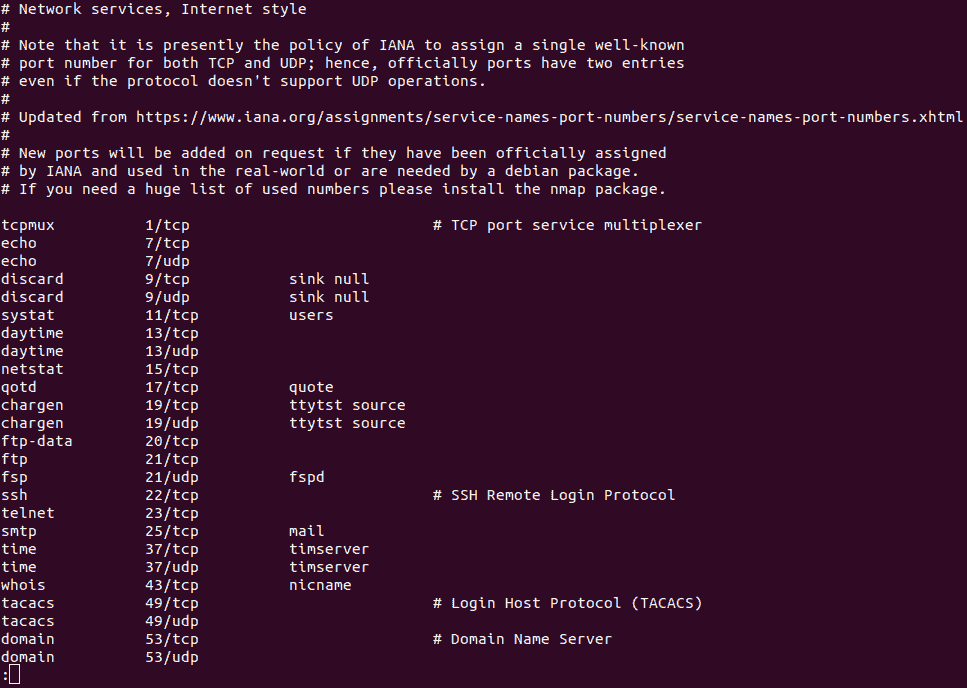

## 使用 netstat 列出开放端口

***netstat*** 工具可以描述为显示路由表、TCP 和多个网络接口的网络连接的实用程序。此外，它便于网络协议的统计。我们可以使用 netstat 工具列出系统的每个开放端口。

我们可以执行以下命令:

```

$ netstat -atu 

```

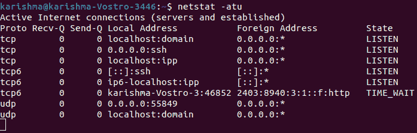

让我们快速解释一下上面命令中使用的每个标志的分解:

**1。答:**该标志通知 netstat 显示每个套接字。

**2。t:** 此标志通知 netstat 列出 TCP 端口。

**3。u:** 此标志通知 netstat 列出 UDP 端口。

***netstat*** 命令还有另一个变体，如下所述:

```

$ netstat -lntu 

```

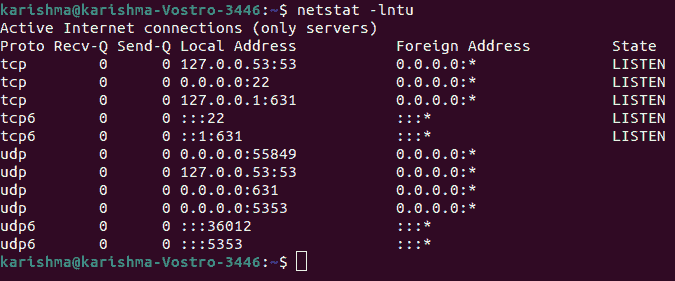

在上面的命令中有两个新标志，解释如下:

**1。l:** 该标志通知 netstat 只打印监听套接字。

**2。n:** 该标志通知 netstat 显示端口号。

我们可以使用一个标志，即 ***"-p"*** 来显示正在使用任何端口的进程 PID。

```

$ netstat -lntup 

```

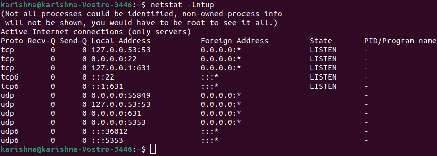

## 检查本地打开的端口

netstat 命令在每一个计算机操作系统上都可以用来监控网络连接。以下命令应用 netstat 来显示具有 TCP 协议的每个监听端口:

```

netstat -lt 

```

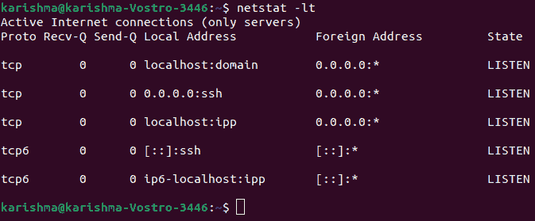

让我们简单定义一下上述命令中的标志:

**1。-l:** 列出监听端口。

**2。-t:** 指定了 TCP 协议。

结果在显示协议、人性化、发送和接收的数据包、端口状态、远程和本地 IP 地址的列中排列有序。

如果我们将 TCP 协议修改为 UDP 协议，那么输出将只显示开放的端口。由于与 TCP 协议的矛盾，结果将在不描述状态的情况下显示。

```

netstat -lu 

```

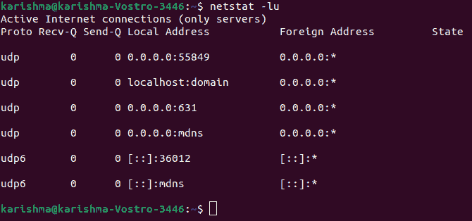

我们可以忽略对协议的描述，只应用选项- listen 或-l 来获取每个自由监听协议的端口的详细信息:

```

netstat --listen

```

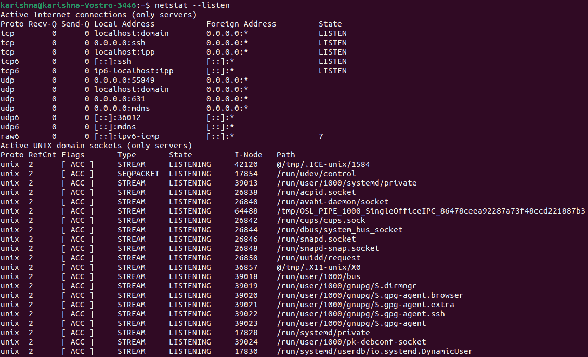

上述选项将显示 Unix、UDP 和 TCP 套接字协议的详细信息。

上面的每个示例都显示了如何在没有授权连接的情况下通过监听端口打印详细信息。以下命令显示了如何显示监听端口和授权连接。

```

netstat -vatn 

```

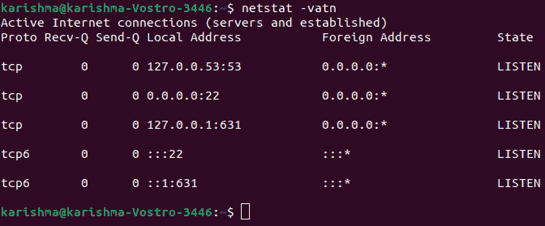

其中:

**1。-v:** 用于赘述。

**2。-a:** 显示活动连接。

**3。-t:** 显示 tcp 连接。

**4。-n:** 显示端口(数值)。

假设我们识别出系统中的一个可疑进程，并希望检查与之相关的端口。我们可以使用 lsof 命令，该命令用于列出与进程相关的打开文件。

```

lsof -i 4 -a -p 
```

哪里，

**1。-i:** 列出了与互联网协作的文件， ***6*** 选项适用于 ***IPv6、*** 和 ***4*** 选项仅指示打印 ***IPv4。***

**2。-a:** 指示结果为 ***和。***

**3。-p:** 指定我们要检查的过程 PID 号。

## 列出带有 ss 的开放端口

***【ss】***工具可以指定为调查插座的工具。该工具的用法与 ***netstat*** 命令相同。

我们可以运行下面的命令来列出打开的端口:

```

$ ss -lntu 

```

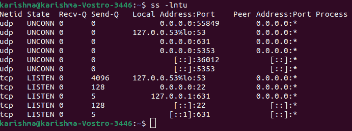

以上旗帜与*命令相同。ss 工具描述的功能也完全相同。*

 ***1。l:** 该标志通知 ss 显示监听插座。

**2。n:** 此标志通知 ss 不要尝试结束服务名称。

**3。t:** 该标志通知 ss 显示 TCP 套接字。

**4。u:** 该标志通知 ss 显示 UDP 套接字。

## 列出带有 lsof 的开放端口

lsof 命令可用于列出打开的文件。但是，它也可以用来显示打开的端口。

我们可以执行以下命令:

```

$ lsof -i 

```

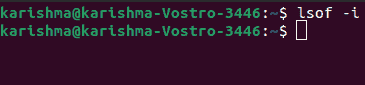

获取特定协议(UDP、TCP 等)的开放端口。)然后指定它在使用***-【I】***标志后，我们可以执行以下命令:

```

$ lsof -i 
```

## 列出带有 nmap 的开放端口

nmap 命令可以定义为用于端口/安全扫描和网络探测的强命令。它还可以报告系统中每个打开的端口。

我们可以执行以下命令来列出打开的 TCP 端口。

```

$ sudo nmap -sT -p- localhost

```


上面提到的这个命令有两个部分:

**1。-sT:** 通知 nmap 工具扫描 ***TCP*** 端口。

**2。-p-:** 通知 nmap 工具扫描每个 ***65535*** 端口。如果不使用，nmap 工具将默认扫描 ***1000*** 端口。

如果我们要求列出 UDP 的开放端口，那么我们可以执行以下命令:

```

$ sudo nmap -sU -p- localhost

```

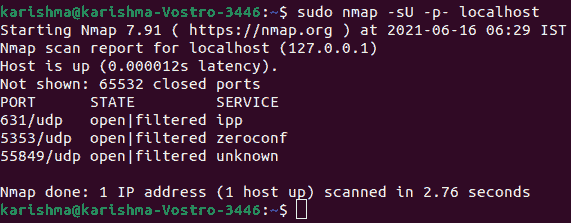

我们还可以执行以下命令来获取 UDP 和 TCP 端口:

```

$ sudo nmap -n -PN -sT -sU -p- localhost

```

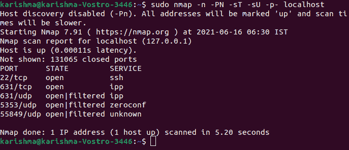

## 列出带有 netcat 的开放端口

netcat 工具可以描述为一个命令行实用程序，用于在 UDP 和 TCP 协议上的许多网络连接之间读写数据。此外，它还可以用于列出开放端口。该工具可以在特定端口或多种端口上实现测试。

下面的 netcat 命令用于从 ***1-1000 扫描端口。*** 默认情况下，它将通过 TCP 协议实现扫描:

```

$ nc -z -v localhost 1-1000

```

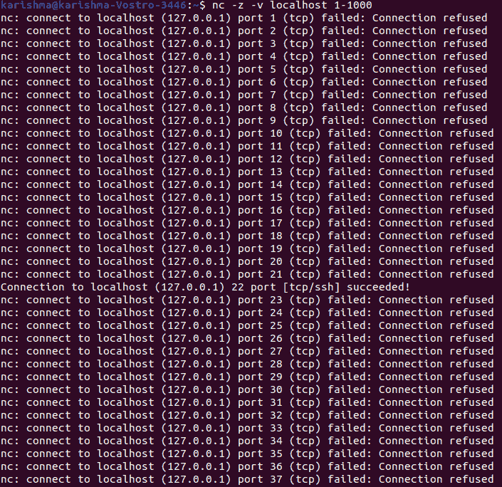

此外，它还可以扩展到某些端口的整个列表:

```

$ nc -z -v localhost 1-65535

```

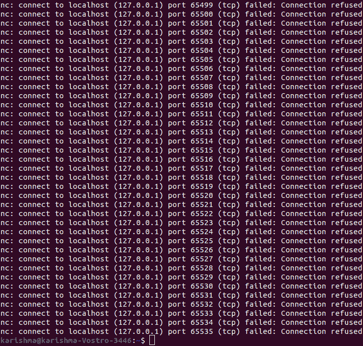

让我们快速分解这些标志。

**1。z:** 它通知 netcat 命令只扫描打开的端口，不传输任何数据。

**2。v:** 通知 netcat 命令以详细模式运行。

我们可以借助 grep 过滤一个术语 ***【成功】*** 的结果，通过这个列表只获取开放端口。

```

$ nc -z -v 127.0.0.1 20-80 | grep succeeded 

```

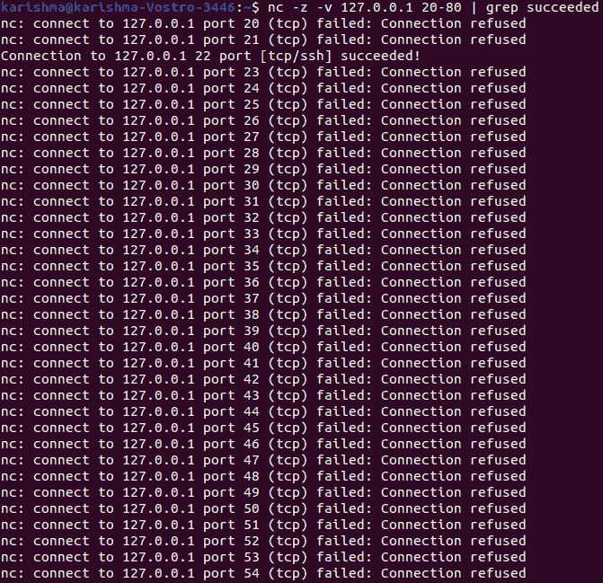

如果我们希望通过 UDP 协议实现扫描。我们可以包括***“-u”***旗。

```

$ nc -z -v -u localhost 0-65535 2>&1 | grep succeeded 

```

* * ****