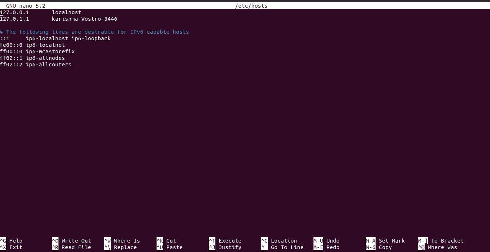

# Linux 主机(文件)

> 原文：<https://www.javatpoint.com/linux-hosts-file>

主机(计算机文件)是一个操作系统文件，可以将主机名映射到 IP 地址。该文件是纯文本文件。最初名为 HOSTS 的文件。TXT，由人工维护，并通过斯坦福研究所的阿帕网会员文件共享呈现。它将主机的地址和主机名包括在内，以便通过成员组织共享。

1983 年，域名系统首次被描述并于 1984 年实施。它自动匹配了发布过程，并在高速增长的网络中促进了动态和即时的主机名解析。

主机文件是名称解析的另一种机制，它通常可配置为工具部分，如名称服务交换机，作为当前操作系统中的后备方法或主要方法。

## 主机文件的用途

主机文件是一种系统工具，有助于寻址计算机网络中的网络节点。它是操作系统的互联网协议实现的基本部分。它的功能是将主机名(人性化的)转换为各种数字协议地址，这些地址被称为 IP 地址，可以识别和查找 IP 网络中的主机。

优选地，主机文件内容被用于像 ***域名系统这样的少数操作系统中的其他名称解析方法。*** 然而，有几个系统操作名称服务开关(用于 Unix 和 Linux 的 nsswitch.conf)来提供定制。主机文件由计算机的本地管理员直接控制，不像远程域名系统解析器。

## 主机文件的文件内容

主机文件包括一个文本行，由文本初始文件中的 IP 地址组成，后跟多个主机名。所有字段都用空格隔开，出于各种历史原因，首选制表符。但是，也使用了空格。可能包括注释行。这些线由线的初始位置的#(十进制)符号表示。此外，文件中的黑线完全被忽略。

例如，主机文件通常包括以下内容:

```

127.0.0.1 localhost loopback 
::1 localhost 

```

上面的示例仅包括系统环回地址和主机名的条目以及主机文件的典型默认内容。该示例表示 IP 地址可能有多个主机名(环回和本地主机)，并且主机名可能映射到 IPv6 和 IPv4 IP 地址，如第二行和第一行所示。

## 文件系统中的位置

在文件系统层次结构中，主机文件的位置因操作系统而异。通常，它被命名为主机，没有任何扩展名。

| 没有 | 操作系统 | 版本和位置 |
| **1。** | **POSIX，类 Unix，Unix** | 

*   /etc/hosts

 |
| **2。** | **微软 Win-dows** | 

*   **3.1:** % WinDir % \ HOSTS
*   **95、98、ME:** % WinDir % \ HOSTS
*   % T10]NT、2000、XP、2003、Vista、2008、7、2012、8、10:% SystemRoot % \ System32 \ drivers \ etc \ HOSTS

 |
| **3。** | **Windows Phone，Windows Mobile** | 

*   香港本地机器通信主机上的注册表项

 |
| **4。** | **苹果 Macintosh** | 

*   **version 9 and earlier:** system or preference folder
*   **Mac OS X 10.0-10。1 .5:**(niloadachenet-infoāú)
*   **Mac OS X 10.2 and later:** /etc/hosts (symbolic link to /private /etc/hosts file)

 |
| **5。** | **Novell NetWare** | 

*   SYS: wait \ host

 |
| **6。** | **OS/2、arcaos、生态站** | 

*   [Boot drive]: \mptm\etc\

 |
| **7。** | **塞班** | 

*   **Saipan OS 6.1-9.0:** C: \ System \ Data \ Host
*   **Saipan OS 9.1+:** C: \ Private \ 10000882 \ Host

 |
| **8。** | **膦** | 

*   **网络堆栈:** ENVARC:sys/net/hosts

 |
| **9。** | **无伴奏演唱者** | 

*   **< 4:** AmiTCP:db/hosts
*   **4:** DEVS:互联网/hosts

 |
| **10。** | **阿罗斯** | 

*   ENVARC:AROSTCP/deb/hosts

 |
| **11 时。** | **安卓** | 

*   /etc/hosts (symbolic link to /system/etc/hosts file)

 |
| **12 时。** | IOs | 

*   **iOS 2.0 and later:** /etc/hosts (symbolic link to /private/etc/hosts file)

 |
| **13。** | **TOPS-20** | 

*   <system>HOSTS .</system> TXT

 |
| **14。** | **计划 9** | 

*   /lib/nob/hosts

 |
| **15。** | beos | 

*   /boot/beos/etc/hosts 文件

 |
| **16。** | **俳句** | 

*   /System/Settings/Network/Host

 |
| **17。** | **开启虚拟机** | *   **【ucx:** 【ucx $ host】**【tcpware】**【tcpip $ host】 |
| **18。** | **RISC OS** | 

*   **3.7，5:** ！靴子。资源！
*   **Late boot sequence:** ! Boots. Select. Hardware. Disable. Internet. File. Host

 |

## 主机文件的历史记录

互联网前身，即***【ARPANET】***没有主机名的共享数据库。所有网络节点都根据需要管理其许多网络节点的地图，并为系统用户分配易于记忆的名称。

没有机制来确保对网络中提供的节点的每个引用都应用相似的名称。此外，没有读取其他计算机的主机文件以自动获取副本的机制。

*   小尺寸的 ***ARPANET*** 减少了管理适当主机文件的管理开销。
*   通常，网络模式只有一个地址，可以有多个名称。
*   作为局域网的计算机网络，TCP/IP 越来越普及，但是主机文件的管理比系统管理员的任务更大，因为网络节点和网络被包含在计算机中的频率越来越高。
*   许多标准化工作，如分发协议和 ***主机的格式规范。RFC 952 中的*T3 文件支持这些类型的问题。**
*   然而，主机文件的单一和集中行为最终使得分布式域名系统的创建成为必要。
*   一个称为网络的文件是可用的，它与一些旧系统上的任何主机文件相同，并且包含网络名称。

## 主机文件的扩展应用

hosts 文件可用于定义任何域名或主机名，以便在解析主机名功能中应用本地系统。

*   重定向本地域

一些内联网和网络服务管理员和开发人员描述了局域网内本地指定的域，用于几个目的，如访问公司的内部资源和测试本地网站。

*   互联网资源阻塞

在 hosts 文件中，这些条目可能是常见的恶意服务器和资源的域，包括广告软件、间谍软件和其他恶意软件，或者用于阻止在线广告。

它可以通过包含许多站点的条目来存档，以便将请求重定向到其他不可用的地址或任何无害的目标，如本地机器。

各种交易软件应用程序可以用于填充主机文件以及自动熟悉的不需要的互联网资源的条目。

此外，各种禁用或阻止有害服务器的用户自制主机文件也是公开的。 ***【弗拉维亚】*** 在首次发布该主机用法的反广告页面中将这些类型的文件指定为**【强大】【珍贵】****【卷轴】**。

*   软件隐私

一些盗版软件依赖于一个已更改的主机文件来防止软件联系发布者激活服务器。然而，有时激活服务器出现在正常的目标主机文件中。

### 主机文件的安全问题

主机文件可能会阻止恶意软件的攻击媒介。例如，该文件可能会被热地的**特洛伊木马、计算机病毒、**或**广告软件**更改，从而将流量通过所需的目标定向到托管不需要或恶意内容的站点。

一般的电脑蠕虫 ***Mydoom。*T3 禁用或阻止用户访问有关杀毒软件和计算机安全的网站。此外，它还会影响通过计算机(受损)访问微软视窗更新网站。恶意软件已经改变了库，容易加载主机文件，将其重定向到任何文件，它可以在少数情况下自由控制。**

## 主机文件的格式

在 hosts 文件中，条目的格式如下:

```

IPAddress DomainName [DomainAliases]

```

域名和 IP 地址必须至少用一个制表符或空格隔开。以 ***#符号*** 开头的行是注释，避免使用。

我们可以简单地在文本编辑器中打开一个文件，向主机文件添加一个条目。在通过应用程序缓存域名系统条目的情况下，主机文件修改会很快生效。

我们可以简单地打开一个文件，删除我们添加的行来撤销修改。

## 更改主机文件

在 [Linux 中](https://www.javatpoint.com/linux-tutorial)、 ***/etc/hosts*** 是一个文件的完整路径。

以下说明适用于每一个 Linux 发行版，包括 ***Linux Mint、Debian、RHEL、CentOS、*** 和 ***Ubuntu:***

**1。**在我们的终端窗口中用我们最喜欢的文本编辑器打开一个 hosts 文件:

```

$ sudo nano/etc/hosts

```

输入 ***密码*** 为 ***苏多*** 时询问。

**2。**向下滚动文件的结尾，添加新条目:

**3。**保存修改。



* * *