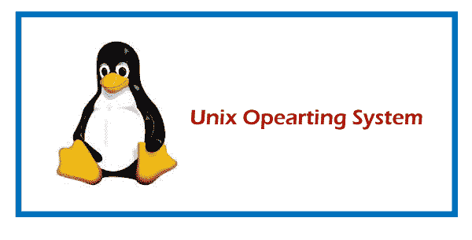
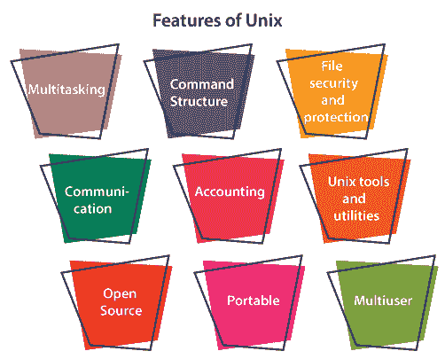
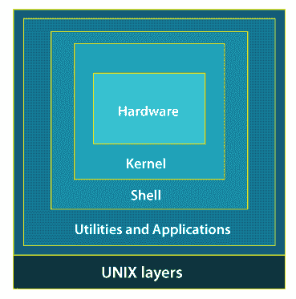
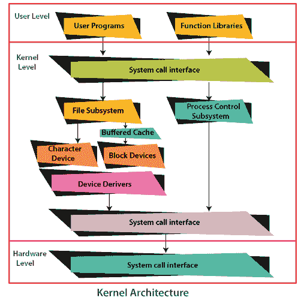
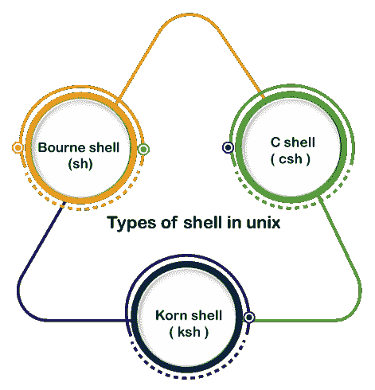

# UNIX 操作系统

> 原文：<https://www.javatpoint.com/unix-operating-system>

UNIX 是一个强大的操作系统，最初由肯·汤普森、丹尼斯·里奇于 1970 年在美国电话电报公司·贝尔实验室开发。它在科学、工程和学术机构中很流行，因为它最具欣赏性的特性，如多任务处理、灵活性等。在 UNIX 中，文件系统是文件和目录的分层结构，用户可以在其中使用文件存储和检索信息。

## UNIX 操作系统的特性:

让我们逐一详细讨论一下 UNIX OS 的特性。

**多任务:**UNIX 操作系统是一种多任务操作系统，允许您从同一个终端启动多个任务，以便一个任务作为前台执行，另一个任务作为后台进程执行。

**多用户:** UNIX 操作系统支持多个用户访问主存、硬盘、磁带机等计算机资源。多个用户可以从不同的终端登录系统，运行共享命令终端资源的不同作业。它涉及分时原则。分时是由调度器完成的，调度器将 CPU 时间分成几个部分，也称为时间片，每个部分按计划分配给每个用户。这个时间片很小。当该时间到期时，它会将控制传递给系统中的以下用户。每个用户在他们的时间片内执行他们的指令集。

**可移植性:**这个特性使得 UNIX 可以在不同的机器和平台上工作，代码可以轻松传输到任何计算机系统。由于 UNIX 的很大一部分是用 C 语言编写的，只有很小一部分是用汇编语言为特定硬件编写的。

**文件安全与保护:**作为一个多用户系统，UNIX 对文件和系统安全有着特殊的考虑。UNIX 有不同的安全级别，通过向单个用户分配用户名和密码来确保身份验证，在提供文件访问权限的级别即。读、写、执行，最后是文件加密，将文件变成不可读的格式。

**命令结构:** UNIX 命令简单易懂，使用简单。例如:“cp”、mv 等。在 UNIX 环境中工作时，UNIX 命令区分大小写，并且以小写形式输入。

**通信:**在 UNIX 中，通信是使用户能够在全球范围内进行通信的出色功能。它支持使用写命令、邮件命令、通话命令等提供的各种通信设施。

**开源:** UNIX 操作系统是开源的它意味着所有人都可以免费使用，是一个基于社区的开发项目。

**记账:** UNIX 对用户创建的作业进行记账。该功能在 CPU 监控和磁盘空间检查方面增强了系统性能。它允许您记录每个用户使用的磁盘空间，并且磁盘空间可以相互限制。您可以为每个用户分配不同的磁盘配额。根用户可以使用配额、df、du 等各种命令来执行这些记帐任务。

**UNIX 工具和实用程序:** UNIX 系统提供各种类型的工具和实用程序设施，如 UNIX grep、sed 和 awk 等。一些通用工具是编译器、解释器、网络应用程序等。它还包括各种提供远程和管理服务的服务器程序。

## Unix 操作系统层的结构如下:

在使用 UNIX 操作系统时，该系统的几个层提供了 pc 硬件和用户之间的交互。以下是对 UNIX 系统中每一层结构的描述:

### 第 1 层:硬件-

UNIX 的这一层由 UNIX 环境中所有与硬件相关的信息组成。

### 第二层:内核

负责维护全部功能的操作系统的核心被称为内核。UNIX 的内核运行在特定的机器硬件上，并与硬件进行有效的交互。

它还充当设备管理器，并为需要访问连接到计算机的外围设备的进程执行有价值的功能。内核通过设备驱动程序控制这些设备。

内核还管理内存。流程是由所有者的人或系统启动执行的程序。

系统必须为所有进程提供足够的内存，少数进程需要大量内存。有效利用主内存，并为每个进程分配足够的内存。它使用分页、交换和虚拟存储等基本技术。

### 第三层:外壳

Shell 是一个解释器，它解释用户在终端提交的命令，并调用您简单想要的程序。

它还保存了您键入的命令列表的历史记录。如果需要重复键入的命令，请使用光标键在列表中上下滚动，或者键入以前命令的历史记录。有各种各样的命令，像 cat、mv、cat、grep、id、wc 等等。

### UNIX 系统中外壳的类型:

*   **伯恩外壳:**这个外壳简称为外壳。它是 UNIX 操作系统的第一个外壳。它仍然是 UNIX 系统上最广泛可用的 Shell。
*   **C Shell:**C Shell 是 UNIX 系统上常见的另一种流行的 Shell。C 壳由加州大学伯克利分校开发，消除了伯恩壳的一些缺点。
*   **Korn Shell:** 这个 Shell 由 David Korn 创建，旨在解决伯恩 Shell 的用户交互问题，并解决 C shell 脚本怪癖的缺点。

### 第 4 层:应用程序第 4 层

它是执行给定外部应用程序的最外层。UNIX 发行版通常附带几个有用的应用程序作为标准。**例如:** emacs 编辑器、StarOffice、xv 图像查看器、g++编译器等。

* * *