# Linux dpkg 命令

> 原文：<https://www.javatpoint.com/linux-dpkg-command>

dpkg 是自由操作系统 Debian 及其几个衍生产品中的包管理基础软件。该软件用于安装、拆卸和提供**的详细信息。deb 包**。

dpkg 是一个低级机制。与 dpkg 工具相比，更高级别的机制，即 **APT** 被更广泛地使用，因为它可以通过远程位置检索包，并与典型的包关系(如依赖关系解析)进行协商。

**APT** ( **高级打包工具**)突触(GTK)和智能(ncurse)等前端可以用于更友好的界面。

dpkg (Debian package)给出了 dpkg 程序和打包系统运行时工作所必需的各种其他程序，如 dpkg-trigger、dpkg-convert、dpkg-statoverride、dpkg-query、dpkg-split 和 dpkg-deb。此外，它包括许多程序，如启动-停止-守护程序和更新-替代方案。

一个程序，即 **install-info** 本来是用来添加的，后来因为现在单独开发共享，所以被去掉了。dpkg-dev (Debian 包)包括大型构建工具。

在 Debian 中，它是基于 Debian 的系统和主要的包管理程序。它用于安装、构建、删除和管理多个包。对于 dpkg 来说，智能是主要的前端。

下面是 dpkg 命令的语法。

**语法:**

```

dpkg ACTIONS
OR,
dpkg [options] filename

```

## dpkg 简史

最初，dpkg 是由伊恩·默多克在 1994 年 1 月作为 Shell 脚本开发的。然后，卡尔·斯特里特、伊恩·默多克和马特·威尔士用 Perl 重写了这个软件。之后，主要部分由伊恩·杰克逊在 1994 年用 C 语言重写。dpkg 名称的前身是**“德比安包”**缩短。

**dpkg 的开发工具**

dpkg 的这些开发工具如下所示:

1.  **dpkg-dev** 包括解包、创建和上传 Debian 源代码包所需的开发工具系列。其中包括:
2.  **dpkg-source:** 它打包和解包一个 Debian 包源文件。
3.  **dpkg-gencontrol:** 它通过一个解包的树源(Debian)读取细节，并产生二进制包控制包，在 Debian/files 中为它做一个入口。
4.  **dpkg-shlibdeps:** 它计算库的运行相关性。
5.  **dpkg-genchanges:** 它通过解包的树源(Debian)读取细节，一旦构造出来就做一个控制文件。
6.  **dpkg-buildpackage:** 可以定义为可以自动用于构建包的控制脚本。
7.  **dpkg-distadfile:**包括一个文件到 Debian 文件的输入。
8.  **dpkg-parsechangelog:** 读取修改文件，即解包后的树源(Debian)的一个 **changelog** ，用那些修改的细节方便地做出准备好的结果。

## dpkg 数据库

dpkg 的数据库位于 **/var/lib/dpkg** 文件中。这个**“状态”**文件包括我们当前系统上安装的软件列表。此外，该数据库中没有关于存储库的详细信息。

## dpkg 示例

Mint、Ubuntu、Kali、Knoppix 等多个 [Linux](https://www.javatpoint.com/linux-tutorial) 发行版的母 OS (Debian Linux/GNU)。使用许多包管理器，如 dpkg-split、dpkg-deb、取消选择、tasksel、突触、智能、apt 和 dpkg。

在描述 dpkg 命令之前，我们将指定所有这些包管理器。

**APT 命令**

它是高级打包工具的缩写。它不与 deb 包妥协，直接工作。但是，它通过文件中描述的位置来处理 deb 归档，即 **"/etc/apt/sources.list"** 。

能力

对于 Debian 来说，智能可以定义为包管理器(基于文本)，它是**【apt】**的前端。它使所有用户能够轻松管理包。

**突触**

它是一个软件包管理器(图形)，可以有效地安装、升级和卸载软件包。

**Tasksel**

它允许所有用户安装与特定任务相关的每个相应的包。

**取消选择**

它是一个包管理工具(菜单驱动)。最初，它是在最初安装时使用的，现在因材施教。

**Dpkg-deb**

它与 Debian 的档案交互。

**Dpkg-split**

它有助于将大文件合并和拆分成小文件块，存储在较小的介质上，如软盘。

## 使用 dpkg 命令安装软件包

在 Ubuntu 中，这个命令最常见的用途是安装一个包。在 Debian 或 Ubuntu 中，我们可以借助一个命令选项，即 **dpkg -i** 来安装任何 deb 包。

在这里，我们可以如何安装软件包:

```

$ sudo dpkg -i [package-name]

```

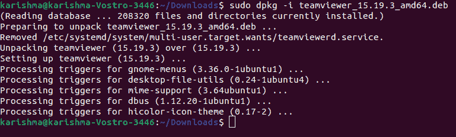

### 使用 dpkg 安装

dpkg 的包管理器用于管理 Debian 中的包以及很多衍生产品，比如 Linux Mint 和 Ubuntu。默认情况下，dpkg 包安装在 Debian 上，其衍生产品可用于安装、构建和删除。黛比套餐。

### 正在安装。带 dpkg 的 deb 包

```

$ sudo dpkg --install [.deb file]

```

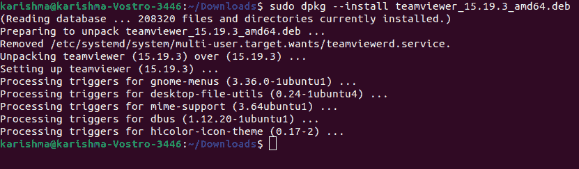

确保我们通过类似的目录执行上面的命令。deb 包正在驻留。如果我们通过任何其他目录执行上述命令，我们需要指定。下面是 deb 文件:

```

$ sudo dpkg --install [path/to/.deb file]

```

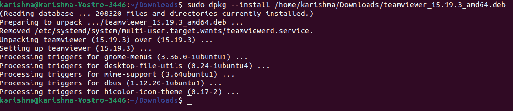

dpkg 命令只能安装没有依赖项的指定包。如果我们正在安装任何需要一些依赖项的包，我们将会得到一个错误。此错误可能如下所示:

*dpkg: error processing package*

dpkg 也不会安装软件包并使其处于损坏和不可配置的状态。

在终端中，我们可以执行以下命令来解决上述错误:

```

$ sudo apt -f install

```

这个命令围绕着破碎的包，并且还安装了需求依赖项，期望它们存在于我们系统的存储库中。

## 删除包

如果我们不再需要计算机上的服务或程序，就不需要使用它。我们将要求指定已安装软件包的名称来删除已安装的软件包，而不是指定。用于安装软件包的 deb 软件包。

要搜索包名，我们可以使用下面的命令，使用对应于包名的关键字:

```

$ dpkg -l package_name

```

在使用 skype 套餐的情况下，我们可以简单地使用 Skype:

```

$ dpkg -l teamviewer_15.19.3_amd64.deb

```

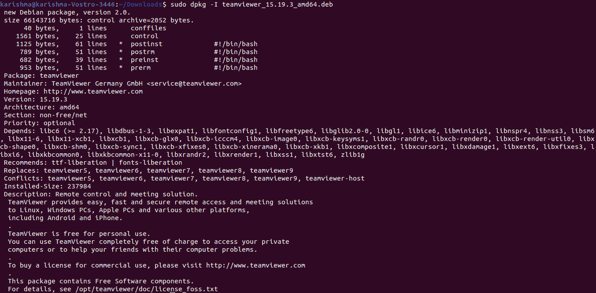

一旦我们检测到确切的已安装软件包名称，我们就可以在- r 或- remove 选项的帮助下从计算机中卸载或删除服务或程序:

```

$ sudo dpkg --remove [package file]

```

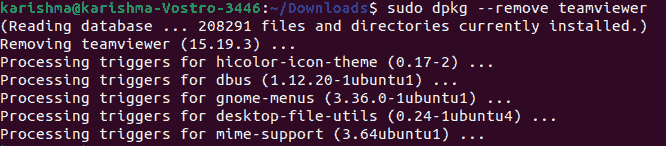

## 更新我们的存储库

dpkg 命令的存储库存储了我们的 Debian 或 Ubuntu Linux 发行版上安装的每个包。

通常情况下，如果新版本已经发布，我们最终可以为任何程序获得旧版本的包，因为这些包是本地存储的。这就需要一种方法来更新我们的存储库。

另一个选项，即 dpkg - update-avail 已经覆盖了我们。它将分析存储库(在线)，并将每个更新的包下载到我们的本地存储库中。

我们将本地存储库更新为最新版本，如下所示:

```

sudo dpkg --update-avail

```

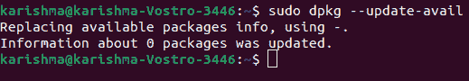

## 查看已安装的软件包列表

在安装任何新软件包之前，我们可能希望列出系统上所有已安装的软件包。为此，我们可以使用下面的- l 或- list 选项来使用这个 dpkg 命令:

```

$ dpkg --list

```

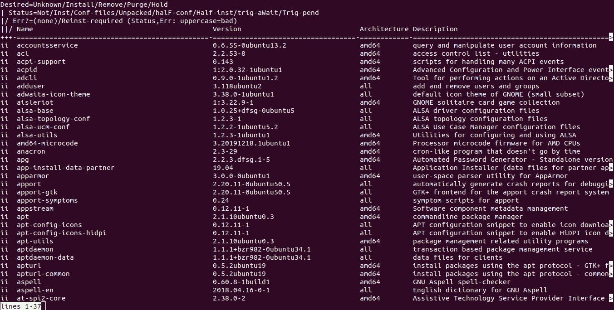

它会在我们的系统上显示一个已安装的软件包列表。

## 用 dpkg 验证包装安装

虽然我们可以通过从 Ubuntu 的 dash 菜单中搜索来验证包的安装。如果它存在，这将验证软件包安装。

然而，dpkg 命令也允许我们验证包的安装。我们可以简单地输入带有- s 或- status 的 dpkg 来验证软件包安装:

```

$ dpkg --status [package-name]

```

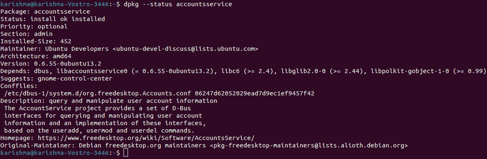

## 清除包

我们可以清除包裹。它将卸载软件并删除每个配置文件，而不是在-P 选项的帮助下将它们留下。

命令如下:

```

$ sudo dpkg -P [package-name]

```

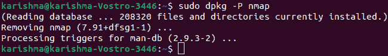

我们可以使用-s 选项快速检查软件包是否安装成功。

命令如下:

```

$ dpkg -s nmap

```

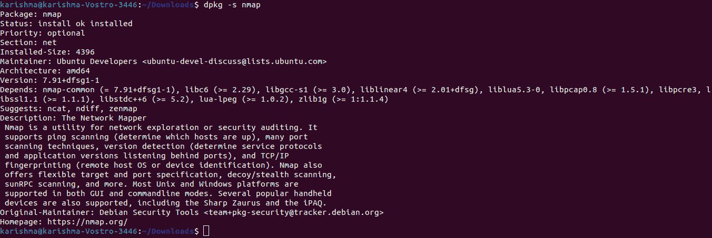

我们可以通过附加-c 选项来检查. deb 文件的内容。

命令如下:

```

$ dpkg -c package-name.deb

```

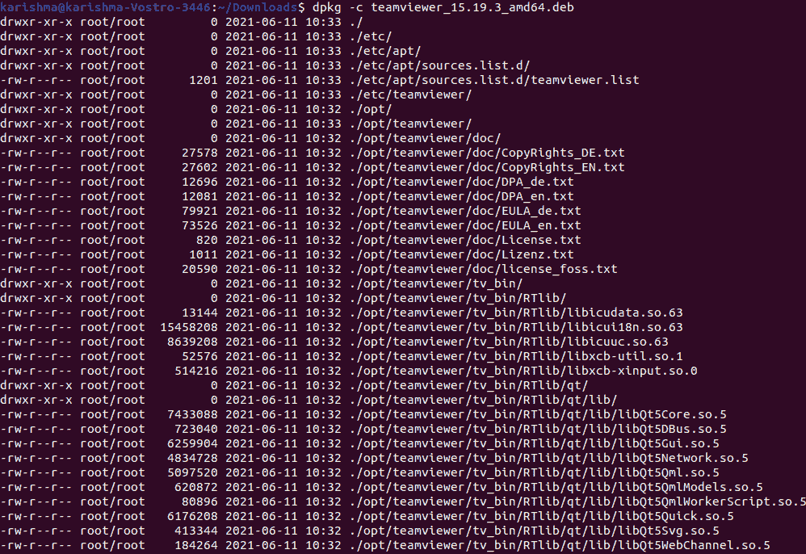

我们可以打开包装。在- unpack 选项的帮助下操作并查看其内容。

命令如下:

```

$ dpkg --unpack package-name.deb

```

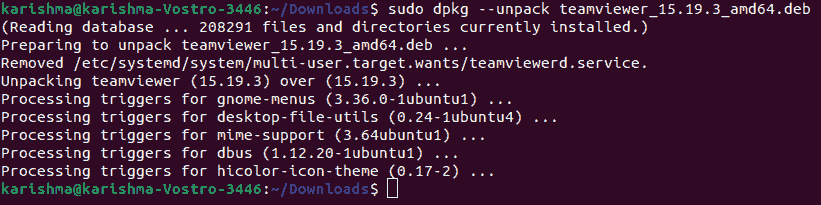

我们可以在。如果我们对。deb 文件(未打包)。

命令如下:

```

$ sudo dpkg --configure package-n

```

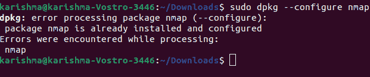

可能，如果我们想进一步配置设置，如果包已经安装和构建好了，我们需要选择一个命令，即 dpkg-reconfigure。

命令如下:

```

$ sudo dpkg-reconfigure unattended-upgrades 

```


* * *