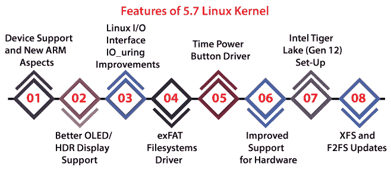

# 最新内核 Linux 版本

> 原文：<https://www.javatpoint.com/latest-kernel-linux-version>

Linux 内核的最新版本是 5.7 版本。这个新内核提供了各种新特性和重大更新。

在本文中，我们将解释 Linux 内核版本 5.7 的一些重要的新方面，以及我们如何升级最新的内核。

## 5.7 Linux 内核的特性

Linux 内核 5.7 版本有几个新特性。下面列出并解释了一些重要特性:

### 1.设备支持和新的 ARM 方面

新的 Linux 内核 5.7 定义了对 ARM 架构(64 位)的开发。它包含对内核指针验证和 ARM 活动监视器的扩展支持。

它支持 PinePhone、PineBook、PineTab 和其他 ARM 设备，以及使用 AllWinner A64 芯片和 RockChip RK3399 Soc 的吹嘘兼容性。此外，它还为联发科 MT8516 SoC、恩智浦 i.MX8M Plus 和高通骁龙 865 提供主线支持。

### 2.更好的有机发光二极管/HDR 展示支持

Linux 内核 5.7 版本包含 AMDGPU [Linux](https://www.javatpoint.com/linux-tutorial) 驱动的 DC (Display Core)补丁，它处理最新的 HDR 和有机发光二极管显示器。现在，它允许通过一个通道(即显示端口辅助)来管理背光亮度，并包括带有 DC 补丁的 PSR(面板自刷新)功能。

### 3.改进期间的 Linux 输入输出接口

最新的 5.7 版本包括新的方面，并升级了性能，以提供更快、更好的输入/输出。然而，自 Linux 内核 5.1 版本以来，已经有了。

### 4.文件系统驱动程序

5.7 版本通过三星和强大的 exFAT 支持读写这个 exFAT 文件系统来提供这个 exFAT 文件系统驱动程序。

此外，它正在为 Linux 提供稳定的 exFAT 支持。此外，新的驱动程序允许我们从窗口访问磁盘的加密数据。

**重要提示:**我们可能希望删除旧内核，以避免在引导(GRUB)菜单上出现大量可引导内核。

### 5.“微型电源按钮”驱动程序

现在，Linux 内核 5.7 版本附带了用于为虚拟机供电的高级配置和电源接口(简称 ACPI)电源按钮驱动程序。

该功能的主要目标是降低虚拟机映像的复杂性并缩短启动时间。直接地，它通过管理和传输信号到一个初始化进程来完成这个任务。

### 6.改善对硬件的支持

Linux 定义了对各种硬件的改进(或原生)支持，如 GT9147 触摸屏、Goodix GT917S、IIC MOTU 微书、Presonus Studio 1810c 和具有这一最新内核版本的罗技 G11 键盘。

这个新的内核包含了一些通用串行总线音频，高清音频和 ALSA 核心，ASoC 更新之前的声音系统。

**重要提示:** Linux 内核 5.7 版本带来了在 Linux 内核 5.0 版本中首次定义的特性提升。

### 7.英特尔老虎湖(第 12 代)设置

默认情况下，新的 Linux 内核 5.7 现在支持英特尔老虎湖(第 12 代)。但是，这个特性在以前的版本中是可用的，由于内核的模块标志，它是未知的。

### 8.XFS 和 F2FS 更新

XFS 文件系统经历了更新和变化，像两部分代码清理，元数据验证(升级)和其他修复。

闪存友好文件系统(简称 F2FS)也针对最近的 Linux 内核进行了更新。

它将对 Zstd 压缩的支持定义为包含在现有的 LZ4 和 LZ0 压缩选项中。此外，文件系统现在还附带了更新的内核 ioctl、DIO 读取改进、DebugFS 以及其他几个错误修复。

## Linux 内核 5.7 的一些其他特性

*   在中央处理器上，这个版本提供了一个热压力跟踪功能，可以很好地放置任务，避免热节流。
*   它有助于驱动程序支持苹果的通用串行总线脂肪充电。
*   它支持改进的英特尔速度选择技术。
*   它为数字版权管理 TTM 大联盟提供支持，该联盟专注于降低 TLB 失误和中央处理器的使用。
*   它修复重叠。但是，重叠现在支持上层和远程文件系统，在上面使用虚拟文件系统。

## 升级我们的 Linux 内核

Linux 内核的最新版本产生升级和高级系统安全性。如果我们没有执行任何生产 Linux 服务器，并且我们已经发现了我们需要或想要的 Linux 内核 5.7 的特性，那么没有什么会限制我们升级到这个 Linux 内核版本。

任何执行生产 Linux 服务器的人都必须建立备份并仔细规划升级，以最大限度地减少停机时间。

* * *